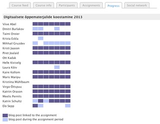

In 2014 I am hoping to make some changes to [BIM](/blog2/research/bam-blog-aggregation-management/) that will enhance [the course I'll be teaching](http://www.usq.edu.au/course/synopses/2014/EDC3100.html). The hope is to leverage various learning analytics to enhance student learning. The following is an attempt to use [the IRAC framework](/blog2/2013/12/03/the-irac-framework-locating-the-performance-zone-for-learning-analytics-ascilite/) to think about what might be done. Essentially a bit of brainstorming about possible future development.

Each of the headings below link to the IRAC framework. First off the content and the purpose of this use of learning analytics is described. Then each of the four components of the IRAC framework - **I**nformation, **R**epresentation, **A**ffordances and **C**hange - are considered.

I've just learnt about [the proceedings](http://ceur-ws.org/Vol-1103/) from the 3rd Workshop on Awareness and Reflection in Technology-Enhanced Learning, will need to read through that content for any additional insights.

## Context

[The course](http://www.usq.edu.au/course/synopses/2014/EDC3100.html) is a 3rd year course in a Bachelor of Education. It's taken by folk hoping to become teachers at every level from prep, through Grade 12 and into the VET sector. The focus is the students be able to use Information and Communication Technologies to enhance/transform the learning of their students. During the course the students complete a three week practical in a school setting. The course is offered twice a year. The first offering has average around 300 students spread over three campuses and online. The second offering averages around 100 students all online. The students in the course are not necessarily all that ICT literate.

The students are required to maintain an individual blog that they use as a learning journal. The learning journal is intended to be used for capturing experiences, feelings and reflections. Contributions to the learning journal contribute 15% of the final mark. There is no formal marking of blog posts. Marking is done on the basis of the number of posts per week, the average word count, and the number of links to both external resources and blog posts from other students.

2013 was the first year the learning journal assessment was used. All 2013 student blog posts are archived in two instances of BIM. The plan is to use learning analytics to explore this data and test out various approaches that could be integrated into BIM and the course's operation in 2014.

## Purpose

At a high level, improve student learning while keeping the staff workload appropriate. Briefly, the pedagogy in the course is trying to encourage students' self-regulation, reflection and building a PLN/making connections. I want the students to take ownership of their learning around ICTs and Pedagogy and for them to create and share a range of artefacts, insights and perhaps knowledge. The purpose that learning analytics can play in this is helping both the students achieve this and help the teaching staff support this.

Some high level aims for harnessing learning analytics.

1. Provide students with some idea of how they are going and perhaps more importantly how to improve.
2. Increase the diversity, quantity and quality of the connections between students and their posts and blogs.
3. Allow teaching staff to identify who is struggling, who is doing well and who is in between and then help support staff in engaging appropriately.

A quick skim of 2013 course evaluation responses reveal some comments (emphasis added) from the semester 1 offering

> The blog is a good idea to ensure the students are trying new ICTs during the course however the assessment was pointless. _There was no real reason for us to be writing a certain amount of blogs per week. I found it a nuisance to maintain_ (on-campus student)  
> Probably the blogging was unnecessary but I still didn't mind that. (on-campus student)  
> The blogs were very time consuming - and considering they were marked without being reviewed/marked then I am concerned that we could have done what ever we wanted! (on-campus student)  
> I also found blogging to be very beneficial in building my PLN (online student - most effective aspects of the course)  
> being forced to blog was actually great as it brought online students together as we shared resources and got to know each other. (online student - most effective aspects of the course)  
> the blog we had to keep, it had no purpose to it (online student - least effective aspect of the course)  
> the amount of blogs expected (online student - least effective aspect of the course)  
> The blogging, although I can see why we had to do it, I found it was hard to keep to the time frames as an online student (online student - least effective aspect of the course)  
> I don't believe that I gained from blogging 3 times per week. I would rather have been assess on the quality of 1 blog per week and professional feedback that I could have provided to another student (rather than just links in the 3 blogs) (online student - least effective aspect of the course)

There were other comments on the blogs, common themes so far seem to be

- The purpose of the blogs was non-existent to some, especially given that they weren't marked based on quality by a human.
- Blogs were potentially seen as more problematic in Semester 1 because of other issues with the course.

## Change

Change is actually the last part of the IRAC acronym, but I'll put it first. Mainly because it is the IRAC components that is least considered in learning analytics related projects (IMHO) and the one that I think is the most important.

In this case, I can see there needing to be three types of change considered: going outside of Moodle, using features inside of Moodle, and insidie BIM.

### Outside Moodle

In short, thinking about, designing and implementing the type of changes to BIM and pedagogy outlined below is inherently a learning experience. I'm not smart enough to predict what is going to happen prior to implementation. I always gain insight when engaged in these activities that I want to leverage straight way into new approaches and new technological capabilities. i.e. I want to be able to make changes to BIM during the semester.

Not something I can do with the standard processes used for supporting a Universities institutional LMS. Hence the need to look at how I can do changes to BIM outside of Moodle and the institutional installation. In 2013, I did this [via a kludge](/blog2/2013/06/10/the-kludge-for-marking-learning-journals/), essentially some Perl scripts and a version of Moodle/BIM running on my laptop.

Beyond the constraints of the institutional LMS processes, there's the question of information and resources other than what is typically available to a Moodle module. Some examples include

- Activity completion.
    
    Currently a small part of the 15% for the learning journal assessment in this course is based on students completing the activities for set weeks. This is in Moodle, but a module like BIM will typically not be able/expected to access this information.
    
    **QUESTION:** Can/how a module access information from other parts of a Moodle course site?
    
- Student demographic and academic data.
    
    e.g. GPA of a student, how many times they've taken the course, might be used to help identify those at risk. Typically not information in Moodle.
    
- Student dispositions.
    
    Data about students dispositions and self-regulation may be useful (see below) in providing advice. This would have to be gathered via surveys and would not be normally in Moodle.
    
- Computationally heavy analytics.
    
    It is likely that a range of natural language processing and other potentially computationally heavy algorithms could be used to analyse student posts. Most enterprise IT folk are not going to want to run these algorithms on the same server as the institutional LMS.
    

All of this combined, means I'll likely explore the use of LTI mentioned in [this post](/blog2/2013/08/29/the-network-challenge-to-the-lms-mindset/) from earlier in the year. i.e. use LTI to enable the version of BIM used in the course to be hosted on another server. A server only used for BIM in this course so that change can happen more rapidly.

In addition, that other server is also likely to run a range of other software for the computationally heavy analytics - rather than try and shoe-horn it into a Moodle module.

### Inside Moodle

There's a line of though - with which I agree - that learning analytics are most useful when supporting a specific learning design. The more specific, the more useful. This is in tension with the tendency of LMS tools to being generic. For example, much of what I'm talking about here moves BIM away from it's original pedagogy of students answering questions to be marked by markers toward a more connectivist approach. Becoming more specific may limit the people who can use BIM. Not a big worry at the moment, but a consideration.

Moodle 2.0 has evolved somewhat in its ability to support change. For example, the [introduction of renderers](http://docs.moodle.org/dev/Overriding_a_renderer) separates out the representation of BIM from the data and allows different themes to override a rendered. In theory, allowing other people to modify what is shown. However, the connection with a theme is potentially a bit limiting.

**Task:** Explore the concept of renderers more often.

### Inside BIM

There is much that could be done to the structure of BIM to enable and support rapid development. e.g. Moodle is now supporting [unit tests](http://docs.moodle.org/dev/PHPUnit), BIM needs to move toward supporting this.

## Information

To scaffold this look at the information that could be drawn upon, I'll use the DAI acronym. i.e. the information to be used in learning analytics can be listed as

- **D**ata - raw data that is the starting point (e.g. blog posts for BIM).
- **A**nalysis - what method/algorithm is going to be used to analyse and transform the source information into....
- **I**nsight or perhaps **I**nformation - something that potentially reveals something new (e.g. how good is the reflection in this blog post)

### Source

Information we currently have access to

- All student blog posts from 2013.
    
    As part of the BIM database tables in the Moodle database.
    
- The date and time when posts were made.
- Student performance on assignments and in the course.
    
    Currently in a database in another non-Moodle assignment submission system. Pondering if this needs to move to the Moodle assignment submission system and thus the Moodle gradebook. But which raises a question..
    
    **Question:** Can/how would a module like BIM get access to Moodle gradebook data in the same course?
    
- Some student demographic data.
    
    Currently as a CSV file manually downloaded from Peoplesoft by someone else. Includes age, postcode, sector, GPA.
    
- Course and institution related dates.
    
    e.g. assignment due dates, semester start and end dates etc.
    

Information that we don't have access to, but which might be useful

- Comments on student blog posts.
    
    There's no really standard way between different blogging engines of tracking and archiving the comments made on blog posts. So we don't record those. Anecdotal observations suggest that many of the "connections" between students occur as comments. [EduFeedr](http://www.edufeedr.org/wiki) did some work around this.
    
- Student perceptions of the learning journal assessment.
    
    Might be some mention in the 2013 course evaluation results.
    
    **TASK:** Take a look at the 2013 course evaluation results and see what mention is made.
    
- Student dispositions and mindsets - e.g. [this work](http://learningemergence.net/events/lasi-dla-wkshp/).

### Analysis

A very limited list of possible forms of analysis on the information we currently have

- Link and social network analysis etc.
    
    Who is linking to who? etc.
    
- Natural language processing, computational linguistics etc - which might open up possibilites such as
    - [Identifying emotions](http://dl.acm.org/citation.cfm?id=1364052) - would be interesting to see changing student emotions over the semester.
    - [Identifying influential posts/bloggers](http://dl.acm.org/citation.cfm?id=1341559) and [user passivity](http://link.springer.com/chapter/10.1007/978-3-642-23808-6_2#page-1).
    - Identifying blogger communities - e.g. do the early childhood folk flock together? Help people find these communities and help them find different communities.

Combining the above with student demographic information and dispositions could also reveal interesting correlations and relationships.

I need to become more aware of what possible forms of analysis might exist. At the same time, the list of affordances (see below) may also suggest forms of analysis that are required.

### Representation

Early suggestions for representation might include

- Social network diagrams of various types.
    
    For students and teachers to see the structure and evolution of the social network of posts/blogs. e.g. this [EduFeedr scenario](http://www.edufeedr.org/wiki/Scenario3)
    
- "My progress"
    
    Allow students to see a collection of stats about their blog and to see it in connection with others.
    
- Student posting

The work [reported in this paper](http://ceur-ws.org/Vol-1103/paper5.pdf) on using badges gives on possibility for representation and also in terms of affordances for students to compare what they're doing with others.

## Affordances

The actual definition of affordances in the IRAC framwork - like the IRAC framework itself - is still in the early days of refinement. Here I'm going to use affordances as functionality that BIM might provide. Obviously influenced by the purpose from above.

- Help students find interesting and relevant posts from other students.
- Help students find interesting and relevant external links.
- Allow students to see how "good" their blog is.
- Show students how their blog compares to other students.
    
    There are reservations about this.
    
- Allow all participants to get some idea of the important topics being discussed each week and over other time periods.
- Show staff a progress bar/heat map/visualisation of some sort of student progress against expected milestones/questions.
    
    The EduFeedr progress visualisation below (click on it to see it bigger) is an inspiration.
    
- Help staff to intervene and track interventions with all students.
- Support staff in creating auto-marking approaches.

## Measuring impact and improvement

If we ever get around to doing something in 2014, how will we know what's changed? Alternatively, what might be useful to learn about the use of the student blogs in 2013?

Some possibilities

- When did student post?
    
    Students were expected to have a number of posts each week, however, it was only assessed over a 3 or 4 week period.
    
    - How many students posted consistently each week and how many did the mad dash toward the end of the 3 or 4 week period?
    - Was there any correlation between when posts were made and the content of the posts, the students performance in the course, their GPA or anything else?
- How did (if at all) did student posts change over the semester?
    - Is it possible to tell when holidays, professional experience, other assignments were due etc. from the student posts?
    - Did the emotions in posts change over semester?
        
        The course is quite heavy going. Especially in the first few weeks. I would expect some great nashing of teeth in the early weeks and perhaps in the leadup to assessment.
        
    - How did the connections between posts/students change over the semester?
- Is it possible to develop indicators that might identify certain types of students/posts?
    - Indicators to identify students who are about to drop out?
    - Indicators to identify popular posts?
    - Indicators of students at all levels?
        
        e.g. what does a "good" student write about that an "ok" student writes about?
        
- What were the most mentioned concepts during the semester?

## To do

Some tasks left to do include, in no particular order

- 2013 blog posts
    - Do some analysis of the 2013 blog posts.
    - Test out some of the planned analytics on these posts.
- BIM
    - Explore the transition to renderers.
    - Explore unit tests.
    - Explore the "Moodle way" for assignments, marking, rubrics, outcomes etc.
    - Develop the "automated" marking feature.
    - Explore how the select "analytics" features will be identified.
- LTI
    - Identify a good external hosting service.
    - Confirm that an LTI version of BIM will work with the course.
- Purpose
    - Clarify exactly what pedagogical aims are going to be valuable.
    - Explore the self-regulated learning literature.
    - Look at the course evaluation responses from 2013 and see if there's anything important to address.
    - Eventually identify a specific set of outcomes I want to work toward.
- Information
    - Explore the various analysis methods that could be useful.
    - Explore how the analysis is best done with BIM, Moodle and PHP.
- Representation
    - Explore how/if badges might be a possibility? USQ Moodle version and capabilities.
    - What PHP support is there for visualising social network diagrams?
- Affordances
    - Get more into the literature around affordances, especially any work people have done on how to design affordances for learning/teaching.