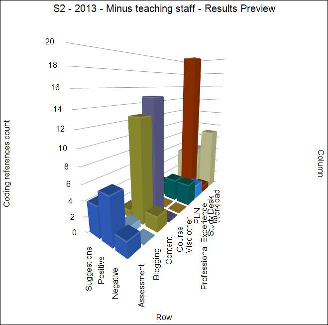

---
categories:
- edc3100
date: 2014-01-15 11:33:50+10:00
next:
  text: Leadership as defining what's successful
  url: /blog2/2014/01/21/leadership-as-defining-whats-successful/
previous:
  text: Getting started with NVivo
  url: /blog2/2014/01/14/getting-started-with-nvivo/
title: Analysing some course evaluation comments
type: post
template: blog-post.html
comments:
    []
    
pingbacks:
    - approved: '1'
      author: What should be covered in EDC3100? | The Weblog of (a) David Jones
      author_email: null
      author_ip: 66.155.8.59
      author_url: https://djon.es/blog/2014/01/22/what-should-be-covered-in-edc3100/
      content: '[&#8230;] course I teach. The rough process and background is available
        in the first post. The first post and the most recent in this series considered
        student feedback. This post moves onto to thinking about the course [&#8230;]'
      date: '2014-01-22 15:47:51'
      date_gmt: '2014-01-22 05:47:51'
      id: '930'
      parent: '0'
      type: pingback
      user_id: '0'
    - approved: '1'
      author: Building a CASA for student evaluation of teaching results &#8211; The Weblog
        of (a) David Jones
      author_email: null
      author_ip: 192.0.100.73
      author_url: https://davidtjones.wordpress.com/2016/05/18/building-a-casa-for-student-evaluation-of-teaching-results/
      content: '[&#8230;] For example, back in early 2014 I manually extracted the free
        text comments from the SET data and analysed them using NVIVO to produce the graph
        to the right. Click on it to see a larger [&#8230;]'
      date: '2016-05-18 09:10:00'
      date_gmt: '2016-05-17 23:10:00'
      id: '931'
      parent: '0'
      type: pingback
      user_id: '0'
    
---
The following reports on some analysis of students responses to open questions on the institutional, end of semester course evaluation survey for the course I taught in 2013. [This initial post](/blog2/2014/01/13/evaluating-edc3100-in-2013-step-1/) gives some background to the course, the evaluation process (and its limits), links to some of the raw results (including summaries of close responses) and an outline of the process I'm following.

This post starts with discussion of the results followed by a quick description of the process used.

## Limitations

The results reported below are drawn only from the Semester 2, 2013 offering of the course. I haven't analysed in detail the responses from the Semester 1, 2013. In part, this is due to time limitations. However, as explained in [the first post](/blog2/2014/01/13/evaluating-edc3100-in-2013-step-1/), it is also due to the Semester 1, 2013 offering of the course being developed as it taught. This did not work well and looking through the student comments this underpinned much of their perspective on the course. The semester 2 offering was essentially complete from the start of semester.

The semester 2 offering - as explained in [the first post](/blog2/2014/01/13/evaluating-edc3100-in-2013-step-1/) - was also (from one limited perspective) reasonably successful. Could be argued that I'm cherry picking the results I like.

One significant limitation of using only the Semester 2 responses is that Semester 2 is an online only offering. There are no on-campus students. A particular issue with this is that the increase in apparent workload for on-campus students from the apparent duplication between attending on-campus lectures and tutes and having to complete online activities is not an issue for online students.

The open coding of student comments into categories (see the method section below) was only done by 1 person - myself. Hence it's not the only, nor likely the best categorisation.

As explained in the method section, I've also removed the "Teaching staff" category from the results. This category had by far the most positive comments (n=27) and no comments coded as negative or suggestions. It's excluded because it made it difficult to get value from the chart and given that I'm already perfect there's no need to consider those comments.

## Results

The following chart (click on the image to see a larger version) provides an overview of the analysis results and some description follows. In summary,

- The overall course in S2, 2013 was well received, as was the Moodle course site.
- The sample assignments and the assignment descriptions were positively received, though the workload remains an issue.
- Workload remains perhaps the main issue, especially in the first few weeks. Though the students still appear to have enjoyed the course.

### Study desk

The most positive comments were for the [Study Desk category](https://dl.dropboxusercontent.com/u/14025788/EDC3100/2014%20Semester%201/evaluation%20results/AnalysisResults/Study%20Desk/1.html) and its related child categories (see the method section for a list of all the categories)

- 4 comments on activity completion, the students liked being able to track what they are up to.
    
    I have a fear hear about what this may encourage.
    
- 6 comments on the learning path.
- 2 comments on Moodle books.
- 10 general comments on the study desk.

### Course comments

[Overall course comments](https://dl.dropboxusercontent.com/u/14025788/EDC3100/2014%20Semester%201/evaluation%20results/AnalysisResults/Course/1.html) are next. All positive comments. So not interesting in this context, but pleasing to the ego.

### Content

[Content](https://dl.dropboxusercontent.com/u/14025788/EDC3100/2014%20Semester%201/evaluation%20results/AnalysisResults/Content/1.html) has 13 positive comments, but also has 1 suggestion ("course materials that link to readings and information" in the context of what can be improved) that I'm not sure I can parse. The same student also gave a negative content comment "there wasn't any information/textbooks off the net for information". This combination plus the wealth of content pointed to during the course seems to suggest that this is a mistake. But uncertain.

The other negative content comment was "Some times it was difficult to navigate back through all of the moodles to find info previously learn". This is pointing to the _absence of search engine_ barrow I've been pushing.

### Assessment

[Assessment](https://dl.dropboxusercontent.com/u/14025788/EDC3100/2014%20Semester%201/evaluation%20results/AnalysisResults/Assessment%20%282%29/1.html) was the next most positive with 6 positive comments mentioned "All ... were so well explained", a couple mentioned something along the lines of "content directly linked to assessment and content", a couple also liked "the examples given they helped a lot when completing my own assignment" and one even "Loved the assessment structure"

In terms of negatives or suggestions, mention was made of more time prior to assignment 1 (thrice); a mention of the final assignment being due 3 days after Professional Experience, and the size of the assessment tasks (twice). One negative comment was more fundamental "assessment tasks changed".

### Workload

[Also](https://dl.dropboxusercontent.com/u/14025788/EDC3100/2014%20Semester%201/evaluation%20results/AnalysisResults/Workload/1.html) with 6 positive comments, but also the first category with more negative comments (9) than positive.

The positive comments were generally of the form "So all content was necessary but just way too much!!".

The negative comments all indicated too much work, with a particular emphasis on the first few weeks (a known problem). For example "This course nearly broke me but I have come a long way".

### PLN

[This category](https://dl.dropboxusercontent.com/u/14025788/EDC3100/2014%20Semester%201/evaluation%20results/AnalysisResults/PLN/1.html) included both setting up a PLN and using a range of tools (Diigo, twitter, blogs) to do that. Only 8 comments overall. A couple of positive ones mentioned the value of the PLN and the tools. The negatives included one that complained about managing multiple accounts for all the tools, one that complained that the tools set up unrealistic expectations for Professional Experience, and one raised not being confident enough to learn all those tools early on.

The remaining categories included very few comments.

## Method

The analysis was used as an [initial exploration of using NVivo](/blog2/2014/01/14/getting-started-with-nvivo/). The method used was:

1. Import data from the institutional course evaluation website into NVivo.
    
    Due to the limitations of this website there are a number of limitations of this data including: no ability to link between responses to closed questions and responses to other open questions; and, only able include responses from 37 of the 42 responses to the survey.
    
    I'm particularly displeased about this institutional inability.
    
2. Initial coding of student comments (or part thereof) into three categories
    - Suggestion - the comment makes a particular suggestion to change the course.
    - Negative - the comment criticises some aspect of the course.
    - Positive - the comment praises some aspect of the course.
3. Open coding of student comments into categories based on an aspect of the course.
    
    A description of the resulting categories is given below. Where needed I've added an explanation. This is a hierarchical list. In the chart above, the child categories have been aggregated into their parent categories (i.e. you won't see "Learning path" in the chart above, all those responses appear as part of the "Study Desk" category). The links below will take you to web pages (produced by NVivo) that show you the comments coded in each category.
    
    - [Assessment](https://dl.dropboxusercontent.com/u/14025788/EDC3100/2014%20Semester%201/evaluation%20results/AnalysisResults/Assessment%20%282%29/1.html) (n=12)
    - [Blogging](https://dl.dropboxusercontent.com/u/14025788/EDC3100/2014%20Semester%201/evaluation%20results/AnalysisResults/Blogging/1.html) (n=2) - any comment around the assessable requirement to write blog posts throughout the semester.
    
    - Blog updates - throughout the semester I sent out emails summarising students' blogging progress against what was required for assessment.
    
    - [Content](https://dl.dropboxusercontent.com/u/14025788/EDC3100/2014%20Semester%201/evaluation%20results/AnalysisResults/Content/1.html) (n=17) - the actual content of the course
    - [Course](https://dl.dropboxusercontent.com/u/14025788/EDC3100/2014%20Semester%201/evaluation%20results/AnalysisResults/Course/1.html) (n=15) - general comments about the course e.g. "bad course", "best course ever"
    - [Misc other](https://dl.dropboxusercontent.com/u/14025788/EDC3100/2014%20Semester%201/evaluation%20results/AnalysisResults/Misc%20other/1.html) (n=1) - for comments that I couldn't think of an appropriate category for
    - [PLN](https://dl.dropboxusercontent.com/u/14025788/EDC3100/2014%20Semester%201/evaluation%20results/AnalysisResults/PLN/1.html) (n=7) - about the requirement for students to engage with social media (blogs, diigo, twitter etc) to build a personal learning network
    
    - ICTs - the use of the various ICTs (diigo, twiiter, blogs) as part of the PLN process.
    
    - [Professional Experience](https://dl.dropboxusercontent.com/u/14025788/EDC3100/2014%20Semester%201/evaluation%20results/AnalysisResults/Professional%20Experience/1.html) (n=3) - as part of the course students spend 3 weeks in schools teaching
    - [Study Desk](https://dl.dropboxusercontent.com/u/14025788/EDC3100/2014%20Semester%201/evaluation%20results/AnalysisResults/Study%20Desk/1.html) (n=22) - the USQ label for the Moodle course site
    
    - Activity Completion - a Moodle feature that will display a tick beside activities that the student has completed
    - Learning path - each week on the study desk was designed as a learning path. A series of online resources and activities that all students had to complete
    - Moodle Books - a Moodle feature used to structure the learning path
    
    - [Teaching Staff](https://dl.dropboxusercontent.com/u/14025788/EDC3100/2014%20Semester%201/evaluation%20results/AnalysisResults/Teaching%20Staff/1.html) (n=27)
    - [Workload](https://dl.dropboxusercontent.com/u/14025788/EDC3100/2014%20Semester%201/evaluation%20results/AnalysisResults/Workload/1.html) (n=21) - a comment about the level of work required to complete the course
    
    - Start of course - the workload for this course is quite heavy in the first few weeks.
    
4. The use of NVivo's matrix coding capability to produce the graph above that compares which aspects of the course the students commented on negatively, positively or as suggestions.