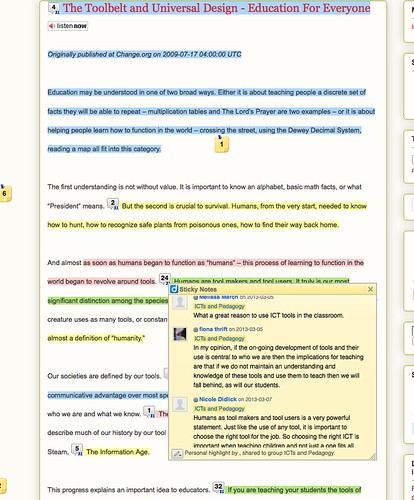
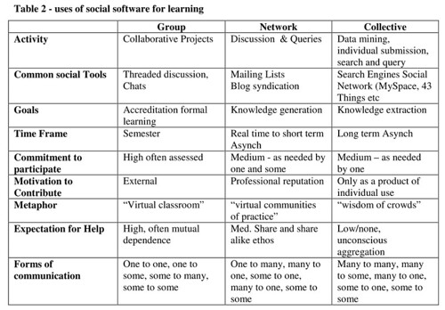

See also: [[blog-home | Home]]

Early this week I received an email from a student who took the course [EDC3100, ICT and Pedagogy](http://www.usq.edu.au/course/specification/2014/EDC3100-S2-2014-WEB-TWMBA.html) in 2013. In essence he had remembered a useful bit of information in the course study material and wanted to use it. On the plus side, he still had access to course material but because of [the big flaw](/blog2/2013/03/07/the-absence-of-a-search-function-my-current-big-problem-with-a-moodle-installation/) (the absence of a search engine) in our institution's Moodle implementation he has to manually search through the information to find what he was looking for and didn't have the motivation/time to do so.

  
   by  [GollyGforce - Living My Worst Nightmare](https://www.flickr.com/people/see-through-the-eye-of-g/) 

### Evaporating "residue of their experiences"

A couple of days later I was reading Riel and Polin (2004) and this quote pointing to a bigger problem with the course site

> Over time, the residue of these experiences remains available to newcomers in the tools, tales, talk, and traditions of the group. In this way, the newcomers find a rich environment for learning. (p. 18)

The problem is that the current course site isn't as rich an environment for learning as it could be. Largely because each semester the course site is created a new and as such destroys any chance of the residue of the experiences of past students being available to the new.

### Some examples of the residue of experience

For this particular course, there is already a couple of examples where the "residue of experience" hasn't evaporated due to the end of semester migration.

For example, this [blog post](http://speedchange.blogspot.com.au/p/blog-page_2046.html) from @irasocol is used in the first week to help the students think about ICTs as part of their toolbelt. The activity is also used to have them begin experimentation with [course Diigo group](https://groups.diigo.com/group/icts-and-pedagogy/). The image to the right shows the residue of experience available via Diigo in terms of highlights and annotations.

I'm interested in how this type of functionality would work on the course site. For this to work, the pages in the course site couldn't change URL each semester as they do now. Students could us Diigo to highlight what is important and annotate connections or questions they have. Teaching staff could do the same.

One of the difficulties would be that while I wouldn't necessarily want the URL to change, I might want to change some of the content of the page. Largely in response to student feedback. The problem is doing that while effectively retaining the residue of experience.

The other large residue of experience now available to new students is the work past students have done in public on the web. Either in [their blogs](https://www.google.com.au/search?q=edc3100+artefact&ie=utf-8&oe=utf-8&aq=t&rls=org.mozilla:en-US:official&client=firefox-a&channel=sb&gfe_rd=cr&ei=C13tU6ieNMPC8gfsqIHQDw#channel=sb&q=edc3100+blog&rls=org.mozilla:en-US:official) or in [artefacts for assignments](https://www.google.com.au/search?q=edc3100+artefact&ie=utf-8&oe=utf-8&aq=t&rls=org.mozilla:en-US:official&client=firefox-a&channel=sb&gfe_rd=cr&ei=C13tU6ieNMPC8gfsqIHQDw).

### Making stuff available early

If the course site never moved, then the course site could always be available. This fits with a suggestion from a current student. The first few weeks of the course are tough for many students as they are thrown into the deep-end and expected to learn a range of new tools. The student suggested that if the course site was available early, some students could get an early start and be better prepared.

The main limit to this at the moment is that "opening up" of the course site is controlled by an institutional process that does it at a fixed time - 2 weeks prior to the start of semester.

### Group, network and swarm

Dron and Anderson (2007) make the distinction between group, network and collective as outlined in the following table.

It's perhaps possible to suggest that "group" is the predominant label for most existing courses. The current shape of EDC3100 is perhaps moving into (in a very slight way) a network. The aim here is perhaps to move further into the network and add aspects of the collective. Dron and Anderson (2007) suggest

> The benefits of and, indeed, the distinguishing features of social software are only fully realised when they embody networks and collectives

The aim here perhaps is for the course to operate as both network and collective. For current students to enter into the network and perhaps only stay for a semester. But if it becomes useful perhaps hang around as part of the collective for a bit longer. Either way the on-going participation in the network could/should provide aspects of the collective.

### Barriers?

Apart from the time and motivation to get this done. Perhaps the biggest barrier is going to be the challenge to the existing institutional systems and processes. Questions such as

1. Can it be negotiated that the EDC3100 course site is always open and always in the one Moodle course site?
2. How would/could Moodle by configured to have multiple cohorts of students enrolled in the course and still be manageable in terms of fulfilling the traditional course-based requirements (tracking participation/marks etc)?
3. More broadly both the organisation and everyone involved being able to learn and respond to the unexpected problems and possibilities that arise from a fairly major change in underlying assumptions.

### References

Dron, J., & Anderson, T. (2007). Collectives, networks and groups in social software for e-Learning. In World Conference on E-Learning in Corporate, Government, Healthcare, and Higher Education (pp. 2460–2467).

Riel, M., & Polin, L. (2004). Online learning communities: Common ground and critical differences in designing technical environments. In S. A. Barab, R. Kling, & J. Gray (Eds.), Designing for Virtual Communities in the Service of Learning (pp. 16–50). Cambridge: Cambridge University Press.