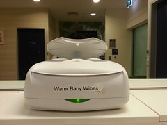

---
categories:
- edu8117
date: 2014-08-20 13:34:51+10:00
next:
  text: Evaluating the use of blogs/reflective journals
  url: /blog2/2014/08/21/evaluating-the-use-of-blogsreflective-journals/
previous:
  text: Part C of catching up on NGL
  url: /blog2/2014/08/18/part-c-of-catching-up-on-ngl/
title: Reclaim, identity, and bricolage
type: post
template: blog-post.html
---
Some thinking and reporting on some explorations of getting into the Reclaim project (movement?). -- _update:_ picking this up after a few weeks of inactivity.

It seems like now or never. Just as I'm starting (somewhat unexpectedly) on a journey participating in a Masters course on [Networked and Global Learning](http://netgl.wordpress.com/) with an explicit desire to "walk the walk" (i.e. break out of the confines of the LMS, traditional approaches to such courses etc.) there's quite a bit of movement around the [Reclaim Hosting project](http://reclaimhosting.com/). Tim Klapdoor is [sharing his planning and approach](http://timklapdor.wordpress.com/2014/07/27/reclaim-rethink/) to getting into the Reclaim Project. Audrey Watters and others in my network are also [sharing reports](http://hackeducation.com/2014/07/22/reclaim-your-domain-hackathon/) on the recent hackathon around the project. Rather than any great confluence, perhaps its just that I'm in a place where I'm now more likely to recognise this activity in my network. Either way, it's time to bite the bullet.

Interestingly just came across [this review](http://rjh.goingeast.ca/2014/08/11/reclaim-hosting-review/) of reclaim. As it happens the author has also written on [why you shouldn't do DBR](http://rjh.goingeast.ca/2014/08/11/part-1-epistemological-mismatch-why-you-shouldnt-do-educational-design-research-edrdbr/) which could be very useful for the NGL course. And there's [another post](http://davidmorgen.org/eng101s14/2014/01/13/how-to-sign-up-for-a-domain/) from elsewhere on what the process involves.

Interestingly I discovered this morning that Philip - one of the other participants in the NGL course - already apparently has [his own domain](http://www.dreamsys.com.au/blog/). It will be interesting to see how and if he makes any connection between this and the brief touch on identity in the course during the first week. Which is another connection to the [Reclaim Project](http://reclaimhosting.com/) which is proudly challenging/asking you to "Reclaim your Digital Identity".

Which is where I first got stuck at the first hurdle for my Reclaim Project. What will my domain be?

https://twitter.com/djplaner/status/493211719267672065

Being introduced to anyone as "David Jones" in part commences the obligatory cultural reference test. Does this person associate "David Jones" with

1. The [Australian Department store](http://shop.davidjones.com.au/djs/en/davidjones).
    
    Growing up in Rockhampton - which doesn't have a David Jones store - this wasn't common. More so when meeting people from capital cities.
    
2. [Davy Jones](http://en.wikipedia.org/wiki/Davy_Jones_%28musician%29) from the Monkees.
    
    You typically had to be of a certain age to make this connection. Though the rise of Pay TV and its raiding of historical TV shows changed that a little.
    
3. Davy Jones locker.
    
    Entering unlikely candidates now, though the later Pirates of the Caribbean movies opened this up to a whole new population.
    
4. [David Bowie](http://en.wikipedia.org/wiki/David_Bowie)
    
    Only the deeply informed are aware that he was born "David Jones".
    
5. Or finally some other David Jones they've met.
    
    While perhaps not at the level of "John Smith" (though I've only ever known one of those) there are few of us around. Including one guy who was obviously so much better and engaged in MP104 at UQ in 1986 than I.
    

### First world problems

  
   by  [avlxyz](https://www.flickr.com/people/avlxyz/) 

At this stage I have to label this as very much a first world problem. Given what's happening in Western Africa, Iraq, Ferguson (the inclusion of America in this list is incredibly sad, silly etc), Syria, Ukraine and many other places, worrying about my online identity strikes me variously as self-serving, irrelevant, confronting, worrying etc.

### What combinations are possible?

My initial desire is to use David Jones in someway, without having to draw on middle names (david**t**jones.wordpress.com) or birth years to avoid duplication

What does the reclaim project offer? The top level domains offered by default include: .com .net .org .us .name .info .ca .uk .es. Is there a David Jones possibility available there? Quick check via the web.

- [davidjones.com](http://davidjones.com) - domain squatter?
- [davidjones.net](http://davidjones.net) \- domain squatter?
- [davidjones.org](http://davidjones.org) - another David Jones
- [davidjones.us](http://davidjones.us) - domain squatter?
- [davidjones.name](http://davidjones.name) - server error, but apparently taken
- [davidjones.info](http://davidjones.info) - domain squatter?
- [davidjones.ca](http://davidjones.ca) - apparently a "parked domain"
- [davidjones.uk](http://davidjones.uk) - apparently available
- [davidjones.es](http://davidjones.es) - apparently available
- [davidjon.es](http://davidjon.es) - apparently available

The last one strikes me as interesting, if a little Spanish. It doesn't quite enable the rapid sharing of a domain name like "davidjones.com". "It's davidjones but put a dot before the es", but it will do I think.

Which generates a "already taken" from Reclaim Hosting, back to the drawing board. Ahh, reclaim is looking at www.davidjon.es - my check didn't use the wwww. It appears this applies to the .uk version above, however, www.davidjones.es is available.

Is that something I can live with?

### Other identities?

Which raises the question about other "identities" I have online and offline

- Jonesy - which mostly applies in the context of playing cricket.
    
    jonesy.id.au - an Australian domain is available.
    
- dj - started by some students many years ago. However, does tend to connect me inappropriately to the mixing of recorded music.
- davidtjones - this blog.
    
    www.davidtjones.name is available. As is .info
    
    davidtjones.net.au is available
    
- davidthomjones - an email address. - would prefer not to use this
- djplaner - Twitter - would prefer not to use this
    
    This particular identity started life on Second Life where you had to choose from a list of random words for the last part of your username. "planer" appealed because of the (bad spelling) link with planning and my hatred for teleological planning. You could choose the first part and "dj" connects with the above identity.
    
- djones - not known but this, but a smaller version
    
    www.djon.es is available
    

### What now?

Reluctant to bite the bullet immediately. Going to let the options percolate a little. Current options are

1. www.djon.es
    
    Plus, it's short and a little different. Which is of course it's draw back. Also suggests I'm Spanish. Actually would be interesting to see how many people make the connection between .es and Spain.
    
2. www.davidtjones.name or .info
    
    Connects with this blog to some extent. Not specific to a country.
    
3. davidtjones.net.au
    
    Not sure how I feel about the .au
    

On the whole it's been confronting almost immediately to be confronted by the need to choose an identity from a fairly narrow set of options. It's delayed diving in and having a go somewhat with the reclaim hosting. Though I'm fairly sure there's flexibility to change this as time and perspective changes, however, not sure I want to go through that.

So will wait and ponder a bit more.