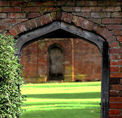

See also: [[blog-home | Home]]

Catching up with everyone in NGL is taking longer than I thought, mainly due to external factors. Here's some more.

### Stone-age facebook

It is interesting to [see a reference](http://katarenasafeplace.wordpress.com/2014/07/27/starting-off/) to the "stone ages" that includes Facebook. I still remember explaining to my daughter how lame she was going to feel because she was still on MySpace and not Facebook. A pre-Facebook time.

### Short cut kings

  
   by  [Unhindered by Talent](https://www.flickr.com/people/nicmcphee/) 

I really like [this sentiment](http://katarenasafeplace.wordpress.com/2014/08/09/understanding-week-2-trying-to-play-catch-up/) for a few reasons

> We are shortcut kings really

Kat was talking about this in the context of [Toolbelt Theory](http://speedchange.blogspot.ca/2008/05/toolbelt-theory-for-everyone.html) from @irasocol. I use this early in both my courses as it represents an approach to technology that I like on a number of levels. For example

> The thing about toolbelts though, is that no two people ever really need the same one. the trick to tool use is to learn to evaluate tasks and environments and your skills and the tools themselves as they change and determine what works best for you The only way to allow students to assemble this essential toolbelt for information and communication is to to throw open your classroom and let the world in

It also brings to mind Kahneman's (2011) idea of "fast" and "slow" thinking and the linkage that Goodyear and Carvalho (2014) make between it and networked learning

> For example, in a learning task, there are often some aspects that require close attention - hard thinking - and others that do not. A well-designed task, and supporting resources, will act in ways that focus hard thinking on the parts o the work that are intended to leave a beneficial cognitive residue - in short, mental effort needs to be focused on what is core to the achievement of learning, on what is hard and important. Well-designed scaffolds, navigational cues and other kinds of procedural facilitation or performance support will mean that 'slow thinking' is not required for those enabling, but marginal, tasks.

Toolbelt theory is about individuals finding the tools that help them focus on the important tasks.

I wonder about the NGL course. I'm guessing many participants would argue that the first few weeks were really, really hard. Especially the need to learn a range of new tools. Shouldn't this process have been scaffolded better?

Aspects of it could have been. However, there's also a part of the difficulty that is required. Actually learning those tools and having difficulties with it are part of what is "hard and important" in the context of this course.

I also believe that many institutions of higher education have a lot of learn from this perspective. Too often I find myself wasting time on marginal tasks and expending energy that could be better spent on more important tasks.

The other illustration from this post is Kath's mention of her dyslexia. As I was reading through her posts I had noticed the writing and wondered what I'd end up saying. With this post I now know what's happening, not something that would always be readily apparent in a different type of course.

### The links

I now find out that [Kath plays WoW](http://katarenasafeplace.wordpress.com/2014/08/18/helping-with-warcraft/) (which is more than I'll claim for myself at this point in time, time is a problem). Her experience reinforces the importance of the community part of NGL and is illustrated nicely through the use of Diigo's annotation ability.

### Walled gardens and protection

  
   by  [recursion\_see\_recursion](https://www.flickr.com/people/hawksanddoves/) 

[Andrew and Anne](https://globalconnectionusq.wordpress.com/2014/08/16/a-useful-collaborative-tool/) share experiences with EdModo. A tool I played with a bit as I headed towards high school teaching. I wonder whether their perspective of Edmodo will evolve as they proceed further into the course?

For me, Edmodo isn't that far removed from the LMS (learning management system). Yet another [walled garden](http://en.wikipedia.org/wiki/Walled_garden). Something that puts in barriers between the "real" world and the world of formal education. Of course, that's a view formed from my context in higher education, many years struggling with the confines of the institutional LMS. I don't have the same sorts of concerns about student protection (and societal expectations) that exist in a school setting.

But I've also [argued that working](/blog2/2010/04/25/inside-out-outside-in-or-both/) within the walled garden and slowly opening up more holes in the wall has some promise as a "change management strategy". One of the reasons for that perhaps links to the comment above about not wasting time on the marginal tasks. The walled garden provides a safe environment and an opportunity for the teacher (and/or others) to open it up as called for.

But then I also wonder how this approach compares with the plethora of teachers who have bitten the bullet and broken the confines of the walled garden? For example, [this post](http://learningandsharingwithmsl.blogspot.com.au/2013/08/using-twitter-in-primary-classroom.html) from a teacher that has been using Twitter with her 6 and 7 year old students.

### Learning how to get a grade

Interesting to [read Mari's reflections](http://mari4art.wordpress.com/2014/07/31/me-as-student/) as she engaged with a new program. In particular by her 5th subject having "learned how to achieve an HD in any subject, regardless of how deeply I really engaged in the study materials". Something that certainly resonates with me. Also interesting to hear how that learned process translates into a standard approach to the use of ICTs and study.

Speaking of "games". [Mari also connects](http://mari4art.wordpress.com/2014/08/01/week-1-minute-paper/) the idea of Wittgenstein's ladder used in [Bigum and Rown (2013)](http://chrisbigum.com/downloads/LLL-PCP.pdf) to the metaphor as life as a game - Snakes and Ladders. Especially as

> as a game that could be played over and over and not to see losing one game as failure, but rather as a motivation to immediately “start a new game."

### Personal and Personalised learning

The institution has adopted the idea of personalised learning as having strategic importance. I'm not much fussed on the idea, especially given some of the bad press it's been receiving recently. [Mari references](http://mari4art.wordpress.com/2014/08/17/preparing-students-to-learn-without-us-a-reflection-on-some-wise-quotes-part-1/) the following tweet from @downes and reflects a bit on how NGL is learning toward the personal end of the spectrum.

https://twitter.com/Downes/statuses/119001912736620544

Though I'm not sure I would limit the following statement to just "art" educationArt education (in an ideal world) has to be more about the process of individual discovery and learning from mistakes than about completing specific tasks and handing in a final piece

### Ahh, success

It does sound like [Mari has achieved a level of success](http://mari4art.wordpress.com/2014/08/18/when-a-pkm-workflow-becomes-a-routine/) as an NGL participant. Her PKM process is becoming routine, her network is providing unexpected sparks and she realises that it isn't linear.

I also wonder about the implications that this statement might have for institutional planners

> I don’t think I’ve signed into my USQ account once over the past 3 weeks, as everything happens through the blog