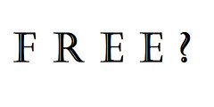

---
categories:
- edu8117
date: 2014-08-23 14:09:49+10:00
next:
  text: One process for the NGL course
  url: /blog2/2014/08/25/one-process-for-the-ngl-course/
previous:
  text: And more NGL catch up
  url: /blog2/2014/08/22/and-more-ngl-catch-up/
title: Ahh Mendeley and freemium tools
type: post
template: blog-post.html
comments:
    - approved: '1'
      author: Tracey McGrath
      author_email: info@traceymcgrath.com.au
      author_ip: 165.228.209.239
      author_url: http://learningforinsight.wordpress.com
      content: Frustrating isn't it.  Just when you think you have a solution. I loved
        Endnote and so didn't want to even like Mendeley.  I absolutely loved the link
        to the Thesis Whisperer.  Thanks for that. Tracey
      date: '2014-08-27 14:03:47'
      date_gmt: '2014-08-27 04:03:47'
      id: '1056'
      parent: '0'
      type: comment
      user_id: '0'
    
pingbacks:
    - approved: '1'
      author: We won&#8217;t be exploring Mendeley to its fullest | An experiment in Networked
        &amp; Global Learning
      author_email: null
      author_ip: 76.74.248.174
      author_url: http://netgl.wordpress.com/2014/08/24/we-wont-be-exploring-mendeley-to-its-fullest/
      content: "[&#8230;] Yesterday I discovered\_that sharing these amongst a group/network\
        \ is limited to either [&#8230;]"
      date: '2014-08-24 15:39:17'
      date_gmt: '2014-08-24 05:39:17'
      id: '1055'
      parent: '0'
      type: pingback
      user_id: '0'
    
---
  
   by  [joe.ross](https://www.flickr.com/people/joeybones/) 

I've been using Mendeley for a few years now. Generally fairly happy with it. Move to it from Endnote after the bad experience of using it for the PhD thesis. Have heard that more recent versions of Endnote may not be as horrible anymore, but Mendeley has me locked in a little (better the devil you now etc).

In theory Mendeley has some nice support for groups and I thought that [NGL](http://netgl.wordpress.com/) would be a good opportunity to try this out. At the very least the currently group approach I used would allow sharing of the references and we could always explore a bit further. The sharing of annotations on documents sounded useful.

This week I found out you can't share documents in a public group. Had assumed this might have been connected to copyright of articles etc. But no, that was me being naive. Apparently it's part of a [Freemium strategy](http://en.wikipedia.org/wiki/Freemium).

Mendeley supports the notion of [both private and public groups](http://support.mendeley.com/customer/portal/articles/227905-how-can-i-share-documents-on-mendeley-) with a private group you can

> upload files to which only a selected set of people have access to. Each member can collaboratively contribute to this group too - adding new papers, updating document details and by annotating and highlighting PDF files.

Public groups allow you to curate a reading list, but not share the documents.

Private groups are limited to 3 people, but the premium subscription package allows you to grow your private groups. In fact, [it appears](http://support.mendeley.com/customer/portal/articles/940352) that a free account can only have 1 private group.

A team plan will allow you to have more, but the [base rate](https://www.mendeley.com/upgrade/team/) for a team plan is $49 (USD I assume) a month and that's for 5 group collaborators.

Looks like we won't be playing with that feature of Mendeley in NGL.

Should probably look for an alternative myself at some stage. [Some thoughts](http://thesiswhisperer.com/2013/08/21/endnote-vs-well-everything-else/) from @thesiswhisperer on the possibilities (and with a lot of comments of people sharing their perspective).