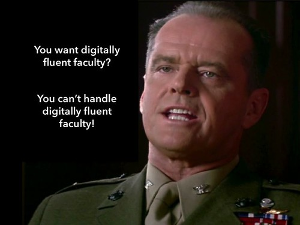

The [2014 Horizon Report for Higher Education](http://www.nmc.org/publications/2014-horizon-report-higher-ed) has identified the "Low Digital Fluency of Faculty" as the number 1 "significant challenge impeding higher education technology adoption". I have many problems with this, but the image below captures my main problem.

As a fairly digitally fluent faculty member I have yet to work for an institution of higher education that is able to deal with digitally fluent faculty. I've spent the last 20+ years banging my head against the digital illiteracies of higher education institutions. So to hear that the low digital fluency of faculty is seen as the #1 challenge impeding technology adoption is really rather aggravating.

(And I do know that Nicholson's character didn't actually say both lines)