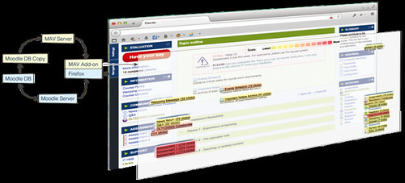
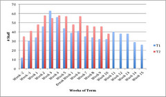

---
categories:
- ascilite
- bad
- design-theory
- distributedcognition
- elearning
date: 2014-09-21 15:52:39+10:00
next:
  text: A perspective on why institutional e-learning is so bad
  url: /blog/2014/09/22/a-perspective-on-why-institutional-e-learning-is-so-bad/
previous:
  text: Searching for a phrase and some research
  url: /blog/2014/09/16/searching-for-a-phrase-and-some-research/
title: Breaking BAD to bridge the reality/rhetoric chasm
type: post
template: blog-post.html
comments:
    - approved: '1'
      author: francesbell
      author_email: frabell@gmail.com
      author_ip: 82.15.171.64
      author_url: null
      content: "Thanks for posting this article David.  You reminded me that I had co-authored\
        \ a paper ( see https://francesbell.files.wordpress.com/2015/01/sme_paper_finalwithwatermark1.pdf)\
        \ on bricolage and strategy in SMEs where we concluded\n\u2022\tSME owner managers\
        \ need to be fully aware of and exploit the resources available to them.  In order\
        \ to do this they need to achieve a level of technical understanding, they need\
        \ to nurture an organisational culture that supports their staff in the utilisation\
        \ of their current and potential skill sets.  Additionally, owner managers should\
        \ be open to the external resources that may be available to them, avoid a \u2018\
        sales resistant\u2019 strategy and be prepared to finance purchase of technical\
        \ resources to support bricolage.\n\u2022\tObservation and listening are essential.\
        \  Being prepared to listen to \u2018visions\u2019 or external bricoleurs without\
        \ immediately viewing proposals in term of cost can expose competitive opportunities.\
        \  Similarly observation of the evolution of competitors or organisations with\
        \ similar business models can be stimuli for allowing bricolage, the competitive\
        \ SME needs to be outward facing.\n\u2022\tPlacing trust in internal or external\
        \ bricoleurs is essential, giving trust creates an environment where bricolage\
        \ can thrive.\n\u2022\tAny bricolage environment needs some control imposing up\
        \ it.  The challenge is to allow bricoleurs to employ some level of self regulation;\
        \ rigorous control will stifle innovation, whilst no control is financially na\xEF\
        ve.  Minimal structure and learning via incremental change are recommended.\n\
        Reading your paper made we wonder why I hadn't thought about how this might apply\
        \ in the university I worked in.  I suppose it was because I had so little faith\
        \ in the flexibility of the strategic process.  The IT gatekeepers were so removed\
        \ from the use of technology in the practice of the academic life of students\
        \ and lecturers that our conclusions seem faintly ridiculous when thought of in\
        \ the university context with which I was familiar.  As you recognise it's about\
        \ bridging gaps."
      date: '2015-01-15 05:47:00'
      date_gmt: '2015-01-14 19:47:00'
      id: '1103'
      parent: '0'
      type: comment
      user_id: '0'
    - approved: '1'
      author: David Jones
      author_email: davidthomjones@gmail.com
      author_ip: 139.86.69.32
      author_url: https://djon.es/blog/
      content: ':) I actually had that paper in my Mendeley library. Small world.
    
    
        Trying to figure out whether I grabbed it while writing the above, or back in
        my days as an IS academic. Over the last three years working in teacher education
        it''s actually struck me as more and more appropriate to think of bricolage as
        what''s missing in institutional e-learning. Much of what I see the expert classroom
        teachers doing is bricolage. Treating each learning task and individual student
        as a unique problem that has to be solved with what is at hand.
    
    
        Even thinking back to my own classroom experience, the best learning experiences
        are those where I''ve creatively used the classroom resources to develop a solution
        to a problem then and there in class.
    
    
        But when I observe the struggles that my teacher education colleagues (expert
        bricoleurs in a face-to-face classroom) are having with teaching online, that''s
        when I start thinking about the limitations of the SET mindset and the need to
        leverage a BAD mindset.
    
    
        But how to merge these two within a very (espoused) strategic environment? This
        is the next challenge.  Will have to revisit your paper to help glean some insights.'
      date: '2015-01-16 11:08:32'
      date_gmt: '2015-01-16 01:08:32'
      id: '1104'
      parent: '0'
      type: comment
      user_id: '1'
    
pingbacks:
    - approved: '1'
      author: Breaking BAD to bridge the reality/rhetoric chasm | The Weblog of (a) David
        Jones | Learning Curve
      author_email: null
      author_ip: 192.0.81.173
      author_url: http://rmaxwellblake.wordpress.com/2014/09/21/breaking-bad-to-bridge-the-realityrhetoric-chasm-the-weblog-of-a-david-jones/
      content: '[&#8230;] https://djon.es/blog/2014/09/21/breaking-bad-to-bridge-the-realityrhetoric-chasm/
        [&#8230;]'
      date: '2014-09-22 02:14:38'
      date_gmt: '2014-09-21 16:14:38'
      id: '1096'
      parent: '0'
      type: pingback
      user_id: '0'
    - approved: '1'
      author: A perspective on why institutional e-learning is so bad | The Weblog of
        (a) David Jones
      author_email: null
      author_ip: 76.74.255.5
      author_url: https://djon.es/blog/2014/09/22/a-perspective-on-why-institutional-e-learning-is-so-bad/
      content: '[&#8230;] another attempt to explain why and map out a way forward. The
        following is based heavily on on this paper that will be presented at ASCILITE&#8217;2014
        and is a slightly re-worked version of something I [&#8230;]'
      date: '2014-09-22 15:26:16'
      date_gmt: '2014-09-22 05:26:16'
      id: '1097'
      parent: '0'
      type: pingback
      user_id: '0'
    - approved: '1'
      author: 'Established versus Affordances: part of the reason institutional e-learning
        is like teenage sex | The Weblog of (a) David Jones'
      author_email: null
      author_ip: 192.0.81.123
      author_url: https://djon.es/blog/2014/11/07/established-versus-affordances-part-of-the-reason-institutional-e-learning-is-like-teenage-sex/
      content: '[&#8230;] is to SET in it&#8217;s thinking and needs to break BAD a little
        (maybe a lot) more often. This table summarises and compares the two [&#8230;]'
      date: '2014-11-07 10:29:15'
      date_gmt: '2014-11-07 00:29:15'
      id: '1098'
      parent: '0'
      type: pingback
      user_id: '0'
    - approved: '1'
      author: Adding more student information to a Moodle course | The Weblog of (a) David
        Jones
      author_email: null
      author_ip: 192.0.80.160
      author_url: https://djon.es/blog/2014/11/13/adding-more-student-information-to-a-moodle-course/
      content: '[&#8230;] to identify some theories/principles that can be used to enhance
        institutional e-learning (see this paper for early development of these [&#8230;]'
      date: '2014-11-13 16:50:58'
      date_gmt: '2014-11-13 06:50:58'
      id: '1099'
      parent: '0'
      type: pingback
      user_id: '0'
    - approved: '1'
      author: FedWiki 7, 8 and 9 &#8211; Moving, catching up and engaging | The Weblog
        of (a) David Jones
      author_email: null
      author_ip: 192.0.86.62
      author_url: https://davidtjones.wordpress.com/2014/12/26/fedwiki-7-8-and-9-moving-catching-up-and-engaging/
      content: '[&#8230;] SFW&#8217;s reliance on JSON to communicate to send it the new
        icon. This is a great example of the BAD mindset &#8211; a bit of bricolage leveraging
        the affordance of technology and relying on [&#8230;]'
      date: '2014-12-26 11:29:39'
      date_gmt: '2014-12-26 01:29:39'
      id: '1100'
      parent: '0'
      type: pingback
      user_id: '0'
    - approved: '1'
      author: An illustration of the difficulty of learning about network learning | The
        Weblog of (a) David Jones
      author_email: null
      author_ip: 207.198.101.80
      author_url: https://davidtjones.wordpress.com/2014/12/31/an-illustration-of-the-difficulty-of-learning-about-network-learning/
      content: '[&#8230;] Breaking BAD to bridge the reality/rhetoric chasm [&#8230;]'
      date: '2014-12-31 15:32:53'
      date_gmt: '2014-12-31 05:32:53'
      id: '1101'
      parent: '0'
      type: pingback
      user_id: '0'
    - approved: '1'
      author: This year it&#8217;s all about the connections | The Weblog of (a) David
        Jones
      author_email: null
      author_ip: 192.0.83.81
      author_url: https://davidtjones.wordpress.com/2015/01/13/this-year-its-all-about-the-connections/
      content: '[&#8230;] Breaking Bad (Jones &amp; Clark, 2014); [&#8230;]'
      date: '2015-01-13 10:55:05'
      date_gmt: '2015-01-13 00:55:05'
      id: '1102'
      parent: '0'
      type: pingback
      user_id: '0'
    - approved: '1'
      author: Learning about case study methodology to research higher education | The
        Weblog of (a) David Jones
      author_email: null
      author_ip: 192.0.81.172
      author_url: https://davidtjones.wordpress.com/2015/01/16/learning-about-case-study-methodology-to-research-higher-education/
      content: '[&#8230;] decent within the current institutional mindset around e-learning.
        The idea is to draw on the Breaking BAD paper, a presentation to MoodleMoot and
        various other publications round BIM/BAM over the [&#8230;]'
      date: '2015-01-16 14:51:16'
      date_gmt: '2015-01-16 04:51:16'
      id: '1105'
      parent: '0'
      type: pingback
      user_id: '0'
    - approved: '1'
      author: What might the 3 levels of organisational culture reveal about university
        e-learning | The Weblog of (a) David Jones
      author_email: null
      author_ip: 66.155.38.18
      author_url: https://davidtjones.wordpress.com/2015/01/20/what-might-the-3-levels-of-organisational-culture-reveal-about-university-e-learning/
      content: '[&#8230;] we&#8217;ve argued in this paper, I believe that the organisation
        works on the assumption that its digital artifacts &#8211; such as [&#8230;]'
      date: '2015-01-20 10:54:42'
      date_gmt: '2015-01-20 00:54:42'
      id: '1106'
      parent: '0'
      type: pingback
      user_id: '0'
    - approved: '1'
      author: 'Barriers to higher education technology adoption: Digital fluency or usefulness?
        | The Weblog of (a) David Jones'
      author_email: null
      author_ip: 192.0.80.144
      author_url: https://davidtjones.wordpress.com/2015/01/21/perceived-usefulness-is-the-most-influential-factor-on-intention-and-actual-use/
      content: '[&#8230;] SET mindset is takes a Strategic approach to deciding what work
        gets done. It&#8217;s focus is on achieving the [&#8230;]'
      date: '2015-01-21 15:45:03'
      date_gmt: '2015-01-21 05:45:03'
      id: '1107'
      parent: '0'
      type: pingback
      user_id: '0'
    - approved: '1'
      author: Adding some learning process analytics to EDC3100 | The Weblog of (a) David
        Jones
      author_email: null
      author_ip: 192.0.86.62
      author_url: https://davidtjones.wordpress.com/2015/01/23/adding-some-learning-process-analytics-to-edc3100/
      content: '[&#8230;] Jones and Clark (2014) we drew on Damien&#8217;s (Clark) development
        of the Moodle Activity Viewer (MAV) as an example of [&#8230;]'
      date: '2015-01-23 11:58:33'
      date_gmt: '2015-01-23 01:58:33'
      id: '1108'
      parent: '0'
      type: pingback
      user_id: '0'
    - approved: '1'
      author: Learning analytics is better when&#8230;..? | The Weblog of (a) David Jones
      author_email: null
      author_ip: 192.0.84.44
      author_url: https://davidtjones.wordpress.com/2015/02/02/learning-analytics-is-better-when/
      content: '[&#8230;] paper last year describes the development of MAV at CQU and
        some local tinkering I did using MAV i.e. &#8220;MAV-enabled [&#8230;]'
      date: '2015-02-02 12:37:24'
      date_gmt: '2015-02-02 02:37:24'
      id: '1109'
      parent: '0'
      type: pingback
      user_id: '0'
    - approved: '1'
      author: 'Concrete lounge #1 &#8211; Helping learners find correct, up-to-date course
        information | The Weblog of (a) David Jones'
      author_email: null
      author_ip: 192.0.99.86
      author_url: https://davidtjones.wordpress.com/2015/02/03/concrete-lounge-1-helping-learners-find-correct-up-to-date-course-information/
      content: '[&#8230;] argument we made in this paper was that the reason why this
        concrete lounge exists (and also the reason why I&#8217;m able to make [&#8230;]'
      date: '2015-02-03 12:27:22'
      date_gmt: '2015-02-03 02:27:22'
      id: '1110'
      parent: '0'
      type: pingback
      user_id: '0'
    - approved: '1'
      author: Kludging an authoring process with Moodle books etc. | The Weblog of (a)
        David Jones
      author_email: null
      author_ip: 192.0.80.104
      author_url: https://davidtjones.wordpress.com/2015/02/08/kludging-an-authoring-process-with-moodle-books-etc/
      content: '[&#8230;] The following outlines an attempt to evolve the authoring &#8220;process&#8221;
        I currently use with Moodle books into something a little more useful. It won&#8217;t
        be the be all and end all of authoring process, just enough to solve the immediate
        problem I have. i.e. bricolage [&#8230;]'
      date: '2015-02-08 13:13:34'
      date_gmt: '2015-02-08 03:13:34'
      id: '1111'
      parent: '0'
      type: pingback
      user_id: '0'
    - approved: '1'
      author: Starting the &#8220;Moodle open book&#8221; project | The Weblog of (a)
        David Jones
      author_email: null
      author_ip: 192.0.82.20
      author_url: https://davidtjones.wordpress.com/2015/04/13/starting-the-moodle-open-book-project/
      content: '[&#8230;] project &#8211; like most of what I do &#8211; will be use an
        approach informed by a BAD mindset. That [&#8230;]'
      date: '2015-04-13 22:10:14'
      date_gmt: '2015-04-13 12:10:14'
      id: '1113'
      parent: '0'
      type: pingback
      user_id: '0'
    - approved: '1'
      author: What&#8217;s good for the &#8220;open content&#8221; is good for the LMS/virtual
        learning space? | The Weblog of (a) David Jones
      author_email: null
      author_ip: 192.0.100.86
      author_url: https://davidtjones.wordpress.com/2015/04/15/whats-good-for-the-open-content-is-good-for-the-lmsvirtual-learning-space/
      content: '[&#8230;] is that this mandated consistent set of minimum standards is
        being seen through the lens of an &#8220;established&#8221; view of technology.
        That you can&#8217;t and shouldn&#8217;t change the technology. In fact, if you
        do change the [&#8230;]'
      date: '2015-04-15 10:15:24'
      date_gmt: '2015-04-15 00:15:24'
      id: '1114'
      parent: '0'
      type: pingback
      user_id: '0'
    - approved: '1'
      author: Where does the LMS site in the reusability paradox | The Weblog of (a) David
        Jones
      author_email: null
      author_ip: 192.0.86.73
      author_url: https://davidtjones.wordpress.com/2015/04/21/where-does-the-lms-site-in-the-reusability-paradox/
      content: '[&#8230;] The work @damoclarky has done to replace a more useful reporting
        mechanism for Moodle with MAV. [&#8230;]'
      date: '2015-04-21 15:54:58'
      date_gmt: '2015-04-21 05:54:58'
      id: '1115'
      parent: '0'
      type: pingback
      user_id: '0'
    - approved: '1'
      author: Where does the LMS sit in the reusability paradox | The Weblog of (a) David
        Jones
      author_email: null
      author_ip: 192.0.81.50
      author_url: https://davidtjones.wordpress.com/2015/04/21/where-does-the-lms-sit-in-the-reusability-paradox/
      content: '[&#8230;] The work @damoclarky has done to replace a more useful reporting
        mechanism for Moodle with MAV. [&#8230;]'
      date: '2015-04-21 15:57:18'
      date_gmt: '2015-04-21 05:57:18'
      id: '1116'
      parent: '0'
      type: pingback
      user_id: '0'
    - approved: '1'
      author: '&#8220;Me as teacher&#8221; &#8211; the 2015 focus for NGL | The Weblog
        of (a) David Jones'
      author_email: null
      author_ip: 192.0.82.47
      author_url: https://davidtjones.wordpress.com/2015/07/23/me-as-teacher-the-2015-focus-for-ngl/
      content: '[&#8230;] on learning, my &#8220;role as teacher&#8221; is to help make
        connections. Borrowing from the &#8220;distributed view&#8221; the idea is that
        the world is complex, dynamic, and consists of interdependent assemblages of [&#8230;]'
      date: '2015-07-23 13:22:29'
      date_gmt: '2015-07-23 03:22:29'
      id: '1117'
      parent: '0'
      type: pingback
      user_id: '0'
    - approved: '1'
      author: 'Homogeneity: the inevitable result of a strategic approach? | The Weblog
        of (a) David Jones'
      author_email: null
      author_ip: 192.0.80.43
      author_url: https://davidtjones.wordpress.com/2015/08/14/homogeneity-the-inevitable-result-of-a-strategic-approach/
      content: '[&#8230;] Jones and Clark (2014) we suggested that contemporary universities
        (along most other organisations) increasingly use a [&#8230;]'
      date: '2015-08-14 09:57:14'
      date_gmt: '2015-08-13 23:57:14'
      id: '1118'
      parent: '0'
      type: pingback
      user_id: '0'
    - approved: '1'
      author: All models are wrong, but some are useful and its application to e-learning
        | The Weblog of (a) David Jones
      author_email: null
      author_ip: 192.0.101.57
      author_url: https://davidtjones.wordpress.com/2015/08/28/all-models-are-wrong-but-some-are-useful-and-its-application-to-e-learning/
      content: '[&#8230;] Breaking BAD to bridge the reality/rhetoric chasm. [&#8230;]'
      date: '2015-08-28 09:04:56'
      date_gmt: '2015-08-27 23:04:56'
      id: '1119'
      parent: '0'
      type: pingback
      user_id: '0'
    - approved: '1'
      author: The perceived uselessness of the Technology Acceptance Model (TAM) for e-learning
        | The Weblog of (a) David Jones
      author_email: null
      author_ip: 192.0.86.138
      author_url: https://davidtjones.wordpress.com/2015/09/03/the-perceived-uselessness-of-the-technology-acceptance-model-tam-for-e-learning/
      content: '[&#8230;] D., &amp; Clark, D. (2014). Breaking BAD to bridge the reality/rhetoric
        chasm. In B. Hegarty, J. McDonald, &amp; S. Loke (Eds.), Rhetoric and Reality:
        Critical perspectives on [&#8230;]'
      date: '2015-09-03 15:37:55'
      date_gmt: '2015-09-03 05:37:55'
      id: '1120'
      parent: '0'
      type: pingback
      user_id: '0'
    - approved: '1'
      author: Design of a BAD approach to developing TPACK | The Weblog of (a) David Jones
      author_email: null
      author_ip: 192.0.80.200
      author_url: https://davidtjones.wordpress.com/2015/09/05/design-of-a-bad-approach-to-developing-tpack/
      content: '[&#8230;] of my recent publications (Jones &amp; Clark, 2015; Jones, Heffernan
        &amp; Albion, 2016) seek to explore and identify the problems faced by teachers
        [&#8230;]'
      date: '2015-09-06 12:35:30'
      date_gmt: '2015-09-06 02:35:30'
      id: '1121'
      parent: '0'
      type: pingback
      user_id: '0'
    - approved: '1'
      author: Exploring Moodle&#8217;s API | The Weblog of (a) David Jones
      author_email: null
      author_ip: 192.0.80.62
      author_url: https://davidtjones.wordpress.com/2015/09/13/exploring-moodles-api/
      content: '[&#8230;] API centric architecture is a coming thing in technology circles.
        It&#8217;s the way vendors and central IT folk will build systems. It is also
        going to be manna from heaven for institutionalised people who are breaking a
        little BAD. [&#8230;]'
      date: '2015-09-13 16:25:06'
      date_gmt: '2015-09-13 06:25:06'
      id: '1122'
      parent: '0'
      type: pingback
      user_id: '0'
    - approved: '1'
      author: What might a project combining LX Design and Analaytics look like? | The
        Weblog of (a) David Jones
      author_email: null
      author_ip: 192.0.99.190
      author_url: https://davidtjones.wordpress.com/2015/09/14/what-might-a-project-combining-lx-design-and-analaytics-look-like/
      content: '[&#8230;] but I worry that LX Design will become just another tool (perhaps
        a very good tool) applied within the dominant SET mindset within institutional
        e-learning (which is my context). Which not surprisingly is one of my concerns
        [&#8230;]'
      date: '2015-09-14 11:40:27'
      date_gmt: '2015-09-14 01:40:27'
      id: '1123'
      parent: '0'
      type: pingback
      user_id: '0'
    - approved: '1'
      author: Self-assertive and integrative tendencies and the connection to the BAD/SET
        mindsets | The Weblog of (a) David Jones
      author_email: null
      author_ip: 192.0.101.213
      author_url: https://davidtjones.wordpress.com/2015/09/17/self-assertive-and-integrative-tendencies-and-the-connection-to-the-badset-mindsets/
      content: '[&#8230;] shift in scientific thinking they apparently describe in the
        book may have some useful insights for BAD/SET mindsets and trying to understand
        and improve digital [&#8230;]'
      date: '2015-09-17 10:16:14'
      date_gmt: '2015-09-17 00:16:14'
      id: '1124'
      parent: '0'
      type: pingback
      user_id: '0'
    - approved: '1'
      author: Situation awareness, complex adaptive systems and learning analytics | Col&#039;s
        Weblog
      author_email: null
      author_ip: 192.0.86.68
      author_url: https://beerc.wordpress.com/2015/09/29/situation-awareness-complex-adaptive-systems-and-learning-analytics/
      content: '[&#8230;] the hypothesis linking SET mindsets/non-complex systems with
        retrospective data [&#8230;]'
      date: '2015-09-29 14:51:07'
      date_gmt: '2015-09-29 04:51:07'
      id: '1125'
      parent: '0'
      type: pingback
      user_id: '0'
    - approved: '1'
      author: 'University e-learning: Removing the context and adding the sediment | The
        Weblog of (a) David Jones'
      author_email: null
      author_ip: 192.0.81.171
      author_url: https://davidtjones.wordpress.com/2015/10/01/university-e-learning-removing-the-context-and-adding-the-sediment/
      content: '[&#8230;] Institutional e-learning &#8211; like much in contemporary corporate
        Universities &#8211; is driven by a SET mindset. [&#8230;]'
      date: '2015-10-01 12:50:23'
      date_gmt: '2015-10-01 02:50:23'
      id: '1126'
      parent: '0'
      type: pingback
      user_id: '0'
    - approved: '1'
      author: A little about sensemaking | Col&#039;s Weblog
      author_email: null
      author_ip: 192.0.101.231
      author_url: https://beerc.wordpress.com/2015/10/02/a-little-about-sensemaking/
      content: '[&#8230;] mention organisations (such as universities) deliberately because
        the risk averse SET mindset drives approaches (such as those involving learning
        analytics) and are based on upfront analysis [&#8230;]'
      date: '2015-10-02 13:27:08'
      date_gmt: '2015-10-02 03:27:08'
      id: '1127'
      parent: '0'
      type: pingback
      user_id: '0'
    - approved: '1'
      author: Are our institutions digital visitors? What are the impacts on learning
        and teaching? | The Weblog of (a) David Jones
      author_email: null
      author_ip: 192.0.100.12
      author_url: https://davidtjones.wordpress.com/2015/10/09/are-our-institutions-digital-visitors-what-are-the-impacts-on-learning-and-teaching/
      content: '[&#8230;] and I argued that institutional digital learning is informed
        by the SET mindset. A mindset that approaches any large, complex problem (like
        digital learning) with a Tree-like [&#8230;]'
      date: '2015-10-09 12:51:16'
      date_gmt: '2015-10-09 02:51:16'
      id: '1128'
      parent: '0'
      type: pingback
      user_id: '0'
    - approved: '1'
      author: The &#8216;wickedness&#8217; of student attrition and retention | Col&#039;s
        Weblog
      author_email: null
      author_ip: 192.0.83.190
      author_url: https://beerc.wordpress.com/2015/10/15/the-wickedness-of-student-attrition-and-retention/
      content: "[&#8230;] Attrition is a complex multi-causal issue that the sector continues\
        \ to try and address using SET mindsets and methods. I\u2019m saying we need to\
        \ think about it differently, and perhaps engage in some BAD [&#8230;]"
      date: '2015-10-15 08:48:55'
      date_gmt: '2015-10-14 22:48:55'
      id: '1129'
      parent: '0'
      type: pingback
      user_id: '0'
    - approved: '1'
      author: 'Testing out the Heatmap #moodle block &#8211; The Weblog of (a) David Jones'
      author_email: null
      author_ip: 192.0.116.139
      author_url: https://davidtjones.wordpress.com/2016/05/13/testing-out-the-heatmap-moodle-block/
      content: '[&#8230;] doesn&#8217;t. This is of particular interest because the theoretical
        perspective offered by the SET and BAD mindsets predicts that Heatmap will have
        some limitations (and strengths), that MAV [&#8230;]'
      date: '2016-05-13 12:20:01'
      date_gmt: '2016-05-13 02:20:01'
      id: '1130'
      parent: '0'
      type: pingback
      user_id: '0'
    - approved: '1'
      author: Preparing my digital &#8220;learning space&#8221; &#8211; The Weblog of
        (a) David Jones
      author_email: null
      author_ip: 192.0.86.139
      author_url: https://davidtjones.wordpress.com/2016/03/04/preparing-my-digital-learning-space/
      content: '[&#8230;] also an example of how the BAD mindset is able to work around
        the significant constraints caused by the SET mindset and in the process [&#8230;]'
      date: '2016-07-07 14:54:28'
      date_gmt: '2016-07-07 04:54:28'
      id: '1131'
      parent: '0'
      type: pingback
      user_id: '0'
    - approved: '1'
      author: Understanding and using the idea of &#8220;network learning&#8221; &#8211;
        The Weblog of (a) David Jones
      author_email: null
      author_ip: 192.0.118.102
      author_url: https://davidtjones.wordpress.com/2016/08/17/understanding-and-using-the-idea-of-network-learning/
      content: '[&#8230;] argument made in this paper is that the use of digital technology
        to enhance learning and teaching in most formal educational [&#8230;]'
      date: '2016-08-17 15:37:25'
      date_gmt: '2016-08-17 05:37:25'
      id: '1132'
      parent: '0'
      type: pingback
      user_id: '0'
    - approved: '1'
      author: 'Meeting in the Middle: How to Manage Change in Universities | Damo&#039;s
        World'
      author_email: null
      author_ip: 192.0.113.137
      author_url: http://damos.world/2016/09/08/meeting-in-the-middle-how-to-manage-change-in-universities/
      content: "[&#8230;] contributions beyond small coalface groups. \_This is by the\
        \ very nature of\_the entrenched SET mindsets of higher education [&#8230;]"
      date: '2016-09-08 14:38:53'
      date_gmt: '2016-09-08 04:38:53'
      id: '1133'
      parent: '0'
      type: pingback
      user_id: '0'
    
---
The following is a copy of a paper accepted at [ASCILITE'2014](http://ascilite2014.otago.ac.nz/) (and nominated for best paper) written by [myself](http://djon.es/) and [Damien Clark](http://damosworld.wordpress.com/) (CQUniversity - @damoclarky). The official conference version of the paper [is available as a PDF](http://ascilite2014.otago.ac.nz/files/fullpapers/221-Jones.pdf).

[Presentation slides](https://docs.google.com/presentation/d/1HI8bIyLoBDrf_Jm525sb8KhOcyWkJ2Lg/edit?usp=sharing&ouid=110869324164028184563&rtpof=true&sd=true) available on Slideshare Google Slides.

The source code for the [Moodle Activity Viewer](https://github.com/damoclark/mav) is available on github. As are [some of the scripts](https://github.com/djplaner/bad) produced at USQ.

# Abstract

The reality of using digital technologies to enhance learning and teaching has a history of falling short of the rhetoric. Past attempts at bridging this chasm have tried: increasing the perceived value of teaching; improving the pedagogical and technological knowledge of academics; redesigning organisational policies, processes and support structures; and, designing and deploying better pedagogical techniques and technologies. Few appear to have had any significant, widespread impact, perhaps because of the limitations of the (often implicit) theoretical foundations of the institutional implementation of e-learning. Using a design-based research approach, this paper develops an alternate theoretical framework (the BAD framework) for institutional e-learning and uses that framework to analyse the development, evolution, and very different applications of the Moodle Activity Viewer (MAV) at two separate universities. Based on this experience it is argued that the reality/rhetoric chasm is more likely to be bridged by interweaving the BAD framework into existing practice.

Keywords: bricolage, learning analytics, e-learning, augmented browsing, Moodle.

# Introduction

In a newspaper article (Laxon, 2013) Professor Mark Brown makes the following comment on the quality of contemporary University e-learning:

> E-learning's a bit like teenage sex. Everyone says they're doing it but not many people really are and those that are doing it are doing it very poorly. (n.p).

E-learning - defined by the OECD (2005) as the use of information and communications technology (ICT) to support and enhance learning and teaching - has been around for so long that there have been numerous debates about replacing it with other phrases. Regardless of the term used, there "has been a long-standing tendency in education for digital technologies to eventually fall short of the exaggerated expectations" (Selwyn, 2012, n.p.). Writing in the early 1990s Geoghagen (1994) seeks to understand why a three decade long "vision of a pedagogical utopia" (n.p.) promised by instructional technologies has failed to eventuate. Ten years on, Salmon (2005) notes that e-learning within universities is still struggling to move beyond projects driven by innovators and engage a significant percentage of students and staff. Even more recently, concerns remain about how much technology is being used to effectively enhance student learning (Kirkwood & Price, 2013). Given that "Australian universities have made very large investments in corporate educational technologies" (Holt et al., 2013, p. 388) it is increasingly important to understand and address the reality/rhetoric chasm around e-learning.

Not surprisingly the literature provides a variety of answers to this complex question. Weimer (2007) observes that academics come to the task of teaching with immense amounts of content knowledge, but little or no knowledge of teaching and learning, beyond perhaps their personal experience. A situation which may not change significantly given that academics are expected to engage equally in research and teaching and yet work towards promotion criteria that are perceived to primarily value achievements in research (Zellweger, 2005). It has been argued that the limitations of the Learning Management System (LMS) - the most common university e-learning tool - make the LMS less than suitable for more effective learner-centred approaches and is contributing to growing educator dissatisfaction (Rahman & Dron, 2012). It's also been argued that the "limited digital fluency of lecturers and professors is a great challenge" (Johnson, Adams Becker, Cummins, & Estrada, 2014, p. 3) for the creative leveraging of emerging technologies. Another contributing factor is likely to be Selwyn's (2008) suggestion that educational technologists have failed to be cognisant of "the more critical analyses of technology that have come to the fore in other social science and humanities disciplines" (p. 83). Of particular interest here is the observation of Goodyear et al (2014) that the "influence of the physical setting (digital and material) on learning activity is often important, but is under-researched and under-theorised: it is often taken for granted" (p. 138).

This paper reports on the initial stages of a design-based research project that aims to bridge the e-learning reality/rhetoric chasm by exploring and harnessing alternative theoretical foundations for the institutional implementation of e-learning. The paper starts comparing and contrasting two different theoretical foundations of institutional e-learning. The SET framework is suggested as a description of the mostly implicit assumptions underpinning most contemporary approaches. The BAD framework is proposed as an alternative and perhaps complementary framework that better captures the reality of what happens and if effectively integrated into institutional practices may help bridge the chasm. The development of a technology - the Moodle Activity Viewer (MAV) - and its use at two different universities is then used to illustrate the benefits and limitations of the SET and BAD frameworks, and how the two can be fruitfully combined. The paper closes with some discussion of implications and future work.

# Breaking BAD versus SET in your ways

The work described here is part of an on-going cycle of design-based research that aims to develop new artefacts and theories that can help bridge the e-learning reality/rhetoric chasm. We believe that bridging this chasm is of theoretical and practical significance to the sector and to us personally. The interventions we describe in the following sections arose out of our day-to-day work and were informed by a range of theoretical perspectives. This section offers a brief description of the theoretical frameworks that have informed and been refined by this work. This is important as design-based research should depart from a problem (McKenney & Reeves, 2013), be grounded in practice, theory-driven and seek to refine both theory and practice (Wang & Hannafin, 2005). The frameworks described here are important because they identify a mindset (the SET framework) that contributes significantly to the on-going difficulty in bridging the e-learning reality/rhetoric chasm, and offers an alternate mindset (the BAD framework) that provides principles that can help bridge the chasm. The SET and BAD frameworks are broadly incommensurable ways of answering three important, inter-related questions about the implementation of e-learning. While the SET framework represents the most commonly accepted mindset used in practice, both frameworks are evident in both the literature and in practice. Table 1 provides an overview of both frameworks.

Table 1: The BAD and SET frameworks for e-learning implementation
| **Question** | **SET** | **BAD** |
| --- | --- | --- |
| What work gets done? | **S**trategy - following a global plan intended to achieve a pre-identified desired future state. | **B**ricolage - local piecemeal action responding to emerging contingencies.    |
| How ICT is perceived? | **E**stablished - ICT is a hard technology and cannot be changed. People and their practices must be modified to fit the fixed functionality of the technology. | **A**ffordances - ICT is a soft technology that can be modified to meet the needs of its users, their context, and what they would like to achieve. |
| How you see the world? | **T**ree-like - the world is relatively stable and predictable. It can be understood through logical decomposition into a hierarchy of distinct black boxes. | **D**istributed - the world is complex, dynamic, and consists of interdependent assemblages of diverse actors (human and not) connected via complex networks. |

## What work gets done: Bricolage or Strategic

The majority of contemporary Australian universities follow a **_s_**_trategic_ approach to deciding what work gets done. Numerous environmental challenges and influences have led to universities being treated as businesses with an increasing prevalence of managers using "strategic control and a focus on outputs which can be quantified and compared" (Reid, 2009, p. 575) to manage academic activities. A **_s_**_trategic_ approach involves the creation of a vision identifying a desired future state and the development of operational plans to bring about the desired future state. The only work that is deemed acceptable is that which fits within the established operational plan and is seen to contribute to the desired future state. All other work is deemed inefficient. The **_s_**_trategic_ approach is evident at all levels of institutional e-learning. Inglis (2007) describes how government required Australian universities to have institutional learning and teaching strategic plans published on their websites. The **_s_**_trategic_ or planning-by-objectives (e.g. learning outcomes, graduate attributes) approach also underpins how course design is largely assumed to occur with Visscher-Voerman and Gustafson (2004) finding that it underpins "a majority of the instructional design models in the literature" (p. 77). The **_s_**_trategic_ approach is so ingrained that it is often forgotten that these ideas have not always existed (Kezar, 2001), have significant flaws, and that there is at least one alternate perspective.

**_B_**_ricolage_, "the art of creating with what is at hand" (Scribner, 2005, p. 297) or "designing immediately" (BŸscher, Gill, Mogensen, & Shapiro, 2001, p. 23) involves the manipulation and creative repurposing of existing, and often unlikely, resources into new arrangements to solve a concrete, contextualized problem. Ciborra (1992) argues that **_b_**_ricolage_ - defined as the "capability of integrating unique ideas and practical design solutions at the end-user level" (p. 299) - is more important in developing organisational applications of ICT that provide competitive advantage than traditional **_s_**_trategic_ approaches. Scribner (2005) and other authors have used **_b_**_ricolage_ to understand the creative and considered repurposing of readily available resources that teachers use to engage in the difficult task of helping people learn. **_B_**_ricolage_ is not without its problems. There are risks associated with extremes of both the **_s_**_trategic_ and **_b_**_ricolage_ approaches to how work gets done (Jones, Luck, McConachie, & Danaher, 2005). In the context of institutional e-learning, the problem is that at the moment the **_s_**_trategic_ is crowding out **_b_**_ricolage_. For example, Groom and Lamb (2014) observe that the cost of supporting an enterprise learning tool (e.g. LMS) limits resources for user-driven innovation, in part because it draws "attention and users away" (n.p) from the **_s_**_trategic_ tool (i.e. LMS). The demands of sustaining the large and complex **_s_**_trategic_ tool dominates priorities and leads to "IT organizationsÉdefined by what's necessary rather than what's possible" (Groom & Lamb, 2014, n.p). There would appear to be some significant benefit to exploring a dynamic and flexible interplay between the **_s_**_trategic_ and **_b_**_ricolage_ approaches to deciding what work gets done.

## How ICT is perceived: Affordances or Established

The **_e_**_stablished_ view sees ICT as a hard technology (Dron, 2013). What can be done with hard technology is fixed in advance either by embedding it in the technology or "in inflexible human processes, rules and procedures needed for the technology's operation" (Dron, 2013, p. 35). An example of this is the IT person quoted by Sturgess and Nouwens (2004) as suggesting in the context of an LMS evaluation process that "we should seek to change people's behavior because information technology systems are difficult to change" (n.p). This way of perceiving ICTs assumes that the functionality provided by technology is **_e_**_stablished_ and cannot be changed. This creates the problem identified by Rushkoff (2010) where "instead of optimizing our machines for humanity - or even the benefit of some particular group - we are optimizing humans for machinery" (p. 15). Perhaps in no small way the **_e_**_stablished_ view of ICT in e-learning contributes to Dede's (2008) observation that "widely used instructional technology applications have less variety in approach than a low-end fast-food restaurant" (p. 58). The **_e_**_stablished_ view of ICT challenges Kay's (1984) discussion of the "protean nature of the computer" (p. 59) as "the first metamedium, and as such has degrees of freedom and expression never before encountered" (p. 59). The problem is that digital technology is "biased toward those with the capacity to write code" (Rushkoff, 2010, p. 128) and increasingly those who can code have been focused on avoiding it.

The **_e_**_stablished_ view of ICT represents a narrow view of technological change and human agency. When unable to achieve a desired outcome, people will use the available knowledge and resources to create an alternative path, they will create a workaround (Koopman & Hoffman, 2003). For example, Hannon (2013) talks about the "hidden effort" (p. 175) of "meso-level practitioners - teaching academics, learning technologies, and academic developers" (p. 175) to bridge the gaps created by centralised technologies. The **_e_**_stablished_ view represents the designer-centred idea of achieving "perfect" software (Koopman & Hoffman, 2003), rather than recognising the need for on-going adaptation due to the diversity, complexity and on-going change inherent in university e-learning. The **_e_**_stablished_ view also ignores Kay's (1984) description of the computer as offering "degrees of freedom and expression never before encountered" (p. 59). The **_e_**_stablished_ view does not leverage the **_a_**_ffordance_ of ICT for change and freedom. Following Goodyear et al (2014), affordances are not a feature of a technology, but rather it is a relationship between the technology and the people using the technology. Within university e-learning the affordance for change has been limited due to both the perceived nature of the technology - best practice guidelines for integrated systems such as LMS and ERP recommend vanilla implementation (Robey, Ross, & Boudreau, 2002) - and the people - the apparent low digital fluency of academics (Johnson, Adams Becker, Cummins, & Estrada, 2014, p. 3). However, this is changing. There are faculty and students who are increasingly digitally fluent (e.g. the authors of this paper) and easily capable of harnessing the advent of technologies that "help to make bricolage an attainable reality" (BŸscher et al., 2001, p. 24) such as the IMS LTI standards, APIs (Lane, 2014) and augmented browsing (Dai, Tsai, Tsai, & Hsu, 2011). An **_a_**_ffordances_ perspective of ICT seeks to leverage the capacity for ICT to be manipulated so that it offers the best possible **_a_**_ffordances_ for learners and teachers. A move away from the **_e_**_stablished_ "design of an artefact towards emergent design of technology-in-use, particularly by the users" (Johri, 2011, p. 212).

## How you see the world: Distributed or Tree-like

The methods used to solve most of the large and complex problems that make up institutional e-learning rely upon a **_t_**_ree-like_ or hierarchical conception of the world. To manage a university it is broken up into a **_t_**_ree-like_ structure consisting of divisions, faculties, schools, and so on. The organisation of the formal learning and teaching done at the university relies upon a **_t_**_ree-like_ structure of degrees, majors/minors, courses or units, learning outcomes, weeks, lectures, tutorials, etc. The information systems used to enable formal learning and teaching mirror the **_t_**_ree-like_ structure of the organisation with separation into different systems responsible for student records, learning management, learning content management etc. The individual information systems themselves are broken up into **_t_**_ree-like_ structures reliant on modular design. These **_t_**_ree-like_ structures are the result of the reliance on methods that use analysis and logical decomposition to reduce larger complex wholes into smaller more easily understood and manageable parts (Truex, Baskerville, & Travis, 2000). These methods produce **_t_**_ree-like_ structures of independent, largely black-boxed components that interact through formally approved mechanisms that typically involve oversight or approval from further up the hierarchy. For example, a request for a new feature in an LMS must wend its way up the **_t_**_ree-like_ governance structure until it is considered at the institutional level, compared against institutional priorities and ranked against other requests, before possibly being passed down to the other organisational black-box that can fulfill that request. There are numerous limitations associated with **_t_**_ree-like_ structures. For example, Holt et al (2013) identify just one of these limitations when they argue that the growing complexity of institutional e-learning means that no one leader at the top of a hierarchical tree has the knowledge to "possibly contend with the complexity of issues" (p. 389).

The solution suggested by Holt et al (2013) is **_d_**_istributed_ leadership which is in turn based on broader theoretical foundations of distributed cognition, social learning, as well as network and activity theories. A theoretical foundation that can be seen in a broad array of **_d_**_istributed_ ways of looking at the world. For example, in terms of learning, Siemens' (2008) lists the foundations of connectivism: as activity theory; distributed and embodied cognition; complexity; and network theory. At the core of connectivism is the "thesis that knowledge is distributed across a network of connections and therefore learning consists of the ability to construct and traverse those networks" (Downes, 2011, n.p). Johri (2011) links much of this same foundation to socio-materiality and suggests that it offers "a key theoretical perspective that can be leveraged to advance research, design and use of learning technologies" (p. 210). Poldolny & Page (1998) apply the **_d_**_istributed_ view to governance and organisations and describe it as meaning that two or more actors are able to undertake repeated interactions over a period of time without having a centralised authority responsible for resolving any issues arising from those interactions. Rather than the responsibility and capability for specific actions being seen as belonging to any particular organisational member or group (**_t_**_ree-like_), the responsibility and capability is **_d_**_istributed_ across a network of individuals, groups and technologies. The **_d_**_istributed_ view sees institution e-learning as a complex, dynamic, and interdependent assemblages of diverse actors (both human and not) distributed in complex networks.

It is our argument that being aware of the differences in thinking between the SET and BAD frameworks offers insight that can guide the design of interventions that are more likely to bridge the e-learning reality/rhetoric chasm. The following sections describe the development and adaptation of the Moodle Activity Viewer (MAV) at both CQUni and USQ as an example of what is possible when breaking BAD.

# Breaking BAD and the development of MAV

The second author works for Learning and Teaching Services at CQUniversity (CQUni). In late 2012, he was working on a guide for teaching staff titled "How can I enhance my teaching practice?". In contributing to the "Designing effective course structure" section of this guide, the author asked a range of rhetorical questions including "How do you know which resources your students access the most, and the least?". Providing an answer to this question for the reader took more effort than expected. There are reports available in Moodle 2.2 (the version being used by CQUni at the time) that can be used to answer this question. However, they suffer from a number of limitations including: duplicated report names; unclear differences between reports; usage values include both staff and student activity; poor speed of generation; and, a tabular format. It was apparent that these limitations were acting as a barrier to reflection on course design. This was especially problematic, as the institution had placed increased emphasis on generating and responding to student feedback (CQUniversity, 2012). Annual course enhancement reports - introduced in 2010 - required teaching staff to respond to feedback from students and highlight enhancements to be made for the course's next offering (CQUniversity, 2011). Information about activity and resource usage on the course Moodle site was seen by some to be useful in completing these reports. However, there was no apparent **_s_**_trategic_ or organisational imperative to address issues with the Moodle reports and it appeared likely that the aging version of Moodle (version 2.2) would persist for some time given other organisational priorities. As a stopgap solution the author and a colleague engaged in some **_b_**_ricolage_ and began writing SQL queries for the Moodle database and generating Excel spreadsheets. Whilst this approach provided more useful data, the spreadsheets were manually generated on request and the teaching staff had to bridge the conceptual gap between the information within the Excel spreadsheet and their Moodle course site.

In the months following, the author started thinking about a better approach. While CQUni had implemented a range of customisations to the institution's Moodle instance, substantial changes required a clear understanding of the final requirements, alignment with **_s_**_trategic_ imperatives, and support of the senior management. At this stage of the process it was not overly clear what the final requirements of a solution would be, hence more experimentation was required to better understand the problem and possible solutions, prior to making the case for modifying Moodle.  While the author did not have the ability to change the institution's version of Moodle itself, he did have access to: a copy of the Moodle database; access to a server computer; and software development abilities. Any bridging of this particular gap would need to draw on available resources (**_b_**_ricolage_) and not disturb or impact critical high-availability services such as Moodle. Given uncertainty about what functionality might best enable reflection on course design any potential solution would also need to enable a significant level of agility and experimentation (**_b_**_ricolage_).

The technical solution that seemed to best fulfill these requirements was augmented browsing. Dai et al (2011) define augmented browsing as "an effective means for dynamically adding supplementary information to a webpage without having users navigate away from the page" (p. 2418). The use of augmented browsing to add functionality to a LMS is not new.  Leony et al (2012) created a browser add-on that embeds learning analytics graphs directly within the Moodle LMS course home page. Dawson et al (2011) used what is known as bookmarklets to generate interactive sociograms to visualise student learning networks as part of SNAPP.  The problems that drove SNAPP's use of augmented browsing - complex and difficult to interpret LMS reports and the difficulty of getting suggestions from teaching staff integrated into an institution LMS (Dawson et al., 2011) - mirror those faced at CQU.

Through a process of **_b_**_ricolage_ the Moodle Activity Viewer (MAV) was developed as an add-on for the Firefox web browser. More specifically, the MAV is built upon another popular Firefox add-on called Greasemonkey, and in Greasemonkey terms MAV is known as a userscript.  However, for the purposes of this paper, the MAV will be referred to more generally as an add-on to the browser. The intent was that the MAV would generate a heat map and embed it directly onto any web page produced by Moodle. A heat map shades each of the links in a web page with a spectrum of colours where the deeper red shades indicate links that are being clicked on more often (see Figure 1). The implementation of the MAV is completely separate from the institutional Moodle instance meaning its use has no impact on the production Moodle environment. Once the MAV add-on is installed into Firefox, and with it turned on, any web page from a Moodle course site can have a heat map overlaid on all Moodle links in that page. This process starts with the MAV add-on recognising a newly loaded page as belonging to a Moodle course site. When this occurs the MAV will generate a query asking for usage figures associated with every relevant Moodle link on that web page. This query is sent to the MAV server hosted on an available server computer. The MAV server translates the query into appropriate queries that will extract the necessary information from the Moodle database. As implemented at CQU, the MAV server relies on a copy of the Moodle database that is updated daily. While not necessary, use of a copy of the Moodle database ensures that there is no risk of disrupting the production Moodle instance.

The MAV add-on can be configured to generate overlays based on the number of clicks on a link, or the number of students who have clicked on a link. It can also be configured to limit the overlays to particular groups of students or to a particular student. When used on the main course page, MAV provides an overview of how students are using all of the course resources. Looking at a discussion forum page with the MAV enabled allows the viewer to analyse which threads or messages are receiving the most attention. Hence MAV can provide a simple form of process analytics (Lockyer, Heathcote, & Dawson, 2013).

An initial proof-of-concept implementation of the MAV was developed by April 2013. A few weeks later this implementation was demonstrated to the "Moodle 2 Project Board" to seek approval to continue development. The plan was to engage in small trials with academic staff and evolve the tool. The intent was that this would generate a blueprint for the implementation of heat maps within Moodle itself.  The low-risk nature of the approach contributed to approval to continue. However, by July 2013, the institution downsized through an organisational restructure and resources in the IT department were subsequently reduced.  As part of this restructure, and in an effort to reduce costs, the IT Department set to reduce the level of in-house systems development in favour of more **_e_**_stablished_ "vanilla" systems (off-the-shelf with limited or no customisations).  This new strategy made it unlikely that the MAV would be re-implemented directly within Moodle, and the augmented browsing approach might be viable longer term. As the MAV was being developed and refined, it was being tested by a small group of teaching staff within the creator's team. Then in September 2013, the first official trial was launched making the MAV available to all staff within one of CQUniversity's schools.

Figure 1: How MAV works (Click on the image to see larger version)

Early in March 2012, prior to the genesis of the MAV, the second author and a colleague developed a proposal for a student retention project. It was informed by ongoing research into learning analytics at the institution and motivated by a strategic institutional imperative to improve student retention (CQUniversity, 2011).  It was not until October 2013 - after the commencement of the first trial of the MAV - that a revised version of the proposal received final approval and the project commenced in November under the name EASICONNECT.  Part of the EASICONNECT project was the inclusion of an early alerts system for disengaged students called EASI (Early Alert Student Indicators) to identify disengaged students early, and provide simple tools to nudge the students to re-engage, with the hope of improving student retention. In 2013, between the proposal submission and final approval of the EASICONNECT Project, EASI under a different name (Student Support Indicators - SSI) was created as a proof-of-concept and used in a series of small term-based trials, evolving similarly to the MAV. One of the amendments made to the approved proposal by the project sponsor (management) was the inclusion of the MAV as a project deliverable in the EASICONNECT project.

Neither EASI nor the MAV were strictly the results of **_s_**_trategic_ plans. Both systems arose from **_b_**_ricolage_ being undertaken by two members of CQUni's Learning and Teaching Services that was later recognised as contributing to the **_s_**_trategic_ aims of the institution. With the eventual approval of the EASICONNECT project, the creators of EASI and the MAV worked more closely together on these tools and the obvious linkages between them were developed further. Initially this meant modifying the MAV so staff participating in the EASI trial could easily navigate from the MAV to EASI. In Term 1, 2014 EASI introduced links for each student in a course, that when clicked, would open the Moodle course site with the MAV enabled only for the selected student. While EASI showed a summary of the number of clicks made by the student in the course site, the MAV could then contextualise this information, revealing where those clicks took place directly within Moodle. In Term 2, 2014 a feature often requested by teaching staff was added to the MAV that would identify students who had and hadn't clicked on links. The MAV also provided an option for staff to open EASI to initiate an email nudge to either group of students. Figure 2 provides a comparison of week-to-week usage of MAV between term 1 and 2, of 2014. The graphs show usage in terms of the number of page views and number of staff using the system, with the Term 2 figures including up until the end of Week 10 (of 15).

Both MAV and its sister project EASI were initiated as a form of **_b_**_ricolage_. It was only later that both projects enjoyed the synthesised environment of a **_s_**_trategic_ project that provided the space and institutional permission for this work to scale and continue to merge. MAV arose due to the limited **_a_**_ffordances_ offered by the LMS and the promise that different ICT could be harnessed to enhance the perceived **_a_**_ffordances_. Remembering that affordances are not something innate to a tool, but are instead co-constitutive between tool, user and context; the on-going use of **_b_**_ricolage_ allowed the potential **_a_**_ffordances_ of the tool to evolve in response to use by teaching staff. Through this approach MAV has been able to evolve from potentially offering **_a_**_ffordances_ of value to teaching staff as part of "design for reflection and redesign" (Dimitriadis & Goodyear, 2013) to also offering potential **_a_**_ffordances_ for "design for orchestration" (Dimitriadis & Goodyear, 2013).

Figure 2: 2014 MAV usage at CQUni: Comparison between T1 and T2 (Click on images to see larger versions of the graphs)
|      |      |
| --- | --- |

Implementing MAV as a browser add-on also enables a break from the **_t_**_ree-like_ conceptions that underpin the design of large integrated systems like an LMS. The **_t_**_ree-like_ conception is so evident in the Moodle LMS that it is visible in the name. Moodle is an acronym for **M**odular **O**bject-**O**riented **D**ynamic **L**earning **E**nvironment. With **M**odular capturing the fact that "Moodle is built in a highly modular fashion" (Dougiamas & Taylor, 2003, p. 173), meaning that logical decomposition is used to break the large integrated system into small components or modules. This modular architecture allows the rapid development and addition of independent plugins and is a key enabler of the flexibility of Moodle. However, this is based on each of the modules being largely independent of each other, which has the consequence of making it more difficult to have functionality that crosses modular boundaries, such as taking usage information from the logging systems and integrating that information into all of the modules that work together to produce a web page generated by Moodle.

# Extending MAV at another institution

In 2012 the first author commenced work within the Faculty of Education at the University of Southern Queensland (USQ). The majority of the allocated teaching load involved two offerings of EDC3100, ICTs and Pedagogy. EDC3100 is a large (300+ on-campus and online students first semester, and ~100 totally online second semester) core, third year course for Bachelor of Education (BEdu) students. The author expected that USQ would have high quality systems and processes to support large, online courses. This was due to USQ's significant reputation in the practice and research of distance and online education; it's then stated vision "To be recognised as a world leader in open and flexible higher education" (USQ, 2012, p. 5); and the observation that "by 2012 up to 70% of students in the Bachelor of Education were studying at least some subjects online" (Albion, 2014, p. 1163). The experience of teaching EDC3100 quickly revealed an e-learning reality/rhetoric chasm.

As a core course EDC3100 students study at all of USQ's campuses, a Malaysian partner, and online from across Australia and the world. The students are studying to become teachers in early childhood, primary, secondary and VET settings. The course is designed so that the "Study Desk" (the Moodle course site) is an essential source of information and support for all students. The course design makes heavy use of discussion forums for a range of learning activities. Given the size and diversity of the student population there are times when it is beneficial for teaching staff to customise their responses to the student's context and specialisation. For instance, an example from the Australian Curriculum may be appropriate for a primary or lower secondary pre-service teacher based in Australia, but inappropriate for a VET pre-service teacher. Whilst the Moodle discussion forum draws on user profiles to identify authors of posts, the available information is limited to that provided centrally via the institution and by the users. For EDC3100 this means that a student's campus is apparent through their membership of the Moodle groups automatically created by USQ's systems, however, seeing this requires navigating away from the discussion forum. The student's specialisation is not visible in Moodle. The only way this information is available is to ask an administrative staff member with the appropriate student records access to generate a spreadsheet (and then update the spreadsheet as students add and drop the course) that includes this specific information. The lack of easy access to this information constrains the ability of teaching staff to effectively intervene.

One explanation for the existence of this gap is the limitations of the SET approach to institutional e-learning systems. The **_t_**_ree_\-based practice of logical decomposition results in distinct tasks - such as the management of student demographic and enrolment data (Peoplesoft), and the practice of online learning (Moodle) - being supported by different information systems with different data models and owned by different organisational units. Logical decomposition allows each of these individual systems and their owners to focus on the efficiency of their primary task. However, it comes at the cost of making it more difficult to both recognise and respond to requirements that go across the tasks (e.g. teaching). It is even more difficult when the requirement is specific to a subset of the organisation. For example, ensuring that information about the specialisation of BEdu students is evident in Moodle is only of interest to some of the staff teaching into the BEdu. Even if this barrier could be overcome, modifying the Moodle discussion forum to make this type of information more visible would be highly unlikely due to the cost, difficulty and (quite understandable) reluctance to make changes to enterprise software inherent in the **_e_**_stablished_\-view of technology.

To address this need the MAV add-on was modified to recognise USQ Moodle web pages that contain links to student profiles (e.g. a forum post). On recognising such a page the modified version of MAV queries a database populated using the manually provided spreadsheet described above. MAV uses that information to add to each student profile link a popup dialog that provides student information such as specialisation and campus without leaving the page. Adding different information (e.g. activity completion, GPA etc.) to this dialog can proceed without the approval of any centralised authority. The MAV server and the database run on the author's laptop and the author has the skill to modify the database and write new code for both the MAV server and client. As such it's an example of Podonly and Page's (1998) **_d_**_istributed_ approach to governance. The only limitation is whether or not the necessary information can be retrieved in a format that can be easily imported into the database.

# Conclusions, implications and future work

Future work will focus on continuing an on-going cycle of design-based research exploring how and with what impacts the BAD framework can be fruitfully integrated into the practice of institutional e-learning. To aid this process we are exploring how MAV, its various modifications, and descendants can be effectively developed and shared within and between institutions. As a first step, the CQU MAV code has been released on GitHub ([https://github.com/damoclark/mav](https://github.com/damoclark/mav)), development is occurring in the open and interested collaborators are welcome. A particular interest is in exploring and evaluating the use of MAV to implement scaffolding and context-sensitive conglomerations. Proposed in Jones (2012) a conglomeration seeks to enhance the affordances offered by any standard e-learning tool (e.g. a discussion forum) with a range of additional and often contextually specific information and functionality. Both uses of MAV described above are simple examples of a conglomeration. Of particular interest is whether these conglomerations can be used to explore whether Goodyear's (2009) idea that "research-based evidence and the fruits of successful teaching experience can be embodied in the resources that teachers use at design time" can be extended to institutional e-learning tools.

Perhaps the biggest challenge to this work arises from the observation that the SET framework forms the foundation for current institutional practice and that the SET and BAD frameworks are largely incommensurable. At CQU, MAV has benefited from recognition and support of senior management; yet, it still challenges the assumptions of those operating solely through the SET framework. The incommensurable nature of the SET and BAD frameworks imply that any attempts to fruitfully merge the two will need to deal with existing, and sometimes strongly held assumptions and mindsets. For example, rather than require the IT division to formally approve and develop all applications of ICT, their focus should perhaps turn (at least in part) to enabling and encouraging "ways to make work-arounds easier for users to create, document and share" (Koopman & Hoffman, 2003, p. 74) through organisational "settings, and systems É arranged so that invention and prototyping by end-users can flourish" (Ciborra, 1992, p. 305). Similarly, rather than academic staff development focusing on ensuring that the appropriate knowledge is embedded in the heads of teaching staff (e.g. formal teaching qualifications), there should be a shift to a focus on ensuring that the appropriate knowledge is embedded within the network of actors - both people and artefacts - distributed within and perhaps outside the institution. Rather than accept "the over-hyped, pre-configured digital products and practices that are being imported continually into university settings" (Selwyn, 2013, p. 3), perhaps universities should instead actively contribute to "a genuine grassroots interest needs to be developed in the co-creation of alternative educational technologies.  In short, mass participation is needed in the development of "digital technology for university educators by university educators" (p. 3).

Biggs (2012) conceptualises the job of a teacher as being responsible for creating a learning context in which "all students are more likely to use the higher order learning processes which 'academic' students use spontaneously" (p. 39). If this perspective is taken one step back, then it is the responsibility of a university to create an institutional context in which all teaching staff are more likely to create the type of learning context which 'good' teachers create spontaneously. The on-going existence of the e-learning reality/rhetoric chasm suggests many universities are yet to achieve this goal. This paper has argued that this is due in part to the institutional implementation of e-learning being based on a limited SET of theoretical conceptions. The paper has compared the SET framework with the BAD framework and argued that the BAD framework provides a more promising theoretical foundation for bridging this chasm. It has illustrated the strengths and weaknesses of these two frameworks through a description of the origins and on-going use of the Moodle Activity Viewer (MAV) at two institutions. The suggestion here is not that institutions should see the BAD framework as a replacement for the SET framework, but rather that they should engage in some **_b_**_ricolage_ and explore how contextually appropriate mixtures of both frameworks can help bridge their e-learning reality/rhetoric chasm. Perhaps universities need to break a little BAD?

# References

Albion, P. (2014). From Creation to Curation: Evolution of an Authentic'Assessment for Learning'Task. In M. Searson & M. Ochoa (Eds.), _Society for Information Technology & Teacher Education International Conference_ (pp. 1160-1168). Chesapapeake, VA: AACE.

Biggs, J. (2012). What the student does: teaching for enhanced learning. _Higher Education Research & Development_, _31_(1), 39-55. doi:10.1080/07294360.2012.642839

BŸscher, M., Gill, S., Mogensen, P., & Shapiro, D. (2001). Landscapes of practice: bricolage as a method for situated design. _Computer Supported Cooperative Work_, _10_(1), 1-28.

Ciborra, C. (1992). From thinking to tinkering: The grassroots of strategic information systems. _The Information Society_, _8_(4), 297-309.

CQUniversity. (2011). _CQUniversity Annual Report 2010_ (p. 136). Rockhampton.

CQUniversity. (2012). _CQUniversity Annual Report 2011_ (p. 84). Rockhampton.

Dai, H. J., Tsai, W. C., Tsai, R. T. H., & Hsu, W. L. (2011). Enhancing search results with semantic annotation using augmented browsing. _IJCAI Proceedings - International Joint Conference on Artificial Intelligence_, _22_(3), 2418-2423.

Dawson, S., Bakharia, A., Lockyer, L., & Heathcote, E. (2011). _"Seeing" networks : visualising and evaluating student learning networks Final Report 2011_. Canberra: Australian Learning and Teaching Council.

Dede, C. (2008). Theoretical perspectives influencing the use of information technology in teaching and learning. In J. Voogt & G. Knezek (Eds.), _International Handbook of Information Technology in Primary and Secondary Education_ (pp. 43-62). New York: Springer.

Dimitriadis, Y., & Goodyear, P. (2013). Forward-oriented design for learning : illustrating the approach. _Research in Learning Technology_, _21_, 1-13. Retrieved from http://www.researchinlearningtechnology.net/index.php/rlt/article/view/20290

Downes, S. (2011). "Connectivism" and Connective Knowledge. Retrieved from http://www.huffingtonpost.com/stephen-downes/connectivism-and-connecti\_b\_804653.html

Dron, J. (2013). Soft is hard and hard is easy: learning technologies and social media. _Form@ Re-Open Journal per La Formazione in Rete_, _13_(1), 32-43. Retrieved from http://fupress.net/index.php/formare/article/view/12613

Geoghegan, W. (1994). _Whatever happened to instructional technology_? Paper presented at the 22nd Annual Conference of The International Business Schools Computing Association. Baltimore, MD.

Goodyear, P. (2009). _Teaching, technology and educational design: The architecture of productive learning environments_ (pp. 1-37). Sydney. Retrieved from http://www.olt.gov.au/system/files/resources/Goodyear%2C P ALTC Fellowship report 2010.pdf

Goodyear, P., Carvalho, L., & Dohn, N. B. (2014). Design for networked learning: framing relations between participants' activities and the physical setting. In S. Bayne, M. de Laat, T. Ryberg, & C. Sinclair (Eds.), _Ninth International Conference on Networked Learning 2014_ (pp. 137-144). Edinburgh, Scotland. Retrieved from http://www.networkedlearningconference.org.uk/abstracts/pdf/goodyear.pdf

Groom, J., & Lamb, B. (2014). Reclaiming innovation. _EDUCAUSE Review_, 1-12. Retrieved from http://www.educause.edu/visuals/shared/er/extras/2014/ReclaimingInnovation/default.html

Hannon, J. (2013). Incommensurate practices: sociomaterial entanglements of learning technology implementation. _Journal of Computer Assisted Learning_, _29_(2), 168-178. doi:10.1111/j.1365-2729.2012.00480.x

Holt, D., Palmer, S., Munro, J., Solomonides, I., Gosper, M., Hicks, M., É Hollenbeck, R. (2013). Leading the quality management of online learning environments in Australian higher education. _Australasian Journal of Educational Technology_, _29_(3), 387-402. Retrieved from http://www.ascilite.org.au/ajet/submission/index.php/AJET/article/view/84

Inglis, A. (2007). Approaches taken by Australian universities to documenting institutional e-learning strategies. In R. J. Atkinson, C. McBeath, S.K. Soong, & C. Cheers (Eds.), _ICT: Providing Choices for Learners and Learning. Proceedings ASCILITE Singapore 2007 (pp. 419-427)._ Retrieved from http://www.ascilite.org.au/conferences/singapore07/procs/inglis.pdf

Johnson, L., Adams Becker, S., Cummins, M., & Estrada, V. (2014). _2014 NMC Technology Outlook for Australian Tertiary Education: A Horizon Project Regional Report_. Austin, Texas. Retrieved from http://www.nmc.org/publications/2014-technology-outlook-au

Johri, A. (2011). The socio-materiality of learning practices and implications for the field of learning technology. _Research in Learning Technology_, _19_(3), 207-217. Retrieved from http://researchinlearningtechnology.net/coaction/index.php/rlt/article/view/17110

Jones, D. (2012). The life and death of Webfuse : principles for learning and leading into the future. In M. Brown, M. Hartnett, & T. Stewart (Eds.), _Future challenges, sustainable futures. Proceedings ascilite Wellington 2012_ (pp. 414-423). Wellington, NZ.

Jones, D., Luck, J., McConachie, J., & Danaher, P. A. (2005). The teleological brake on ICTs in open and distance learning. In _17th Biennial Conference of the Open and Distance Learning Association of Australia_. Adelaide.

Kay, A. (1984). Computer Software. _Scientific American_, _251_(3), 53-59.

Kezar, A. (2001). Understanding and Facilitating Organizational Change in the 21st Century: Recent Research and Conceptulizations. _ASHE-ERIC Higher Education Report_, _28_(4).

Kirkwood, A., & Price, L. (2013). Technology-enhanced learning and teaching in higher education: what is "enhanced" and how do we know? A critical literature review. _Learning, Media and Technology_, (August), 1-31. doi:10.1080/17439884.2013.770404

Koopman, P., & Hoffman, R. (2003). Work-arounds, make-work and kludges. _Intelligent Systems, IEEE_, _18_(6), 70-75.

Lane, K. (2014). _The University of API_ (p. 28). Retrieved from http://university.apievangelist.com/white-paper.html

Laxon, A. (2013, September 14). Exams go online for university students. _The New Zealand Herald_.

Lockyer, L., Heathcote, E., & Dawson, S. (2013). Informing Pedagogical Action: Aligning Learning Analytics With Learning Design. _American Behavioral Scientist_, _57_(10), 1439-1459. doi:10.1177/0002764213479367

McKenney, S., & Reeves, T. C. (2013). Systematic Review of Design-Based Research Progress: Is a Little Knowledge a Dangerous Thing? _Educational Researcher_, _42_(2), 97-100. doi:10.3102/0013189X12463781

OECD. (2005). _E-Learning in Tertiary Education: Where do we stand?_ (p. 289). Paris, France: Centre for Educational Research and Innovation, Organisation for Economic Co-operation and Development. Retrieved from http://new.sourceoecd.org/education/9264009205

Podolny, J., & Page, K. (1998). Network forms of organization. _Annual Review of Sociology_, _24_, 57-76.

Rahman, N., & Dron, J. (2012). Challenges and opportunities for learning analytics when formal teaching meets social spaces. In _2nd International Conference on Learning Analytics and Knowledge_ (pp. 54-58). Vancourver, British Columbia: ACM Press. doi:10.1145/2330601.2330619

Reid, I. C. (2009). The contradictory managerialism of university quality assurance. _Journal of Education Policy_, _24_(5), 575-593. doi:10.1080/02680930903131242

Robey, D., Ross, W., & Boudreau, M.-C. (2002). Learning to implement enterprise systems: An exploratory study of the dialectics of change. _Journal of Management Information Systems_, _19_(1), 17-46.

Rushkoff, D. (2010). _Program or be programmed: Ten commands for a digital age_. New York: OR Books.

Salmon, G. (2005). Flying not flapping: a strategic framework for e-learning and pedagogical innovation in higher education institutions. _ALT-J, Research in Learning Technology_, _13_(3), 201-218.

Scribner, J. (2005). The problems of practice: Bricolage as a metaphor for teachers' work and learning. _Alberta Journal of Educational Research_, _51_(4), 295-310. Retrieved from http://ajer.journalhosting.ucalgary.ca/ajer/index.php/ajer/article/view/587

Selwyn, N. (2008). From state‐of‐the‐art to state‐of‐the‐actual? Introduction to a special issue. _Technology, Pedagogy and Education_, _17_(2), 83-87. doi:10.1080/14759390802098573

Selwyn, N. (2012). Social media in higher education. _The Europa World of Learning_. Retrieved from http://www.educationarena.com/pdf/sample/sample-essay-selwyn.pdf

Selwyn, N. (2013). Digital technologies in universities: problems posing as solutions? _Learning, Media and Technology_, _38_(1), 1-3. doi:10.1080/17439884.2013.759965

Siemens, G. (2008). What is the unique idea in Connectivism? Retrieved July 13, 2014, from http://www.connectivism.ca/?p=116

Sturgess, P., & Nouwens, F. (2004). Evaluation of online learning management systems. _Turkish Online Journal of Distance Education_, _5_(3). Retrieved from http://tojde.anadolu.edu.tr/tojde15/articles/sturgess.htm

Truex, D., Baskerville, R., & Travis, J. (2000). Amethodical systems development: the deferred meaning of systems development methods. _Accounting Management and Information Technologies_, _10_, 53-79.

USQ. (2012). _University of Southern Queensland 2011 Annual Report_. Toowoomba. doi:10.1037/e543872012-001

Visscher-Voerman, I., &Gustafson, K. (2004). Paradigms in the theory and practice of education and training design. _Educational Technology Research and Development_, _52_(2), 69-89.

Wang, F., & Hannafin, M. (2005). Design-Based Research and Technology-Enhanced Learning Environments. _Educational Technology Research and Development_, _53_(4), 5-23.

Weimer, M. (2007). Intriguing connections but not with the past. _International Journal for Academic Development_, _12_(1), 5-8.

Zellweger, F. (2005). Strategic Management of Educational Technology: The Importance of Leadership and Management. Riga, Latvia.