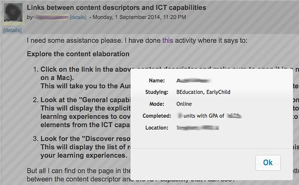

---
categories:
- bad
- elearning
date: 2014-09-22 15:26:06+10:00
next:
  text: Unintended consequences of technology in education
  url: /blog2/2014/10/02/unintended-consequences-of-technology-in-education/
previous:
  text: Breaking BAD to bridge the reality/rhetoric chasm
  url: /blog2/2014/09/21/breaking-bad-to-bridge-the-realityrhetoric-chasm/
title: A perspective on why institutional e-learning is so bad
type: post
template: blog-post.html
comments:
    - approved: '1'
      author: Maurice A. Barry
      author_email: maurice.a.barry@gmail.com
      author_ip: 134.153.32.130
      author_url: http://duckstarfish23.wordpress.com
      content: In many ways the LMS, which is so vital to many of the routine tasks we
        all have to do, imposes serious limits on the extent to which we can do when you
        suggested. As a longtime user of D2l I have observed much the same limitations
        as you have noted with moodle. Perhaps much of this is due to the fact that the
        larger LMS (D2l, Moodle, Blackboard) have been around longer than Web 2.0 and
        constantly struggle to more or less force it in on top of a previous mid set.
        Interestingly enough, though, I have recently had reason to make some use of Schoology
        and, while it's by no means a "solution" I admit to being intrigued by what the
        inherently "social networking" approach might be able to do as far as diverse
        engagement is concerned.
      date: '2014-09-22 22:24:09'
      date_gmt: '2014-09-22 12:24:09'
      id: '1134'
      parent: '0'
      type: comment
      user_id: '0'
    - approved: '1'
      author: David Jones
      author_email: davidthomjones@gmail.com
      author_ip: 124.185.38.198
      author_url: https://djon.es/blog/
      content: It appears that EDUCAUSE and the Gates Foundation <a href="http://www.educause.edu/library/resources/next-generation-digital-learning-environment-ngdle"
        rel="nofollow">are on the case</a>.  I'm sure there are going to be very smart
        people involved with that project, but I fear that they'll have the same problems.  The
        problems which I think lay at the bottom of all of these systems - SET thinking.  If
        they still think of the next generation in terms of "Established" then the same
        problems are going to arise.  It also sounds like they are trying to be "Strategic",
        i.e. identify some future possible state and work towards that. They are using
        the same mindsets/process that lead to the LMS.  Dave Snowden has <a href="http://cognitive-edge.com/blog/entry/6351/please-not-more-of-the-same-2-of-3/"
        rel="nofollow">a recent post</a> that touches on some of this.
      date: '2014-09-24 09:12:39'
      date_gmt: '2014-09-23 23:12:39'
      id: '1135'
      parent: '1134'
      type: comment
      user_id: '1'
    - approved: '1'
      author: Maurice A. Barry
      author_email: maurice.a.barry@gmail.com
      author_ip: 47.55.84.92
      author_url: http://duckstarfish23.wordpress.com
      content: It appears that we are not far apart in our thinking. In a post from a
        while back I pointed out that many of those who wield the real power in education
        are not that qualified to do it and have agendas that run contrary to what public
        education is trying to achieve. It's a little rambling but the post is here if
        you are interested (though I did hit he points in the summary :-)  http://mauriceabarry.wordpress.com/2014/01/13/eltm11-who-wields-the-power-what-of-purpose-and-audience/
      date: '2014-09-24 09:22:01'
      date_gmt: '2014-09-23 23:22:01'
      id: '1136'
      parent: '1135'
      type: comment
      user_id: '0'
    - approved: '1'
      author: Maurice A. Barry
      author_email: maurice.a.barry@gmail.com
      author_ip: 47.55.84.92
      author_url: http://duckstarfish23.wordpress.com
      content: Oh, and it appears we both have common ground with DS. I noticed you touch
        on some of that yourself a few weeks back.
      date: '2014-09-24 09:24:14'
      date_gmt: '2014-09-23 23:24:14'
      id: '1137'
      parent: '1135'
      type: comment
      user_id: '0'
    
pingbacks:
    []
    
---
    by  [TheGiantVermin](https://www.flickr.com/people/tudor/) 

It's about time to tilt at the same windmill again. For as long as I can remember I've thought institutional e-learning was done badly. Here's another attempt to explain why and map out a way forward. The following is based heavily on on [this paper](/blog2/2014/09/21/breaking-bad-to-bridge-the-realityrhetoric-chasm/) that will be presented at [ASCILITE'2014](http://ascilite2014.otago.ac.nz/) and is a slightly re-worked version of something I shared as part of my current institution's attempts to formulate operational plans.

The argument is that institutional e-learning is based entirely on the wrong mindset. To see any hope of improvement it needs to integrate a little of another largely incommensurable mindset. I use a problem specific to my practice below to illustrate the argument. My co-author [shares a different problem](/blog2/2014/09/21/breaking-bad-to-bridge-the-realityrhetoric-chasm/#MAV) in the paper that illustrates the same point, but his problem is potentially more interesting.

### My problem

I teach [EDC3100, ICT and Pedagogy](http://www.usq.edu.au/course/specification/2014/EDC3100-S1-2014-ONC-WIBAY.html) a third year core course in the Bachelor of Education. The first semester enrolment typically consists of 300 plus pre-service teachers; studying to become every type of teacher from early childhood, primary, secondary, and VET; located at each of USQ's campuses, Malaysia and about 170 of the students via online learning. Some of these students - due to exemptions - are in their first semester of University study. Others are into the 6th, 7th and beyond year of study at USQ.

As a course that is teaching teachers about how to use Information and Communication Technologies to enhance/transform their pedagogy, the course requires all students to make heavy use of ICTs. Many of these students are [not "digital natives"](/blog2/2013/03/13/many-of-our-students-are-neither-digital-natives-nor-digitally-literate/). Even those with years of online study at USQ show surprising levels of digital illiteracy. Hence there are lots of questions from students that need answering. Almost all of these questions are asked on discussion forums.

When I respond to a question on a course discussion forum it's often important/useful to cater the response to the specifics of the student. In particular, it's not unusual to see the need to customise a response based on

1. The student's mode (at which campus or online) of study.
2. What "type" of teacher are they studying to become (early childhood, primary etc).
3. Whether they also have a specific learning area/discipline. e.g. HPE students often have a specific set of challenges around ICTs and the secondaries have specific learning areas. Then the secondary students are focusing on two or so disciplines.
4. Whether this is the student's first semester of study.
5. The physical location of online students. Students in other states or overseas often use different curricula etc.

**Challenge:** If you are teaching in a University, can you find out this type of information about your students?

At my institution I have access to an LMS and a student records systems. This information is mostly not in the LMS, and if it is it will require navigating to another page to find it. While it is in the student records system the default access provided to academics does not allow them to access that information.

The silly solution I've used for the last 3 years has been

1. At the start of semester, ask the Faculty staff member with the appropriate permission and ask them to generate a spreadsheet providing this information for all students.
2. I then have that spreadsheet open when replying to student queries and when needed I check the spreadsheet.

As you might imagine this doesn't happen as often as it should because it takes time. Of course the spreadsheet is almost straight away out of date as students add and drop the course.

### My new solution

What I did instead was modify my web browser so that when it sees any page provided by the Study Desk that contains a link to a user profile it will add a new link to the page that is close by the user profile link. When I click on this new link (and it's for a student in EDC3100) a dialog box will pop up with additional information about the student (what they are studying, their mode of study, how many courses they've completed and their city/post code/country).

The following figure shows what it looks like. Note:

1. The \[details\] links near the author's name and photo. I haven't spent the time to tidy this [kludge](http://en.wikipedia.org/wiki/Kludge) up.
2. The dialog box and how the forum post is somewhat greyed out. The idea is that I can check this information, click Ok and then reply to the query.

 

Currently, this only works via a web browser running on my laptop. It's a personal solution. It is based on a particular [set of technologies](/blog2/2014/02/02/moodle-activity-viewer-mav-and-the-promise-for-bricolage/) developed by and currently being used at CQUni for a strategic project around retention.

### Why can't USQ have more solutions like this? SET in our ways

The argument is that USQ (or any other university) is generally unable to achieve a solution like this due to the usually implicit mindset that underpins how it operates. My co-author and I have tried to make this mindset explicit as the "SET framework" based on how the institution answers three questions:

1. What work gets done? - **S**trategic i.e. there is a strategic plan and a sequence of operational plans that define what is acceptable. The assumption is that the organisation has identified some ideal future state (enshrined in the plans) and what work can be done is judged against how well it helps the organisation achieve this pre-defined state. Any work that isn't in the plan is deemed inefficient or unimportant. This particular problem could be aligned with the existing institutional plans, but there's a question of how easily this could be achieved.
2. How is ICT perceived? - **E**stablished This quote from an IT person at CQU from around 2003/4 sums up this perspective nicely, "we should seek to change people's behavior because information technology systems are difficult to change" (Sturgess & Nouwens, 2004, n.p). This view of ICTs is that it is really hard to change them and instead people and their practices should change. This is especially prevalent with "enterprise systems" where best practice advice is to implement them as "vanilla" (i.e. no change to the technology). Peoplesoft (USQ's student records system) is a horrendously difficult and expensive system to modify. Moodle - as open source software - is theoretically easier to modify but still requires some significant technical skill (i.e. expensive and rare) to modify properly. Even Moodle is very difficult to modify if your modifications require contextually specific changes to the systems in-built assumptions. e.g. modifying the Moodle discussion forum to show whether an EDC3100 students is studying to become a HPE teacher is not likely to happen.
3. How the world is perceived? - **T**ree-like By this I mean [hierarchical tree](http://en.wikipedia.org/wiki/Tree_structure) in the computer science sense. Strategic approaches will always use logical decomposition to reduce a big, really hard problem into lots of little easy to solve problems and assumes that you can just put all those little solutions together again and solve the big problem. You can see this in org charts, how learning and teaching is broken down into programs, courses, topics, learning objectives, attributes etc, and information systems. Each of the little boxes in the tree become responsible for a specific task. e.g. the development and support of IT is meant to be done in the IT box. Teaching education is done by the education teaching box etc. Managing student records is done in the Peoplesoft box which is the responsibility of the Student Administration box.
    
    The problem is that it's really, really hard to move between boxes. If I wanted my problem solved, it would have to recognised by the folk in my box that are part of the IT governance process. They would take my problem (along with everyone else's) up the hierarchy to someone/group who can make a judgement. A small problem like this is almost certainly going to be starved of attention as the focus is on achieving strategic goals. If it does get attention there's the challenge of trying to bridge the two different boxes in which Peoplesoft and Moodle reside. etc.
    
    The more likely outcomes is that I'm not going to bother (at least not with the formal structure)

### How is this possible? Breaking BAD

The solution I've developed is possible due to a different mindset that provides different answers to the three questions above. We've labelled this mindset the "BAD framework".

It answers the three questions this way

1. What work gets done? - **B**ricolage Rather than trying to achieve some pre-defined perfect state, bricolage focuses on solving concrete, contextualised problems using the resources that are to hand.I had a problem that I needed to solve so I figured out how I could solve it with the resources I had to hand. This year I've been able to improve my solution because I had access to new and better resources. But not resources that were provided by USQ. A good set of APIs would be a great help.
2. How is ICT perceived? - **A**ffordances ICTs are seen as [protean](http://www.thefreedictionary.com/protean). They can and should be manipulated, modified and re-worked to help people achieve what they want to achieve. There is no such thing as a "perfect design" or "perfect system", the diversity and rapid change inherent in learning and teaching makes such an idea as nonsensical. In this case, I've been able to use the spreadsheet manually generated from Peopelsoft, Perl, Postgres, PHP, [Greasemonkey](https://addons.mozilla.org/en-US/firefox/addon/greasemonkey/), the Firefox web browser and the well designed HTML created by Moodle to manipulate and change the appearance and functionality of the Study Desk pages.
3. How the world is perceived? - **D**istributed The world is (and universities are) complex, dynamic, and consists of interdependent assemblages of diverse actors (human and not) connected via complex networks. The ability to quickly construct and traverse those connections are essential to learning, understanding and action. Poldolny & Page (1998) apply the distributed view to governance and organisations and describe it as meaning that two or more actors are able to undertake repeated interactions over a period of time without having a centralised authority responsible for resolving any issues arising from those interactions. Rather than the typical tree-like structure of server (Study Desk) and client (my laptop), my solution draws on a network of technologies some on my laptop and some on university servers. I've used that distributed technologies to make connections not previously possible and hence I'm no able to do more than previously.

### Implications

[The paper](/blog2/2014/09/21/breaking-bad-to-bridge-the-realityrhetoric-chasm/) that goes into this in more detail closes with this

The suggestion here is not that institutions should see the BAD framework as a replacement for the SET framework, but rather that they should engage in some bricolage and explore how contextually appropriate mixtures of both frameworks can help bridge their e-learning reality/rhetoric chasm. Perhaps universities need to break a little BAD?

Hence the suggestion for institutions is to figure out whether we want to break a little BAD and how that might be done.

However, as argued above it takes more than just having good technology. The fundamental mindset that underpins much of how an organisation does business needs to be questioned. This is hard.

The paper also raises the following as potential examples of how existing conceptions might need to be challenged

rather than require the IT division to formally approve and develop all applications of ICT, their focus should perhaps turn (at least in part) to enabling and encouraging "ways to make work-arounds easier for users to create, document and share" (Koopman & Hoffman, 2003, p. 74) through organisational "settings, and systems arranged so that invention and prototyping by end-users can flourish" (Ciborra, 1992, p. 305).

rather than academic staff development focusing on ensuring that the appropriate knowledge is embedded in the heads of teaching staff (e.g. formal teaching qualifications), there should be a shift to a focus on ensuring that the appropriate knowledge is embedded within the network of actors – both people and artefacts – distributed within and perhaps outside the institution.

Rather than accept "the over-hyped, pre-configured digital products and practices that are being imported continually into university settings" (Selwyn, 2013, p. 3), perhaps universities should instead actively contribute to "a genuine grassroots interest needs to be developed in the co-creation of alternative educational technologies. In short, mass participation is needed in the development of “digital technology for university educators by university educators” (p. 3).

The argument isn't that we should throw out Moodle or other systems. Instead there needs to be mechanisms by which we can harness the complete knowledge distributed across the institution to extend and modify those existing technologies into something that is unique to the institutional context.

For me, I'd love to see what happens if institutional e-learning was characterised by

Widespread and on-going bricolage by a widely distributed collection of individuals and groups (students, teachers and others) from across the entire institution all connected via various means and learning from and building upon each others work. An institutional context that provides a range of functionality that supports and enables this on-going engagement with bricolage and recognises that this is where its competitive advantage will come from. An institutional context that is actively trying to make it easier to connect to actors from across and outside the institution and grow the knowledge embedded in those connections. All of this knowledge being used to manipulate and modify technologies to achieve new and interesting learning experiences.