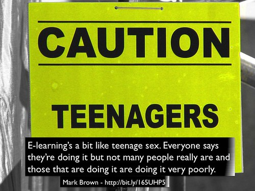
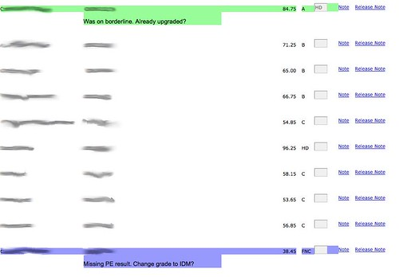
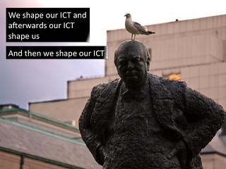
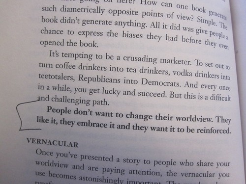

---
categories:
- bad
date: 2014-11-07 10:29:06+10:00
next:
  text: Adding more student information to a Moodle course
  url: /blog/2014/11/13/adding-more-student-information-to-a-moodle-course/
previous:
  text: Some more tweaks to gradebook
  url: /blog/2014/11/05/some-more-tweaks-to-gradebook/
title: '"Established versus Affordances: part of the reason institutional e-learning
  is like teenage sex"'
type: post
template: blog-post.html
comments:
    []
    
pingbacks:
    - approved: '1'
      author: Adding more student information to a Moodle course | The Weblog of (a) David
        Jones
      author_email: null
      author_ip: 192.0.80.160
      author_url: https://djon.es/blog/2014/11/13/adding-more-student-information-to-a-moodle-course/
      content: '[&#8230;] script uses much the same technology as the gradebook fix mentioned
        in this post and @damoclarky&#8217;s Moodle Activity Viewer. The work on these
        scripts is part of an on-going [&#8230;]'
      date: '2014-11-13 16:50:53'
      date_gmt: '2014-11-13 06:50:53'
      id: '1147'
      parent: '0'
      type: pingback
      user_id: '0'
    - approved: '1'
      author: This year it&#8217;s all about the connections | The Weblog of (a) David
        Jones
      author_email: null
      author_ip: 192.0.83.81
      author_url: https://davidtjones.wordpress.com/2015/01/13/this-year-its-all-about-the-connections/
      content: '[&#8230;] fix to the Peoplesoft gradebook implemented last year is an
        early example of a CASA. A greasemonkey script is used to create an [&#8230;]'
      date: '2015-01-13 10:55:35'
      date_gmt: '2015-01-13 00:55:35'
      id: '1148'
      parent: '0'
      type: pingback
      user_id: '0'
    
---
The following is an attempt to expand and connect some thoughts from a soon to be presented [ASCILITE'2014](http://ascilite2014.otago.ac.nz/) paper titled [Breaking BAD to bridge the the reality/rhetoric chasm"](http://bit.ly/badchasm) (this link will eventually have a range of additional resources). The expand part of this post is me trying to experiment with some approaches of explaining what we're trying to get at. Hopefully with the aim of being convincing. The "connect" part of this post aims to connect with some of the discussion about the [LMS that has gone on recently](http://abject.ca/lets-get-systematic-baby/).

# Some context

The paper draws on our experience in an attempt to identify some reasons why institutional e-learning is like teenage sex (you'll soon see why I'm reluctant to just say bad). In doing so, we're proposing two mindsets we've seen/used that underpin institutional e-learning. They are

1. the SET mindset - **S**trategic, **E**stablished, and **T**ree-like. The most common (and the cause of all the problems, we think).
2. the BAD mindset - **B**ricolage, **A**ffordances, and **D**istribution. Which better describes the mindset we use in our own practice.

Even though these two mindset are incommensurable, we think that institutional e-learning is to SET in it's thinking and needs to break BAD a little (maybe a lot) more often. [This table](/blog/2014/09/21/breaking-bad-to-bridge-the-realityrhetoric-chasm/#badset) summarises and compares the two mindsets.

This post - at the title suggests - is going to look at the 2nd of the three components of these mindsets. i.e. How is Information and Communication Technologies (mostly software) (ICT) perceived?

The S**E**T mindset sees ICT as _**E**stablished_. With this mindset, ICTs are a hard technology and cannot be changed. Instead, people and their practices must be modified to fit the fixed functionality of the technology.

The B**A**D mindset sees ICT as having _**A**ffordances_ for change. ICT is a soft technology that can and should be modified to meet the needs of its users, their context, and what they would like to achieve.

The paper/presentation seeks to illustrate these mindsets and their components by drawing on challenges that @damoclarky (co-author) and I have faced and how we've worked around them. The point is that these examples are indicative of broader problems. These won't be the only examples of such problems, there will be many more. The paper uses two other much larger examples from our experience.

The point is that the SET mindset underpinning most institutional e-learning makes it difficult, if not impossible, to be aware of let alone respond to these problems.

# A practical example - Peoplesoft gradebook

My current institution (and my prior institution) had the misfortune to choose to implement the Peoplesoft ERP at the turn of the century. Many of millions of dollars later we are lumbered with using this conglomeration of tools for many tasks, including the processing of final results and grades at the end of semester. A task that is about to start.

In my situation, all of the results for students are entered into a local online assignment management system that is also used for the submission, marking etc of student assignments. Once a student's assignment is marked, moderated and returned to the student, their mark for that assignment is placed into the Peoplesoft gradebook. Once the final assignment is moderated and returned I can view the Peoplesoft gradebook and see something like the following. Listing all the students, their names/ids (blurred here), the final result and the grade awarded. (Click on the images to see larger versions)

Now the Peoplesoft gradebook has been configured to do something intelligent. It will automatically calculate the students grade based on the result. And it is mostly, but NOT always, correct. You see there are special cases that have not been programmed into the gradebook, including:

1. rounding up; If a student is within 0.5% of a grade borderline (e.g. 84.6%) then they should be upgraded to the next grade.
2. supplementary; If a student is within 5% of a fail mark, then they should be given the appropriate form of supplementary grade.
3. missing compulsory result; If a student has not yet received a mark for a compulsory assignment, then they should be given a "result outstanding" grade.
4. fail not completed; and, If a student has failed a course, but hasn't completed all of the assessment, then they should get a "fail not completed" grade.
5. fail not passed; If a student hasn't completed any of the assessment items, then they should get a "fail not pass" grade.

Since none of these special cases are handled by Peoplesoft, the course examiner must do it manually. The course examiner is expected to scroll through the gradebook looking for students who fall into these categories. When identified, the examiner then changes the grade to the appropriate value and may be required to add a note explaining the change.

The course I teach in first semester has 300+ students spread over four different modes. This means I have to scroll through four difference lists (one list per mode), some with 100s of students manually searching for special cases. As shown in the image above, the gradebook page does not show any other information such as whether the student as submitted all assessment items. Or in my case, whether a result for the Professional Experience item (managed by another section) has been received. Not only do I have to manually look through a web page of a 100+ students. I have to be manually checking other data sources in order to make the change.

And my course is by no means the largest course.

To help with this process, various actors within the institution will every semester or so generate sets of instructions about how to use the Peoplesoft gradebook and reminding people of the special cases. Every semester a several other staff members have to run checks on the changes made (or not) by the examiners to identify potential problems.

# Why is this a problem?

Human beings are very bad at repetitive, low-level tasks like this. Computers are very good at it. In this case, the Peoplesoft system is only doing part of the necessary job.

This isn't a particular learner focused example, but the suggestion here is that these types of problem a littered throughout the learner/teacher experience of institutional e-learning. This particular problem is interesting because I've just solved it.

# Why can't it be solved?

But I'm not holding my breath for the institution to solve this problem. My argument is that the SET mindset that underpins how it does business will significantly limit its capability to recognise this problem, let alone fix it.

In part, this is because organisations are increasingly seeing ICT as established. i.e. it's not something they can change. ICT - especially large complex enterprise systems like an ERP or an LMS - is something that should be implemented vanilla, as is. This is best practice advice in the research and practitioner literature. ICT is seen as very hard and expensive to change. Well illustrated by my favourite quote from an IT person participating in a LMS review process

> we should seek to change people’s behavior because information technology systems are difficult to change (Sturgess and Nouwens, 2004, n.p)

Even though I detest Peoplesoft, I have to imagine that there is some mechanism within it to program these sorts of special cases into the gradebook. But the system owner of Peoplesoft is that student administration part of the institution. In a separate branch of the organisational tree (hierarchy) than the academics and other staff who are carrying the cost of doing this manually (this links to the 3rd component of SET/BAD).

But a problem here is also the assumption that it is the Peoplesoft gradebook that has to change. It seems obvious. The problem here is that the gradebook isn't providing some functionality. Thus, the expensive ERP needs to be blamed and fixed. But ERPs are hard (i.e. expensive) to change and can only be changed by qualified people who are expensive and scarce. They can only be used for important - as defined by the system owner - work.

The net effect is that it is very difficult (if not possible) to change the gradebook. It is _Established_. It's likely that this view is so fundamental, that the possibility of using ICT to fix this problem wouldn't even be considered.

This perspective of ICT reminds me of this quote from Churchill.

The established mindset results in us and what we can (and can't) do being shaped by our technologies.

# How might the BAD mindset can solve the problem?

With a BAD mindset you might get a solution that generates the web page shown in the following image. In that image you can see that two of the rows (students) are now coloured differently. The change in colour represents one of the special cases mentioned above. You'll also see that the coloured rows have some additional hints to remind the course examiner either: what they need to do; or, what they've already done.

This solution did not involve any changes to Peoplesoft. As established above, it is too hard to change and I don't have the access or knowledge to change it. However, there are other possibilities. At some stage the gradebook generates a web page and sends it to my web browser on my computer. At this stage, I can get some level of affordance for change via [Greasemonkey](https://addons.mozilla.org/en-US/firefox/addon/greasemonkey/), a plugin for the Firefox browser. Greasemonkey allows you to write scripts (written in Javascript) that can manipulate the presentation and functionality of web pages.

Using Greasemonkey, I've been able to write a script that

1. Recognises when a web page generated by the Peoplesoft gradebook appears;
2. Looks through each of the students in the table looking for the special cases; and,
3. When it finds one, the script changes the colour of the row and adds a hint about what should be done by the examiner.

The protean nature of ICT has been leveraged to increase the affordances offered to the user.

In theory, I can share this Greasemonkey script and it can be installed by anyone. Assuming that the default institutional operating system hasn't been SET in stone so that you can't install a Firefox plugin.

# The Affordance mindset

The term affordance comes in many shapes, sizes and arguments. In this context, an affordance is seen as a relation between the abilities of individuals/organisations and the features of ICT. In the BAD mindset there are two important implications around the idea of affordance, they are

1. ICTs generally have an affordance for being protean/mutable. Echoing Kay’s (1984) discussion of the "protean nature of the computer" (p. 59) as "the first metamedium, and as such has degrees of freedom and expression never before encountered". But as affordances are relational, this affordance is only perceived by those who can "program". Echoing Rushkoff's (2010) sentiment that that digital technology is "biased toward those with the capacity to write code" (Rushkoff, 2010, p. 128). The problem is that most universities are increasingly getting rid of the people who have the ability to "write code" or more generally perceive ICT as protean. Since I can write code and have access to Greasemonkey. I can use Greasemonkey to manipulate the output of Peoplesoft to change in to a form of expression that is more appropriate.
2. ICTs should be continually refined to maximise the affordances they offer. i.e. people shouldn't have to reshape their hand to fit the tool. The tools they have should actively help and transform what is done. This process should tend to recognise the diversity inherent in people.

In short, the affordance mindset not only knows that ICT can be changed, it should be changed to suit the purposes of the people using it. Or to adapt the Churchill quote above to the affordance mindset.

This mindset is not new. People have always done it. There are in fact entire sections of literature devoted to talking about people doing this. For example, there's literature on ["shadow systems"](/blog/publications/the-rise-and-fall-of-a-shadow-system-lessons-for-enterprise-system-implementation/) in the information systems field that sees such practices as a threat/risk to organisational integrity, efficiency and apple pie. There's a similar literature - mostly in computer science and management - under terms such as work-arounds, make-work and kludges (Koopman & Hoffman, 2003).

The increasingly digital nature of life and the increasing availability and functionality of enabling technologies (like Greasemonkey) are only making the affordance mindset more widely available. The problem is that not many organisations are yet to recognise it.

# Implications

Our argument is that unless an institution can adopt more of an **A**ffordance approach, rather than an **E**stablished approach to ICT, it's unlikely to make any progress in bridging the chasm between the reality and rhetoric around e-learning. It's e-learning will continue to be more like teenage sex.

However, we don't want to stop there. One of the aims of this work is to try and understand how to bridge the chasm. To explore answers to how institutional e-learning can break BAD? What might that look like and what might be the impacts?

Changing any mindset is far from easy.

  
   by  [John Drake Flickr](https://www.flickr.com/people/johndrake45/) 

## Can "scratch my itch" become "scratch our itch"?

The above example - like most current examples of the affordance mindset - arise from the work of an individual or small group scratching an itch particular to them. They are interested in solving their own problem with the tools they have to hand (bricolage which is the B in the BAD mindset and the topic of a latter post). A problem with this approach is how can that personal scratching of an itch become something that is usable by more (or perhaps most) people in an organisation?

One approach is for organisations to focus less on the assumption that central ICT staff are able to develop/select "perfect" ICT that don't need to change, and instead focus on "ways to make work-arounds easier for users to create, document and share" (Koopman & Hoffman, 2003, p. 74) through organisational "settings, and systems - arranged so that invention and prototyping by end-users can flourish" (Ciborra, 1992, p. 305).

This appears to involve at least two steps in terms of technologies

1. Providing technologies etc. that make it easier to scratch an itch (create). e.g. an institution providing [appropriate APIs](http://university.apievangelist.com/white-paper.html) for its data and services.
2. Providing technologies etc. that make it easier to share "scratches" (document and share) e.g. something like [User scripts](http://userscripts-mirror.org/) for Greasemonkey. A place where people from across the institution (and perhaps broader) can share, comment and rate "scratches"

## The threat of mobile and other closed systems?

In this example and all the other examples we've develop so far we have relied on Greasemonkey to provide the duct tape that we use to renovate the institutional systems. Greasemonkey works in a Web environment. The increasing push to mobile devices and away from the web has some implications for this type of work. Specific apps are not a very open system, they don't offer much in the way of affordances. The apparent [death of RSS](http://andrewchen.co/the-death-of-rss-in-a-single-graph/) is indicative of a preference for some technology providers for integrated/closed/established systems, rather than open systems.

## Growing digital renovators and builders

Since affordance is a relational concept, simply providing the technology isn't enough. Every institution will have their own "Fred in the shed" or "Lone ranger" that have been scratching their own itch. But the majority of staff can't, don't or won't. The 2015 Horizon reports identify the apparent low digital fluency of academics as a major impediment to the quality use of ICT in learning and teaching (Johnson, Adams Becker, Cummins, & Estrada, 2014). If academics are perceived as not being able to use the current technology, what hope do they have for being able to modify it?

One perspective might be to consider the implications of what it means for affordance to be relational. Blaming the limited digital fluency of academics is only looking at one side of the relationship. Sure, there may be an issue with digital fluency and the [availability heuristic](http://en.wikipedia.org/wiki/Availability_heuristic) means that just about everyone has a story about a "dumb academic" to illustrate this. However, there may also be an issues (as shown above) with the quality of the technologies (and the support systems, processes and policies surrounding those technologies) they are required to use.

There's also a question about whether or not current definitions of digital fluency are sufficient. Is a focus on the ability to use the institutionally provided ICT effectively sufficient for fluency? It might appeal to institutional senior management who just want their staff to use the ICT they have been provided with. But, as argued above ICT are protean, a key advantage of ICT is the ability to be modified and changed to suit requirements. Is there a case to be made that being digitally fluent may extend to include the ability to modify ICT to suit your purpose?

Not to suggest that everyone needs to have an undergraduate degree in software engineering. Not everyone in the digital world needs to be a digital builder. But perhaps being digitally fluent does mean that you should have some skills in digital renovation. This capability may be especially important if you are a teacher. Shulman (1987) described the distinguishing knowledge of a teacher as the capacity

> to transform the content knowledge he or she possesses into forms that are pedagogically powerful and yet adaptive to the variations in ability and background presented by the students (p. 15)

If learning and teaching are increasingly taking place in a digital world, then having the ability to transform content knowledge into pedagogically powerful yet adaptive forms would seem to imply some capacity as a digital renovator.

Of course this capacity should not be limited to teachers. Learners and learning in a digital world would also seem likely to benefit from the capacity to digitally renovate their digital spaces. Which in turn brings up the question of "their digital spaces". Not digital spaces provided by the institution, but spaces that learners and teachers own and control.

This touches on some of the issues raised by @audreywatters in [The Future of Education: Programmed or Programmable](http://www.hackeducation.com/2014/11/04/programmed-instruction-versus-the-programmable-web/). The differences between the _Established_ and _Affordances_ view of ICT seems to be a partial contributor to the Programmed Instructions and Programmable Web models of ed-tch Audrey mentions. The Established view "hard-codes" the functionality and content of learning. The Affordances view sees ICT as a space for co-creation and connection.

## Agency versus structure

In my current institution it's quite common for the topic of ICT to arise amongst any gathering of staff. The tone of the conversation is almost always negative. It doesn't work. Things break at the worst possible time and there are sessions of woe sharing arising from the common experience of make work arising from limitations of systems. There are on-going complaints about yet another change in this system, an upgrade of Moodle, a new assignment management system or a new look and feel for course sites. A litany of change being done to staff because of the needs of technology. Technology is shaping us.

Such structure would appear to be sucking the agency of teaching staff. Capable and confident face-to-face teaching staff are struggling with systems that require their teaching practice to be shoe-horned into the inappropriate capabilities offered by the functionality of institutional systems. Teaching staff can see what they'd like to be able to do better, but are unable to do it. The ICT is shaping them and their practice with no apparent capacity to shape the digital space in which their learning and teaching takes place.

How widespread is this view? What impact does it have on their identity and capability as a teacher? What impact does it have on the quality of learning and teaching?

What would happen if they had the capacity to shape the ICT? Even if just a little bit more. Would that increased sense of agency add something to the quality of learning and teaching?

## Not ready for digitally fluent staff

The Horizon Report's identification of limited digital literacy of academic staff as a significant barrier begs a range of questions. Accepting the premise and putting aside questions over what it means to digitally literate or fluent I wonder: Are universities ready for digitally fluent staff? Would digitally fluent staff be will to accept an organisation having an _Established_ view of ICT, or would they expect an _Affordances_ view of ICT?

# References

Ciborra, C. (1992). From thinking to tinkering: The grassroots of strategic information systems. The Information Society, 8(4), 297–309.

Johnson, L., Adams Becker, S., Estrada, V., & Freeman, A. (2014). NMC Horizon Report: 2014 Higher Education Edition. Austin, Texas. Retrieved from http://www.nmc.org/publications/2014-horizon-report-higher-ed

Koopman, P., & Hoffman, R. (2003). Work-arounds, make-work and kludges. Intelligent Systems, IEEE, 18(6), 70–75. Retrieved from http://ieeexplore.ieee.org/xpls/abs\_all.jsp?arnumber=1249172

Shulman, L. (1987). Knowledge and teaching: Foundations of the new reform. Harvard Educational Review, 57(1), 1–21. Retrieved from http://her.hepg.org/index/J463W79R56455411.pdf