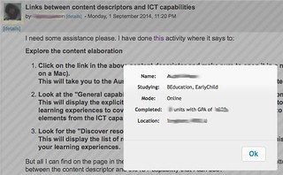
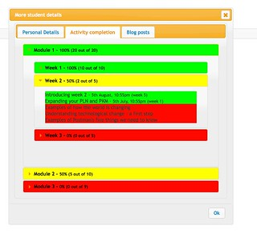

---
categories:
- bad
- elearning
date: 2014-11-13 16:50:48+10:00
next:
  text: '"What is" and "what might be" - evidence of a problem with institutional
    e-learning?'
  url: /blog/2014/12/15/what-is-and-what-might-be-evidence-of-a-problem-with-institutional-e-learning/
previous:
  text: 'Established versus Affordances: part of the reason institutional e-learning
    is like teenage sex'
  url: /blog/2014/11/07/established-versus-affordances-part-of-the-reason-institutional-e-learning-is-like-teenage-sex/
title: Adding more student information to a Moodle course
type: post
template: blog-post.html
comments:
    []
    
pingbacks:
    - approved: '1'
      author: Types of e-learning projects and the problem of starvation | The Weblog
        of (a) David Jones
      author_email: null
      author_ip: 192.0.101.73
      author_url: https://davidtjones.wordpress.com/2015/06/16/types-of-e-learning-projects-and-the-problem-of-starvation/
      content: '[&#8230;] that are specific to a particular pedagogical design. Perhaps
        unique to a single course. e.g. the &#8220;more student details&#8221; Greasemonkey
        script (see more recent screenshot below) that I&#8217;ve implemented for EDC3100.
        The pedagogical design [&#8230;]'
      date: '2015-06-16 10:56:41'
      date_gmt: '2015-06-16 00:56:41'
      id: '1093'
      parent: '0'
      type: pingback
      user_id: '0'
    - approved: '1'
      author: Exploring BIM + sentiment analysis &#8211; what might it say about student
        blog posts | The Weblog of (a) David Jones
      author_email: null
      author_ip: 192.0.83.190
      author_url: https://davidtjones.wordpress.com/2015/06/16/exploring-bim-sentiment-analysis-what-might-it-say-about-student-blog-posts/
      content: '[&#8230;] But for the purpose of the talk I have to give in a couple of
        weeks, I should be able to use this to knock up something that works with the
        more student details script. [&#8230;]'
      date: '2015-06-16 22:38:08'
      date_gmt: '2015-06-16 12:38:08'
      id: '1094'
      parent: '0'
      type: pingback
      user_id: '0'
    - approved: '1'
      author: Updating &#8220;more student details&#8221; | The Weblog of (a) David Jones
      author_email: null
      author_ip: 192.0.81.73
      author_url: https://davidtjones.wordpress.com/2015/07/23/updating-more-student-details/
      content: '[&#8230;] &#8220;More student details&#8221; (see image below) is the
        most visible part of the additional systems I&#8217;ve put in place to make teaching
        bearable (this presentation talks more about it). The problem I&#8217;m dealing
        with here is that a new semester has started, which means I need to re-configure
        these feral systems to work with the new semester. [&#8230;]'
      date: '2015-07-23 12:39:15'
      date_gmt: '2015-07-23 02:39:15'
      id: '1095'
      parent: '0'
      type: pingback
      user_id: '0'
    
---
moreStudentDetails.user.js is a Greasemonkey script I've written to provide more details about a student when I'm using Moodle. Originally intended to help when responding to a student query in a course I teach that regularly has 300+ pre-service teachers from a range of backgrounds and locations. The current version produces something like the following image (click on it to see a larger version).

The script adds a link titled \[details\] to the Moodle page whenever it finds a link to a user profile (see above). When you click on that link a small dialog box pops up with some more student details. For my purposes, I'm particularly interested in what type of pre-service teacher they are and their mode/campus.

This script uses much the same technology as the gradebook fix mentioned in [this post](/blog/2014/11/07/established-versus-affordances-part-of-the-reason-institutional-e-learning-is-like-teenage-sex/) and @damoclarky's [Moodle Activity Viewer](http://damosworld.wordpress.com/2013/08/30/the-moodle-activity-viewer-mav-heatmaps-of-student-activity/). The work on these scripts is part of an on-going project to identify some theories/principles that can be used to enhance institutional e-learning (see [this paper](/blog/2014/09/21/breaking-bad-to-bridge-the-realityrhetoric-chasm/) for early development of these ideas).

The rest of this post is divided into two parts

1. Recent developments - documents thinking about how to transform this simple script into something that provides more useful and specific process analytics (see [this post](/blog/2013/08/14/aligning-learning-analytics-with-learning-design/) for a definition of process analytics). Also documents early attempts to share this script via github.
2. [Initial development](/blog/2014/09/21/breaking-bad-to-bridge-the-realityrhetoric-chasm/) - a development diary of early steps in developing this script.

# Recent developments

## Sharing via github

Have just created the [BAD repository](https://github.com/djplaner/bad) on github. It currently hosts two scripts

1. gradebookFix.user.js - briefly mentioned in [this post](/blog/2014/11/07/established-versus-affordances-part-of-the-reason-institutional-e-learning-is-like-teenage-sex/) this script modifies the Peoplesoft gradebook to highlight special cases.
2. moreStudentDetails.user.js - the script described here. Only the client script, not the server at the moment.

Much of this code is still quite ugly and probably not at all useful by others (though the gradebookFix.user.js should be useful by any course examiner from USQ).

Creating the repository at the moment is more about having the scripts under source control, stored off my laptop and to start playing with the process and mechanisms of sharing these types of scripts.

The name "BAD" is based on the BAD (Bricolage/Affordances/Distributed) mindset formulated in [the paper](/blog/2014/09/21/breaking-bad-to-bridge-the-realityrhetoric-chasm/).

## Extending it to include process analytics

Lockyer et al (2013) define process analytics as analytics that "provide direct insight into learner information processing and application" (p. 1448). i.e. analysis and representations that provide some additional detail about how the learning is progressing. I'm keen to add more of this to the "more student details" script. The following explains what I'd like to add and some reflection about how this might be best done with the technologies available.

As it happens, @Edu\_K has just [commented](/blog/2013/08/14/aligning-learning-analytics-with-learning-design/#comment-7067) on a post and described nicely what I'm trying to achieve

> I like your idea of in-built LA functions into the existing tools. This can help their use to adjust teaching “on-the-go” in response to needs of the particular cohort – which is one of the most important abilities of a good educator

### The plan

I'm looking to add two additional groups of information about students specific to this course to the dialog box

1. Activity completion; and, Each week of the course has a learning path of set activities. Students get some marks for completing these activities and Moodle's activity completion functionality is used to track their work. Having a usable summary of each student's activity completion available in this dialog would help understand where they are up to in the learning path.
2. Blog post activity. The course requires the students to create and post to their own external blog. The [BIM Moodle module](/blog/research/bam-blog-aggregation-management/) is used to mirror blog posts and help award marks to students based on # of posts, word count etc. Adding a summary of the student's blog posts, related statistics and perhaps other analytics (e.g. emotion etc) could also be useful.

### The mockup

This will probably involve some fairly advanced jQuery work - something I'm new to - hence the need to start with a mockup. Once the design is sort of working I'll post this and a subsequent post will pick up the coding.

The initial mockup (ugly colour scheme and all) can be seen in the following image. Or you can actually play with the [mockup here](https://dl.dropboxusercontent.com/u/14025788/BAD/jquery/my.html).

What the mockup shows in the above is the visual representation of the activities the student has completed (or not), some explanation

- There are 3 modules. Each module in the above is coloured from green (most/all complete) through yellow (a fair bit complete) down to red (not much complete). Initially you can only see the summary of the module completion. But you can drill down.
- Each module has 3 or 4 weeks. The above shows Module 1 expanded to its three weeks. Each of the weeks are also colour coded based on the weekly activities that have been completed.
- Each week has a number of activities. The above shows Week 2 expanded to show its 5 activities. 2 are completed and are in green. 3 aren't. The completed activities include the date/time when they were completed and also the week of semester in which that date occurs. The real version would have those activity names as links to the actual activity.

# Initial development

The following is a description of long gestating approach to solving a problem I have when teaching. i.e. knowing a bit more about my students when I'm replying to a query on a discussion forum in a Moodle course. It describes a modification to the [Moodle Activity Viewer (MAV)](https://github.com/damoclark/mav/) to solve this problem.

## What I did

1. Fork a new version of the MAV code.
2. CLIENT: Get MAV running only on my course.
3. Figure out how it will all work
4. CLIENT: Get the data to send to the server (user ids) on the current page.
5. CLIENT: Send that information to the server.
6. CLIENT: Figure out the popup.
7. SERVER: Return a collection of HTML to the client.
8. CLIENT: Add a popup to the moodle page for each user link.
    
    Yep Damo and Rolley, going with the kludge first up.
    

### Add a new link for people to click on and use that

This does it.

\[code lang="javascript"\] $(element).after('<a id="user\_"'+userID+'" class="makealink"><small>&nbsp;more&nbsp;</small></a>' ); \[/code\]

But the problem is that there can be multiple such links (e.g. one around the image on a forum). May not want to add a link on all. Plus there are some other issues with passing values. Here's what works now.

\[code lang="javascript"\] $(element).after('<a data="'+userID+'" class="showMoreUserDetailsLink"><small>&nbsp;\[details\]&nbsp;</small></a>' ); $(".showMoreUserDetailsLink").click( function() { var id = $(this).attr("data"); getUserDetails(id); } ); \[/code\]

**OUTSTANDING:** Still have limit the situations where this is added.

### Get some data from the server

1. Create an empty server that returns nothing. \[code lang="php"\] $html = "<h3>Getting data from the server</h3>" ;
    
    header('Content-Type: application/json');
    
    echo json\_encode($html) ;
    
    if(getenv('DEBUG')) error\_log('html='.json\_encode($html)) ; \[/code\]
2. Update the client to query the server.
    
    Copied an existing method. Passes the user id and displays information back from the server. Pared back the message length and its working well.
    
3. Create the database tables for users for the MAV server.
    
    Main issue here is that I'm dealing with two separate Moodle databases with different user ids. Two steps required here on my local Moodle database:
    
    1. Create a table to map between ids.
        
        Need to extract list of user ids from the institution, match with local and stick in database.
        
        The enrolled users report and some regular expression magic in vi etc gets me a list of ID and name in a text file.
        
        Rather than create a new table, adding a column to the mdl\_user table on the local server "usqMoodleId" is the kludge".
        
    2. Create the table(s) required to store the additional information.
4. Have the server extract and return real data.

\* Modify the server to return specific data for each user \* Map the ids from study desk to my database \* Only add the \[details\] link for specific links and only for links associated with this course?

## Fork a new version

This is a kludge. Not making this pretty so a new directory and start from scratch.

## Only run on my course

I've the method balmi.getCoursePageLink returns NULL, MAV doesn't work.

I've modified this to return NULL if the Moodle course ID for the page doesn't match the ID for my current course. Obviously this would need to be more general in the future.

# How will it work

Basic plan is

- Update the initial Moodle page: detect any links to user/view.php and bind a hover event on that link to function.
- That function will pass the user id to the MAV server, get some HTML back and generate a dialog box.

### Get the dialog box working

First test is to modify the links and get the dialog box appearing without any interaction with the server.

## Get the data to send to the server

The idea is that MAV will extract the Moodle user ids that it finds in the current page. If there aren't any, then nothing to do. If there is some, it has to bundle those up and send them to the MAV server to get additional data about the user. To do that I have recognise the user profiles and then extract the URL.

User profile links are typically of the following form

> _moodle URL_/user/view.php?id=_userid_&course=_courseid_

That should be fairly easy to recognise and the existing balmi.getMoodleLinks should serve as a template

Change the name to getMoodleUserLinks and fiddle with the regular expressions to focus on the user links. That's working.

Some stuffing around to extract the user id thanks to limited knowledge of Javascript.

As it stands with just these changes, the client is sending the following JSON to the server

\[code lang="javascript"\] { "mavVersion":"0.5.4", "settings":{"activityType":"C","displayMode":"C","groups":\[0\]}, "courselink":"http://usqstudydesk.usq.edu.au/m2/course/view.php?id=4688", "links":{"1093":"1093","18474":"18474","6622":"6622"} }\[/code\]

In a proper development I'd actually change all this, but I need to get this working. Actually I will change it slightly.

## Client/Server

Modify the request so that it's going to the right server.

New server (API) getUserProfile.php

## Figure out the popup

This is the bit that will stretch my non-existent JQuery skills. How to modify the Moodle page to add the dialog/popup I want for each bit of user data passed back from the server?

Apparently, I'll be using [the JQuery dialog widget](http://jqueryui.com/dialog/) and apparently the [getStudentAccess method](https://github.com/damoclark/mav/blob/master/gmdocs/moodleActivityViewer.user.js) is a useful template. Of course that through me a bit until I assumed to use it as a model to modify the requestData method from the original MAV that I'm kludging.