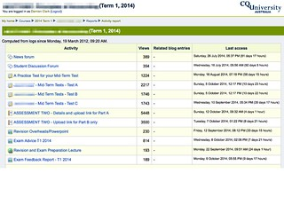
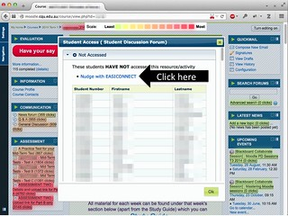

The following does a compare and contrast between the "what is" of university e-learning systems and the "what might be". There are three sections

1. The task - describes a fairly common task someone teaching online might wish to undertake.
2. What is - describes how that task is completed in existing institutions (using Moodle). The point of this post isn't to suggest that Moodle is bad. I'm sure that other similar systems would have similar problems. If not for this task, there would be other tasks for which they are bad. This is also not meant to be a criticism of the LMS. I could do a similar description with an e-portfolio tool. I could do a similar task for [BIM](https://moodle.org/plugins/view.php?plugin=mod_bim) (something I wrote).
3. What might be - describes an alternative (much better) approach to achieve the same task in much the same environment. An alternative that is built upon/around Moodle and is largely only possible because Moodle is open source.

The argument is that for many common tasks required for "good" learning and teaching, there is a huge chasm between "what is" and "what might be". A chasm that I know from personal experience exists with many, many other tasks (e.g. [one](/blog2/2014/11/07/established-versus-affordances-part-of-the-reason-institutional-e-learning-is-like-teenage-sex/) and [two](/blog2/2014/11/13/adding-more-student-information-to-a-moodle-course/)). The existence of these chasms raise a number of questions that I'd like to explore further

1. Why do these chasms exist? The [paper](/blog2/2014/09/21/breaking-bad-to-bridge-the-realityrhetoric-chasm/) this stuff comes from proposes one explanation.
2. What other chasms exist? A very [wise invited speaker](https://twitter.com/shaned07) at [ASCILITE14](http://ascilite2014.otago.ac.nz/) suggested that "Innovation comes from solving problems". These chasms appear to be problems crying out to generate some innovation. Mapping out what chasms there are and analysing them would appear to be interesting and useful from a number of perspectives.
3. What impact do these chasms have on the quality of learning and teaching? I believe they have a fairly large negative impact. Would be interesting and useful to identify that impact and its size.
4. How can these chasms be closed? How can and should universities change how they develop and support their e-learning to close up these gaps.
5. What is the impact of closing these chasms? Is it worth it? Is it sufficient to improve learning and teaching? What else is needed?

## The task

As someone teaching an online course, it might not be that unusual for you to want to

1. Find out how students are accessing/using the resources and activities you've made available via the course site; and
2. Contact those students who haven't accessed a particular resource.

Can you do this with the system you currently use? How easy is it? How often do you do it?

## What is?

To complete either of these tasks in Moodle, you start by logging into your course site. Here's an example (click on the images to see larger versions)

So what Moodle feature will help you identify how students are accessing resources on the course site? How do I access this feature?

With Moodle, the feature are the reports. Where you find the reports depends on the customisations that your institution has done to the look and feel. Corporate branding rules! For this institution you access the list of reports under the "Navigation" tab on your course home page. If you find the right place within the Navigation tab you are presented with a list of reports.

### How many times are students accessing resources?

Assuming you want to find out how often students are using the resources and activities on your course site, which of the list of reports in the following will you need to use? Do you know?

Perhaps you might like to try a bit of trial and error to discover which it is. Well there's a slight problem with that. Assuming you're a little nervous about finding the right report, what happens next isn't going to help. If you click on one of the report links, what you see next (for a very long time) is a blank page.

No indication of anything happening on the Moodle end, just a blank page with your browser doing its "waiting for something from the server" animation of the mouse pointer. At one institution the wait was 4 minutes and 50 seconds, but I've seen longer. This is the time it takes Moodle to initially complete the calculations necessary to show you the report.

The point is that this long period of no action is not conducive to follow through. Most people won't wait this long for something to happen on the web, especially if you're not certain about your choice in the first place. This is particularly problematic within the context of a University LMS where teaching staff are experienced with the LMS regularly timing out because it's fallen over (especially during the first couple of weeks of semester).

If you do wait, you'll see something like the following. Which is the activity report from Moodle. It shows the number of "views" for each resource in the order they appear on the course home page.

But there's a problem here. If the question you want to answer is "how many times are the students using the activities and resources?" then the above report can't really help. This is because it shows the number of views on resources by all people on your course site. Students, teaching staff and anyone else who can access your course site.

Another problem is that the activity report doesn't tell you how many students have accessed a resource. It's impossible to know whether the 389 views of the News Forum from the above report is from

1. 389 students accessing the news forum once.
2. 1 student (or staff member) clicking on the news forum 389 times.

### Which students aren't accessing particular resources?

To answer this question, you will need to use the "Participation report". It will allow you to choose which resource you are interested.

But there is a problem. There are some optional modules for Moodle that don't support these reports. So you can't get details about who's accessed resources using those modules or not.

But let's assume you select a resource that is supported.

At this stage you will have to wait again, how long will depend on a range of factors. Eventually you will see a page showing who has or hasn't accessed the chosen resource.

By default Moodle shows this information a page at a time. If you'd rather see a list of all the students on one page, then go to the bottom and select all

### Contact those students who haven't accessed a resource

The participation report does have the ability for you to send a message to selected students. So you can select all those who haven't accessed the resource and send a message.

This allows you to type in a message that will be emailed to the appropriate students.

One problem is that these messages are not personalised. You can't add in a personalised salutation "G'day Fred".

### Summary of limitations

From the above there are a few limitations/difficulties with this process

1. Finding which feature/report to use isn't immediately straight forward.
2. There is a lot of waiting while calculations are done.
3. During that waiting there is no visible feedback suggesting that Moodle is making progress (rather than just simply crashed).
4. Resource usage can't be limited just to students (or to specific groups of students).
5. No method to see the number of students who have accessed a resource, rather than the number of clicks.
6. You can't find out who has accessed a resource with some modules.
7. The messaging system can't be personalised.
8. The tables of statistics about usage are displayed in tables separate from the course site.

## What might be?

The following show what might be if your institution has [the MAV](https://damosworld.wordpress.com/2013/08/30/the-moodle-activity-viewer-mav-heatmaps-of-student-activity/) installed. The lucky folk at [CQUni](http://www.cqu.edu.au/) have the MAV installed.

If your institution has the MAV, then you will need to

1. Use the Firefox browser to access your course site.
2. Install the [Greasemonkey add-on](https://addons.mozilla.org/en-US/firefox/addon/greasemonkey/) for Firefox.
3. Have the MAV Greasemonkey script installed on your Firefox browser.

### How many times are students accessing resources?

With MAV installed, you now have to turn it on. This again is hidden under Navigation (at CQUni).

Once you turn MAV on with your browser. You will have to wait....for 3 seconds (not the minutes you have to wait for Moodle reports)

Beyond being a much shorter wait, another important advantage of MAV is that it will show a MAV specific animation to indicate that it is working.

Once your 3 second wait is over, you see something like this. Can you see the difference?

Can you see how all of the links on the course page have different background colours? Some are red, some orange, some yellow, some green. This is a heat map.

The redder the background colour the hotter the link is. This means that more students have been clicking that link. **Important:** MAV only shows what students are doing.

The greener the background colour, the cooler the link is. i.e. it's being used less.

While MAV is turned on a heat map will be added to all links on all Moodle pages you visit. There is no longer any significant wait when you visit these different pages. You don't need to turn anything else one, or visit any other page. You see the usage embedded in the page.

For example.

If you'd rather know how many students have accessed a link - rather than how many clicks there have been on the link - then you can change the configuration of MAV.

And the heat map will now be based on the total number of students who have clicked on a link. If you look really closely at a link in the following image (click on the image to see a bigger version) you should be able to see something link (111 students) at the end of each link.

MAV adds the actual count to the link.

This feature also works on any Moodle page.

Working on any Moodle page is important. This means that when you view a discussion forum, you can tell how many students have accessed a particular post in the discussion forum.

If you'd only like to focus on a particular (Moodle) group of students. You can change the MAV configuration to focus just on particular groups. You even have the option to add teaching staff back into the count.

MAV does work on any page. Even the activity report page from Moodle. This also clearly demonstrates how the Moodle report combines both teaching staff and student usage in its counts. Look closely at the difference between the number of "Views" listed in the table produced by Moodle and the number of "clicks" that have been added in the brackets to each link.

It also works on any Moodle page. Even those produced by modules that don't support the Moodle participation report. The following shows MAV working on one such module.

### Contact the students who haven't accessed a resource

MAV also helps you contact the students who haven't accessed a particular resource.

If you click on the number of clicks/students in brackets that MAV adds to each link....

A dialog box will pop up and show you a list of all the students who have accessed the resource and all the students who haven't. With each group you also have the option (at CQUni) to "Nudge with EASICONNECT".

This is a link to another CQUni system that allows teaching staff to make or record different types (phone call, meeting) of nudges or contacts. One of the nudges is a personalised email message. EASICONNECT provides a messaging system not unlike a mail merge facility.

### Summary of limitations and benefits

MAV is not perfect, perhaps its biggest limitations are

1. Only usable via Firefox.
    
    Ruling out other browsers and mobile devices
    
2. Have to have the MAV plugin installed.
3. Still not hugely easy to find and turn on.
4. Requires the institution to install and maintain something beyond Moodle.

But it has some significant benefits

1. The statistics are represented visually and embedded within the normal viewing of the course site.
2. It will work on any Moodle page for any Moodle link.
3. Much faster response and there is visual feedback of progress being made.
4. Usage can be limited to students, various groups of students and other users.
5. The heat map can be based on either number of clicks or number of students.
6. Is linked with an enhanced messaging system.