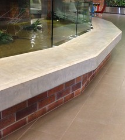

---
categories:
- bad
date: 2014-12-18 17:59:38+10:00
next:
  text: '"FedWiki Daily #6 - Mining, fracking and exploring the process"'
  url: /blog2/2014/12/19/software-issues-for-applying-conversation-theory-for-effective-collaboration-via-the-internet/
previous:
  text: 'Starting to write for Fedwiki - Daily #4 (and 5)'
  url: /blog2/2014/12/18/starting-to-write-for-fedwiki-daily-4-and-5/
title: Concrete Lounge
type: post
template: blog-post.html
comments:
    []
    
pingbacks:
    - approved: '1'
      author: This year it&#8217;s all about the connections | The Weblog of (a) David
        Jones
      author_email: null
      author_ip: 192.0.83.81
      author_url: https://davidtjones.wordpress.com/2015/01/13/this-year-its-all-about-the-connections/
      content: '[&#8230;] more useful approach. This is illustrated by showing how the
        SET mindset has created a couple of concrete lounges and how the BAD mindset can
        help make it possible to live with a concrete [&#8230;]'
      date: '2015-01-13 10:55:07'
      date_gmt: '2015-01-13 00:55:07'
      id: '1158'
      parent: '0'
      type: pingback
      user_id: '0'
    - approved: '1'
      author: Initial rationale and ideas for &#8220;continuous improvement&#8221; of
        learning and teaching | The Weblog of (a) David Jones
      author_email: null
      author_ip: 192.0.81.34
      author_url: https://davidtjones.wordpress.com/2015/02/18/initial-rationale-and-ideas-for-continuous-improvement-of-learning-and-teaching/
      content: '[&#8230;] Concrete Lounge [&#8230;]'
      date: '2015-02-18 12:57:48'
      date_gmt: '2015-02-18 02:57:48'
      id: '1159'
      parent: '0'
      type: pingback
      user_id: '0'
    - approved: '1'
      author: Organising a change in session time | The Weblog of (a) David Jones
      author_email: null
      author_ip: 192.0.80.121
      author_url: https://davidtjones.wordpress.com/2015/02/19/organising-a-change-in-session-time/
      content: '[&#8230;] The digital environment in which teachers (of all types) is
        littered with concrete lounges. [&#8230;]'
      date: '2015-02-19 07:19:07'
      date_gmt: '2015-02-18 21:19:07'
      id: '1160'
      parent: '0'
      type: pingback
      user_id: '0'
    - approved: '1'
      author: Framing some project ideas around support and services for learning and
        teaching | The Weblog of (a) David Jones
      author_email: null
      author_ip: 192.0.86.78
      author_url: https://davidtjones.wordpress.com/2015/03/25/framing-some-project-ideas-around-support-and-services-for-learning-and-teaching/
      content: '[&#8230;] then enterprise computing has shown all the flexibility, adaptability,
        and fitness for purpose as a concrete lounge. Support and services for teacher
        learning that are protean move away from the established practice [&#8230;]'
      date: '2015-03-25 13:54:54'
      date_gmt: '2015-03-25 03:54:54'
      id: '1161'
      parent: '0'
      type: pingback
      user_id: '0'
    - approved: '1'
      author: Allocating assignments to markers &#8211; moodle assignment submission |
        The Weblog of (a) David Jones
      author_email: null
      author_ip: 192.0.101.189
      author_url: https://davidtjones.wordpress.com/2015/03/30/allocating-assignments-to-markers-moodle-assignment-submission/
      content: '[&#8230;] As a teacher engaged with e-learning at a University, most of
        the technology provided is a concrete lounge. [&#8230;]'
      date: '2015-03-30 17:46:08'
      date_gmt: '2015-03-30 07:46:08'
      id: '1162'
      parent: '0'
      type: pingback
      user_id: '0'
    - approved: '1'
      author: How do we design the need for design? &#8211; Col&#039;s Weblog
      author_email: null
      author_ip: 192.0.101.245
      author_url: https://beerc.wordpress.com/2023/07/10/how-do-we-design-the-need-for-design/
      content: '[&#8230;] needs (Allen &amp; Varga, 2006). Because our IT systems tend
        not to evolve (they become concrete lounges), the reality is always far ahead
        of IT systems. The information systems have, in some ways, become [&#8230;]'
      date: '2023-07-11 08:53:46'
      date_gmt: '2023-07-10 22:53:46'
      id: '24891'
      parent: '0'
      type: pingback
      user_id: '0'
    
---

The Concrete Lounge is a nascent analogy intended to help explain the need for more people to take on the role of [Digital Renovator](http://djones.federatedwiki.org/digital-renovator.html). Especially in the context of university-based educational technology.

The argument being that universities need to focus more on enabling digital renovators than just trying to create perfect systems (that end up as concrete lounges)

(This is also a duplicate - of at least the initial version - of [this Federated Wiki page](http://djones.federatedwiki.org/view/december-2014-journal/view/concrete-lounge)).

### Concrete lounge

Imagine you've just moved into a new house. To your surprise when you enter the lounge room you discover that there is a concrete lounge set up in the prime position.

Assuming that it's impossible to remove, what do you do?

Of course, you add some cushions, a mattress and just about anything else you can think of that will make the concrete lounge somewhat fit for the purpose of lounging

You modify, adapt, engage in bricolage and generally renovate the environment that you are given to suit the task.

### University e-learning

The problem is that when it comes to learning and teaching, the environment provided by most universities (for a huge variety of tasks) is no more fit for purpose than a concrete lounge.

What's even worse is that there is essentially no capacity to modify, adapt, engage in bricolage and generally renovate the environment.

The inability to renovate arises from two sources

1. Low digital fluency. The [2014 Horizon report(s)](http://www.nmc.org/publications/2014-horizon-report-higher-ed) identify the low digital fluency of staff as the number 1 "significant challenge impeding higher education technology adoption".
    
    Perhaps just a bit of the problem is because the technology to be adopted is a concrete lounge.
    
    But perhaps the low digital fluency makes renovation a step too far.
2. A mindset that has technology SET in concrete. That's the argument in [this paper](/blog2/2014/09/21/breaking-bad-to-bridge-the-realityrhetoric-chasm/). The mindset underpinning university education technology has SET (acronym from the paper) the technology in concrete. i.e. it can't be changed.

Raising the question, Are universities ready for digitally fluent staff?

