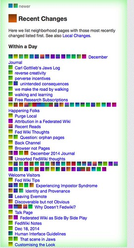

See also: [[blog-home | Home]]

And onto daily #6 of #fedwikihappening. I'm hoping this will start explore what the process might be around using fedwiki in my day-to-day thinking. To that end, I'm planning to

1. Read and do a bit more idea mining.
2. Explore how to catch up on what's happening in fedwiki space via fedwiki (and not Twitter).
3. Follow the paths that have been created by my neighbourhood.

## Reading

Lots of things I need to read, but I came across Klemm (2002) today while marking an assignment. The points cited made it sound interesting and potentially relevant to #fedwikihappening and then I read the abstract

> Conversation is central to human interaction. The usual way to conduct asynchronous “conversations” over the Internet is to post e-mail messages on an electronic bulletin board, with messages organized by topic. However, such environments do not allow us to exploit the richness of conversation theory for effective collaboration. This presentation will review key elements of conversation theory and describe our collaboration experiences with Forum MATRIX, a software application that runs in a Web browser and allows users to share and edit multi-media documents, plus make in-context links and notes

This is where Idea Mining (and perhaps fed wiki) bumps up against my normal approach for sharing what I read. Idea mining is focused on producing a short nugget summarising a particular idea. When I normally share what I read, it's a summary of the whole paper (e.g. [this one](/blog2/2010/03/17/embedding-behaviour-modification-paper-summary/)) not of an idea.

Sadly the paper didn't delivery what I'd expected/hoped. See [my standard summary](/blog2/2014/12/19/software-issues-for-applying-conversation-theory-for-effective-collaboration-via-the-internet/) if interested.

Running out of time, so perhaps straight onto catching up. Engaging is probably a more beneficial practice right now anyway

## Catching up

Connect to my fedwiki and away we go.

Interesting to watch the neighbourhood "icons" change as navigating from page to page. Notice also the indication that there is a "newer" version of the concrete lounge page. Appears @timklapdor has [forked it](http://djones.federatedwiki.org/view/welcome-visitors/view/december-2014-journal/view/concrete-lounge/tim.au.fedwikihappening.net/concrete-lounge) and added a comment.

That's one way to see changes, I wonder what the recent changes shows? A collection of changes, appears that @timklapdor has been busy and that he's the only other person showing up on my recent changes. Suggesting he's the only one in my neighbourhood? Perhaps because his is the only fedwiki I've forked pages from? We'll see how that changes as I engage more.

Have been out to buy a Xmas present. In my absence my neighbourhood has grown. The list of "icons"/chicklets along the bottom has grown significantly. It appears there needed to be some time for all the connections to catch up. Suggesting that I needed to be connected to my fedwiki for this to happen. i.e. it didn't happen overnight when I'm guessing much of this happened.

Which suggests that if I revisit my recent changes page, it should be significantly expanded. The image to the right success!

Now to catch up/find the good stuff and build.

### Idea fracking

[Idea fracking](http://djones.federatedwiki.org/view/welcome-visitors/view/recent-changes/journal.hapgood.net/idea-fracking) got a call out, so let's start there. It appears idea fracking is almost an anti-pattern or in opposition to idea mining (not quite). But some of the origins of idea fracking arises from how ideas spread and one of the comments picks up on this "idea spreading". Strikes me as two separate discussions, perhaps calling for two separate pages.

Do I add this as a comment? Do I do this by forking and adding, or can I edit the page directly as suggested in some of the other discussions going on? Does the [video](https://www.youtube.com/watch?v=VvYdRTUP7qc) for daily #6 - which covers commenting - answer this? Not really.

Apparently @holden has a problem with comments. Comments are a way of avoiding fixing documents.

Which brings me to the other way of commenting, simply make the change and see what others thing/do. If others don't like my change, can they remove it? Well, not from my copy, but they could from their own.

As I'm still getting used to fedwiki and still finding my way within the #fedwikihappening community, I'm loathe to take on the task of fixing the document, rather than commenting. Time's also a factor.

I'll leave idea fracking there and move on. Will be interesting to see how things evolve.

### Reverse creativity, that scene in jaws and emergent development

Reading through [this sequence](http://djones.federatedwiki.org/view/welcome-visitors/view/recent-changes/kate.au.fedwikihappening.net/reverse-creativity/kate.au.fedwikihappening.net/that-scene-in-jaws) of pages (it's rather cool how with a single URL I can share the navigation sequence I used to get to this) ends with a comment apparently from Alan Levine (though he's not using @holden's recommended format, so I could be wrong about the identity. The point is the comment talks about software development experiences that aren't driven by requirements and plans. This links to a topic near and dear to my heart - teleological versus ateleological processes.

Time to write an article, or at least to self-plagiarise. So

1. Add a comment and link to the currently empty pages.
2. Start writing the pages. Fedwiki doesn't appear to like borders on tables. Oops, orange halo of death. Login. Ahh, have a lost stuff? No. Local changes has the stuff. Good. ANd here comes the neighbourhood back again.
3. Think about whether there needs to be a broader process types page Added that [article](http://djones.federatedwiki.org/view/welcome-visitors/view/recent-changes/view/types-of-process)

## Looking good

I'm starting to get a feel for fedwiki and am liking what I am experiencing. I could see how the type of community and process it supports could be valuable. Some questions

1. How will it scale? The neighbourhood idea should help, but I wonder if it can become overwhelming.
2. Can it scale? Is it too much of a change for folk to handle?
3. Can I keep up? Haven't had the time to engage more fully with the process. But keep in the cMOOC advice in mind, you don't have to do/see it all.

## References

Klemm, W. (2002). Software issues for applying conversation theory for effective collaboration via the Internet. Proceedings of the 2002 International Conference. Retrieved December 19, 2014, from http://www.cvm.tamu.edu/wklemm/Files/ConversationTheory.pdf