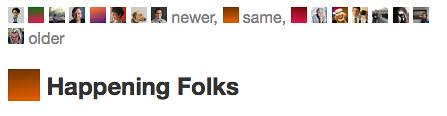

---
categories:
- thesis
date: 2014-12-26 11:29:22+10:00
next:
  text: '"Random #fedwikihappening ramblings"'
  url: /blog/2014/12/29/random-fedwikihappening-ramblings/
previous:
  text: 'FedWiki Daily #6 - Mining, fracking and exploring the process'
  url: /blog/2014/12/19/software-issues-for-applying-conversation-theory-for-effective-collaboration-via-the-internet/
title: FedWiki 7, 8 and 9 - Moving, catching up and engaging
type: post
template: blog-post.html
---
Thanks to the good folk of @reclaimhosting I know have a FedWiki working as part of my own domain - [http://fedwiki.djon.es/](http://fedwiki.djon.es/). That's the good news. The bad news is that the move creates two problems

1. A small loss of data. In setting up the new fedwiki there was a need to copy over the old one. However, just after that copy (of which I was clueless due to ignoring email) I got inspired and added something. Not a big problem, but something to explore how I might remedy this within the fedwiki model.
2. Re-connecting with the neighbourhood. With a new home, I have to explore how best to reconnect with the #fedwikihappening neighbourhood.

Beyond those, I just have to catch up and delve a bit deeper.

## Recovering the lost data?

A brainstorm whilst laying in bed on Sunday morning led to the creation of [this page](http://djones.federatedwiki.org/view/welcome-visitors/view/paper-ideas) on ideas for future papers and the creation of the first paper idea page. Nothing earth-shaking in either and I could perhaps just re-create them manually on my new FedWiki. But I want to see if there's a more "fedwiki way" of doing this.

One approach is the one I stumbled [across earlier](/blog/2014/12/18/starting-to-write-for-fedwiki-daily-4-and-5/)

1. Visit [the page](http://djones.federatedwiki.org/view/welcome-visitors/view/paper-ideas) and get the URL - http://djones.federatedwiki.org/view/welcome-visitors/view/paper-ideas
2. Construct a new URL that combines aspects of that URL with my new FedWiki site. The format is my fedwiki's "home page" http://fedwiki.djon.es/view/welcome-visitors/ followed by the _page slug_ for the paper ideas page. The page slug is the
    - hostname - _http://djones.federatedwiki.org_ - plus
    - article title from the url - _paper-ideas_Which gives http://fedwiki.djon.es/view/welcome-visitors/djones.federatedwiki.org/paper-ideas
3. Visit that URL
4. Fork the page to my new fed wiki
5. Visit the first paper idea and fork that page.

Done.

## Updating your icon

Have been replying to [this comment](/blog/2014/12/16/initial-steps-with-the-fedwikihappening-happening/#comment-7086) on an earlier post and have noticed folk have figured out how to change the icon used to indicate forking etc.

Will have to figure out/come across how to do that in this session. Documented toward the end of [this blog post](http://blog.jasongreen.net/2014/08/personal-wikis-a-how-to-including-better-icons/). Requires access to the file system and using that to replace an icon.

Question: Do I have this access? Probably not. Would rely on @reclaimhosting having installed a single FedWiki instance within the file system I have access to, not likely.

But the neighbourhood to the rescue. Alex North has shared an [interesting kludge](http://fedwiki.djon.es/view/welcome-visitors/view/recent-changes/catherine.uk.fedwikihappening.net/question-can-i-replace-this-opaque-coloured-square-with-a-picture-of-myself/alex.au.fedwikihappening.net/changing-your-flag) that I should be able to replicate. Here's the process

1. Find a new icon. Possibly the step I'll have the most trouble with. Hate taking/choosing selfies. Will stick with my [Twitter profile image](https://pbs.twimg.com/profile_images/3167763216/c60c5bdbacfbd62fdeeb2809daf843b1_bigger.jpeg). Not the best representation, but hopefully distinctive.
2. Convert to PNG and right size. Seashore on the MAC to the rescue.
3. Find the values for a PUT request using Chrome.
4. Use curl to make the change.

_Problem:_ Would have liked to copy and paste the curl comment from Alex's wiki page, but SFW supports drag and drop. Trying to drag the mouse over the page moves the paragraph, it doesn't allow you to select. Would have to be a work around for that.

So the command is the following. Appears to be leveraging SFW's reliance on JSON to communicate to send it the new icon. This is a great example of the [BAD mindset](/blog/2014/09/21/breaking-bad-to-bridge-the-realityrhetoric-chasm/) - a bit of bricolage leveraging the affordance of technology and relying on distribution. \[code lang="sh"\] curl -X "POST" "http://fedwiki.djon.es/favicon.png" -H "Cookie: YOUR\_COOKIE" -H "Content-type: application/json" -d "{"image:": "\`base64 < ~/Desktop/flag.png\`"}" \[/code\]

Sadly I'm getting a [403 response](http://en.wikipedia.org/wiki/HTTP_403). Verbose output of curl seems to suggest that the cookie is accepted. Appears that the server is saying "can't do that". Perhaps something with the way my server has been configured. The icon is at the [expected location](http://fedwiki.djon.es/favicon.png), perhaps the ownership on the image file is such it can't be over-written?

Oh well, no great loss. Bugger it, lets annoy the reclaim hosting folk and see if they can help remedy this.

Time to try again.

So, first problem is user error. Missed a vital point through existing schema/expectations.

Not getting the 403 error anymore, moving onto a 500 Internal Server Error. Reporting as a type error.

On the plus side, @reclaimhosting have come to the rescue. The version of SFW they are using to provide me with my bit of fedwiki space has its own space on github. By which I can gain access to the "file system" of my wiki and replace the icon (via a pull request). All done. Great example of the BAD mindset. Have to blog about this separately.

And my new icon is showing up other places in FedWiki space.

## Catching up with the neighbourhood

Was going to leave a comment on Alex's page sharing the 403 problem, but that raises a question about my profile page and the moving of my SFW. If I use the practice of starting my comment with \[\[David Jones\]\] is it going to point to my old profile?

Actually, it appears to have worked. i.e. pointing to the new site. But is this because I'm logged in as me and \[\[David Jones\]\] points at the new site? What if I view these pages via the old site?

Yep, looks like it does connect back to the old site. Bugger.

Enough time thinking about the technology and implications of the move, time to engage in the neighbourhood. Of course, the wrong profile link has the potential to limit neighbourhood connections.

Ahh, [others have linked](http://fedwiki.djon.es/view/welcome-visitors/view/recent-changes/jenny.uk.fedwikihappening.net/movable-furniture) to the concrete lounge article, which of course points to the old site. \*sigh\*

Perhaps if I just fork the page with the new server and perhaps modify the new concrete lounge article to point to it? It's now a few days later, this seems to be working but can't be sure.

It's now Boxing Day and enjoying the traditional (for some) Australian past-time of watching the Boxing Day test match and doing a bit of catch up.

Started with creating an initial article on pattern entrainment and related articles on adaptive stretch and psychological dissonance. The latter articles sparked by articles from others on incremental caging and impostor syndrome.

More later.