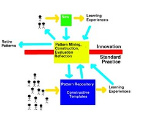

---
categories:
- thesis
date: 2014-12-29 15:18:45+10:00
next:
  text: An illustration of the difficulty of learning about network learning
  url: /blog/2014/12/31/an-illustration-of-the-difficulty-of-learning-about-network-learning/
previous:
  text: FedWiki 7, 8 and 9 - Moving, catching up and engaging
  url: /blog/2014/12/26/fedwiki-7-8-and-9-moving-catching-up-and-engaging/
tags:
- fedwikihappening
title: '"Random #fedwikihappening ramblings"'
type: post
template: blog-post.html
---
The Christmas break is over. It's the start of a new week and I've completed some holiday tasks (complete a run through of Dragon Age Inquisition, watch the final series of The Newsroom, and upgrade the family computers to Yosemite). Time to start engaging with #fedwikihappening and trying to make sense of how it connects with other work I'm doing.

## The new routine

The new routine around SFW goes something like

1. Log into [my SFW](http://fedwiki.djon.es/view/welcome-visitors).
2. Join the neighbourhood(s) I'm interested in . Currently this is limited to [the #fedwikihappening folk](http://fedwiki.djon.es/view/welcome-visitors/view/happening-folks). Over time the hope would be that this diversifies and in some cases specialises. Finding, forming and contributing to the right neighbourhoods would seem a key success factor for on-going use of SFW. And this is perhaps also one of the major hurdles. More on this below.
3. Load up the [recent changes](http://fedwiki.djon.es/view/welcome-visitors/view/recent-changes). Having joined the right neighbourhood, the recent changes list reflects what's been going on. Time to catch up on what folk have been doing.

## One challenge for SFW

The issue with creating the right neighbourhoods in part comes down to the difficulty of people understanding what is different and potentially beneficial about SFW. Maha Bali identifies a large part of that in [this blog post](http://blog.mahabali.me/blog/educational-technology-2/people-in-my-fedwikihappening-neighborhood-are-showing-me-the-world-as-id-like-to-see-it/)

> I’ve written a lot about how I would love to make cMOOCs more understandable to other people, and that I think it might not be possible unless they actually experience them...(_5 barriers listed_)...But how do you encourage people to experience them, given how much of a mindset-shift that would entail? And the time investment and change in your work process it would require in order for it to work out well for you enough that you relax and enjoy it instead of stress over it or worse, drop out completely?

While describing the difficulty around understanding cMOOCs, I see this applying to SFW as well.

During my last ramble into the #fedwikihappening neighbourhood I came across a couple of related articles: [Experiencing Imposter Syndrome](http://fedwiki.djon.es/view/welcome-visitors/view/recent-changes/view/experiencing-impostor-syndrome) and [Incremental Caging](http://fedwiki.djon.es/view/welcome-visitors/view/recent-changes/view/incremental-caging). I came across these articles just as I was thinking about [Pattern Entrainment](http://fedwiki.djon.es/view/welcome-visitors/view/recent-changes/view/pattern-entrainment). Incremental caging in turn reminded me of [adaptive stretch](http://fedwiki.djon.es/view/welcome-visitors/view/recent-changes/view/adaptive-stretch).

These two patterns are fairly large members of the set of patterns that make up my schema. These are factors I see all the time contributing to the limitations of institutional e-learning. Factors that aren't limited to teaching staff. Institutional leaders and support staff - both from central L&T, but also central IT - suffer from the same problems.

These are also factors I see in my teaching (helping pre- and in-service teachers think about how ICT can help in their teaching/learning). Factors which appear to require the solution Maha suggests - "people to experience". This is why my courses tend to focus on creating/encouraging learners to gain experience with new technologies and the pedagogies that they enable. But even this isn't always sufficient. As the experience can fail to break the existing schema and instead is understood through those existing schema.

## Adding my new site to the neighbourhood

I'm still not listed on the [happening folks page](http://fedwiki.djon.es/view/welcome-visitors/view/happening-folks). Time to fix that. This was one of those little tasks that didn't work the first time and I couldn't immediately see what I was missing. Until I was reading through [this post](http://hapgood.us/2014/09/01/using-federated-wiki-in-the-classroom-getting-started/) titled "Using Federated Wiki in the Classroom: Getting Started" from @holden. The trick was to use the "icon" for the page as the thing you drag. Combine that with opening my profile page with shift-click to get it to appear at the end of the list of pages, and bob's your uncle.

There are some other interesting points in Mike's post around the experience of using SFW in a class. I can't help comparing some of this to my experience [with BIM](/blog/research/bam-blog-aggregation-management/) and individual student blogs. Some quick observations/comments

- The difference size creates. I'm using BIM in a class of 300+. Mike's current experience is in a class of 20. I think the order of magnitude difference in numbers makes a significant difference in workload/issues. e.g. manually setting up the class circle. Something I currently do by creating OPML files.
- Roll your own class circle SFW allows students to create their own circle. With my course the same outcome is achieved through a combination of feeds/feedreaders and Wordpress' follow feature. I do have a feeling that more students use the follow feature than feeds. That might be interesting to explore.
- Tracking recent changes The recent pages approach works with 20 students, but would it work with 300. This is not something I've done well with BIM/blogs. A challenge I'd like to set myself this year to improve.
- Different metaphors At some stage a blog post has to be published. It is complete. SFW, as Mike notes, is more a personal journal that allows for incomplete contributions.
- The "twins" approach to compare students' work is something very different.

## SFW as a pattern language

Back when I was reading about [idea mining](/blog/2014/12/19/software-issues-for-applying-conversation-theory-for-effective-collaboration-via-the-internet/) I had a vague sense of deja vu. This was quickly resolved as I explored some of SFW space and came across articles like [Positive Outdoor Space](http://fedwiki.djon.es/view/welcome-visitors/view/recent-changes/forage.ward.fed.wiki.org/positive-outdoor-space). Ahh, design patterns and pattern languages. Confirmed by discovering articles such as [Pattern language](http://fedwiki.djon.es/forage.ward.fed.wiki.org/invited-authors/wiki.sfw.c2.com/pattern-language) and the connection [Ward Cunningham](http://en.wikipedia.org/wiki/Ward_Cunningham) (originator of SFW) has with design patterns.

As this [1999 paper](/blog/publications/the-case-for-patterns-in-online-learning/) suggests, I have a lot of time for the design pattern idea. The paper even proposed a process for enhancing e-learning based around design patterns, constructive patterns and pattern mining (the ugly, obviously 1990s image to the right). A colleague and I started working on that, but nothing ever came of it. Ten years later I reflected on that experience in [this blog post](/blog/2009/02/22/patterns-for-e-learning-a-lost-opportunity-or-destined-to-fail/) and proposed three reasons why design patterns didn't work in our context (the obvious other reason is that we weren't very good at doing this).

One point that doesn't come out strongly in that old post is the difficulty of abstraction. Pattern mining/writing requires some significant capability with abstraction. Both to identify a practical problem/solution and abstract that into a general pattern, but also to simply grasp the value of pattern languages in the first place. This is demonstrated in the observation that the object-oriented programming (OOP) community adopted the concept of design patterns much more readily than architects (the design pattern idea was developed by an architect). Really good OOP folk are very good at abstraction.

I'm not sure that the broader community has this capability. This can be seen somewhat in the early struggles some of the #fedwikihappening folk had with idea mining, not to mention questioning whether [something is lost by this approach](http://fedwiki.djon.es/view/welcome-visitors/view/recent-changes/maha.uk.fedwikihappening.net/is-dissertation-over-discourse-gendered)

### The third place for e-learning - gathering ideas

One of the vague applications I'm considering for SFW is in term of gathering ideas for papers/frameworks. I have a tendency to create frameworks - e.g. [the BAD mindset](http://fedwiki.djon.es/view/welcome-visitors/view/the-bad-mindset) - in my attempt to understand the world. I'm after a way to group together resources and ideas that fit within those frameworks. A page on [Third Place](http://alyson.sf.fedwikihappening.net/view/welcome-visitors/view/third-place) is the spark for this. This resonates with some vague ideas I'm having around the BAD mindset. So how to do this?

First attempt

- Create the [BAD mindset page](http://fedwiki.djon.es/view/welcome-visitors/view/the-bad-mindset) Will borrow various bits from the paper. Was going to do this all on one page, but I don't think that fits with the SFW way and I can see it reducing reusability. So time to move it out into separate pages for Bricolage, Affordances, Distribution.
- Add to each of those pages a brief definition and a "See also" section into which I can copy references to related pages.

Creating all those separate pages and ensuring some consistency requires a bit a work. But the hope is that this "framework" will help in the future as there will be "slots" into which useful resources can be added.

Could go on for a lot longer, but will bring this to a close for now.