---
categories:
- thesis
date: 2014-12-31 15:27:27+10:00
next:
  text: '"TPACK as shared practice: Toward a research agenda"'
  url: /blog2/2015/01/06/tpack-as-shared-practice-toward-a-research-agenda/
previous:
  text: 'Random #fedwikihappening ramblings'
  url: /blog2/2014/12/29/random-fedwikihappening-ramblings/
title: An illustration of the difficulty of learning about network learning
type: post
template: blog-post.html
comments:
    - approved: '1'
      author: nonamuldoon
      author_email: n.muldoon@cqu.edu.au
      author_ip: 139.86.2.15
      author_url: http://
      content: 'So many big elephants in the room that only a few brave folks appear to
        acknowledge at USQ. I share your thoughts David - this kind of observation/critique
        made me very unpopular during the ISD project and remains so today. In my own
        little way, I tried to address and/or circumvent the issues you''ve raised in
        the PLAS initiative. I welcome your open and honest critique of PLAS and any suggestions
        to overcome the restrictions imposed on the system and by gatekeepers.  The need
        for circumvention frustrates me to no end - the system should serve our pedagogical
        purpose, not the other way around!
    
    
        When you get a chance to explore PLAS, I suggest you read first Peter Albion''s
        opinion piece :)'
      date: '2015-01-16 09:40:53'
      date_gmt: '2015-01-15 23:40:53'
      id: '1165'
      parent: '0'
      type: comment
      user_id: '0'
    - approved: '1'
      author: David Jones
      author_email: davidthomjones@gmail.com
      author_ip: 139.86.69.32
      author_url: https://djon.es/blog/
      content: "I'll probably explore PLAS a little when I start thinking about the tweaks\
        \ I'll make to EDC3100 for 2015.  This is when I'm going to think about the contribution/description\
        \ you wanted me to make.\n\nAn obvious initial critique I'd offer is really out\
        \ of your control and somewhat related to the point you make.  It's perhaps best\
        \ summarised by the following quote from Dutton (2010) that I mention in <a href=\"\
        https://davidtjones.wordpress.com/2015/01/13/this-year-its-all-about-the-connections/\"\
        \ rel=\"nofollow\">this post</a>\n<blockquote>Organizations aren\u2019t thinking\
        \ about the \u2018networked individual\u2019 \u2013 the networking choices and\
        \ patterns of individual Internet users. They\u2019re still focused on their own\
        \ organizational information systems and traditional institutional networks.</blockquote>"
      date: '2015-01-16 10:16:58'
      date_gmt: '2015-01-16 00:16:58'
      id: '1166'
      parent: '1165'
      type: comment
      user_id: '1'
    
pingbacks:
    - approved: '1'
      author: A proposal for fixing what&#8217;s broken with ed tech support in some universities
        | The Weblog of (a) David Jones
      author_email: null
      author_ip: 192.0.81.31
      author_url: https://davidtjones.wordpress.com/2015/01/22/a-proposal-for-fixing-whats-broken-with-ed-tech-support-in-some-universities/
      content: '[&#8230;] that is), how would I find an answer?&#8221;. The answer to
        that question was summarised in this post. A post that is password protected because
        of the embarrassing difficulty I had in answering that [&#8230;]'
      date: '2015-01-22 11:57:58'
      date_gmt: '2015-01-22 01:57:58'
      id: '1167'
      parent: '0'
      type: pingback
      user_id: '0'
    
---
The following is a summary of what it takes for a teacher to find support resources around e-learning/network learning within the existing USQ systems. I had started this as part of another blog post that was going to draw upon [my research](/blog2/2014/09/21/breaking-bad-to-bridge-the-realityrhetoric-chasm/) to suggest an alternative approach. I had thought this would provide a useful comparison. However, as I stepped through the process it became obvious that what exists is far worse than I thought existed. Part of me wonders whether I've missed something simple, can't it really be this bad?

Hence this post has been kept password protected.

## The point

Goodyear, Hodgson & Steeples (1992) define network learning as

> learning in which C&IT is used to promote _connections_: between one learner and other learners, between learners and tutors; between a learning community and its learning resources. Some of the richest examples of networked learning involve interaction with on-line materials _and_ with other people. But use of on-line materials is not a _sufficient_ characteristic to define networked learning (p. 2)

Teaching online requires teachers to engage in network learning about how to teach online. The following illustrates that the current USQ approach to using C&IT (communication and information technologies) isn't doing a great job of promoting connections between teachers, the available resources around how to teach online, and other people. The difficulties in making these connection would seem likely to limit learning about how to teach online and subsequently limit the quality of the online learning that is offered to students.

Significantly enhancing the promotion of these connections would appear to be called for.

## Finding some help

Let's assume that it's a few weeks out from the start of semester and I'm keen to finishing the set up of the site for my course. I login to the LMS and see this (as with all the images in this post, click on the image to see a larger version).

[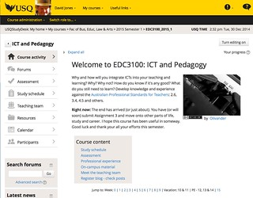](https://www.flickr.com/photos/david_jones/15957952599 "Home page by David Jones, on Flickr")

Oh, I forgot. First semester next year sees the introduction of a new default design for course sites. I haven't used that design before and my course is somewhat unique, which means that there will be quite a few things to tweak.

This new course design has been used by other courses before. Both in trials and during the last semester (when my course wasn't offered). I assume that there is a collection of advice and experience to draw upon to make my task easier. Where might I "connect" with that advice and experience?

Oh look, you can see that there's a question mark in the top right hand corner of the above image. It even comes with a tool-tip with the text "View FAQs about StudyDesk or ask a question of your own.". That's the obvious place for it to be. Let's click on that and see what I get.

[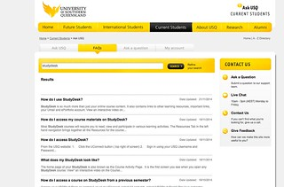](https://www.flickr.com/photos/david_jones/15956585808 "Answers for StudyDesk by David Jones, on Flickr")

Oh, that's a shame. It's a generic holding place for all questions (and answers) asked about the Study Desk. It appears that all of the questions are those that might be asked by students. There's no specific filter for me to see just questions that teaching staff may ask (and the subsequent answers). Since there are 1000s of students and only 100s of teaching staff, the student questions will dominate.

**Problem #1:** Connections to learning resources are not role specific. i.e. if I'm a teacher, then I need different resources than a student.

The question mark is a standard part of the design. It appears on every page on the Study Desk and is always visible, even when scrolling. For example, here is what it looks like when I'm on one of the discussion forum pages in my course.

That's good. But, what do I see when I click on the question mark in the top right hand corner?

Exactly the same list of questions as the image above.

**Problem #2:** Resources are not page/tool/context specific. i.e. if I'm on a discussion forum, it would be useful to have access to resources about the discussion forum.

At this stage, I still haven't found any support resources specific to teachers. There must be some somewhere. Let's go looking for those.

My assumption is that they are accessible from the staff portal (which I rarely use as it provides little beyond a set of bookmarks organised into categories that make no sense to me). The portal has a "uTeach" page shown below. Given it's a page about me teaching, I'd assume that the support resources to help me in that task would be obvious.

**Problem #3:** Support resources are not connectable from within the context of teaching. i.e. I have to know and remember where to go to find them.

_Question:_ Can you identify from the image below where I should go to access online teaching support resources? Especially resources covering the new design for course sites? Digital Learning @ USQ? Need Help? Learning and Teaching Services? LRDS Course Resources Planning? Something else?

[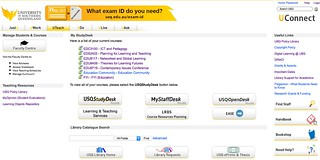](https://www.flickr.com/photos/david_jones/15957953849 "004_Uteach by David Jones, on Flickr")

At first glance, the following options appear likely

1. Digital learning @ USQ
2. Need Help These first two links are hidden away in the right hand column. Not in the main central section. Hence they might be missed.
3. Learning & Teaching Services The label for this button is indicative more of an organisational website than a service, but it sounds most like the section responsible for providing the resources I'm after.

Let's start with Digital learning @ USQ.

[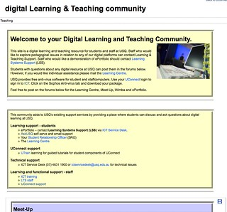](https://www.flickr.com/photos/david_jones/15964515979 "001 Digital Learning and Teaching Community by David Jones, on Flickr")

It's apparently designed for both staff and students. It's also an old site, it's still using version 1.8 (or so) of Moodle. There are broken links (mail the Learning Centre). In the right hand column (not shown in the image) there is a link titled [USQStudyDesk Info](http://www.usq.edu.au/currentstudents/studydesk/help.htm) which is old information for students.

**Problem #4:** It's possible to come across links to old support resources that may no longer apply.

Let's try "Need help". It looks like this

Oh dear, it's actually the same page mentioned above as [USQStudyDesk Info](http://www.usq.edu.au/currentstudents/studydesk/help.htm).

**Problem #5:** The same resources are linked from multiple places using different labels.

Ok, so onto Learning and Teaching Services. Which brings me to this page, a Moodle course that doesn't look like a Moodle course but which is mislabelled. Remember, I clicked on the link "Learning and Teaching Services" to get to this page, what's the dominant title on this page?

[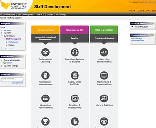](https://www.flickr.com/photos/david_jones/16118245516 "005_StaffDevelopment by David Jones, on Flickr")

**Problem #6:** Link names and page titles don't always align.

Once I get over the confusion this inconsistency creates, my next task is to figure out which of the many options available will satisfy my original need - To find some resources for teaching staff (specifically a course examiner) about the new Study Desk look and feel.

Can you identify from the above image which of the above options I should use?

I should mention that the image above cuts off the titles for the three icons at the bottom of the page. These three icons are:

- Grants & Awards
- Multimedia
- Software training

Oops, just discovered another feature/problem. The above image only shows three columns of icons

- How can we help?
- What can we do?
- What is available?

There are actually four columns as shown in the following screenshot. Apparently the implementation of this page means that if you have your web browser set up with a fairly narrow window (as I tend to) any column that doesn't fit disappears with no indication of its existence.

**Problem #7:** What you can see is dependent on how you use your browser.

[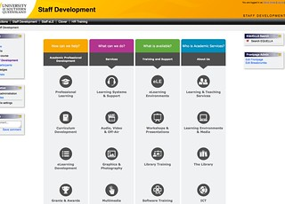](https://www.flickr.com/photos/david_jones/15963433520 "003 Four column staff devleopment page by David Jones, on Flickr")

After a bit of experimentation, it appears that the eLearning Environments might be the place. It brings up the following less than useful page.

[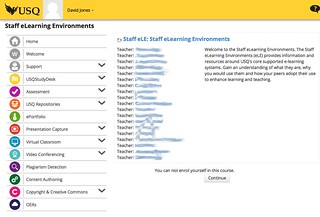](https://www.flickr.com/photos/david_jones/16143379742 "006 eLearning Environments by David Jones, on Flickr")

Note the "You can not enrol yourself in this course" message. Not sure this is the best message to be sending someone who has gotten this far.

At this stage, I was going to ignore that message try clicking on the links in the menu down the left hand side. None of the links worked!! They all came back to the same page. At least those that I tried.

At this stage and in frustration I clicked on the "Continue" button and get taken to what appears to be a PR page designed to keep staff informed about the institution's impact in the news.

On the plus side, that page does contain a link to CLOVER. A site that I was aware of, but have never really used.

[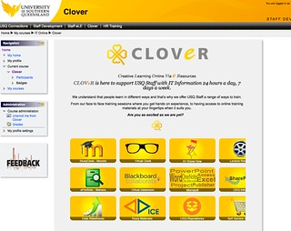](https://www.flickr.com/photos/david_jones/16150035912 "004 CLOVER by David Jones, on Flickr")

If you look closely at the above you will see that some of the icons on the right hand side of the page are incomplete. Only part of them is visible. Indications again that I tend to have my browser windows set up a little narrower than most. But at least on this page the columns haven't disappeared.

The purpose of CLOVER on the page is

> CLOVeR is here to support USQ Staff with IT Information 24 hours a day, 7 days a week.

Mishra & Koehler (2006, p 1029) argue that (emphasis added)

> Quality teaching requires developing a _nuanced understanding_ of the _complex relationships_ between technology, content, and pedagogy and using this ... to develop appropriate, _context-specific_ strategies and representation

**Problem #8:** Learning about how to use the LMS is seen as an IT problem, it is not about helping develop "a nuanced understanding of the complex relationships between technology, content and pedagogy".

But this page does have something recognisable - StudyDesk - Moodle - this must be where I'll find what I'm looking for. Going there gives me this page.

[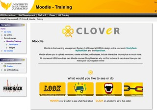](https://www.flickr.com/photos/david_jones/15963508060 "005 CLOVER Moodle by David Jones, on Flickr")

Oh look there's something specific to meet my needs. Finally. "New StudyDesk Overviews".

[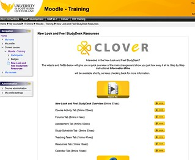](https://www.flickr.com/photos/david_jones/15528492834 "006 CLOVER New Study Desk Overviews by David Jones, on Flickr")

There are some videos that I can view.

At this stage I could offer some complaints about how the assumption of a common experience built into the standardised look and feel assumes that all courses use the same abstractions (e.g. one module == 1 week of semester), but that's a story for another day. Though you could jump back to the quote above and the aim of "appropriate, context-specific strategies and representation".

What isn't shown in the above image is that there are also some links to PDFs covering FAQs. If I click on those links, I currently can't view them. Here's what I see with Firefox, my default browser.

[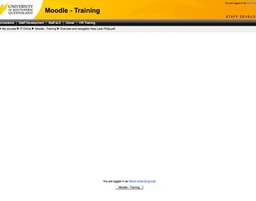](https://www.flickr.com/photos/david_jones/16148979681 "007 Empty PDF display by David Jones, on Flickr")

It does work in other browsers and may be due to a configuration issue with Firefox, but this is the only site I have this problem with.

Beyond how the PDF files are configured to download in Moodle, there is the perceived problem with using PDF files. The PDF files contain information that could just as easily been displayed as a web page. Beyond this, there's the problem of having a set of Frequently Asked Questions enshrined in a PDF document. No chance to ask additional questions or add different answers.

**Problem #9:** FAQs and other documentation is enshrined in locked formats with no scope for other teaching staff to contribute additional insights.

This model is used on other pages. For example the following image shows the CLOVER "View an Info Bite" page. There's a long list of videos and PDFs on various Moodle related topics on this page.

[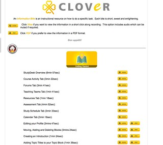](https://www.flickr.com/photos/david_jones/15967167497 "008 Clover Information Bites by David Jones, on Flickr")

**Problem #10:** There is no direct link between various support resources about features of Moodle and the Moodle features. (i.e. it would be good if, when I am in the "Discussion Forum" tab of the new Moodle look and feel, if the "question mark" on that page could link directly to the "Forums Tab" video in Information Bites)

### Backing up a bit

The above sequence included a report of a problem with the "Staff eLearning Environments" page with not being able to enrol yourself in this course. See below.

It turns out that appears to have been an intermittent error. This morning when I try again I see something different (see the following)

[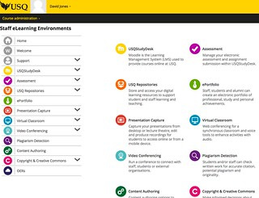](https://www.flickr.com/photos/david_jones/16152245552 "009 staff Elearning Environments by David Jones, on Flickr")

This is more like I expected. Nice visual design. If I click on the USQStudyDesk link I get the following

[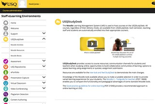](https://www.flickr.com/photos/david_jones/15965564958 "010 StudyDesk by David Jones, on Flickr")

The videos linked here have had a large amount of production/post-production put into them.

**Problem #11:** Has more effort been placed into producing the resources than into making them easy for people to find?

The link "new look and feel Study Desk" links to the CLOVER-based resources discussed above. This opens yet another tab in the browser - even though doing so breaks the back button and amongst certain members of web design is [considered bad practice](https://www.brightorangethread.com/blog/view/dont-break-the-back-button/#.VKN9QKau_FE)

If I click on "Moodle Activities" I see a page with a range of resources associated with the different available activities on Moodle.

[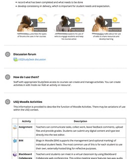](https://www.flickr.com/photos/david_jones/16152461122 "011 Activities by David Jones, on Flickr")

The videos of staff talking about how they use various forms of activities are a good idea. Sharing concrete practice is good. However, there are two potential problems. The investment required to produce these videos means that only a limited subset can be produced. That limited subset has to be chosen. The act of choosing limits potential perspectives.

**Problem #12:** The centrally produced and controlled nature of these resources limit the diversity of perspective and don't mirror the increasingly peer-generated nature of resources online.

For example, in 2012 all 400+ students in the two offerings of one course I taught were required to use the institutional eportfolio system. The course design had the students creating assignments in the eportfolio. Based on my experience, I would never do that again. There's an eportfolio set of resources on this site. What are the chances that this cautionary tale of an institutionally provided resource would be "chosen"?

Also, it's likely that very few staff are going to find these videos because they are not linked to directly from the activity discussed. i.e. the videos on using the Wiki would be so much more useful if they were directly linked into the Wiki tool.

The link "USQStudyDesk Discussion" links to a discussion forum that contains two posts from the same person. Both made on October 10, 2014. There appears to be no acknowledgment of these posts. The same staff member has contributed the only posts to other forums, including: repositories, plagiarism detection, and content authoring. The remaining forums - eportfolio, assessment, presentation capture, virtual classroom, video conferencing, copyright and creative commons, and OERs - were empty.

**Problem #13:** Any community around these resources is perhaps best known for the tumbleweeds blowing through a wide open, empty space.

The activities page also included a table summarising the various Moodle activities available on the USQ study desk. It appears that these are simply a copy and paste of the short descriptions provided by Moodle. i.e. when you choose to add a particular activity, you see this same content.

## Another use case

Lastly, let's assume that I'm currently using the discussion forum on Study Desk and a student is reporting a problem with the editor. How do I find a solution to help them? Do I:

1. Tell them to contact the ICT helpdesk as I can only help with the content/pedagogy?
2. Do I log a service request with ICT helpdesk for them?
3. Do I login to UConnect, go to the UTeach page, remember to click on the Learning and Teaching Services button, click on eLearnign Environments, remember that the discussion of the forum is underneath USQStudyDesk and click on that, understand that the forum is an activity in Moodle speak and click on that, and finally get frustrated that none of the resources available here can help me diagnose and solve the student's problem?
4. Do I do a Google search for "moodle forum editor student problem" and use the Monash resources that are freely available via the web and thus Google searchable?
    
    Which is what I (and I suspect any other digitally literate teacher) have been doing.
    

[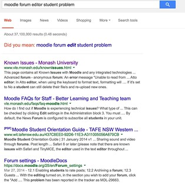](https://www.flickr.com/photos/david_jones/15533483243 "012 Google search by David Jones, on Flickr")

**Problem #14:** The available USQ resources only provide help with initial design type choices with no connection with asking for help or known issues.

**Problem #15:** The USQ resources aren't Google searchable and thus ignored because other resources are Google searchable.