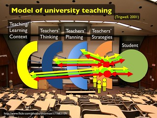

See also: [[blog-home | Home]]

Late last year @salvetore read and [commented on](https://moodle.org/mod/forum/discuss.php?d=276835) the ["three paths" paper](/blog2/2014/09/05/three-paths-for-learning-analytics-and-beyond-moving-from-rhetoric-to-reality/) that @beerc and @rolley wrote for ASCILITE'2014. (Always nice to know that someone reads a paper). The following is a response I've just added to the thread on the Moodle research discussion forum. In particular, picking up on two suggestions from Sean Dicks, which badly summarised are

1. That the focus should be on doing it with students, rather than teachers.
2. That the use of Trigwell's model (see images below) "seems somewhat incongruent with the earlier statement that in complex systems part are all "interacting and evolving so that we cannot understand any of the agents or systems without reference to the others"

The original paper argues that for learning analytics (and perhaps any form of education technology) to move beyond being a fad, it needs to be implemented by drawing on a good combination of three paths: do it to, for and with the teachers. (Remember this in in the context of Australian higher education).

## The focus on teachers, not students??

The focus on teachers rather than students in the paper comes from our increasing disquiet with the rise of the "do it to" approach around educational technology within Australian higher education (this is the context we work within). This is especially obvious within learning analytics over recent years.

The "do it to" path involves senior (and not so senior) management responding to the rising fad, identifying a tool and implementing it with the expectation that it will improve learning and teaching. The innovation is done to the teaching staff who are expected to change their practice.

In our experience, this path generally doesn't provide any significant, wide-spread change in learning or teaching.

We don't disagree that the ultimate focus is on "do it with" the students, to contribute to the improvement of student learning. The question is how best do you achieve that goal within higher education as it currently stands?

And that's where Trigwell's model enters the picture. i.e. the idea that what the student experiences is largely (but not completely) influenced by the strategies, planning and thinking of teachers. The proposition is that if you change teachers thinking and strategies, then the student learning experience will change.

Our concern is that the current focus on the "do it to" path attempts to ignore this and instead believe that it's possible for the institution to directly impact the student experience. Whereas the Trigwell model (or at least one interpretation of it) suggests that the best the "do it to" approach can achieve is to change the teaching and learning context.

The "do it with" approach is focused much more on engaging directly with teachers' strategies as the starting place. Almost like [desire paths,](http://en.wikipedia.org/wiki/Desire_path) build on what they are already doing. In part, the assumption is that people learn from experience, change their experience (strategies) and you have a better chance of changing their thinking.

Hopefully, by the institution doing more "with teachers" will lead to the situation where teachers will be doing more "with students".

### Complexity

We do believe that with learning and teaching in a university setting, we're talking about a complex adaptive system. The following slide (click on it to see a larger version) from an earlier presentation that contributed to the paper visually represents this belief and how it connects with the Trigwell model a little better.

While (at best) the teaching and learning context may be the same each of the subsequent layers will be unique to each individual teacher and student. i.e. each teacher will think differently, that will in turn translate into different approaches to planning and hence strategies. In addition, each student will respond to those strategies in different ways. Hence the multitude of arrows in the above.

The double headed nature of the arrows also points to the complexity of the problem. Double headed is meant to suggest an inter-dependence. If you change a teacher's strategy (and thus their experience), you will hopefully change their planning, which in turn will change their future strategies, which in turn will...and these changes will happen in ways that could not have been planned. Which is why we think doing it "with" teachers is so important to being able to respond effectively and build upon positive changes and respond to negative changes.