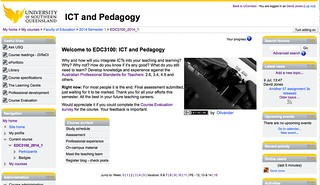
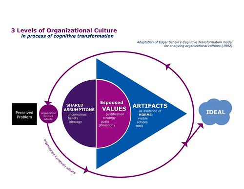
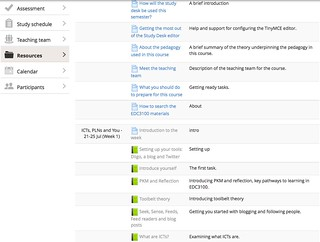
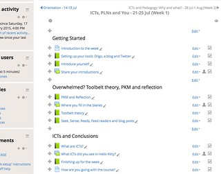
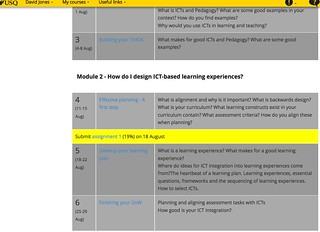
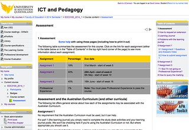
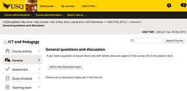

See also: [[blog-home | Home]]

I have fulfilled my organisational duty and attended and participated in a 3 hour workshop intended to achieve some level of shared vision within the organisation. As always I remain cynical about likely impact such sessions will have on the organisation and my experience of it. There was, however, some benefit in making me aware of Schein's three levels of organisational culture (apparently from this book) and summarised in the following table (and more on [wikipedia](http://en.wikipedia.org/wiki/Edgar_Schein)).

 "

Three levels of culture (Adapted from Schein, 1992, p. 24)
| Level | Description |
| --- | --- |
| 1\. Artifacts | Visible and feelable structures and processes  Observed behaviour - difficulty to decipher |
| 2\. Espoused beliefs and values | Ideals, goals, values, aspirations  Ideologies  Rationalisations - may or may not be congruent with behaviour and other artifacts |
| 3\. Basic underlying assumptions | Unconscious, taken-for-granted beliefs and values - determine behaviour, perception, thought and feeling |

An idea is that the artifacts are one avenue for exploring the espoused beliefs and the underlying assumptions that inform the organisational culture.

Hence my question, what do the artifacts associated with organisational e-learning say about the organisational culture of those institutions? What are the espoused beliefs and underlying assumptions that inform that culture? Are there any contradictions?

What follows is a quick application of this to my next task - starting the preparation of my course site for the next semester. This is a simple exercise not an in-depth analysis and certainly informed by the barest of familiarities with a very specific view of culture. But on the face of it, this exercise strikes me as as useful lens. (It would appear that @leahpmac already done [some work around](https://circle.ubc.ca/bitstream/handle/2429/1330/reederLLT.pdf?sequence=1) "culture and e-learning". It's a small world.)

## 1\. Artifact - Standard course design

The artifact I need to deal with is the new look and feel for the institutional LMS. This means that every course will not only look the same, there are some expectations about what is expected to be on the course site. For my course, this means it will look something like the following

Everything at the top of the page and in the left hand column is part of the new, standardised look and feel. Everything under the "Welcome to EDC3100: ICT and Pedagogy" heading is what was copied over from the last offering of the course. Hence the "Right now:" message suggestion the course has ended. The following is what the 2014 course site looked like.

Broadly speaking the changes involved in this project were

- Changes in the branding/look and feel.
- More moved into the reduced banner. Explicit mention of the time at USQ, notifications, my courses, useful links, course administration etc moved into the banner which takes up just a bit less vertical space. These look like good moves, but the breadcrumbs continue to include the unnecessary listing of the faculty to which the course belongs. Don't think the students care about the faculty and it takes up a fair bit of space.
- The removal of any ability to have a right hand column. Only two columns, not three now.
- AN "expand all/collapse all" option for the main content area. I assume this is an attempt to address the [scroll of death problem](http://www.markdrechsler.com/?p=720) with Moodle. Wonder how much of this is implemented with standard Moodle and how much local customisation?
- The addition of highly visible menu as the first element in the left hand column. These appear to be divided up into two broad categories of items
    1. Links to existing Moodle features (Forums, Resources, Calendar, Participants); or, As the labels suggest, these all point to equivalent Moodle functionality. e.g. Forums links to the Moodle service that lists all forums etc.
    2. institutionally specific pages that are semi-integrated with institutional data sources (Study Schedule, Teaching Team, Assessment). The basic model for these pages is to know about institutionally specific information such as the dates associated with weeks of semester, due dates for assignments, and the staff teaching into the course. Such information is drawn from institutional databases and combined with some capability to use the Moodle HTML editor to add additional text. For example, the study schedule will fill the date for a Week 1 and teaching staff can manually edit information such as the name of the module for that week.

## 2\. Espoused beliefs and values

As expressed in the support resources, the rationale for this new look and feel include

- similar experience; The desire that students have a similar experience regardless of the course.
- findability. That students are able to find the information they need easily.

The support video for the assessment tab also proposes that the assessment tab "will be very useful for your students".

## 3\. Assumptions

Obviously I do not know what assumptions these beliefs are based upon, but the following perhaps are not a million miles away

- Consistency is generally a good thing for learning. Given the institutional strategic plan putting some significant weight to personalisation, creativity and innovation, having everything the same doesn't seem appropriate. Insights from research around learning, teaching, and educational technology would seem to support that. e.g. some of the points from Chris Dede (Harvard Professor of Education) mentioned in [this post](/blog2/2009/09/12/dedes-sleeping-eating-and-bonding-metaphor-and-the-diversity-of-learning-and-its-impacts-for-e-learning/).
- A consistent look and feel will make information more findable. Wikipedia suggests](http://en.wikipedia.org/wiki/Findability) that findability involves a bit more than just user interface design. Especially when the user interface design is only really helping users locate very specific bits of information. i.e. The new look and feel does make it easy for students to find the forums, assessment, study schedule, and teaching team for a course. Good. But what about the content included in the resources? More on this below in ["What about the resources".In short, if findability is a concern, install a search engine!
- That it's possible to have a consistent look and feel across the diversity of courses in an institution. The new look and feel does have some features that allow for flexibility. Even though this does raise questions about the consistency espoused belief. If no information is entered for assessment or study schedule the students won't see those options in the menu. In addition, the study schedule page provides some flexibility in terms of how many columns form the study schedule and the column titles. Allowing individual courses to substitute in the language they use. However, there's a limit to how far this goes. More on this below in "Grouping the weeks".

An assumption that appears to underpin this new look and feel is that the focus is student centered. The aim is to enhance the student experience. Now that's a good aim, perhaps the best aim. But the follow on assumption in this case is that teaching staff aren't capable of using the online environment to enhance the student experience and that the institution needs to do something.

From 1997 through 2004 I helped design, implement and support [one approach](/blog2/2010/06/07/default-course-sites-and-wizards/) to an institution doing something about this. Since then I've made [the argument](/blog2/2010/06/07/should-academics-manually-create-course-websites/) for this. However, there are two important points missing from the "new look and feel" at my current institution, they are

1. the ability to opt out; and There will always be academics who can and wish to create their own course sites. The [approach](/blog2/2010/06/07/default-course-sites-and-wizards/) provided the opportunity for academics to do this.
2. an adopter-focused and emergent development approach to the new look and feel. i.e. it's not sufficient for a project team to design the new look and feel and roll it out. There will be inevitably problems with the look and feel and there will be some really good ideas about how to enhance it that emerge from on-going use. How students and staff are using the new look and feel needs to be closely watched and those insights used to continually develop the new look and feel to solve problems and enhance it.

The absence of these points from the new look and feel suggest that there is an underlying assumption that there is nothing to be learned from the teaching staff and their experience. It's a prime example of the "do it to" and perhaps "do it for" paths and an apparent avoidance of the "do it with" path ([Beer et al, 2014](/blog2/2014/09/05/three-paths-for-learning-analytics-and-beyond-moving-from-rhetoric-to-reality/)).

Interestingly, I've just found the following slide on Flickr that purports to represent Schein's cognitive transformation model for analysing organisational cultures. I'm guessing this was the basis for the consultant/facilitator. What I find particularly relevant to the specific decision is the circle around the outside labelled "organisation iteratively adapts" which I see as resonating with the adopter-focused and emergent development approach mentioned above.

[]](https://www.flickr.com/photos/ctcvistaqueen/3543282128/) 

  

## What are the limitations of the new look and feel?

The following explores the dissonances that exist between the new look and feel and the approach I use in my course.

### What about the resources?

The following image is a partial screen shot of the "Resources" page for my course.

This partially illustrates that my course is designed so that each week contains a learning path. A collection of activities and resources that all students are expected to work through. The "resources" page only shows the resources, but at least it does show you that there are quite a few Moodle books amongst those resources.

A Moodle book is essentially a collection of web pages. The Moodle books are used to structure student learning around a task or some related concept. For example, the first book in Week 1 is titled "Setting up" and is designed to help the students set up Diigo, their blog and Twitter. The next book explains the first required learning task for the course - introducing themselves.

Each book is typically at least 3 or 4 web pages long. A quick visual count reveals almost 50 separate Moodle books in the learning paths. Some can cover some important concepts. Concepts that the students will wish to revisit later in the semester. In particular, some books give advice about assessment. It's not unusual for students to ask "Where did we talk about _\*insert topic\*_".

Nothing in the new look and feel will help students find this information.

A search engine would.

It would be nice not to have to [implement this kludge again](/blog2/2014/02/25/evernote-as-a-solution-to-a-moodle-problem/) to enable the search.

### Duplication and confusion

It would be interesting to find out the thinking behind promoting the "Resources" link into the menu for the new look and feel. I assume the aim (in line with the espoused beliefs above) is to make it easier for students to find the resources and that this is important for learning.

However, I wonder if it's going to create some duplication/confusion, especially given the design of my course.

The image above shows part of the resources view for my course site, including most of the initial resources for Week 1. The following image shows the learning path for week 1.

The resources page offers essentially the same view as the learning path, but it misses two components. First, it doesn't include the activities (e.g. the discussion forums "Share you introduction" and "Where you fill in the blanks" are missing). Second, the headings are missing. These are used to group the resources and activities into meaningful groups.

The presence of the resources link doesn't appear to add any value to students and appears likely to create some confusion.

### Grouping the weeks

Adding a study schedule page is potentially a useful addition. Something that isn't present on may sites. Some students may find this useful. That's the reason why I've had a study schedule in my course site since I started.

Take a look at the "Course content" box in the middle of the page below. Do you see the link "study schedule"?

The following image shows part of the study schedule I've created. A problem I have is that there are some features of this study schedule that the new look and feel won't support

1. grouping weeks by modules; In the following, Module 2 includes weeks 4, 5 and 6. The new look and feel doesn't support this grouping. This is problematic because the course is designed to have four modules and it's a good thing that the study schedule clearly shows these modules.
2. assignments as separate rows; and The submission date for assignment 2 is quite clearly shown in the study schedule by an entire row of a different colour. The new look and feel's schedule embeds this as part of the a cell in the week's row.

Not major problems, but illustrations of how a consistent approach to course design breaks down when it meets the design decisions made by individual teachers. If those design decisions are bad, there may not be a problem. But what if those design decisions are valid? Is it appropriate that those design decisions should be thrown our and the course revert to the norm?

### Limited assessment information

Just under "Study Schedule" in the "Course Content" box above you will see a link labelled "Assessment". i.e. my course site already provide a range of information about course assessment. This is again a case of the new look and feel duplicating what I already do, and doing so in a way that loses functionality.

The new look and feel assessment page does have some advantages. For example, it allows you to create cohort specific assessment information that is only seen by that cohort. The trouble is that I don't do that in my course. So no value for me.

The new look and feel's approach to assessment creates a single page for assessment. Everything about assessment for a course on a single page. This is a problem as the following shows.

Can you see the "Table of Contents" heading in the left-hand menu? That's the start of the list of information I provide on Assessment. It includes the following

- Assessment (1 and a bit pages long) Overview of course assessment, due dates, percentage etc. What you see in the above image.
- How to request an extension (almost 2 pages long) Some FAQs about extensions and details of how to ask.
- Learning Journal (almost 3 pages long) The learning journal is a core part of the learning design (and assessment) of the course. It's new to students, this section offers an explanation of the learning journal.
- Problems with the learning journal (about 2 pages long) FAQs about the learning journal, particular common problems.
- Assignment 1 (3 and a bit pages) Detailed description of assignment including submission process and the rubrics.
- Assignment 1 Questions and Answers Video (less than page) A video/screen cast answering FAQs about assignment 1.
- How to submit assignment 1 (less than a page) Another video showing how to submit the assignment.
- Assignment 2 (about 3 pages) Detailed description of assignment including submission process and the rubrics.
- Assignment 3 (about 4 pages) Detailed description of assignment including submission process and the rubrics.
- But I'm not going on Professional Experience? (a page and a bit) Assignment 3 is linked to professional experience. In some circumstances students aren't going on Professional Experience. Describes what those students do.
- How to query the marking (a page) Describes the process students should use to query the marking of their assignments.

That's a total of about 22 pages (as you might see the new look and feel uses a larger font and white space) of information that under the new look and feel would appear to have to go onto a single page. Horrendous for me to create and worse for students to actually find and use any information.

With the above I use the Moodle book plugin to create and manage this collection of information. The Moodle book plugin also provides a nice way for students to print this information. Either the entire book or selected "chapters". This "nice way" includes removing all of the additional web interface elements.

The new look and feel does attempt to implement something like this "nice way", however, it's a generic web approach that leads to overlapping of real content with basic web navigation (at least on my Mac).

### Problems with Moodle books

Exploring the difference with assessment has revealed some additional problems around the use of Moodle books and the new look and feel. The following image is that Assessment overview page in the old course site as it would be seen by students.

In the above image, look for the following components

1. Table of contents; and This is in the top left hand corner. It's the ToC for the Assessment book and shows all of the components. It aids findability. Students can see all of the chapters in the book.
2. Book administration. This is in the bottom right hand corner. It has two important links: "Print book" and "Print this chapter". These are the links that allow students to print versions of the book/chapters with just the content (the middle column).

Now, look below. This is the same assessment book in the new look and feel. What do you notice about the "Table of Contents" and the "Book administration" components?

The two problems that I see are

1. Table of contents is partially below the fold; and Due to the new look and feel's use of a larger font, more whitespace, a single column on the left-hand side, and retaining the standard menu at the top of the left-hand menu the Table of Contents for the book gets pushed down. So that large parts of it aren't visible. I should note that I have a large monitor and keep my browser windows open in a longer format than most. There will be some students for whom the Table of Contents will not be visible.
2. There is no "book adminsitration" component. Actually, there is. It just doesn't appear in the image above and I've only just know found where it is located after a concerted effort to find it. i.e. I knew it had to be there, so I went looking. The following image shows the "Forums" page in the new look and feel. IN the black bar at the top of the page you should be able to see "Forum administration". When viewing a Moodle book this is where "Book administration" will appear.

## What do I need to do?

Based on the above, here's a list of questions to answer

1. Can I change the study schedule and assessment links to my existing approaches? Happy to stay with the menu and the new look and feel, but would prefer that the menu link to the relevant Moodle books.
2. Can I remove the resources link? I don't think it adds any value in my course and is potentially going to cause confusion. So can I remove it. **Question:** I wonder whether the organisation has done any analysis of student usage of the course sites over Semester 3 (when they've been using the new look and feel)?
3. Can I implement a macro/API system to insert USQ information? The one really useful addition to the new look and feel is the integration with USQ systems to pull information (e.g. dates for each week, assignment due dates etc). The problem is that this functionality is only available within the assessment and study schedule features from the new look and feel. As above, I don't want to use these. However, it would be really useful if there were a combination API and [course site wide macro facility](/blog2/2014/01/22/a-moodle-course-site-wide-macro-facility/) that would allow me to enter something like the following in the HTML for my course \[code lang="html"\] Assignment 1 due: &lt;div class=&quot;assignment\_1\_due\_date&quot; course=&quot;edc3100&quot; offering=&quot;2015\_1&quot;&gt;&lt;/div&gt;\[/code\] and have it automagically replaced with the appropriate due date.

The API is a step too far, but some kludges with javascript might make the macro possible.

- How best to explain to students how to best use Moodle books in the new look and feel?
- What can and might I do around providing a search engine for the course site? I feel this may be a step too far for this year.

 

If I am to be a good organisational citizen, then in answering the above questions I should be raising these questions through the formal support mechanisms and waiting for them to identify whether these are possible and allowed. (I fear that the latter is more likely to be the real problem).

Of course, there are also the possibility that some of the above can be implemented through a bit of bricolage.

## Lessons from Schein's 3 level of organisational culture?

Arguably I've established above that organisational culture contains strong assumptions about consistency equating to findability. That it is possible to employ a consistent approach across all courses in an entire university. I think I've established from the above that there are problems with these assumptions. I also think that I've illustrated that the new look and feel is (or at least appears to be) suffering from the absence of on-going iterative development. i.e. it's not learning from itself.

In the workshop a slide was handed around that showed artifacts, espoused beliefs, and assumptions as three vertically arranged boxes (typical Powerpoint). Between assumptions and espoused beliefs, and espoused beliefs and artifacts, there were two arrows, each pointing from one box to the other. The suggestion being that assumptions influence espoused beliefs and espoused beliefs influence assumptions. Similarly for artifacts.

As we've argued in [this paper](/blog2/2014/09/21/breaking-bad-to-bridge-the-realityrhetoric-chasm/), I believe that the organisation works on the assumption that its digital artifacts - such as the new look and feel - are established. i.e. they can't be changed by anyone very easily and certainly not be anyone who hasn't been approved via the appropriate governance structure. Hence the arrow suggesting that anything should be changing the artifact is somewhat attenuated when it comes to digital artifacts in enterprises.

However, as we've argued in [another paper](/blog2/2015/01/06/tpack-as-shared-practice-toward-a-research-agenda/) digital technologies are protean. They are flexible and changeable. Some more so than others. For example, phone apps are hard to change unless you're the developer. But the web environment is definitely protean. Suggesting that the ability to change the artifact is possible from cultures that don't hold the assumptions or espoused beliefs of the dominant organisational culture.

Of course, the problem is making changes to artifacts set up with the assumption that they are established. Can be harder than you think.