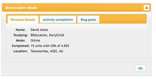
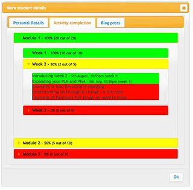
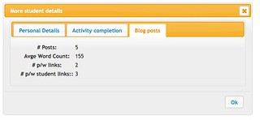
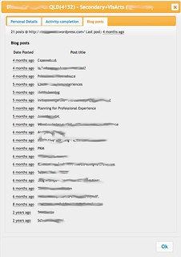

---
categories:
- bad
- edc3100
- irac
- learninganalytics-elearning
date: 2015-01-23 11:58:28+10:00
next:
  text: Using the PIRAC - Thinking about an "integrated dashboard"
  url: /blog/2015/01/30/using-the-pirac-thinking-about-an-integrated-dashboard/
previous:
  text: A proposal for fixing what&#039;s broken with ed tech support in some universities
  url: /blog/2015/01/22/a-proposal-for-fixing-whats-broken-with-ed-tech-support-in-some-universities/
title: Adding some learning process analytics to EDC3100
type: post
template: blog-post.html
comments:
    []
    
pingbacks:
    - approved: '1'
      author: Using the PIRAC &#8211; Thinking about an &#8220;integrated dashboard&#8221;
        | The Weblog of (a) David Jones
      author_email: null
      author_ip: 192.0.83.195
      author_url: https://davidtjones.wordpress.com/2015/01/30/using-the-pirac-thinking-about-an-integrated-dashboard/
      content: '[&#8230;] Knowing who my students are, where they are, what they are studying,
        what they&#8217;ve studied and when the add/drop the course (in a way that I can
        leverage). Which is part of what I&#8217;m doing here. [&#8230;]'
      date: '2015-01-30 15:49:32'
      date_gmt: '2015-01-30 05:49:32'
      id: '1208'
      parent: '0'
      type: pingback
      user_id: '0'
    - approved: '1'
      author: What&#8217;s good for the &#8220;open content&#8221; is good for the LMS/virtual
        learning space? | The Weblog of (a) David Jones
      author_email: null
      author_ip: 192.0.100.86
      author_url: https://davidtjones.wordpress.com/2015/04/15/whats-good-for-the-open-content-is-good-for-the-lmsvirtual-learning-space/
      content: '[&#8230;] take LMS data and data from the student records system to develop
        a &#8220;learning process analytics&#8221; tool used in the [&#8230;]'
      date: '2015-04-15 10:15:34'
      date_gmt: '2015-04-15 00:15:34'
      id: '1209'
      parent: '0'
      type: pingback
      user_id: '0'
    - approved: '1'
      author: Where does the LMS site in the reusability paradox | The Weblog of (a) David
        Jones
      author_email: null
      author_ip: 192.0.86.73
      author_url: https://davidtjones.wordpress.com/2015/04/21/where-does-the-lms-site-in-the-reusability-paradox/
      content: '[&#8230;] those required to implement the process analytics I&#8217;ve
        added to my [&#8230;]'
      date: '2015-04-21 15:54:56'
      date_gmt: '2015-04-21 05:54:56'
      id: '1210'
      parent: '0'
      type: pingback
      user_id: '0'
    - approved: '1'
      author: Where does the LMS sit in the reusability paradox | The Weblog of (a) David
        Jones
      author_email: null
      author_ip: 192.0.81.50
      author_url: https://davidtjones.wordpress.com/2015/04/21/where-does-the-lms-sit-in-the-reusability-paradox/
      content: '[&#8230;] those required to implement the process analytics I&#8217;ve
        added to my [&#8230;]'
      date: '2015-04-21 15:57:15'
      date_gmt: '2015-04-21 05:57:15'
      id: '1211'
      parent: '0'
      type: pingback
      user_id: '0'
    
---
In [Jones and Clark (2014)](/blog/2014/09/21/breaking-bad-to-bridge-the-realityrhetoric-chasm/) we drew on Damien's (Clark) development of the Moodle Activity Viewer (MAV) as an example of how bricolage, affordances and distribution (the BAD mindset) can add some value to institutional e-learning. My empirical contribution to that paper was talking about how I'd [extended MAV](/blog/2014/09/21/breaking-bad-to-bridge-the-realityrhetoric-chasm/#extending) so that when I was answering a student query in a discussion forum I could quickly see relevant information about that student (e.g. their major, which education system they would likely be teaching into etc).

A major point of that exercise was that it was very difficult to actually get access to that data at all. Let alone get access to that data within the online learning environment for the course. At least if I had to wait upon the institutional systems and processes to lumber into action.

As this post evolved, it's become also an early test to see if the [IRAC framework](/blog/2013/10/03/the-irac-framework-locating-the-performance-zone-for-learning-analytics/) can offer some guidance in designing the extension of this tool by adding some learning process analytics. The result of this post

1. Defines learning process analytics.
2. Applies that definition to my course.
3. Uses the IRAC framework to show off the current mockup of the tool and think about what other features might be added.

Very keen to hear some suggestions on the last point.

At this stage, the tool is working but only the student details are being displayed. The rest of the tool is simply showing the static mockup. This afternoon's task is to start implementing the learning process analytics functionality.

Some ad hoc questions/reflections that arise from this post

1. How is the idea of learning process analytics going to be influenced by the inherent tension between the tendency for e-learning systems to be generic and the incredible diversity of learning designs?
2. Can generic learning process analytics tools help learners and teachers understand what's going on in widely different learning designs?
3. How can you the diversity of learning designs (and contexts) be supported by learning process analytics?
4. Can a bottom-up approach work better than a top-down?
5. Do I have any chance of convincing the institution that they should provide me with
    1. Appropriate access to the Moodle and Peoplesoft database; and,
    2. A server on which to install and modify software?

## Learning process analytics

The following outlines the planning and implementation of the extension of that tool through the addition of process analytics. [Schneider et al (2012)](http://edutechwiki.unige.ch/en/Learning_process_analytics) (a new reference I've just stumbled across) define learning process analytics

> as a collection of methods that allow teachers and learners to understand what is going on in a learning scenario, i.e. what participants work(ed) on, how they interact(ed), what they produced(ed), what tools they use(ed), in which physical and virtual location, etc. (p. 1632)

and a bit later on _learning scenario and learning process analytics_ are defined as

> as the measurement and collection of learner actions and learner productions, organized to provide feedback to learners, groups of learners and teachers during a teaching/learning situation. (p. 1632)

This is a nice definition in terms of what I want to achieve. My specific aim is to

> collect, measure, organise and display learner actions and learner productions to provide feedback to the teacher during a teaching/learning situation

Two main reasons for the focus on providing this information to the teacher

1. I don't have the resources or the technology (yet) to easily provide this information to the learners. The method I'm using here relies on servers and databases residing on my computer (a laptop). Not something I can scale to the students in my class. I could perhaps look at using an external server (the institution doesn't provide servers) but that would be a little difficult (I haven't done it before) and potentially get me in trouble with the institution (not worth the hassle just yet).
    
    As it stands, I won't even be able to provide this information to the other staff teaching into my course.
2. It's easier to see how I can (will?) use this information to improve my teaching and hopefully student learning. It's harder to see how/if learners might use any sort of information to improve their learning.

Providing this information to me is the low hanging fruit. If it works, then I can perhaps reach for the fruit higher up.

## Learner actions and productions

What are the learner actions and productions I'm going to generate analytics from?

The current course design means that students will be

1. Using and completing a range of activities and resources contained on the course site and organised into weekly learning paths. These actions are in turn illustrated through a range of data including
    - Raw clicks around the course site stored in system logs.
    - Activity completion. i.e. if a student has viewed all pages in a resource, completed a quiz, or posted the required contributions to a discussion forum they are counted as completing an activity. Students get marks for completing activities.
    - Data specific to each activity. i.e. the content of the posts they contributed to a forum, the answers they gave on a quiz.
2. Posting to their individual blog (external to institutional systems) for the course. Students get marks for # of posts, average word count and links to other students and external resources.
3. Completing assignments.
4. Contributing to discussions on various forms of social media. Some officially associated with the course (e.g. [Diigo](https://groups.diigo.com/group/icts-and-pedagogy/) and others unofficially (student Facebook groups).

I can't use some of the above as I do not have access to the data. Private student Facebook groups is one example, but the more prevalent is institutional data that I'm unable to access. In fact, the only data I can easily get access to is

- Student blog posts; and,
- Activity completion data.

So that's what I'll focus on. Obviously there is a danger here that what I can measure (or in this case access) is what becomes important. On the plus side, the design of this course does place significant importance on the learning activities students undertake and the blog posts. It appears what I can measure is actually important.

Here's where I'm thinking that [the IRAC framework](/blog/2013/10/03/the-irac-framework-locating-the-performance-zone-for-learning-analytics/) can scaffold the design of what I'm doing.

## Information

Is all the relevant Information and only the relevant information available?

Two broad sources of information

1. Blog posts. I'll be running a duplicate version of [the BIM module](http://bit.ly/bambim) in a Moodle install running on my laptop. BIM will keep a mirror of all the posts students make to their blogs. The information in the database will include
    - Date, time, link and total for each post.
    - A copy of the HTML for the post.
    - The total number of posts made so far, the url for the blog its feed.
2. Activity completion. I'll have to set up a manual process for importing activity completion data into a database on my computer. For each activity I will have access to the date and time when the student completed the activity (if they have).

What type of analysis or manipulation can I perform on this information?

At the moment, not a lot. I don't have a development environment that will allow me to run lots of complex algorithms over this data. This will have to evolve over time. What do I want to be able to do initially? An early incomplete list of some questions

1. When was the last time the student posted to their blog?
2. How many blog posts have they contributed? What were they titled? What is the link to those posts?
3. Are the blog posts spread out over time?
4. Who are the other students they've linked to?
5. What activities have they completed? How long ago?
6. Does it appear they've engaged in a bit of task corruption in completing the activities? e.g. is there a sequence of activities that were completed very quickly?

## Representation

[Does the representation of the information aid the task being undertaken?](/blog/2013/10/03/the-irac-framework-locating-the-performance-zone-for-learning-analytics/#R)

The task here is basically giving me some information about the student progress.

For now it's going to be a simple extension to the approach talked about [in the paper](/blog/2014/09/21/breaking-bad-to-bridge-the-realityrhetoric-chasm/#extending). i.e. whenever my browser sees on a course website a a link to a user profile, it will add a link **\[Details\]** next to it. If I click on that link I see a popup showing information about that student. The following is a mockup (click on the images to see a larger version) of what is currently partially working

By default the student details are shown. There are two other tabs, one for activity completion and one for blog posts.

**Requirement suggestion:** Add into the title of each tab some initial information. e.g. Activity completion should include something like "(55%)" indicating the percentage of activities currently completed. Or perhaps it might be the percentage of the current week's activities that have been completed (or perhaps the current module).

The activity completion tab is currently the most complicated and the ugliest. Moving the mouse of the Activity Completion tab brings up the following.

The red, green and yellow colours are ugly and are intended to indicate a simple traffic light representation. Green means all complete, red is not, yellow means in progress for some scale.

The course is actually broken up into 3 modules. The image above shows each module being represented. Open up a module and you see the list of weeks for that module - also with the traffic light colours. Click on a particular week and you see the list of activities for that week. Also with colours, but also with the date when the student completed the activity.

**Requirement suggestion:** The title bars for the weeks and modules could show the first and last time the student completed an activity in that week/module.

**Requirement suggestion:** The date/time when an activity was completed could be a roll-over. Move the mouse over the date/time and it will change the date/time to how long ago that was.

**Requirement suggestion:** What about showing the percentage of students who have completed activities? Each activity could show the % of students who had completed it. Each week could show the percentage of students who had completed that week's activities. Each module could....

**Requirement suggestion:** Find some better colours.

The blog post tab is the most under-developed. The mockup currently only shows some raw data that is used to generate the students mark.

**Update** The following screen shot shows progress on this tab. The following is from the working tool.

**Requirement suggestions:**

- Show a list of recent blog post titles that are also links to those posts. Knowing what the student has (or hasn't) blogged recently may give some insight into their experience. **Done:** see above image.
- Show the names of students where this student has linked to their blog posts.
- Organise the statistics into Modules and show the interim mark they'd get. This would be of immediate interest to the students.

## Affordances

[Are there appropriate Affordances for action?](/blog/2013/10/03/the-irac-framework-locating-the-performance-zone-for-learning-analytics/#A)

What functionality can this tool provide to me that will help?

Initially it may simply be the display of the information. I'll be left to my own devices to do something with it.

Have to admit to being unable to think of anything useful, just yet.

## Change

[How will the information, representation and the affordances be Changed?](/blog/2013/10/03/the-irac-framework-locating-the-performance-zone-for-learning-analytics/#C)

Some quick answers

1. ATM, I'm the only one using this tool and it's all running from my laptop. Hence no worry about impact on others if I make changes to what the tool does. Allows some rapid experimentation.
2. Convincing the organisation to provide an API or some other form of access directly (and safely/appropriately) to the Moodle database would be the biggest/easiest way to change the information.
3. Exploring additional algorithms that could reveal new insights and affordances is also a good source.
4. Currently the design of the tool and its environment is quite kludgy. Some decent design could make this particularly flexible. e.g. simply having the server return JSON data rather than HTML and having some capacity on the client side to format that data could enable some experimentation and change.

## References

Schneider, D. K., Class, B., Benetos, K., Lange, M., Internet, R., Developer, A., & Zealand, N. (2012). Requirements for learning scenario and learning process analytics. In World Conference on Educational Multimedia, Hypermedia and Telecommunications (pp. 1632–1641).