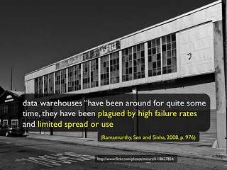
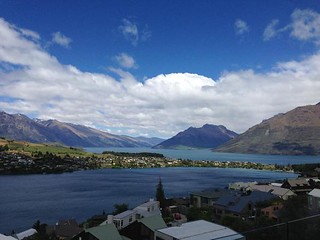

See also: [[blog-home | Home]]

On Monday I'm off to a rather large meeting to talk about what data might be usefully syndicated into a integrated dashboard. The following is an attempt to think out lod about the (P)IRAC framework ([Jones, Beer and Clark, 2013](/blog2/2013/10/03/the-irac-framework-locating-the-performance-zone-for-learning-analytics/)) in the context of this local project. To help prepare me for the meeting, but also to ponder some recent thoughts about the framework.

This is still a work in progress.

## Get the negativity out of the way first

Dashboards sux!!

I have a long-term negative view of the value of dashboards and traditional data warehouses/business intelligence type systems. A view that has risen out of both experience and research. For example, the following is a slide from [this invited presentation](/blog2/2013/09/22/moving-beyond-a-fashion-likely-paths-and-pitfalls-for-learning-analytics-3/). There's also a [a paper](/blog2/2014/09/05/three-paths-for-learning-analytics-and-beyond-moving-from-rhetoric-to-reality/) (Beer, Jones, & Tickner, 2014) that evolved from that presentation.

I don't have a problem with the technology. Data warehouse tools do have a range of functionality that is useful. However, in terms of providing something useful to the everyday life of teachers in a way that enhances learning and teaching, they leave a lot to be desired.

The first problem is the [Law of Instrument](http://en.wikipedia.org/wiki/Law_of_the_instrument).

  
   by  [Theen ...](https://www.flickr.com/people/theenmoy/) 

The only "analytics" tool the institution has is the data warehouse, so that's what it has to use. The problem being is that the data warehouse cannot be easily and effectively integrated into the daily act of learning and teaching in a way that provides significant additional affordances (more on affordances below).

Hence it doesn't get used.

Now, leaving that aside.

## (P)IRAC

After a few years of doing learning analytics stuff, we put together the IRAC framework as an attempt to guide learning analytics projects. Broaden the outlook and what needed to be considered. Especially what needed to be considered to ensure that the project outcome was widely and effectively used. The idea is that the four elements of the framework could help ponder what was available and what might be required. The four original components of IRAC are summarised in the following table.

IRAC Framework (adapted from [Jones et al 2013](/blog2/2013/10/03/the-irac-framework-locating-the-performance-zone-for-learning-analytics/))
| Component | Description |
| --- | --- |
| **I**nformation |   - the information we collect is usually about “those things that are easiest to identify and count or measure” but which may have “little or no connection with those factors of greatest importance” (Norman, 1993, p. 13). - Verhulst’s observation (cited in Bollier & Firestone, 2010) that “big data is driven more by storage capabilities than by superior ways to ascertain useful knowledge” (p. 14). - Is the information required technically and ethically available for use? - How is the information to be cleaned, analysed and manipulated? - Is the information sufficient to fulfill the needs of the task? - In particular, does the information captured provide a reasonable basis upon which to “contribute to the understanding of student learning in a complex social context such as higher education” (Lodge & Lewis, 2012, p. 563)?   |
| **R**epresentation |   - A bad representation will turn a problem into a reflective challenge, while an appropriate representation can transform the same problem into a simple, straightforward task (Norman, 1993). - To maintain performance, it is necessary for people to be “able to learn, use, and reference necessary information within a single context and without breaks in the natural flow of performing their jobs.” (Villachica et al., 2006, p. 540). - Olmos and Corrin (2012) suggest that there is a need to better understand how visualisations of complex information can be used to aid analysis. - Considerations here focus on how easy is it to understand the implications and limitations of the findings provided by learning analytics? (and much, much more)   |
| **A**ffordances |   - A poorly designed or constructed artefact can greatly hinder its use (Norman, 1993). - To have a positive impact on individual performance an IT tool must be utilised and be a good fit for the task it supports (Goodhue & Thompson, 1995). - Human beings tend to use objects in “ways suggested by the most salient perceived affordances, not in ways that are difficult to discover” (Norman, 1993, p. 106). - The nature of such affordances are not inherent to the artefact, but are instead co-determined by the properties of the artefact in relation to the properties of the individual, including the goals of that individual (Young, Barab, & Garrett, 2000). - Glassey (1998) observes that through the provision of “the wrong end-user tools and failing to engage and enable end users” even the best implemented data warehouses “sit abandoned” (p. 62). - The consideration for affordances is whether or not the tool and the surrounding environment provide support for action that is appropriate to the context, the individuals and the task.   |
| **C**hange |   - Evolutionary development has been central to the theory of decision support systems (DSS) since its inception in the early 1970s (Arnott & Pervan, 2005). - Rather than being implemented in linear or parallel, development occurs through continuous action cycles involving significant user participation (Arnott & Pervan, 2005). - Buckingham-Shum (2012) identifies the risk that research and development based on data already being gathered will tend to perpetuate the existing dominant approaches from which the data was generated. - Bollier and Firestone (2010) observe that once “people know there is an automated system in place, they may deliberately try to game it” (p. 6). - Universities are complex systems (Beer, Jones, & Clark, 2012) requiring reflective and adaptive approaches that seek to identify and respond to emergent behaviour in order to stimulate increased interaction and communication (Boustani et al., 2010). - Potential considerations here include, who is able to implement change? Which, if any, of the three prior questions can be changed? How radical can those changes be? Is a diversity of change possible?   |

### Adding purpose

Whilst on holiday enjoying the Queenstown view below and various refreshments, @beerc and I discussed a range of issues, including the IRAC framework and what might be missing. Both @beerc and @damoclarky have identified potential elements to be added, but I've always been reluctant. However, one of the common themes underpinning much of the discussion of learning analytics at ASCILITE'2014 was for whom was learning analytics being done? We raised this question somewhat in [our paper](/blog2/2014/09/05/three-paths-for-learning-analytics-and-beyond-moving-from-rhetoric-to-reality/) when we suggested that much of learning analytics (and educational technology) is mostly done to academics (and students). Typically in the service of some _purpose_ serving the needs of senior management or central services. But the issue was also raised by many others.

Which got us thinking about **P**urpose.

As originally framed (Jones et al, 2013)

> The IRAC framework is intended to be applied with a particular context and a particular task in mind......Olmos & Corrin (2012), amongst others, reinforce the importance for learning analytics to start with “a clear understanding of the questions to be answered” (p. 47) or the task to be achieved.

  
   by  [John Jack Rice](https://www.flickr.com/people/johnjackrice/) 

If you start the design of a learning analytics tool/intervention without a clear idea of the task (and its context) in mind, then it's going to be difficult to implement.

In our discussions in NZ, I'd actually forgotten about this focus in the original paper. This perhaps reinforces the need for IRAC to become PIRAC. To explicitly make purpose the initial consideration.

Beyond increasing focus on the task, purpose also brings in the broader organisational, personal, and political considerations that are inherent in this type of work.

So perhaps purpose encapsulates

1. Why are we doing this? What's the purpose? Reading between the lines, this particular project seems to be driven more by the availability of the tool and a person with the expertise to do stuff with the tool. The creation of a dashboard seems the strongest reason given. Tied in with seems to be the point that the institution needs to be seen to be responding to the "learning analytics" fad (the [FOMO](http://en.wikipedia.org/wiki/Fear_of_missing_out) problem). Related to this will, no doubt, be some idea that by doing something in this area, learning and teaching will improve.
2. What's the actual task we're trying to support? In terms of a specific L&T task, nothing is mentioned.
3. Who is involved? Who are they? etc. The apparent assumption is that it is teaching staff. The integrated dashboard will be used by staff to improve teaching?

Personally, I've found thinking about these different perspectives useful. Wonder if anyone else will?

## (P)IRAC analysis for the integrated dashboard project

What follows is a more concerted effort to use PIRAC to think about the project. Mainly to see if I can come up with some useful questions/contributions for Monday.

### Purpose

- Purpose As above the purpose appears to be to use the data warehouse.
    
    **Questions:**
    - What's the actual BI/data warehouse application(s)?
    - What's the usage of the BI/data warehouse at the moment?
    - What's it used for?
    - What is the difference in purpose in using the BI/data warehouse tool versus Moodle analytics plugins or standard Moodle reports?
- Task Without knowing what the tool can do I'm left with pondering what information related tasks that are currently frustrating or limited. A list might include
    
    1. Knowing who my students are, where they are, what they are studying, what they've studied and when the add/drop the course (in a way that I can leverage). Which is part of what I'm [doing here](/blog2/2015/01/23/adding-some-learning-process-analytics-to-edc3100/).
    2. Having access to the results of course evaluation surveys in a form that I can analyse (e.g. with NVivo).
    3. How do I identify students who are not engaging, struggling, not learning, doing fantastic and intervene?
    
    **Questions:**
    - Can the "dashboards" help with the tasks above?
    - What are the tasks that a dashboard can help with that isn't available in the Moodle reports?
- Who
- Context

What might be some potential sources for a task?

1. Existing practice e.g. what are staff currently using in terms of Moodle reports and is that good/bad/indifferent?
2. Widespread problems? What are the problems faced by teaching staff?
3. Specific pedagogical goals?
4. Espoused institutional priorities? Personalised learning appears to be one. What are others?

**Questions:**

- How are staff using existing Moodle reports and analytics plugins?
- How are they using the BI tools?
- What are widespread problems facing teaching staff?
- What is important to the institution?

### Information

The simple questions

- What information is technically available? It appears that the data warehouse includes data on
    
    - enrolment load Apparently aimed more at trends, but can do semester numbers.
    - Completion of courses and programs.
    - Recruitment and admission The description of what's included in this isn't clear.
    - Student evaluation and surveys Appears to include institutional and external evaluation results. Could be useful.
    
    As I view the dashboards, I do find myself asking questions (fairly unimportant ones) related to the data that is available, rather than the data that is important.
    
    **Questions**
    
    - Does the data warehouse/BI system know who's teaching what when?
    - When/what information is accessible from Moodle, Mahara and other teaching systems?
    - Can the BI system enrolment load information drill down to course and cohort levels?
    - What type of information is included in the recruitment and admission data that might be useful to teaching staff?
    - **Can we get access to course evaluation surveys for courses in a flexible format?**
    
- What information is ethically available?

Given the absence of a specific task, it would appear

### Representation

- What types of representation are available? It would appear that the dashboards etc are being implemented with [PerformancePoint](http://en.wikipedia.org/wiki/Microsoft_Office_PerformancePoint_Server) hence it's integration with Sharepoint (off to a strong start there). I assume relying on its "dashboards" feature hence meaning it [can do this](https://support.office.com/en-au/article/Getting-acquainted-with-PerformancePoint-Dashboard-Designer-9e014283-afec-4819-87b9-78be6f6ef0d0#bm2). So there would appear to be a requirement for Silverlight to see some of the representations
    
    **Questions**
    
    - **Can the data warehouse provide flexible/primitive access to data?** i.e. CSV, text or direct database connections?
    
- What is knowledge is required to view those representations? There doesn't appear to be much in the way of contextual help with the existing dashboards. You have to know what the labels/terminology mean. Which may not be a problem for the people for whom the existing dashboards are intended.
- What is the process for viewing these representations?

### Affordances

Based on the information above about the tool, it would appear that there are no real affordances that the dashboard system can provide. It will tend to be limited to representing information.

- What functionality does the tool allow people to do?
- What knowledge and other resources are required to effectively use that functionality?

### Change

- Who, how, how regularly and with what cost can the
    1. Purpose; Will need to be approved via whatever governance process exists.
    2. Information; This would be fairly constrained. I can't see much of the above information changing. At least not in terms of getting access to more or different data. The question about ethics could potentially meant that there would be less information available.
    3. Representation; and, Essentially this would appear that all the dashboards can change. Any change will be limited by the specifics of the tool
    4. Affordances. You can't change what you don't have.be changed?