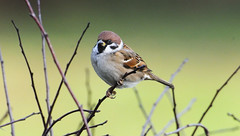

---
categories:
- thesis
date: 2015-02-06 11:10:16+10:00
next:
  text: Kludging an authoring process with Moodle books (almost)
  url: /blog2/2015/02/08/kludging-an-authoring-process-with-moodle-books-etc/
previous:
  text: 'Concrete lounge #1 - Helping learners find correct, up-to-date course information'
  url: /blog2/2015/02/03/concrete-lounge-1-helping-learners-find-correct-up-to-date-course-information/
tags:
- bad
- change
- herdingcats
- metaphor
title: Metaphors and organisational change
type: post
template: blog-post.html
comments:
    - approved: '1'
      author: francesbell
      author_email: frabell@gmail.com
      author_ip: 82.15.171.64
      author_url: null
      content: 'I really like this post.  We have things in common - background in IS
        and looking at metaphors:)  I have always disliked the herding cats thing - as
        it promotes the agency of the herder and rather looks down on the cats.  But I
        suppose it depends on how the metaphor is used.  I thought I would share two practical
        uses of metaphors. Working with Jenny Mackness recently caused me to dig out some
        1980s Scandinavian work that used multiple metaphors for organisations/ systems
        to free up thinking.  What I liked about it was they looked at where the metaphor
        broke down.  That''s what tropes are good at - covering things up.
    
        The second one was where I used metaphors with a Masters class of IT/IS students.  We
        used the example of learning and teaching as that was an experience we shared.  What
        came out of this was probably not surprising but led to a very useful discussion.  Groups
        came up with ideas (not all metaphors) such as learning and teaching is like a
        restaurant where the teacher is the chef and the students are the diners, or like
        a football team where teacher is coach and students are team members.  When we
        had all shared, I encouraged them to relook at the metaphors from the perspectivity
        of agency/ passivity.  Then we thought about what difference the metaphor would
        make if we started to look for opportunities to employ technology effectively
        in teaching and learning situations.
    
    
        Catch the cats being good and stroke them or just enjoy the beauty they bring
        to your world:)'
      date: '2015-02-06 23:02:16'
      date_gmt: '2015-02-06 13:02:16'
      id: '1220'
      parent: '0'
      type: comment
      user_id: '0'
    
pingbacks:
    []
    
---
Metaphors are useful. They reveal some of the underlying assumptions held by people. For example, [this paper](http://aisel.aisnet.org/icis2007/9) (Behrens, 2007) reveals that Information Systems research has a strong bias towards thinking of organisations as if they were machines. A bias that tends to invade most organisational practice. The following picks up on a couple of recent events to examine one of the metaphors commonly used in academia. It argues that this metaphor reveals some problematic assumptions.

## Herding cats

The standard trope around academics and change is herding cats. Captured memorably by an EDS commercial

https://www.youtube.com/watch?v=Pk7yqlTMvp8

Of course, anyone who knows cats, knows that's not the way to get cats to do anything.

**Update:** (26/06/2015) Apparently the Mythbusters have some empirical proof of how difficult this might be. As pointed to by this tweet

https://twitter.com/thesiswhisperer/status/614250070762885120

Obviously this difficulty was foresee by others, as (end update) is illustrated by a tweet yesterday from @SAlexander\_UTS summarising a point made by a senior academic

https://twitter.com/SAlexander\_UTS/status/563178078998757376

Even this modification of the herding cats metaphor doesn't understand that the entire metaphor is based on potentially problematic assumptions. Problematic assumptions that I have observed failing to have any impact on universities for something approaching 20 years.

I'll focus on three.

## That you know where to move the food to

  

   by  [chapmankj75](https://www.flickr.com/people/25553993@N02/) 

The first assumption is that someone (typically senior management) know where to move the food. i.e. someone knows what is the best strategy, the best practice. This is the assumption that underpinned [Mao's four pests campaign](http://en.wikipedia.org/wiki/Four_Pests_Campaign) to eliminate rats, flies, mosquitoes and sparrows. The sparrows ate grain meant for the people, so had to go. They were eliminated by (amongst other measures) millions of villagers heading out to bang pots and pans to continually scare sparrows so they would never land and hence die from exhaustion. The campaign was so successful that there was a locust plague.

Apparently, the sparrows also ate insects, including locusts. With most of the sparrows dead, the locusts bred leading to somewhat troubling and unintended consequences.

Change of a complex adaptive system - like a university/organisation - is very very difficult because it's difficult for a group of people (even if they are super intelligent senior management) to understand all of the consequences of changing where the food is located.

## That you can successfully move the food

The other assumption underpinning the herding cats metaphor is that you can successfully move the cat food (or herd the cats). i.e. once you've identified where to move the cat food to, that you are capable of picking up the cat food and moving it to the new location. At an organisational level this is very hard for any meaningful change.

For example, over the last two days I was attending a planning session for the two schools of education at my current institution (I work in one of those schools). The sessions were held in the dining room of one of the colleges on-campus. The restroom for men at this college provides a wonderful metaphor for just how difficult it is to move the cat food and illustrates what "moving the cat food" typically looks like in most universities.

As the image shows, the door into the restroom had prominently displayed a sticker promoting the idea of being water wise. Someone in the college or broader institution had identified being water wise as a good idea and was trying to herd the cats in that direction.

The only trouble is that when you entered the restroom you soon became aware of running water. As the next image shows it appears that the washer in the basin tap was shot so that tap was continually leaking. No matter how water wise I wanted to be....

When it comes to "moving the cat food" in universities. It often more closely resembles the distribution of lots of stickers, rather than effectively modifying the environment to achieve the stated goal. So an institution that is keen on Open Educational Resources runs lots of special events and creates websites espousing the benefits of open educational resources. But at the same time retains a default position that the copyright for all teaching materials created by staff remains with the university. If I want to convert my teaching resources into open educational resources, I have to ask the legal office for permission.

## That the cats will follow the food

So, assuming that you can

1. Identify the best destination for the cat food; and,
2. Successfully move the cat food to that destination.

The assumption is that the cats will follow the food. That they will happily accept your arbitrary decision that they should eat in a new location.

Anyone who knows cats, knows that this isn't going to work. For example.

!!! warning "Broken image"

If there is a defining characteristic of cats it is that they have a fairly high level of agency. They will decide whether or not the new destination suits. If it doesn't, they will do something else.

For example, if you design a new standard look and feel for the institutional LMS and it is a step backwards in terms of functionality, then some academics will work around that look and feel.

It's called [task corruption](/blog2/2009/03/04/task-corruption-in-teaching-university-negative-impact-of-place/).

## Other alternatives

I'm a cat person (I'm also a dog person) and based on my experience there are other alternatives.

### Scruff of the neck

  

   by  [Malingering](https://www.flickr.com/people/malingering/) 

You could take a leaf out of the species textbook and grab them by the scruff of the neck and take them where you want. This is an approach that is being taken by some management. However, it still suffers from exactly the same problems as outlined above.

Beyond those problems, it adds the additional problem of changing the relationship between you and any adult cat you try this with. Especially if you try it repeatedly.

### Squirting water

  

   by  [Tim McFarlane](https://www.flickr.com/people/tilaneseven/) 

If wanted the cat to stop doing the wrong thing, you could always use the squirt bottle approach. Whenever the cat does the wrong thing, you squirt water at or yell loudly or some other form of punishment.

Of course, this actually can only ever prevent the cat from doing the wrong thing, rather than take them to a new place. It also assumes you can identify the "wrong thing" to do.

But worse than that, there is an argument that [it doesn't even work](http://www.catbehaviorassociates.com/the-squirt-bottle-controversy/) and I quote

> The squirt bottle technique only accomplishes three things:
> 
> 1. It creates frustration in the cat
> 2. It causes the cat to become afraid of you
> 3. The cat learns to wait until you aren’t around before engaging in the behavior

### Trust

This is Tommy (aka Son). He's my cat/I'm his human. We've been together for must be almost 9 years now. Tommy can be the other side of the yard, but if I make a particular noise (and all things being equal) he will generally head my way (at his own speed). He knows that there will be a positive outcome and generally desires that outcome. He trusts me. If something in the environment changes (e.g. visitors) he may not, but in the right circumstances I might be able to get him to surface, but there are limits.

This is another approach you can take with cats. However, it still suffers from the same problems as above. It assumes that I (senior management) know where to go and can successfully get everyone there.

## Surprise - let the cat(s) take you where it will

An approach that doesn't seem to be all that much discussed is to let the cats be cats. Enjoy what they do and what they will give you. Perhaps establish a few routines and the appropriate environment, but the reason anyone owns a cat is because cats surprise and give enjoyment. Letting cats be cats.

Just a bit like organising a children's birthday party.

https://www.youtube.com/watch?v=Miwb92eZaJg