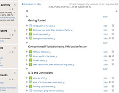

The following outlines an attempt to evolve the authoring "process" I currently use with Moodle books into something a little more useful. It won't be the be all and end all of authoring process, just enough to solve the immediate problem I have. i.e. [bricolage](/blog2/2014/09/21/breaking-bad-to-bridge-the-realityrhetoric-chasm/#badset)

I've essentially got this working on my end. The problem is that the Moodle book module has a few flaws in how its import function works which means I can't really use this approach. At least until the book module is fixed. I've fixed most of it on my own install of Moodle. Will have to find out how that might happen.

## Some related work

As it happens @abelardopardo wrote a post yesterday titled [Re-visiting authoring: Reauthoring](http://abelardopardo.blogspot.com.au/2015/02/re-visiting-authoring-reauthoring.html) that touches on the broader problem and [offers a solution](https://bitbucket.org/abelardopardo/reauthoring). Many of the conditions he outlines align with mine, however, my need is more immediate and contextual than what would be need to explore and adopt his solution.

And I remember @timklapdor doing some work around this broader issue last year. Yep, I even commented on [his post](https://timklapdor.wordpress.com/2014/01/31/an-academic-authoring-environment/). A comment that captures some of my disquiet about institutional approaches to solving the authoring problem (I know my institution will be having another go at this soon).

Meaning I'm not trying to solve it at the institutional level. I'm simply aiming to enhance my current practice a bit. An ["inside out" approach](/blog2/2010/04/25/inside-out-outside-in-or-both/), rather than outside in.

## A better idea

If I had the time I might have modified the approach below so that rather than exporting the Moodle book into HTML files on my computer, I'd have it exporting to pages on my [smallest federated wiki (SFW)](http://fedwiki.djon.es/) (and back into the Moodle book). With this approach the SFW version would be the definitive version. It has version control built in at the paragraph level and opens up a range of possibilities of students (and others) being able to fork and work on their own versions of the content. An affordance that could potentially be much more interesting from a learning perspective and in terms of being "open".

However, the SFW authoring environment doesn't feel quite as natural to what I plan to use below. That may simply be familiarity, but there's also the problem that SFW somewhat denigrates the use of HTML and is somewhat limited in terms of presentation and embedding. Why not use SFW, rather than Moodle books? Mainly because the course design currently (and perhaps problematically) relies on Moodle activity completion. Not a function that is available in SFW, nor a function that is sensible in the SFW world-view. It also appears - after a quick test - that SFW doesn't necessarily play all that nicely with search engines. Meaning that SFW doesn't solve my big bug bear with Moodle, no search capability.

## Deja vu all over again: why?

I do this with some reservation due to a sense of deja vu. Almost 20 years ago as I prepared my [first totally web-based course](http://web.archive.org/web/19970808204421/http://mc.cqu.edu.au/subjects/85321/) I wrote a [set of scripts](/blog2/publications/solving-some-problems-of-university-education-a-case-study/#authoring) to help with authoring [the web-based study material](http://web.archive.org/web/19970809003757/http://mc.cqu.edu.au/subjects/85321/study-guide/chap1/index.html) (thank you the web archive). Tools and an outcome not unlike the approach I'm working toward below and not that far removed (but far more primitive) than those mentioned above.

Why? Why after 20 years this authoring problem still hasn't been solved? Why do there remain a plethora of disjointed systems and no-one really good solution?

Perhaps mainly because there is a plethora of disjointed systems in which the resources that are authored have to fit. Each of those disjointed systems have different world-views and subsequently sets of functionality. Hence it's almost impossible for one authoring process to fit nicely into all of them. e.g. the talk above about integrating SFW and Moodle books. Adding more complexity, and touching on the comment I made on [@timklapdor's post](https://timklapdor.wordpress.com/2014/01/31/an-academic-authoring-environment/), the people who are likely to use, the people that will use these authoring systems come with their own set of world-views, preferences and peccadilloes. The gaps between all these world-views are perhaps just big enough to prevent the wide acceptance of a single approach.

Suggesting that designing or selecting a single system (an outside-in approach) for everyone to use is destined to fail. There will always be gaps between the different world-views. Even if you can get everyone to agree, in a year or so another type of system will arise and there will be another gap to overcome. Perhaps a better approach is focus on what people are currently doing and bridge the gaps (an inside-out approach), which is sort of what I'm doing here.

## The problem and context

As outlined in [a previous post](/blog2/2015/02/03/concrete-lounge-1-helping-learners-find-correct-up-to-date-course-information/) and shown in the following screenshot my course uses ["Moodle books"](https://docs.moodle.org/28/en/Book_module). Each Moodle book tends to be focused on a specific task and generally is wrapped around external resources.

These books were originally written in HTML using the vi editor and manually imported into Moodle. Last year I made ad hoc changes by using the book module's "editing" interface. That's not a great process.

The wish list for what I want from a process

1. Have an authoritative source HTML file that contains all the content for the book.
2. Use directories and files to create a structure that mirrors the learning paths on Moodle.
3. Perhaps in way that allows the content to be put on another website so it can be searched.
4. Have that structure under source control.
5. Allow simple updating of the Moodle book.
6. Benefit from the Moodle migration smarts. The Moodle books point to additional Moodle activities (e.g. quizzes, discussion forums) etc that are used in learning activities in the books. When a new offering of the course is prepared, the old offering is migrated. This migration process is smart enough to have the books in the new offering pointing to the activities that belong to the new offering. The "books" in source control wouldn't be automatically updated this way.

In essence, I'd like to edit the books using vi (or whatever HTML editor etc I end up using) on my local computer. When I'm happy with the book, commit it to source control and import it into Moodle.

In a perfect world, at the start of a new term I'd have a process that dumps the migrated books from the new course site onto my local computer ready for editing and importing into source control.

## Exploration and Development

The following documents some exploration of various possibilities that might help achieve the above.

### Import and export from a Moodle book

When I started all this either I was aware of, or the Moodle books didn't have an import facility. Time to play with that as it may be the foundation for putting content back into Moodle quickly.

It appears it accepts each chapter as a HTML file. Which is a bit of a bugger as I'd hoped to work with a single HTML file locally and upload that. Appears I may need some sort of script to produce the format required by the Moodle book. Let's test this out

1. Download an existing book.
    
    I'm doing this by using the "print book" function. This produces a fairly bare HTML file of the entire book that forms the basis for the local copy.
    
2. Look at the HTML. Diigo/Firefox has stuck a bunch of css etc into it. Remove that.
    - book\_summary/title classes book\_summary and book\_info use for entire book information.
    - class book\_toc\_numbered
    - Chapters are surrounded by a div with class book\_chapter, heading 2 used for the title.
    - Sadly sub\_chapters also appear to use class book\_chapter but with heading 3
    - A collection text/css files are created when saving the printed file.
3. Import that single HTML file into another book. Well that doesn't work. Apparently an invalid file type. Let's try removing all the diigo etc crud. Nope that doesn't help. So what about a single section of HTML? Of course, it has to be a zip file that you upload. Idiot. So zip file with two html files. One the big HTML from the book itself, and the second a small excerpt. So it does the import and presents some feedback - "Importing" "Relinking" and then a continue button.
    
    Appears to be a very simple import. Each HTML is create as a single chapter. Sequenced in the order found in the zip file.
    
    What if I import again, but change one of the files to end in \_sub.html. This is meant to create a sub chapter. That works as expected. Another two chapters added to the book, exactly the same as the other two. But the test\_sub.html has been created as a sub-chapter. i.e. the title of the chapter is taken from the title, but it isn't smart enough to remove the \_sub, even though it knows what \_sub at the end indicates. **Note:** I really should do something about that, looks like it would only take the addition of a single line of code.
4. Look at the content and develop the script. Looks like the script will need to parse the HTML "print" version from the book by
    
    - Extract all the div class book\_chapter
    - for all of those (in order that they are found in the HTML file)
        - create a new file with the following name format NUMBER TITLE{\_sub}.html
            1. NUMBER - A number such as 001 to ensure that the order stays the same.
            2. TITLE - the title from the heading 2 or three immediately inside the div.
            3. \_sub - if it's a heading 3 - indicating a sub-chapter.
        - Add in the content of the div into that.
    
    Also appears like I'll need to have two separate functions, related to preparing the version of the file to
    
    1. edit; and This would be a single HTML file that I use to edit.
    2. import. The one outlined above that would imported into Moodle.
    
    So which Perl HTML parsing module to use? TreeBuilder::XPath was the most recent I've used. But I'm doing jquery a bit recently, so [Mojo::DOM](http://blogs.perl.org/users/tempire/2011/02/easy-dom-parsing-with-mojodom.html) is interesting.
    
    Yep that worked. Script is now producing an EDIT.html file that I'll use to make changes.
    
5. Import the broken up HTML files into another book The aim here is to
    
    1. extract all the book sections from the EDIT.html file
    2. create a collection of separate HTML files containing the contents of each book section
    3. zip up all those separate HTML files ready for importation
    4. remove the files
    
    Done. Fairly simply. Tried import into the book and it's sort of worked. The problems to solve are
    1. The inclusion of ".html" in the chapter name.
    2. The inclusion of "\_sub" in the chapter name. These first two problems appear to be down to how the Moodle book import function works. i.e. it doesn't remove these, which is somewhat surprising. Have made some initial changes to my local Moodle installation (about line 83 of mod/book/tool/importhtml/locallib.php), but which won't work on all uses of the module - e.g sub-directories, HTML files with .htm extensions etc. \[code lang="php"\] # DJ's changes if ( preg\_match( "/.html$/", $chapter->title ) ) { $chapter->title = preg\_replace( "/.html$/", "", $chapter->title ); } # end DJ's changes
        
        if (preg\_match('/\_sub(/|.htm)/i', $chapter->importsrc)) { // If filename or directory ends with \*\_sub treat as subchapters # DJ's changes // remove \_sub from title, should be last given above replacement if ( preg\_match( "/\_sub$/", $chapter->title ) ) { $chapter->title = preg\_replace( "/\_sub$/", "", $chapter->title ); } # end DJ's changes \[/code\]
    3. The inclusion of #39; (i.e. html entities) in the chapter name. This appears to be due to the process I'm using to save and process the exported book files. I need to modify it to decode HTML entities. Easy enough in Perl using HTML::Entities. But I also have to update the heading back in the HTML. Done.
    4. Chapters having no content. My immediate guess is that the HTML files being imported still have some of the Moodle book divs etc and that this is clashing. So remove those and test. Nope, that didn't work. Time to look at the code \[code lang="php"\] if (preg\_match('/<body\[^>\]\*>(.+)</body>/is', $html, $matches)) { return $matches\[1\]; \[/code\] Oh dear, regular expression matching. That's the problem. It requires a body tag around the outside. Have to love open source projects where you can look at the code. That's fixed.
    5. Duplicate headings. The import file needs to have the heading title and the other book chapter remnants removed to prevent issues. Done.
    6. The chapter numbers still present. The Moodle book import processes the collection of files in the order it sees them in the zip file. To make sure that the order is what I want, the filenames start with numbers. The problem is that the import process doesn't remove the numbers, so you end up with stuff like _2 2 Diigo_ where the first 2 is from the Moodle book module and the 2nd 2 is from the file name. I can't change the Moodle book module code quickly enough to help me. Can't remove the numbers in my export script as this would change the order of the files imported. Leaving exploring the zip function to see if I can specify the order the files should be zipped in the script, without relying on numbers in the file system. Can do this with zip, however, the book module doesn't play nicely. It looks like it just unzips the file, forgets about any order in the zip file and relies on the order from the file system.
6. Additional problems Of course it's not going to be as simple as this. A major problem will be that via this process I will lose the capability to correctly link between pages in a book. The import process back into the Moodle book will either actively change links to a Moodle book, or it will ignore them. It will also play silly buggers with links to/from other Moodle books. i.e. modifying a book this way will break all other links to the original version of the book.
    
    Some possible solutions
    1. Have the import script look for and announce links to Moodle books. Thereby allowing for manual intervention.
    2. Run the institutional "check course" function to check for broken links
    3. Modify the book module so that the import function supports some sort of variable for pages. i.e. the ability to use _{TITLE\_OF\_PAGE}_ as a link to a page within the current book. Where TITLE\_OF\_PAGE is the chapter title.

### Export all Moodle books

This will have to wait until another day.

### A structure that works

Looks like being something like

- Week folder
    - Book folder
        - ALL.html - the version imported from Moodle.
        - EDIT.html - output of "parseBook.pl ALL.html" ready to edit.
        - IMPORT.zip - output of parseBook.pl. A zip file ready to import into Moodle that contains ALL.html split up into the appropriate separate HTML files.

### git{hub}

Wait for another day. But I assume the aim would be to have EDIT.html in git with the surrounding structure.

## Planned process

1. Create a folder for each week.
2. In that create a folder for each book using 001 etc to get order correct
3. Save a HTML version of the book from Moodle into EXPORT.html in that directory
4. Run the script which will produce an EDIT.html file in that directory
5. Make the changes in the EDIT.html file
6. The EDIT.html file can be kept in github?
7. Run the script to produce the import version.

## To do

- Look into how to suggest/contribute the following changes to the Moodle book
    - Modify the chapter titles imported to remove the \_sub and the .html. Semi-done.
    - Import chapters in the order they are contained in the zip file (if possible) The zip stuff is done by lib/filestorage/zip\_packer.php. ATM, the book module is simply extracting files to storage. Hence the problem with out of order. zip\_packer does have a list\_files method that might just provide the list of in order file names that we're after. This actually works and the book module does use this initially to get the filenames. But it loses the order when it creates a hash with the pathName as the key.
        
        That's fixed.
    - Have an option to remove all existing chapters prior to import.
- Think about the implications of integrating SFW .