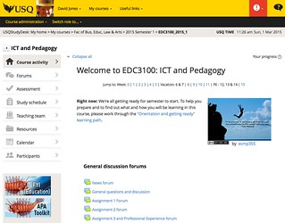
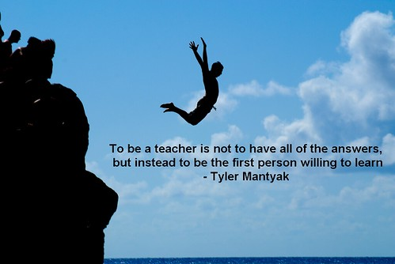
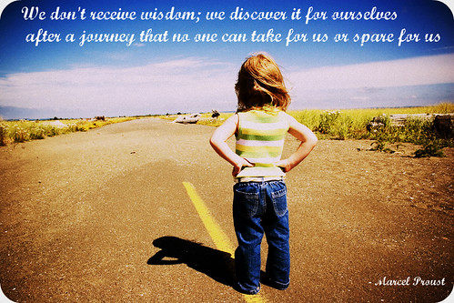
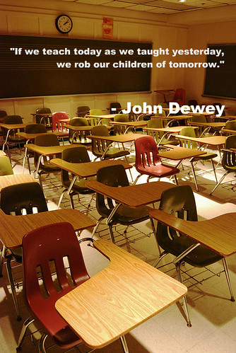
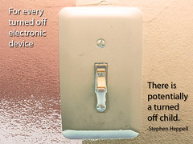
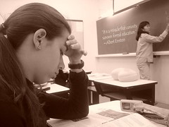
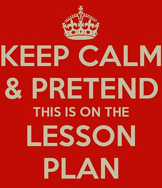

---
categories:
- edc3100
date: 2015-03-01 11:34:56+10:00
next:
  text: What do you do with Twitter?
  url: /blog2/2015/03/04/what-do-you-do-with-twitter/
previous:
  text: 'Contradictions in adjectives: You can&#039;t be consistent and optimal'
  url: /blog2/2015/02/25/contradictions-in-adjectives-you-cant-be-consistent-and-optimal/
title: The edc3100 "inspirational posters"
type: post
template: blog-post.html
comments:
    []
    
pingbacks:
    - approved: '1'
      author: Computer Simulation for History | MMafi
      author_email: null
      author_ip: 192.0.81.170
      author_url: https://mmafi.wordpress.com/2015/05/04/computer-simulation-for-history/
      content: '[&#8230;] for students learning in achieving the curriculum goal, I was
        able to get a response back from David Jones. He threw in a few ideas such as
        using simulation by refering to the History Teachers Discussion [&#8230;]'
      date: '2015-05-04 16:22:06'
      date_gmt: '2015-05-04 06:22:06'
      id: '1234'
      parent: '0'
      type: pingback
      user_id: '0'
    
---
The following is a work in progress intended to record the "inspirational posters" that I use on my course website. Mainly so I an remember what I used and why.

### Inspirational posters??

Rather than take up the space ["above the fold"](http://en.wikipedia.org/wiki/Above_the_fold) on my course site with reams of text or less than useful navigation icons, I have moved toward a model with minimal text and an "inspirational" post for each week of semester. The idea is to provide something that is interesting, not text-based, and related to what the students may be doing/thinking in any given week.

The following image shows the current state of the course site.

I know have to think about whether there's any good way of moving the "general" forums from the top of the site without losing functionality.

_Start whinge_

I'm learning to detest the intrusion from folk outside of my course into the learning space for my course. This week the "fish" block appeared in the left hand column. These are two links to various support sites created at a program or institutional level. The intent is that they will aid students and improve their learning. My hypotheses is that their impact is low (few students use the links) and this is partly because they are just plonked on the edge of the learning space and are not integral to the learning process for the course (a process which, in this course, points explicitly to these and related resources at a time appropriate to the learners.

And don't get me started on "Fac of Bus, Educ, Law & Arts". It's bad enough when organisational restructures create conglomerations of disparate organisational units, let alone when they are inflicted upon learners who really don't need to know that my course (and their education program) belongs to the "Fac of Bus, Educ, Law & Arts" and not USQ (the institution they enrolled to study at). Especially when it takes up huge amounts of limited space in the bread crumbs navigation space.

Which of course is all related to the broken idea of ["consistent course websites"](/blog2/2015/02/25/contradictions-in-adjectives-you-cant-be-consistent-and-optimal/). It is especially ironic given that as I write this post, one of my students in EDC3100 (a course for pre-service teachers title "ICT and Pedagogy") has just shared the following comment via Diigo on [this reading](http://speedchange.blogspot.com.au/p/blog-page_2046.html) for the course

> There is no such thing as a one size fit all approach to learning or teaching and no individual student or teacher should stop talking and working out better ways of learning and teaching together.

(Note: semester starts tomorrow, so this opinion is the outcome of the students learning prior to joining this course and being infected by my views).

End whinge

Previously [I've used Diigo](https://www.diigo.com/user/djplaner/edc3100pictures?type=all&sort=updated) to keep track of what I've used, but it's time to be a bit more explicit.

## Week 0 - orientation

Here's the first image I'm using this semester. It's used during "week 0" the two weeks between when the institution opens course sites to students and the start of semester. In this course, it's the "orientation and getting ready" period.

    by  [ecmp355](https://www.flickr.com/people/ecmp355/) 

[The photo](https://www.flickr.com/photos/ecmp355/5408979138/) is from one of the students taking a course taught by @courosa. The quote is

> To be a teacher is not to have all of the answers, but instead to be the first person willing to learn -- Tyler Mantyak

[Tyler](https://twitter.com/tmantyak) appears to be using his own quote in the image. Love it.

The connection with my course is that many students find it a challenge. Especially in the first couple of weeks. This quote might help them remember that they need to be willing to learn and that learning is typically pretty hard. If they are finding the course a challenge, then maybe it is because they are learning (and not that the course is badly designed and implemented).

## Week 1 - ICTs, PLNs, and you

For the first week I think a bit of Proust is called for.

    by  [ecmp355](https://www.flickr.com/people/ecmp355/) 

[This photo](https://www.flickr.com/photos/ecmp355/6797045261/) (as with many) is also taken from a @courosa course. Continues the theme of taking responsibility for the journey. Also links nicely with the use of "learning path" as the metaphor for the weekly journey students have to go on.

## Week 2 - ICT and Pedagogy: Why and What?

One of the aims of this week is to get folk thinking about the broader changes in society that are impacting learning and teaching, and also to start questioning how ICT might change pedagogy. Which means this Dewey quote fits nicely.

    by  [ecmp355](https://www.flickr.com/people/ecmp355/) 

## Week 3 - RAT, SLIC, Curriculum, Copyright and Digital literacy

A bit of what is apparently Proust this week. A nice constructivist type of a quote that does capture the intent behind design of the course. Not sure how effectively the course achieve that, but at least the intent is there.

    by  [ecmp355](https://www.flickr.com/people/ecmp355/) 

## Week 4 - Effective planning

This week marks a turn of focus toward unit planning as a mechanism by which to demonstrate the design of ICT-rich learning experiences. The focus on planning means that the Lewis Carroll quote in the following is a nice fit

> If you don't know where you are going, any road will get you there..."

As yet we don't really engage with questions like, is it ok for any road to get there? Is it possible to really know where you should be going in a class of 20+ learners?

  
   by  [ecmp355](https://www.flickr.com/people/ecmp355/) 

## Week 5 - Learning experiences

  
 by [ecmp355](https://www.flickr.com/people/ecmp355/)

The aim this week is to get the students thinking about the design of ICT-rich learning experiences. Trying to encourage them to turn off the old style of teaching.

  

## Week 6 - Finishing up the unit plan

  
 by [ecmp355](https://www.flickr.com/people/ecmp355/)

The last week spent on developing a ICT-rich unit plan and a small dig at formal education. By this stage the learners are all probably a bit jack of the formalism that comes with unit plans.

  

## Week 7 - Professional Experience

This week has focus turn toward preparing for Professional Experience. Where the learners head out to schools and try to put some of this into practice. Mostly in the form of designing and implementing ICT-rich lessons. Teaching in schools is always just a little scary.

## Week 8 - Digital Citizenship

  
 by [ecmp355](http://www.flickr.com/people/ecmp355/)

One of the aims of week 10 is to move students beyond the "it's too dangerous lets avoid it" focus of digital citizenship into one where it has it's risks, but also it's benefits, and we should all be able to leverage the benefits.

## Week 9 - IWBs and CLEM

This week the focus is on how to develop the knowledge required to effectively design ICT-rich lessons that amplify and transform student learning using what ever random ICT is available within a specific classroom context. We focus on this because next week the pre-service teachers head out on Professional Experience. i.e. they are in a classroom having to teach ICT-rich lessons with whatever ICT is available in that classroom. CLEM is a framework designed to help them identify the Communities, Literature, Examples and Models that are available for the ICTs that are available. CLEM is designed to help them develop the knowledge they need. Hence the link back to the image first used in Week 0.

  by [ecmp355](https://www.flickr.com/people/ecmp355/)