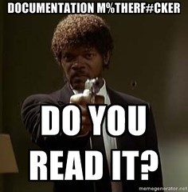

See also: [[blog-home | Home]]

Assignment 1 for my course is due later today. 100+ students have submitted. Time to explore the Moodle assignment submission system and how to allocate assignments to markers.

### So what?

Why would that be interesting to anyone not using Moodle? Well because...

[One explanation](http://www.linkedin.com/pulse/train-teacher-way-she-should-go-depart-michael-sankey) for the quality of "e-learning" is

> We have taken our teachers who have been really effective at face-to-face teaching and asked them to also be experts in online teaching. Get real! That’s like asking a good basket baller to become a good hockey player. Yes it’s sport and yes you have a ball and competitors, but the rules are very different. And yes, if you’re a good sportsperson, chances are you can pick-up on being good at another code, but it will take time and quite a bit of training.

  
   by  [Jorbasa](https://www.flickr.com/people/jorbasa/) 

That's certainly part of the problem. But - to extend the analogy - the other part of the problem that I experience day to day is that universities are asking the good basketball players to play hockey with equipment that's quite a few sizes too small and simply doesn't help them play hockey, let alone learn how to play hockey.

This is not to say that the provision of the appropriate equipment is easy. It's not. It's incredibly difficult. A wicked problem.

The point is that the perspective (from the [same post](http://www.linkedin.com/pulse/train-teacher-way-she-should-go-depart-michael-sankey)) is - in my experience - not the case at all

> We already have all the tools we need to get our students engaged. Sure there will be new ones that come along from time to time that will do things a wee bit better, but for the time being we have plenty to make this happen.

As a teacher engaged with e-learning at a University, most of the technology provided is [a concrete lounge](/blog2/2014/12/18/concrete-lounge/).

  

### Assignment submission

My current institution has this year moved away from a locally produced online assignment submission and management (OASM) system toward one embedded within the Moodle LMS. There's apparently been some customisation of the standard Moodle OASM system, but it's not clear just how much. I've already heard reports from other staff (with courses that have assignments due before mine) that allocation of assignments to makers is less than easy.

The following documents my attempts to do this and seeks to explore if the Moodle assignment submission system will be an example of the wrong size shoes for playing hockey.

### I'm a hockey player

_Background:_ I designed and implemented my first OASM system back in 1994/1995. From then through to about 2004/2005 I led the design and implementation of various generations of an OASM system and wrote [the odd paper](/blog2/publications/three-generations-of-online-assignment-management/) about it. I know a bit about these systems. I'm not a basketball player, I'm a hockey player.

## Assigning some assignments - do it myself

  
   by  [mray](https://www.flickr.com/people/mray/) 

First test, can I figure out how to do this via the interface. i.e. don't read the "manual".

Assuming the "Assignment administration" menu would offer some insight/affordances.

"Marker assignment quota" seems the most obvious option. A couple of observations

- Apparently one of the students has some how been allocated the role of marker, she is appearing in the list of markers.
    
    My first question is obviously, "How the hell did that happen?". The user is currently assigned to both the student and "general admin" roles. I don't remember (even accidentally) making this change. Wonder how it happened?
    
- This offers a choice of unlimited or a specific quota, but isn't pre-populated with data already entered.
    
    i.e. to employ the markers to do this work, I had to negotiate with them how many they could mark and then specify that in the contract process. Having to re-enter this data in another system is a bit of a pain. I understand why it hasn't been done. These are two very separate systems managed by very different parts of the institution. But if the shoe were too fit.....
    

> **Concrete lounge #1:** Having to re-enter data already present in other systems.

### View/grade all submissions

Next bet is to try the "View/grade all submissions" which shows a filterable list of all the submitted assignments and allows a number of operations to be done upon them. I'm assuming that "allocate marker" could be one of them.

Yep, "set allocated marker" is an option. Select the student(s) to allocate, select the menu option and hit "Go". Brings up a page with those students listed and another drop down menu of markers. You chose the marker and hit "Save Changes"

Two potential problems with this

1. Pre-allocation; and
    
    This does imply that you can only allocate markers to assignments that have already been submitted. I've got at least one marker who has a fixed group of assignments to mark. All located at a specific campus. In a perfect world I'd be able to pre-allocate the assignments from those students to the marker. Rather than have to wait until they are submitted and manually allocate them.
    
2. Manually selecting individual students.
    
    Individual allocation is ok, but I would like to see at least two additional options. First, the allocation by group option available above. Second, a random (or perhaps specific) allocation of specified numbers. e.g. I have markers who will make 50 assignments, I'd like to automatically allocate them 50 assignments and have the system randomly allocate them. I'd rather not have to count to 50.
    
    Even better, it might be nice to say allocate them 50 assignments, but aim to achieve a balance of ability levels (perhaps based on GPA or some other indicator). Few things are more depressing than having to mark 50 low quality assignments. I assume there would be other allocation schemes people would like to apply.
    

Are there other options beyond this?

### Grading options

Under the "grading option" drop down menu there is a "auto-allocate markers" option. But I wonder if it's smart enough to handle variety. i.e. I need to ensure that one marker gets all the students at one campus, but can randomly allocate the remainder.

I don't want to experiment with this option, just in case it goes ahead and auto-allocates straight away. So I'll do a Google search for documentation. The search results are not that clear.

It appears that Moodle 2.6 added two related features - marking workload; and, marking allocation. These have to configured into the assignment activity. Did I do this? I did indeed. And this provides the functionality I've already identified.

So let's just suck it and see. Good, it doesn't do this straight away. It allows the options to

1. allocate all unallocated, submitted submissions;
2. allocate all unallocated submissions (including unsubmitted ones);
    
    Both these options are dong be specifying an "allocation batch size" and either doing an "Allocate" or "Simulate". The simulate is a useful feature.
    
3. copy allocations from another assignment.

Nothing here about allocating based on groups.

### Filters and options

There are a collection of filters that can be applied, based on

- \# assignments per page;
- assignment status;
- marker allocation;
- workflow status;
    
    A slight duplication to assignment status, but based on a different approach.
    

There's nothing here about filtering based on groups. Is this because I haven't configured there to be?

### Group options in the settings

There is a "Group submission settings" section in the assignment settings. But most of this is based on the idea of students submitting assignments in groups. Not using groups to allocate assignments to markers.

### No obvious options

I'm giving up. I can't see from the system any obvious ways to allocate assignments easily via groups.

At this stage it appears that I will have to

1. Manually allocate all students at one campus to their marker.
2. Use the auto-allocate feature for the remaining students.

In theory, I could negotiate with the first marker to do an auto-allocate. But I think it important that he mark the assignments of his own students. Changing that preference would be the case of the tail wagging the dog.

## Use the documentation

Before I do that, let's see whether the documentation provided by the institution can offer any insight. It appears that this might be the solution

> However, if the assignment activity has first been configured into groups, these can be manually assigned to a specified Marker.

I'm not entirely sure what this means. Let's experiment with a dummy assignment and use the "common module settings" and the groups there.

First, the groupings don't seem to be appropiate. No option to do it at campus level.

Okay, this appears to have added an additional option to filter which students/assignments are shown based on groups.

This would provide the option I need (a bit of a kludge), but the question is whether or not the setting can be changed on the fly - i.e. after students have started submitting?

The other question is what do (or will) the students actually see. I don't believe there is actually an easy way for me to test this.

Let's try making the change. Appears to be no problem with other assignments. I assume Moodle will warn of any horrible consequence? Famous last words? Logically there shouldn't be a problem, but....

Change made, but there is no difference in the display. The option to select just the students in a particular group does not appear. Perhaps it can't be changed once submissions have been made.

> **Concrete Lounge #2:** No apparent way to filter assignments/students by groups

Group membership is stored independently of assignment submission in the Moodle database. It should be possible to offer a "Group filter" - perhaps even one dependent on the "grouping" - as a way to modify the viewing of all submissions.

Looks like I'll have to do this manually.

## Documentation at the wrong abstraction layer

> **Concrete Lounge #3:** The local help documentation (like most help documentation) is written at the level of functionality. It describes the interface and what each interface element does. It isn't organised at the level of "activity type" i.e. the level of the users.

i.e. I have a certain model of how I want to manage the submission, allocation, and marking of assignments. That's what I know. That's where I am. Documentation that started at this level by describing a list of different models of using assignment submission and then describing how to configure the Moodle assignment submission system to implement this model would be more useful (and much more difficult to write).

Better yet. Would be an assignment submission system that would present a list of different models, briefly explain each one, allow me to choose which I want, and then set up the system to fulfill that model.

i.e. the system actually fit what I wanted to do, rather than required me to engage in explorations how to figure out if and how I could translate the functionality of the system into what I wanted to do.

Sorry, but the tools we have available at the moment aren't quite ready to help basketball players become better hockey players.

## Update

As per the comment below I missed an option to flick. That's done and I can see the groups and make use of those. So here's what I did

1. Allocate unsubmitted from campus X to the marker;
    
    Set filter to the tutorial group I need and filter for "unsubmitted". This is so that if they submit, they will automatically appear on the marker's list.
    
2. Allocate submitted from campus X to the marker;
3. Auto-allocate the remaining submitted to markers;
    
    Priority is given to those submitted.
    
4. Drop the allocation for campus X marker
    
    _Problem:_ the campus X marker was originally allocated 22 students to make. But one has dropped out. Meaning when I do an auto-allocate (simulation) he gets allocated another marker.
    
    I also have to make sure that the "student marker" has an allocation of 0.
    
5. Do the auto-allocation again.

Now all I need do is to figure out how much advice the markers will need to download, mark and resubmit the their allocated assignments.

### What advice is there?

Hard to explore this myself as I don't know how much my view of the system is the same as what a marker would see.

The "Download all submissions" option gets them all, not just the ones I've allocated.

Appears that the "view all", play with filters, and then download is the way to go. I assume that the markers won't need have the "Marker filter" to play with.

I wonder if the organisation has given any advice specific to markers. Of course, the "portal" I can access links to various staff support sites won't let me login on my current browser. Nor on chrome.

Oh dear, the "portal" still has a large explicit link to the old assignment submission system.

Now begins the traipsing through various sites to figure out where it is.

A couple of red herrings and finally found the document I had been using (not only was it hidden away in the object repository, I had to login again to access it) and it confirms my suspicion. Downloading will be fairly simple for markers - once they find the right place and buttons to push.

But there doesn't appear to be any specific file/resource that can be sent to markers. It appears that I'll have to create my own (just like every other person in charge of a course with multiple markers). Of course, the other option is that I've missed the presence of this other document entirely.

It appears a cut down version of the larger document was circulated. Found this out via personal networks and Twitter, rather than via other means. The smaller document had been circulated earlier via email, but finding it in my Inbox......

The documentation is very generic. I'll update it and include a direct link to the specific assignment.

### What is downloaded?

A zip file with all student submissions in a single directory. Wonder how it works if the students are submitting multiple files? Does it put each student's submission into separate directories then?

### Specifying moderation samples

In terms of moderation, my practice is to specify to the marker at least 3 assignments that they should mark first. These are sent back to me ASAP for moderation and any advice on marking. The aim is that the 3 assignment represent a spectrum of abilities based on GPA typically: a 6+ GPA, a high 4/5 GPA, and a sub 4 GPA.

As in the past, this information isn't part of the OASM system. So I have to do it manually via a spreadsheet. However, in the past the OASM system did provide a spreadsheet of students allocated to a marker. This enable the use of Excel formulas to find some samples. Doesn't appear possible to do this via Moodle.

Luckily the "more student details" popup [described here](/blog2/2014/09/21/breaking-bad-to-bridge-the-realityrhetoric-chasm/#extending) lets me click on a link in the list of students and find out the students GPA (amongst other things).

> **Concrete lounge:** Can't easily allocate sample marking based on student GPA (or other means) in part because can't see how to expert students allocated to a marker to a spreadsheet.

### Contacting the non-submits

Another task at this time is to approach the students who have yet to submit the assignment and see what's going on. Some of these will have extensions, some won't. Is there an option to show those students who have not submitted, but haven't received extensions?

Doesn't appear to be.

> **Concrete lounge:** Can't see how to list those students who have not yet submitted the assignment, but who haven't been granted an extension.

The options appear to be scrolling through the list of almost 50 students and manually identifying those without extensions. But even when I do that, what can I do? Can I send those students an email message?

Doesn't appear to be possible.

> **Concrete lounge:** Unable to send group (or personalised) emails to students who have not yet submitted the assignment.

Wouldn't be too hard to write a Greasemonkey script that extracts the email addresses of the students without extensions.

- name in c2 (cell 2)
- email address is in C4
- an extension is indicated by a div with class extensiondate in c5

But that would require a bit of extra work. I do have some Perl scripts that I use for web scraping that could be more easily converted, but not as shareable. Script written and email sent.

> **Concrete lounge:** Unable to use filters to identify students who have not submitted the assignment AND do not have an extension

### Uploading results and marked files

Uploading the marked files seems fairly straight forward, as long as the same filenames are retained.

Question remains about how to upload the marks. The OASM system won't be smart enough to extract the results from the uploaded files.

Oh dear, it appears that results need to be added manually for each student. That's a bugger if you're a casual marker employed to make 50 assignments. Beyond the time and workload implications, there's the problem of human error, especially with a hugely repetitive manual process.

Correction, I need to enable the "offline grading worksheet" option. Yep, that adds "download grading worksheet" (and upload) to the options.