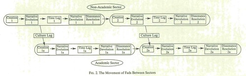

What do the following two artefacts say about learning analytics?

Perhaps I'm being just a bit too cynical.

### Horizon report predictions

The [NMC Horizon Reports](http://www.nmc.org/nmc-horizon/) are (Johnson et al, 2013)

> a comprehensive research venture established in 2002 that identifies and describes emerging technologies likely to have a large impact over the coming five years in education around the globe (p. 3)

Each year they list those technologies. The following table summarises the mentions of learning analytics as one of those "emerging technologies like to have a large impact...in education" from the annual Horizon Reports each year from 2009 through 2015

| Year | Time frame | Important developments in Ed Tec |
| --- | --- | --- |
| 2009 | n/a |  |
| 2010 | 4 to 5 years | Visual data analytics |
| 2011 | 4-5 years | Learning analytics |
| 2012 | 2-3 years | Learning analytics |
| 2013 | 2-3 years | Learning analytics |
| 2014 | One year or less (#2) | Learning analytics |
| 2015 | 4 to 5 years | Adaptive learning technologies |

### Birnbaum's fad cycle

The following image (click on it to see a larger version) is taken from Birnbaum (2000, p. 5) and describes Birnbaum's life cycle stages of the fad process in higher education. In particular, it shows his proposition that these fads enter higher education from a non-academic sector.

### References

Birnbaum, R. (2000). The Life Cycle of Academic Management Fads. The Journal of Higher Education, 71(1), 1–16.

Johnson, L., Adams Becker, S., Cummins, M., Estrada, V., Freeman, A., and Ludgate, H. (2013). Horizon Report: 2013 Higher Education Edition. Austin, Texas: The New Media Consortium.