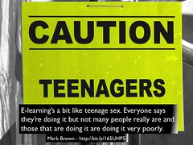

There are two versions of this talk.

1. A joint presentation by [Professor Peter Albion](http://peter.albion.id.au/) and I [gave in May 2015 at USQ](http://www.usq.edu.au/learning-teaching/USQSalon/JonesAlbion).This version of the talk combines and builds upon ideas from two papers co-written with [Damien Clark](https://damosworld.wordpress.com/) and [Amanda Heffernan](https://twitter.com/chalkhands).
    
    **Update:** [The video](https://vimeo.com/user10756933/review/128556038/dc36237ecc) of the session is available. Talk starts at about 4m30s.
2. A solo presentation that I gave at CSU as part of [a workshop on Learning Technology Innovation](http://uimagine.edu.au/portfolio/learning-technology-innovation/).

### Slides for CSU version

<iframe src="https://docs.google.com/presentation/d/e/2PACX-1vTk9P9av-Otxv2U-QlqYGwtookytVFlFm154cUxGYVarHWQPN5C9CcfKbeAiy-iRw/embed?start=false&amp;loop=false&amp;delayms=3000" frameborder="0" width="480" height="389" allowfullscreen="true" mozallowfullscreen="true" webkitallowfullscreen="true"></iframe>

### USQ version

Slides not available

## Abstract

    by  [David T Jones](https://www.flickr.com/people/david_jones/) 

The implementation of e-learning - defined by the OECD ([2005](http://www.oecd-ilibrary.org/education/e-learning-in-tertiary-education_9789264009219-en)) as the use of information and communications technology (ICT) to support and enhance learning and teaching - in universities has a problem. A problem perhaps best summed up by Professor Mark Brown ([Laxon, 2013](http://bit.ly/165UHP5))

> E-learning's a bit like teenage sex. Everyone says they're doing it but not many people really are and those that are doing it are doing it very poorly. (n.p).

E-learning's teenage sex problem is apparent at USQ with the perception that some academic staff are not as engaged with the use of learning technologies as they perhaps could be ([Sankey, 2015](http://www.linkedin.com/pulse/train-teacher-way-she-should-go-depart-michael-sankey)).

This is not a new problem. In a paper over 20 years ago Geoghagen ([1994](http://eprints.soton.ac.uk/260144/)) sought to explain why a three decade long "vision of pedagogical utopia" (n.p.) promised by instructional technologies had failed to eventuate. Given that "Australian universities have made very large investments in corporate educational technologies" ([Holt et al., 2013](http://www.ascilite.org.au/ajet/submission/index.php/AJET/article/view/84), p. 388) it would appear increasingly important to understand and address e-learning's on-going teenage sex problem.

    by  [David T Jones](https://www.flickr.com/people/david_jones/) 

This session will discuss and demonstrate both practical and theoretical perspectives of and solutions to the problem. The practical approaches and tools to be demonstrated have been applied successfully within USQ by individual and small groups of academics. Similar approaches and tools have also been used at CQUniversity to develop a strategic, learning analytics-enabled, student retention project.

The session will argue that the dominant deficit model of academic staff - perhaps best illustrated by the suggestion from the 2014 Horizon Report for Higher Education ([Johnson et al, 2014](http://www.nmc.org/publications/2014-horizon-report-higher-ed)) that the low digital fluency of faculty was the most significant challenge impeding higher education technology adoption - is less than helpful. Instead, the session will argue that e-learning's teenage sex problem arises from an inappropriate mindset, and a limited conception of knowledge and learning. The session will demonstrate how a different mindset and conception of knowledge and learning can help address e-learning's on-going teenage sex problem.

The session will build upon ideas from two earlier papers ([Jones and Clark, 2014](https://ascilite.org/conferences/dunedin2014/files/fullpapers/221-Jones.pdf); [Jones, Heffernan and Albion, 2015](http://www.editlib.org/p/150454/proceeding_150454.pdf))

 

# References

Geoghegan, W. (1994). [Whatever happened to instructional technology?](http://eprints.soton.ac.uk/260144/) Paper presented at the 22nd Annual Conference of The International Business Schools Computing Association. Baltimore, MD.

Holt, D., Palmer, S., Munro, J., Solomonides, I., Gosper, M., Hicks, M., Sankey, M., Allan, G., & Hollenbeck, R. (2013). Leading the quality management of online learning environments in Australian higher education. Australasian Journal of Educational Technology, 29(3), 387-402. Retrieved from [http://www.ascilite.org.au/ajet/submission/index.php/AJET/article/view/84](http://www.ascilite.org.au/ajet/submission/index.php/AJET/article/view/84)

Johnson, L., Adams Becker, S., Estrada, V., & Freeman, A. (2014). NMC Horizon Report: 2014 Higher Education Edition. Austin, Texas. Retrieved from [http://www.nmc.org/publications/2014-horizon-report-higher-ed](http://www.nmc.org/publications/2014-horizon-report-higher-ed)

Jones, D., Heffernan, A., & Albion, P. R. (2015). TPACK as shared practice: Toward a research agenda. In D. Slykhuis & G. Marks (Eds.), Proceedings of Society for Information Technology & Teacher Education International Conference 2015 (pp. 3287-3294). Las Vegas, NV: AACE. Retrieved from [http://www.editlib.org/p/150454/](http://www.editlib.org/p/150454/)

Jones, D., & Clark, D. (2014). Breaking BAD to bridge the reality/rhetoric chasm. In Rhetoric and Reality: Critical perspectives on educational technology. Proceedings ascilite Dunedin 2014 (pp. 262-272). Dunedin. Retrieved from [http://ascilite2014.otago.ac.nz/files/fullpapers/221-Jones.pdf](http://ascilite2014.otago.ac.nz/files/fullpapers/221-Jones.pdf)

Laxon, A. (2013, September 14). [Exams go online for university students](http://bit.ly/165UHP5). The New Zealand Herald.

OECD. (2005). E-Learning in Tertiary Education: Where do we stand? Paris, France: Centre for Educational Research and Innovation, Organisation for Economic Co-operation and Development. Retrieved from [http://www.oecd-ilibrary.org/education/e-learning-in-tertiary-education\_9789264009219-en](http://www.oecd-ilibrary.org/education/e-learning-in-tertiary-education_9789264009219-en)

Sankey, M. (2015). Train a teacher in the way s/he should go and s/he will not depart... Retrieved April 10, 2015, from [http://www.linkedin.com/pulse/train-teacher-way-she-should-go-depart-michael-sankey](http://www.linkedin.com/pulse/train-teacher-way-she-should-go-depart-michael-sankey)