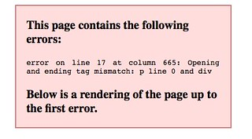

See also: [[blog-home | Home]]

One of the likely aims of the [Moodle "open" book project](/blog2/the-moodle-open-book-module-project/) that interested me was the ability to export Book modules to ePub format. A capability I think would be seen as valuable for students in my course, given the heavy use of the book module. In developing the Moodlemoot'AU 2015 [session on the project](https://mootau15.moodlemoot.org/mod/data/view.php?d=1&rid=126) this was certainly I've been trawling the Moodle community forums for discussions about the Book module. This type of function has been mentioned as desirable by others.

Then last night I stumble across [this post](https://moodle.org/mod/forum/discuss.php?d=315119) from Saturday in which someone has done it. Written some add-ons that will not only export in the ePub format, but also allow the import of ePub formats. Some [discussions in tracker](https://tracker.moodle.org/browse/MDL-37199) about this that I may wish to look at again later. What follows is some initial experiments with that code.

In summary, looks like it works very well and is very promising. The biggest problem is that it is very finicky about the HTML. Generating big red error boxes when the HTML (which works in the browser) doesn't meet it's standards. Could be very useful.

Wonder how difficult it would be in getting it installed on the institutional Moodle?

### Export

I'm going to start with the [export tool](https://moodle.org/plugins/view/booktool_exportepub) as that's my main interest. Instructions [here](http://lucidor.org/lucimoo/manual.php)

1. Download the zip file.
2. Install view Site Admin / Plugins...
    
    Being added as a "Tool" within the book. **note:** perhaps a model for other functions?
    
    No problems.
    
3. Test it with some of the EDC3100 books.
    
    Head into one of the EDC3100 books. And there is a new link under the "Book administration" menu - Download as ebook.
    
    Click on that link and an ePub file gets downloaded and opened in iBooks.
    
    Errors coming in terms of rendering. I'm assuming at the moment due to some of the HTML I've included.
    
    
    
    Yep, the problem is a bit of poor HTML. Appears that the ePub export tool is quite a bit stricter about HTML than a browser. **Suggestion:** meaning that some sort of warning about HTML issues with book chapters might be useful.
    

A copy of the epub file produced during testing can be [seen here](https://dl.dropboxusercontent.com/u/14025788/MoodleOpenBook/PKM%20and%20Reflection%20-%20fixed.epub), including a range of errors generated by less than stellar HTML.

Some points to ponder:

- The reliance on strict HTML is going to be a barrier to many, more support from the tools is required to reduce this barrier.
    
    Some ideas of the type of support might include:
    
    - Some way for the book module to analyse and highlight (or fix) problem HTML prior to export to ePub.
    - An option for the ePub export tool not to show the quite obvious errors.
        
        Some of the errors don't appear to impact display. It's the big red error box that impacts display. Being able to turn this off might be useful.
        
- Some thought will need to be given to video and other non-book content.
    
    Page 28 (in the ePub) I produced above has a YouTube video to play when viewed in Moodle. In the ePub there is nothing, no link, no image etc suggesting that the video should go there.
    
    The ePub does show links and other HTML, but not YouTube embeds. Automatically including something suggesting and linking to the video would be useful.
    
- Missing ToC
    
    A feature of the Moodle book in both it's online and print forms is that it produces a table of contents that helps navigation. The ePub export isn't producing a ToC. Could be useful.
    
- Bundling up multiple books into an ePub.
    
    As mentioned in [the presentation abstract](https://mootau15.moodlemoot.org/mod/data/view.php?d=1&rid=126) my course has 70+ books with 670+ chapters. One of the aims of the ePub export tool is to allow students to have offline copies of the books. At the moment the ePub export tool only works one book at a time. Meaning students would have to export each of the 70+ books individually.
    
    A tool that allows exporting collections of books to ePub - perhaps as a single ePub or as separate ePubs would be useful. e.g. the ability to export all the books in a topic (or a course) into a single ePub.
    
    This is the same sort of tool that would be useful if a book search tool was implemented. The ability to search within a single book, all books in a topic, or all books in a course.
    
- Confusion over "page" numbers.
    
    I can see the student questions now.
    
    > I'm having problems understanding the last sentence on page 52 of the PKM and reflection book. Help!!!
    
    While the student has been reading the ePub (hence page 52), I'm more than likely to be only using the Moodle based versions of the book. Creating some confusion as we have to translate back and forth between page numbers.
    
- Usability of the ePub format.
    
    I don't have any real experience using the ePub format. So I wonder how useful it will be for students. i.e. how many have software that can read iBooks on the various devices they want to use?