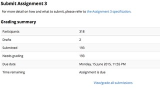
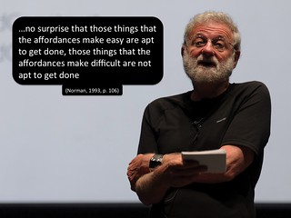
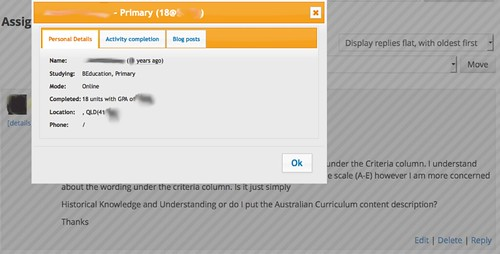

---
categories:
- 4paths
- bad
- elearning
date: 2015-06-16 10:55:59+10:00
next:
  text: Exploring BIM + sentiment analysis - what might it say about student blog
    posts
  url: /blog2/2015/06/16/exploring-bim-sentiment-analysis-what-might-it-say-about-student-blog-posts/
previous:
  text: Import/export ePubs into the Moodle book module
  url: /blog2/2015/06/15/importexport-epubs-into-the-moodle-book-module/
title: Types of e-learning projects and the problem of starvation
type: post
template: blog-post.html
comments:
    - approved: '1'
      author: u1011625
      author_email: U1011625@umail.usq.edu.au
      author_ip: 101.162.51.164
      author_url: http://u1011625.wordpress.com
      content: 'Hi David -
    
    
        Have just read your post (after thismornings exam haha). I am one of the non-submitters
        - unfortunately exam prep got on top of me, and these things happen. That being
        said, you are indeed the first lecturer in five years worth of study to send any
        sort of enquiry about late submittal of assessments. As while I did suppose it
        was an automated email, it''s still touching to know that you''ve taken the time
        and put yourself out there to a) acknowledge that we''re late (like a tacit behaviour
        management for adults, its a gentle WTF are you doing?) and b) offer assistance
        if required.
    
        I have enjoyed this course from an ICT point of view, as the content was indeed
        useful. However I believe that I have enjoyed this course now as a model of positive
        teacher behaviour. You;ve been inspiring the whole way through about keeping contact,
        actually reading student blogs, responding personally to queries (and sometimes
        rants), and I applaud you sir - it''s a big class, with a huge taskload, so cheers
        for the effort. thanks for showing us how it''s done.'
      date: '2015-06-16 11:27:15'
      date_gmt: '2015-06-16 01:27:15'
      id: '1326'
      parent: '0'
      type: comment
      user_id: '0'
    
pingbacks:
    - approved: '1'
      author: 'Import and the Book module: a case of knowledge loss? | The Weblog of (a)
        David Jones'
      author_email: null
      author_ip: 192.0.86.68
      author_url: https://davidtjones.wordpress.com/2015/07/18/import-and-the-book-module-a-case-of-knowledge-loss/
      content: '[&#8230;] Leading to questions of prioritisation, which inevitably leads
        to the problem of stavation. [&#8230;]'
      date: '2015-07-18 15:54:08'
      date_gmt: '2015-07-18 05:54:08'
      id: '1327'
      parent: '0'
      type: pingback
      user_id: '0'
    - approved: '1'
      author: The role of &#8220;coding&#8221; in learning and teaching | The Weblog of
        (a) David Jones
      author_email: null
      author_ip: 192.0.81.74
      author_url: https://davidtjones.wordpress.com/2015/08/18/the-role-of-coding-in-learning-and-teaching/
      content: '[&#8230;] reasons for learning how to code touch on what I&#8217;ve called
        the starvation problem with e-learning projects. Alex&#8217;s description was
        our developers work with the code. This is [&#8230;]'
      date: '2015-08-18 15:54:25'
      date_gmt: '2015-08-18 05:54:25'
      id: '1328'
      parent: '0'
      type: pingback
      user_id: '0'
    - approved: '1'
      author: 'University e-learning: Removing the context and adding the sediment | The
        Weblog of (a) David Jones'
      author_email: null
      author_ip: 192.0.81.171
      author_url: https://davidtjones.wordpress.com/2015/10/01/university-e-learning-removing-the-context-and-adding-the-sediment/
      content: '[&#8230;] not everyone can code. University e-learning systems currently
        have a starvation problem. That is, a range of projects that should get implemented
        can&#8217;t because there aren&#8217;t [&#8230;]'
      date: '2015-10-01 12:50:33'
      date_gmt: '2015-10-01 02:50:33'
      id: '1329'
      parent: '0'
      type: pingback
      user_id: '0'
    - approved: '1'
      author: 'Exploring &#8220;post adoptive usage&#8221; of the #moodle Book module
        &#8211; a draft proposal | The Weblog of (a) David Jones'
      author_email: null
      author_ip: 192.0.99.237
      author_url: https://davidtjones.wordpress.com/2015/11/06/exploring-post-adoptive-usage-of-the-moodle-book-module-a-draft-proposal/
      content: '[&#8230;] starved of attention.Since these are complex systems. Changing
        them is expensive. Thus only strategic changes can be [&#8230;]'
      date: '2015-11-06 15:39:48'
      date_gmt: '2015-11-06 05:39:48'
      id: '1330'
      parent: '0'
      type: pingback
      user_id: '0'
    - approved: '1'
      author: Extending a little thought experiment | The Weblog of (a) David Jones
      author_email: null
      author_ip: 192.0.99.213
      author_url: https://davidtjones.wordpress.com/2016/02/05/extending-a-little-thought-experiment/
      content: "[&#8230;] is the purpose for\_ which I&#8217;ve recently developed and\
        \ used an option similar to Wiley&#8217;s option [&#8230;]"
      date: '2016-02-05 12:41:59'
      date_gmt: '2016-02-05 02:41:59'
      id: '1331'
      parent: '0'
      type: pingback
      user_id: '0'
    - approved: '1'
      author: The nature of digital technology? Part 2 &#8211; The Weblog of (a) David
        Jones
      author_email: null
      author_ip: 192.0.100.241
      author_url: https://davidtjones.wordpress.com/2016/06/28/the-nature-of-digital-technology-part-2/
      content: "[&#8230;] who are in turn constrained by a hierarchical governance process.\
        \ A situation that might lead a problem of starvation where the priority is given\
        \ to\_ large-scale, institutional level changes, rather than changes [&#8230;]"
      date: '2016-06-28 11:38:31'
      date_gmt: '2016-06-28 01:38:31'
      id: '1332'
      parent: '0'
      type: pingback
      user_id: '0'
    - approved: '1'
      author: Design of a BAD approach to developing TPACK &#8211; The Weblog of (a) David
        Jones
      author_email: null
      author_ip: 192.0.118.74
      author_url: https://davidtjones.wordpress.com/2015/09/05/design-of-a-bad-approach-to-developing-tpack/
      content: '[&#8230;] A key vine that I&#8217;m interested in is the idea of &#8220;helper
        applications&#8221;. i.e. small scripts/applications that add value to the functionality
        of the current page/service. This idea is linked to the idea of the Reusability
        Paradox and the Starvation Problem of e-learning. [&#8230;]'
      date: '2016-07-01 08:24:24'
      date_gmt: '2016-06-30 22:24:24'
      id: '1333'
      parent: '0'
      type: pingback
      user_id: '0'
    - approved: '1'
      author: 'University digital technology: problems, causes, and suggested solutions
        &#8211; The Weblog of (a) David Jones'
      author_email: null
      author_ip: 192.0.116.169
      author_url: https://davidtjones.wordpress.com/2016/09/07/university-digital-technology-problems-causes-and-suggested-solutions/
      content: '[&#8230;] across the whole organisation (i.e. a digital technology that
        actually provides value) suffers from starvation. The resources to develop/approve
        a digital technology within an organisation are limited. [&#8230;]'
      date: '2016-09-07 13:08:46'
      date_gmt: '2016-09-07 03:08:46'
      id: '1334'
      parent: '0'
      type: pingback
      user_id: '0'
    
---
The last assignment for the course [EDC3100, ICT and Pedagogy](http://www.usq.edu.au/course/specification/2015/EDC3100-S1-2015-ONC-TWMBA.html) was due to be submitted yesterday. Right now the Moodle assignment activity (a version somewhat modified by my institution) is showing that 193 of 318 enrolled students have submitted assignments.

This is a story of the steps I have to take to respond to the story these figures (they're not as scary as they seem) tell.

It's also a story about the different types of development projects that are required when it comes to institutional e-learning and how the institutional approach to implementing e-learning means that certain types of these projects are inevitably starved of attention.

### Don't forget the extensions

193 out of 318 submitted suggests that almost 40% of the students in the course haven't submitted the final assignment. What this doesn't show is that a large number of extensions have been granted. Would be nice for that information to appear on the summary shown above. To actually identify the number of extensions that have been granted, I need to

1. Click on the "View/grade all submissions" link (and wait for a bit).
2. Select "Download grading worksheet" from a drop down box.
3. Filter the rows in the worksheet for those rows containing "Extension granted" (sorting won't work)

This identifies 78 extensions. Suggesting that just under 15% (48) of the students appear to have not submitted on time.

### Getting in contact with the non-submits

I like to get in contact with these students to see if there's any problem. If you want some support for this practice the #1 principle of the ["7 Principles of Good Practice for Undergraduate Education"](http://www.aahea.org/articles/sevenprinciples1987.htm) is

> 1\. Encourages Contact Between Students and Faculty Frequent student-faculty contact in and out of classes is the most important factor in student motivation and involvement. Faculty concern helps students get through rough times and keep on working.

Since my students are spread across the world (see the image to the right) and the semester ended last week, a face-to-face chat isn't going to happen. With 48 students to contact I'm not feeling up to playing phone tag with that number of students. I don't have easy access to the mobile phone numbers of these students, nor do I have access to any way to send text messages to these students that doesn't involve the use of my personal phone. An announcement on the course news forum doesn't provide the type of individual contact I'd prefer and there's a question about how many students would actually see such an announcement (semester ended last week).

This leaves email as the method I use. The next challenge is getting the email addresses of the students who haven't submitted AND don't have extensions.

The Moodle assignment activity provides a range of ways to filter the list of all the students. One of those filters is "Not submitted". The problem with this filter is that there's no way (I can see) to exclude those that have been given an extension. In this case, that means I get a list of 126 students. I need to ignore 78 of these and grab the email addresses of 48 of them.

Doing this manually would just be silly. Hence I save the web pages produced by the Moodle assignment activity onto my laptop and run a Perl script that I've written which parses the content and displays the names and email addresses of the students without extensions.

Another approach would have been to use the grading worksheet (a CSV file) I used above. But I've gone down the HTML parsing route because I've already got a collection of Perl scripts parsing Moodle HTML files due to a range of other screen scraping tasks I've been doing for other reasons.

### Excluding the won't submits

I now have the list of students who haven't submitted and don't have extensions. But wait, there's more. There are also some students I know who will, for a variety of reasons, never submit. If possible, I'd prefer not to annoy them by sending them an email about them not submitting Assignment 3.

This information is not in any database. It's mostly a collection of email messages from various sources stored in the massive 2Gb of space the institution provides for email. I have to manually search through those to find the "won't submits".

### Send the email

Now it's time to send the email. In a perfect world I would like to send a personalised email message. A message that includes the student's name and perhaps other details about their participation in the course. Moodle doesn't appear to [provide an email merge facility](/blog2/2010/05/28/one-potential-approach-to-provide-a-moodle-email-merge-facility/). In theory Office provides some functionality this way but I use a Mac and the Office stuff never seems to work easily on the Mac (and I'm biased against Office).

So I don't send out a personalised email. Just the one email message to these specific students but with only generic content. Many still appear to appreciate the practice. For example, this is a response from one of the students who received one of these emails for a prior assignment (emphasis added)

> Thank you for contacting me in regards to the submission. _You're the first staff member to ever do that so I appreciate this a lot_.

### Some questions

Which makes me wonder how many teaching staff do something like this? Why/why not?

Of the staff who don't do this, is that because

1. They don't think it's important or appropriate for their course?
2. They've never thought of doing it?
3. It's too difficult to do?

And, if it were easier, would they do it? What impact might this have?

Moodle is an open source project used by huge numbers of institutions across the world. In addition, over the last year or so my institution has spent some time [customising the Moodle assignment activity](https://mootau15.moodlemoot.org/mod/data/view.php?d=1&rid=339). I'm fairly certain that I'm not the first person using Moodle to have wanted to contact students who haven't submitted.

So why all the limitations in the affordances of the Assignment activity?

### Types of e-learning projects

In some discussions with @beerc and @damoclarky we've identified five separate types of e-learning projects that an institution faces.

1. External/system driven projects.
    
    Projects that have to be done because of changes in the external environment. e.g. there's a new version of Moodle and we need to roll that out or we'll fall behind and be running a non-supported version.
    
2. Strategic projects approved by the institution.
    
    The institution has decided that a project is important and should be funded and used by the entire institution. e.g. the decision my institution made to modify [the Moodle assignment activity](https://mootau15.moodlemoot.org/mod/data/view.php?d=1&rid=339) in order to transition from a locally built system and not lose functionality.
    
    **Note:** there's a line here between these projects and those below. Typically projects above this line are those that will be used by all (or perhaps most) of the institution.
    
3. Projects that might scale, but waiting for them to happen creates problems.
    
    This is where parts of the institution recognise that there is a problem/need (e.g. the story above) that might scale to the entire institution. But the problem/need has not yet made it across the line above into a strategic project. Meaning that there is a period of time when people know they want to do something, but can't. They have to wait for the scarce resources of the institution to be allocated.
    
    In these situations, a few people don't wait. They develop workarounds like the above. If the need is particularly important, everyone develops their workarounds. Leading to large inefficiencies as the solution is re-created in numerous different ways.
    
4. Projects that will only ever be of interest to a program or a particular set of courses.
    
    For example, all the courses in the Bachelor of Education might benefit from a [single page application](https://en.wikipedia.org/wiki/Single-page_application) lesson template that is integrated with the Australian Curriculum. This isn't something that any other set of courses is going to desire. But it's possibly of great importance to the courses that do.
    
5. Course or pedagogical design specific projects.
    
    These are projects that are specific to a particular pedagogical design. Perhaps unique to a single course. e.g. the ["more student details" Greasemonkey script](/blog2/2014/11/13/adding-more-student-information-to-a-moodle-course/) (see more recent screenshot below) that I've implemented for EDC3100. The pedagogical design for this course makes use of both Moodle's [activity completion facility](https://docs.moodle.org/29/en/Activity_completion) and the [BIM module](https://moodle.org/plugins/view/mod_bim).
    
    I'm willing to bet large amounts of money that my course is currently the only course that uses this particular combination. This specific version of the tool is unlikely to be valuable to other people. It won't scale (though the principles behind it might). There's no point in trying to scale this tool, but it provides real benefit to me and the students in my course.
    

### The problem of starvation

If you ask any University IT Director they will complain about the fact that they don't have sufficient resources to keep existing systems running and effectively deal with project types #1 and #2 from the list above. The news is even worse for project types 3, 4 and 5.

#5 projects never get implemented at the institutional level. They only ever get done by "Freds-in-the-shed" like me.

#4 projects might get implemented at the institutional level, but typically only if the group of courses the project is for has the funds. If your degree has small numbers, then you're probably going to have to do it yourself.

#3 projects might get implemented at the institutional level. But that does depend on the institution become aware of and recognising the importance of the project. This can take a loooong time, if at all. Especially if the problem requires changes to a system used by other institutions. If it's a commercial system it may never. But even with an open source system (like Moodle) it can take years. For example, Costello (2014) says the following about a problem with the Quiz system in Moodle (p. 2)

> Despite the community reporting the issue to the Moodle developers, giving multiple votes for its resolution and the proposal of a fix, the issue had nonetheless languished for years unfixed.

and (p. 1)

> Applying this patch to DCU’s own copy of Moodle was not an option for us however, as the University operated a strict policy of not allowing modifications, or local customisations, to its Moodle installation. Tinkering with a critical piece of the institutional infrastructure, even to fix a problem, was not an option.

### Ramifications

I suggest that there are at least four broad results of this starvation of project types 3, 4 and 5

1. The quality of e-learning is constrained.
    
    Without the ability to implement projects specific to their context, people bumble along with systems that are inappropriate. The systems limit the quality of e-learning.
    
2. Feral or shadow systems are developed.
    
    The small number of people who can, develop their own solutions to these projects.
    
3. Wasted time.
    
    The people developing these solutions are typically completing tasks outside their normal responsibilities. They are wasting their time. In addition, because these systems are designed for their own particular contexts it is difficult to share them with other people who may wish to use them. Either because other people don't know that they exist, or because they use a unique combination of technologies/practices no-one else uses. This is a particular problem for project types 3 and 4.
    
4. Lost opportunity for innovation and strategic advantage.
    
    Some of these project types have the potential to be of strategic advantage, but due to their feral nature they are never known about or can't be easily shared.
    

### So what?

My argument is that if institutions want to radically improve the quality of their e-learning, then they have to find ways to increase the capacity of the organisation to support all five project types. It's necessary to recognise that supporting all five project types can't be done by using existing processes, technologies and organisational structures.

### Responses

I sent the email to the students who hadn't submitted Assignment 3 at 8:51 this morning. It's just over two hours later. In that time, 8 of the 36 students have responded.

### References

Costello, E. (2014). Participatory Practices in Open Source Educational Software : The Case of the Moodle Bug Tracker Community. University of Dublin. Retrieved from http://www.tara.tcd.ie/handle/2262/71751

Norman, D. A. (1993). Things that make us smart: defending human attributes in the age of the machine. Cambridge, Mass: Perseus. Reading, MA: Addison Wesley.