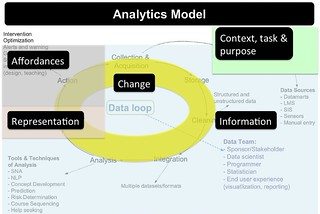

The Moodlemoot'AU 2015 conference is running [working groups](https://mootau15.moodlemoot.org/mod/page/view.php?id=108) one of which is looking at assessment analytics. In essence, trying to think about what can be done in the Moodle LMS code to enhance assessment.

As it happens I'm giving a talk during the Moot titled ["Four paths for learning analytics: Moving beyond a management fashion"](https://mootau15.moodlemoot.org/mod/data/view.php?d=1&rid=124). The aim of the talk is to provide some insights to help people think about the design and evaluation of learning analytics. The working seems like a good opportunity to (at some level) "eat my own dogfood" and fits with my current task of developing the presentation.

As part of getting ready for the presentation, I need to revisit the IRAC framework. A bit of work from 2013 that we've neglected, but which (I'm surprised and happy to say) I think holds much more promise than I may have thought. The following explains IRAC and what insights might be drawn from it. A subsequent post will hopefully apply this more directly to the task of Moodle assessment analytics.

(Yes, Col and Damien, I have decided once again to drop the P and stick with IRAC).

### The IRAC Framework

Originally developed to "improve the analysis and design of learning analytics tools and interventions" and hopefully be "a tool to aid the mindful implementation of learning analytics" ([Jones, Beer, Clark, 2013](/blog2/2013/10/03/the-irac-framework-locating-the-performance-zone-for-learning-analytics/)). The development of the framework drew upon "bodies of literature including Electronic Performance Support Systems (EPSS) (Gery, 1991), the design of cognitive artefacts (Norman, 1993), and Decision Support Systems (Arnott & Pervan, 2005).

This was largely driven by our observation that most of the learning analytics stuff wasn't that much focused on whether or not it was actually adopted and used, especially by teachers. The EPSS literature was important because an EPSS is meant to embody a "perspective on designing systems that support learning and/or performing” (Hannafin, McCarthy, Hannafin, & Radtke, 2001, p. 658). EPSS are computer-based systems intended to “provide workers with the help they need to perform certain job tasks, at the time they need that help, and in a form that will be most helpful” (Reiser, 2001, p. 63).

Framework is probably not the right label.

IRAC was conceptualised as four questions to ask yourself about the learning analytics tool you were designing or evaluating. As outlined in Jones et al (2013)

> The IRAC framework is intended to be applied with a particular context and a particular task in mind. A nuanced appreciation of context is at the heart of mindful innovation with Information Technology (Swanson & Ramiller, 2004). Olmos & Corrin (2012), amongst others, reinforce the importance for learning analytics to start with “a clear understanding of the questions to be answered” (p. 47) or the task to be achieved.

Once you've got your particular context and task in mind, then you can start thinking about these four questions:

1. Is all the relevant _**I**nformation_ and only the relevant information available?
2. How does the _**R**epresentation_ of the information aid the task being undertaken?
3. What _**A**ffordances_ for interventions based on the information are provided?
4. How will and who can _**C**hange_ the information, representation and the affordances?

### The link with the LA literature

Interestingly, not long after we'd submitted the paper for reviewing, Siemens (2013) came out and that paper included the following Learning Analytics (LA) Model (LAM) (click on the image to see a larger version). LAM was meant to help move LA from small scale "bottom-up" approaches into a more systemic and institutional approach. The "data team" was given significant emphasis in this.

 Learning Analytics Model by David Jones, on Flickr")

Hopefully you can see how the Siemens' LAM and the IRAC framework, at least on the surface, seem to cover much of the same ground. In case you can't, the following image (click on it to see a larger version) makes that connection explicit.

### Gathering insights from IRAC and LAM

The [abstract for the Moot presentation](https://mootau15.moodlemoot.org/mod/data/view.php?d=1&rid=124) promises insights so let's see what insights you might gain from IRAC. The following is an initial list of potential insights. Insights might be too strong a word. Provocations or hypothesis might be better suited.

1. An over emphasis on **I**nformation.
    
    When overlaying IRAC onto the LAM the most obvious point for me is the large amount of space in the LAM dedicated to **I**nformation. This very large focus on the collection, acquisition, storage, cleaning, integration, and analysis of information is not all that surprising. After all that is what big data and analytics bring to the table. The people who developed the field of learning analytics came to it with an interest in information and its analysis. It's important stuff. But it's not sufficient to achieve the ultimate goal of learning analytics, which is captured in the following broadly used definition (emphasis added)
    
    > Learning analytics is the measurement, collection, analysis and reporting of data about learners and their contexts, for purposes of understanding and _optimising_ learning, and the environments in which it occurs.
    
    The point of learning analytics is to find out more about learning and the learning environment and change it for the better. That requires action. Action on part of the learner, the teacher, or perhaps the institution or other actors. There's a long list of literature that strongly argues that simply providing information to people is not sufficient for action.
    
2. Most of the **i**nformation currently available is of limited value.
    
    In not a few cases, "big data is driven more by storage capabilities than by superior ways to ascertain useful knowledge" (Bollier & Firestone, 2012, p. 14). There have been questions asked about how much the information that is currently captured by LMSes and other systems can actually "contribute to the understanding of student learning in a complex social context such as higher education” (Lodge & Lewis, 2012, p. 563). Click streams reveal a lot about when and how people traverse e-learning environments, but not why and with what impacts. Beyond that is the problem raised by observations that the use of e-learning by most courses does not make particularly heavy or well-designed use of the learning environment.
    

4. Don't stop at a dashboard (**R**epresentation).
    
    It appears that most people think that if you've generated a report or (perhaps worse) a dashboard you have done your job when it comes to learning analytics. This fails on two parts.
    
    First, these are bad **r**epresentations. Reports and many dashboards are often pretty crappy at helping people understand what is going on. Worse, these are typically presented outside of the space where the action happens. Breaking the goal of an an information system/EPSS i.e. "provide workers with the help they need to perform certain job tasks, at the time they need that help, and in a form that will be most helpful" (Reiser, 2001, p. 63).
    
    Second, just providing data in a pretty form is not sufficient. You want people to do something with the information. Otherwise, what's the point? That's why you have to consider the **a**ffordances question.
    
5. Change is never considered.
    
    At the moment, most "learning analytics" projects involve installing a system, be it stand alone or part of the LMS etc. Once it's installed it's all just a better of ensuring people are using it. There's actually no capacity to change the system or the answers to the I, R, or A questions of IRAC that the system provides. This is a problem on so many levels.
    
    In the original [IRAC paper](/blog2/2013/10/03/the-irac-framework-locating-the-performance-zone-for-learning-analytics/) we mentioned: how development through continuous action cycles involving significant user participation was a core of the theory of decision support systems (Arnott & Pervan, 2005) a pre-cusor to learning analytics; Buckingham-Shum's (2012) observation that most LA is based on data already being captured by systems and that analysis of that data will perpetuate existing dominant approaches to learning; the problem of gaming once people learn what the system wants. Later we added the [task artifact cycle](https://www.interaction-design.org/encyclopedia/task_artifact_cycle.html).
    
    More recently (Macfadyen et al 2014) argue that one of the requirements of learning analytics tools is an integrated and sustained overall refinement procedure allowing reflection" (p. 12).
    
6. The more context sensitive the LA is, the more value it has.
    
    In talking about the use of the SNAPP tool to visualise connections in discussion forums, Lockyer et al (2013) explain that the "interpretation of visualizations also depends heavily on an understanding the context in which the data were collected and the goals of the teacher regarding in-class interaction" (p. 1446). The more you know about the learning context, the better the insight you can draw from learning analytics. An observation that brings the [reusability paradox](http://cnx.org/contents/dad41956-c2b2-4e01-94b4-4a871783b021@19/The_Reusability_Paradox) into the picture. Most LA - especially those designed into an LMS - have to be designed to have the potential to be reused across all of the types of institutions that use the LMS. This removes the LMS (and its learning analytics) away from the specifics of the context, which reduces its pedagogical value.
    
7. Think hard about providing and enhancing **a**ffordances for intervention
    
    Underpinning the IRAC work is the work of Don Norman (1993), in particular the quote in the image of him below. If LA is all about optimising learning and the learning environment then the LA application has to make it easy for people to engage in activities designed to bring that goal about. If it's hard, they won't do it. Meaning all that wonderfully complex algorithmic magic is wasted.
    
    Macfadyen et al (2014) identify facilitating the deployment of interventions that lead to change to enhance learning as a requirement of learning analytics. Wise (2014) defines learning analytics intervention "as the surrounding frame of activity through which analytics tools, data and reports are taken up and used". An area of learning analytics that is relatively unexplored (Wise, 2014) and I'll close with another quote from Wise (2014) which sums up the whole point of the IRAC framework and identifies what I think is the really challenging problem for LA
    
    > If learning analytics are to truly make an impact on teaching and learning and fulfill expectations of revolutionizing education, we need to consider and design for ways in which they will impact the larger activity patterns of instructors and students. (Wise, 2014, 203)
    
    (and I really do need to revisit the Wise paper).
    

### References

Arnott, D., & Pervan, G. (2005). A critical analysis of decision support systems research. Journal of Information Technology, 20(2), 67–87. doi:10.1057/palgrave.jit.2000035

Bollier, D., & Firestone, C. (2010). The promise and peril of big data. Washington DC: The Aspen Institute. Retrieved from http://india.emc.com/collateral/analyst-reports/10334-ar-promise-peril-of-big-data.pdf

Buckingham Shum, S. (2012). Learning Analytics. Moscow. Retrieved from http://iite.unesco.org/pics/publications/en/files/3214711.pdf

Hannafin, M., McCarthy, J., Hannafin, K., & Radtke, P. (2001). Scaffolding performance in EPSSs: Bridging theory and practice. In World Conference on Educational Multimedia, Hypermedia and Telecommunications (pp. 658–663). Retrieved from http://www.editlib.org/INDEX.CFM?fuseaction=Reader.ViewAbstract&paper\_id=8792

Gery, G. J. (1991). Electronic Performance Support Systems: How and why to remake the workplace through the strategic adoption of technology. Tolland, MA: Gery Performance Press.

Jones, D., Beer, C., & Clark, D. (2013). The IRAC framwork: Locating the performance zone for learning analytics. In H. Carter, M. Gosper, & J. Hedberg (Eds.), Electric Dreams. Proceedings ascilite 2013 (pp. 446–450). Sydney, Australia.

Lockyer, L., Heathcote, E., & Dawson, S. (2013). Informing Pedagogical Action: Aligning Learning Analytics With Learning Design. American Behavioral Scientist, 57(10), 1439–1459. doi:10.1177/0002764213479367

Lodge, J., & Lewis, M. (2012). Pigeon pecks and mouse clicks : Putting the learning back into learning analytics. In M. Brown, M. Hartnett, & T. Stewart (Eds.), Future challenges, sustainable futures. Proceedings ascilite Wellington 2012 (pp. 560–564). Wellington, NZ. Retrieved from http://www.ascilite2012.org/images/custom/lodge,\_jason\_-\_pigeon\_pecks.pdf

Macfadyen, L. P., Dawson, S., Pardo, A., & Gasevic, D. (2014). Embracing big data in complex educational systems: The learning analytics imperative and the policy challenge. Research and Practice in Assessment, 9(Winter), 17–28.

Norman, D. A. (1993). Things that make us smart: defending human attributes in the age of the machine. Cambridge, Mass: Perseus. Reading, MA: Addison Wesley.

Olmos, M., & Corrin, L. (2012). Learning analytics: a case study of the process of design of visualizations. Journal of Asynchronous Learning Networks, 16(3), 39–49. Retrieved from http://ro.uow.edu.au/medpapers/432/

Reiser, R. (2001). A history of instructional design and technology: Part II: A history of instructional design. Educational Technology Research and Development, 49(2), 57–67.

Siemens, G. (2013). Learning Analytics: The Emergence of a Discipline. American Behavioral Scientist, 57(10), 1371–1379. doi:10.1177/0002764213498851

Swanson, E. B., & Ramiller, N. C. (2004). Innovating mindfully with information technology. MIS Quarterly, 28(4), 553–583.

Wise, A. F. (2014). Designing pedagogical interventions to support student use of learning analytics. In Proceedins of the Fourth International Conference on Learning Analytics And Knowledge - LAK ’14 (pp. 203–211). doi:10.1145/2567574.2567588