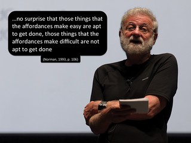

See also: [[blog-home | Home]]

I started playing around with what became learning analytics in 2007 or so. Since then every/any time "learning analytics" is mentioned in a university there's almost an automatic mention of dashboards. So much so I was lead to tweet.

https://twitter.com/djplaner/status/610769509394182144

I've always thought dashboards suck. This morning when preparing the slides for [this talk](http://bit.ly/4pathsTalk) on learning analytics I came across an explanation which I think captures my discomfort around dashboards (I do wonder whether I'd heard it somewhere else previously).

### What is a dashboard

In the context of an Australian university discussion about learning analytics the phrase "dashboard" is typically mentioned by the folk from the business intelligence unit. The folk responsible for the organisational data warehouse. It might also get a mention from the web guru who's keen on Google Analytics. In this context a dashboard is typically a collection of colourful charts, often even doing a good job of representing important information.

So what's not to like?

### The broken metaphor

Obviously "analytics" dashboards are a metaphor referencing the type of dashboard we're familiar with in cars. The problem is that many (most?) of the learning analytics dashboards are conceptualised and designed like the following dashboard.

  
   by  [Paul Jerry](https://www.flickr.com/people/paj/) 

The problem is that this conceptualisation of dashboards misses the bigger picture. Rather than being thought of like the above dashboard, learning analytics dashboards need to be thought of as like the following dashboard.

  
   by  [Simon Collison](https://www.flickr.com/people/collylogic/) 

Do you see the difference? (and it's not the ugly, primitive nature of the graphical representation in the second dashboard).

### Representation without Affordances and removed from the action

The second dashboard image includes: the accelerator, brake, and clutch pedals; the steering wheel; the indicators; the radio; air conditioning; and all of the other interface elements a driver requires to do something with the information presented in the dashboard. All of the [affordances](https://en.wikipedia.org/wiki/Affordance) a driver requires to drive a car.

The first dashboard image - like many learning analytics dashboards - provides no affordances for action. The first vision of a dashboard doesn't actually help you do anything.

What's worse, the dashboards provided by most data warehouses aren't even located within the learning environment. You have to enter into another system entirely, find the dashboard, interpret the information presented, translate that into some potential actions, exit the data warehouse, return to the learning environment, translate those potential actions into the affordances of the learning environment.

Picking up on the argument of Don Norman (see quote in image below), the difficulty of this process would seem likely to reduce the chances of any of those potential actions being taken. Especially if we're talking about (casual) teaching staff working within a large course with limited training, support and tools.

### Affordances improve learning analytics

Hence, my argument is that the dashboard (Representation) isn't sufficient. In designing your learning analytics application you need to include the pedals, steering wheel etc (Affordances) if you want to increase the likelihood of that application actually helping improve the quality of learning and teaching. Which tends to suggest that your learning analytics application should be integrated into the learning environment.