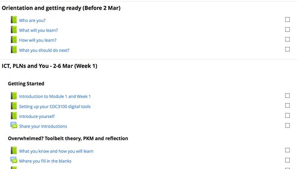
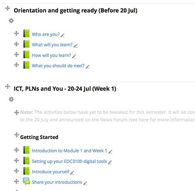

---
categories:
- edc3100
- moodle
date: 2015-06-26 14:12:49+10:00
next:
  text: Re-building results processing
  url: /blog/2015/07/01/re-building-results-processing/
previous:
  text: 'Dashboards suck: learning analytics&#039; broken metaphor'
  url: /blog/2015/06/24/dashboards-suck-learning-analytics-broken-metaphor/
title: And the little one said, "roll over, roll over"
type: post
template: blog-post.html
comments:
    - approved: '1'
      author: iancreid
      author_email: iancreid@internode.on.net
      author_ip: 150.101.72.73
      author_url: http://users.on.net/~iancreid/
      content: Surely the simplest solution here is to do what Distance Educators have
        always done - make sure your study materials can stand-alone (eg refer to week
        numbers , but not dates) and use 'course information' to update that with week
        dates, holidays, assessment due dates, etc? I realise its a bit more complicated
        than that in the online environment, and it would be nice to have it 'auto-update',
        but surely its the easiest way forward??
      date: '2015-06-30 16:30:27'
      date_gmt: '2015-06-30 06:30:27'
      id: '1340'
      parent: '0'
      type: comment
      user_id: '0'
    - approved: '1'
      author: David Jones
      author_email: davidthomjones@gmail.com
      author_ip: 101.179.31.1
      author_url: https://djon.es/blog/
      content: 'I don''t think it''s any surprise that I see elements of <a href="http://cnx.org/contents/dad41956-c2b2-4e01-94b4-4a871783b021@19"
        rel="nofollow">the reusability paradox</a> in this.  Not to mention the idea that
        digital technologies are meant to protean/flexible/mutable. And add in the whole
        EPSS idea of systems that provide people the information they need at the point
        they need it. Or to borrow a sentiment from Dave Snowden - you shouldn''t have
        to reshape your hand to use a tool.
    
    
        As I work at an institution that has personalised learning as one of the themes
        of <a href="http://www.usq.edu.au/about-usq/about-us/plans-reports/strategic-plan"
        rel="nofollow">its 2022 vision</a>, it would seem logical that we''d at least
        be able to personalise the weeks/due dates to the semester when students are studying
        the course.  That would seem to be at the very simple end of "personalisation".
    
    
        Of course, one of the problems at my institution is that you can''t use week numbers.  Depending
        on when the holidays fall within a semester, the weeks change when you''d cover
        a particular topic.  To give CQU it''s due, at least it didn''t include the holidays
        in the official weeks.  Made <a href="http://webfuse.cqu.edu.au/Courses/2009/T1/COIS20025/Study_Schedule/"
        rel="nofollow">creating (automated) study schedules</a> so much easier.'
      date: '2015-06-30 17:06:17'
      date_gmt: '2015-06-30 07:06:17'
      id: '1341'
      parent: '1340'
      type: comment
      user_id: '1'
    
pingbacks:
    - approved: '1'
      author: 'Re-using a #moodle course design | The Weblog of (a) David Jones'
      author_email: null
      author_ip: 192.0.101.147
      author_url: https://davidtjones.wordpress.com/2015/07/04/re-using-a-moodle-course-design/
      content: '[&#8230;] it stands each topic does have a formal title meaning it&#8217;s
        probably valuable to make use of the macro facility I&#8217;m using in [&#8230;]'
      date: '2015-07-04 16:26:01'
      date_gmt: '2015-07-04 06:26:01'
      id: '1342'
      parent: '0'
      type: pingback
      user_id: '0'
    - approved: '1'
      author: Possible sources of an institution&#8217;s e-learning content problems |
        The Weblog of (a) David Jones
      author_email: null
      author_ip: 192.0.82.151
      author_url: https://davidtjones.wordpress.com/2015/08/13/possible-sources-of-an-institutions-e-learning-content-problems/
      content: '[&#8230;] implemented a kludge macro system, but Moodle has a functionality
        called filters that could be used to achieve the same end with some [&#8230;]'
      date: '2015-08-13 10:19:08'
      date_gmt: '2015-08-13 00:19:08'
      id: '1343'
      parent: '0'
      type: pingback
      user_id: '0'
    
---

It's that time of year again. The time between semesters when one offering of [the main course](http://www.usq.edu.au/course/specification/2015/EDC3100-S1-2015-WEB-TWMBA.html) I teach is still drawing to a close and when I have to think about preparing for the next offering. It's time - for better or worse - to roll over. The following is a description and some thoughts on how and what I do during roll over.

As it happens there is [some discussion going on](http://tabitharoder.blogspot.co.nz/2015/06/imoot15-and-mootau15.html) in the Moodle community about "roll over", but at the institutional level. The following is very much focused on the course level.

### The process

The high level steps I use are:

1. Use the Moodle/institutional roll over process.
2. Update my "macros".
3. Check for broken links.
4. Other manual changes

Overall, the tools provided by the institution to roll over a course from one semester to the next do a reasonable job. However, if you have a fair amount of structure and content to a course site there is a hole. The tools don't yet know enough about the institutional context (dates, weeks). Nor is this information provided in a way that helps teaching staff integrate the information in a way that responds to those changes. The problem gets worse the more you get into the unique course context (e.g. names of weekly topics).

### Moodle/institutional roll over

I log an IT request (using a god awful interface) and in a little while some magic happens and the content from Semester 1 (S1) is copied into the Semester 2 (S2) course. The image below (click on it to see it larger) is of the newly rolled over S2 course site. As it shows - for better or worse - the course has quite a collection of resources that make up each weekly learning path (originally called and based on the idea of a [weekly ramble](/blog/2012/02/19/designing-the-weekly-ramble/)). The interconnections between each of the elements is quite convoluted. e.g. the "Introduce yourself" book links to the "Share your introductions" discussion forum and vice versa.

The Moodle/institutional roll over process does a really good job of updating the interconnections between elements. This is good.

But there's a problem. Can you see the problem in the following image?

Semester 2 runs from late July through to October/November. The dates in the above image are different. They are for Semester 1. The Moodle roll over process doesn't know anything about USQ dates. This causes problems because dates are littered throughout the course site. Such as the [assessment overview page](https://www.flickr.com/photos/david_jones/18543806373/), each [individual assignment page](https://www.flickr.com/photos/david_jones/19164401855/), the [study schedule](https://www.flickr.com/photos/david_jones/18543805803/), and any of [the learning path pages](https://www.flickr.com/photos/david_jones/18976768220/) that mention dates.

The suggestion is that I need to manually search (remember there's typically no search engine on a Moodle course site) and replace all occurrences of dates and any other information that may change from offering to offering. Information that might include:

- the details of the teaching staff; e.g. the assessment information contains directions to "email [the course examiner](mailto:)" with extension requests. Who is the course examiner may change from offering to offering.
- names of weeks/topics; and In the above image, week 1 goes under the title "ICT, PLNs and You". I may wish to change that topic name in Semester 2 (e.g. add in the missing comma "ICT, PLNs, and You") and the course material uses the topic names throughout.
- the weeks of the semester for each topic. For some historical reason, when it numbers the weeks of semester my institution includes weeks that are holidays in the count. Since holidays are never at the same time each semester, it means for some topics their week of semester changes. In Semester 1, the "Finishing your UoW" topic is in Week 8. In semester 2, it will be Week 6.

### "Macros" - my solution to this problem

Last semester I implemented [a "macro" system](/blog/2015/02/03/concrete-lounge-1-helping-learners-find-correct-up-to-date-course-information/#macro). Initial implementation had it working just for the semester 1 site. Time to update it to work with both sites. The Javascript code will no need to

1. Identify which course site (S1 or S2) the user is viewing.
2. Replace all the "macro" variables with values appropriate to the course site.

What I need to do know is enter appropriate information for the new offering, this includes

- links to books within the course site;
    
    Assessment, study schedule etc.
    
- Assignment due date - course profile.
- Professional experience dates - PE calendar
- Weeks and dates - academic calendar. This also involves moving the holidays and week numbers around.

With the script updated viewing the S2 course site now reveals the following. Dates and weeks updated.

### Broken links

The institution has a "check course" tool that performs a range of checks. Problems it picked up in the newly rolled over course included

- Cross-course references
- Reference to missing activity

22 problems were identified, all to be fixed manually. Most were due to the tweaking of paths I did last semester which broke links.

### Other manual changes

**Teaching team details** - need to remove the folk who aren't teaching in S2. The institutional system for "teaching team" does this automatically, but it has some missing functionality, including

- No space to add a "Advice on specific request" section. i.e. when students are looking for how to contact the teaching team, they often want to ask the same question. A section like this allows some additional advice and scaffolding.
- No space for "personalisation". The institutional version only offers the standard contact details and qualification information that is present in the institutional database. It doesn't allow a staff member to personalise their part of the course site. e.g. to explain exactly what they do in the course and more importantly take a small step in creating a relationship with the students.

**Week order for study schedule and "jump to"** - the change in week numbers for specific topics needs to be manually adjusted. That's done, but a problem

### Build the scaffolds

A number of the activities are based around discussion forums. Students have to complete an activity and share the end result in a forum. Many of these includes example responses (often only seen after the student posts their response). Most of these come from other students in the offering, but a small number are provided by me. I need to manually copy these over from the last offering.

But it appears that the institutional SSO is playing silly buggers. Will have to complete that task later.