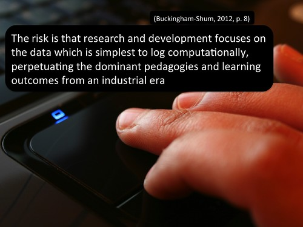
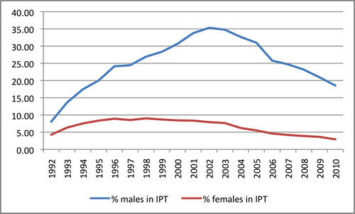

---
categories:
- eds4406
- ipt
date: 2015-07-09 08:40:18+10:00
next:
  text: "\"Digital learning: It's d\xE9j\xE0 vu all over again\""
  url: /blog2/2015/07/12/digital-learning-its-like-deja-vu-all-over-again/
previous:
  text: Does branding the LMS hurt learning
  url: /blog2/2015/07/07/does-branding-the-lms-hurt-learning/
title: '"Female/male participation rates in IT: an example of what''s easy to log??"'
type: post
template: blog-post.html
---
There's an identified problem with learning analytics captured by the quote from Buckingham-Shum in the image below (the image is from [a presentation](http://www.slideshare.net/davidj/four-paths-for-learning-analytics-moving-beyond-a-management-fashion) I gave yesterday on learning analytics, so my head is in that space). In the case of learning analytics that data that is easy to capture is generally mouse clicks. The number of times a learner clicks on a website. Computer systems log this information almost by default. It's the data that exists so it is what learning analytics analyses. It's the data which defines the way people think about the problem.

This morning there were two different resources come across my PLN about the question of female participation in IT related courses. First, was [this research project](http://jzagami.info/wordpress/research/girls-computing/) into female participation in ICT in schools. Second, was [this analysis](http://blogs.adelaide.edu.au/cser/2015/07/03/a-look-at-it-and-engineering-enrolments-in-australia/) of female participation in IT and Engineering degrees at University.

This is an important issue, both in general and for me. This semester I'm somewhat involved with [a course](http://www.usq.edu.au/course/specification/2015/EDS4406-S2-2015-WEB-TWMBA.html) that is helping Secondary Computing pre-service teachers develop their discipline specific knowledge and identity. Interestingly, at least 60% (n is quite small) of the students in the course are female.

I did some initial exploration of enrolments in IPT (a Queensland senior secondary ICT course) a few years ago. The following graph is one artefact from that. It shows the percentage of all OP students (those who will be eligible to apply directly for University enrolment after year 12). It shows that the % of female OP students never got above 10%. It also shows that as of 2010, less than 20% of male OP students enroled in IPT.

Gender is something that appears in most enrolment databases and in most surveys. It's data that is available. I wonder if there is some "factor Y" (or multiple factors) that isn't in the data that's already been gathered?

I imagine the research in this field has already done some thinking about this.

Over the last couple of years (in particular, but not only) parts of the broader computing community/culture haven't exactly covered themselves in glory when it comes to questions of gender. As a long-term male part of that community/culture I don't wish this question to be seen as suggesting moving focus away from the question of female participation in computing. There are obviously some important questions to be explored.

### References

Buckingham Shum, S. (2012). Learning Analytics. Moscow. Retrieved from [http://iite.unesco.org/pics/publications/en/files/3214711.pdf](http://iite.unesco.org/pics/publications/en/files/3214711.pdf)