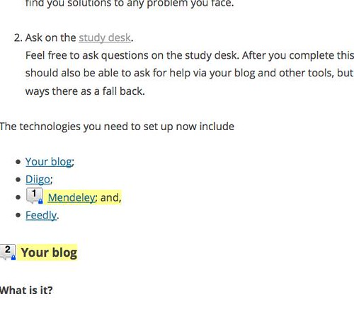
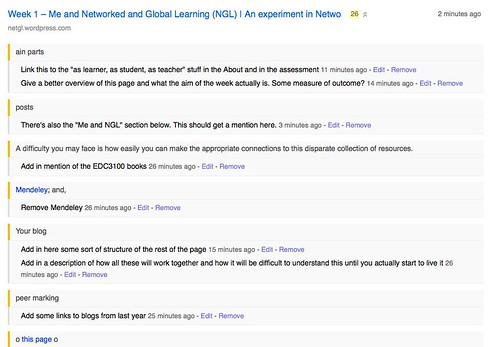

The following is a description of how I've gone about revising the [Week 1 material](https://netgl.wordpress.com/2014/07/15/week-1-me-and-networked-and-global-learning-ngl/) for EDU8117, Networked and Global Learning. The intent is to demonstrate how a tool can be used for something a little different.

### The problem

The content for week 1 is [a longish web page](https://netgl.wordpress.com/2014/07/15/week-1-me-and-networked-and-global-learning-ngl/). It was created in a hurry last year and could use some re-jigging. I need to read through the material and ponder what changes to make. The problem is how to record those thoughts in a way that allows me to focus on reading through the material initially.

If the material was in a Word (or PDF, or Google) document I would probably end up using Word's (or Acrobat's, Google doc's) annotation facility to mark up the text and add comments. But it's a web page and I'm not going to venture into the wilds of converting back and forth between HTML and other formats.

### The solution

Luckily, I do use [Diigo](http://www.diigo.com/) which will allow me to annotate web page, and that's what I'm using. I'm reading through the web page and highlighting sections and making comments on sections I think will change. Once I'm complete, I'll open the blog post in the Wordpress editor beside another browser with the annotated version and make the changes.

### The result

Here's what part of the web page looks like with the annotations.

And the corresponding information in Diigo. You'll be able to see that yourself if you visit [my Diigo library](https://www.diigo.com/user/djplaner/annotate). That link is actually to Diigo's list of all links I've tagged with "annotate". I'll try to keep this the only one.

It has the advantage of leaving a visible record of the changes I've made. Even after I've changed the original web page, Diigo has done a reasonable job of keeping the highlights and annotations in place.

It also provides the potential advantage of making explicit