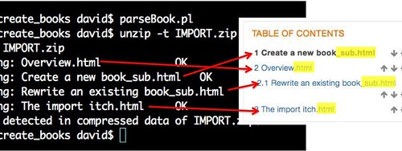

---
categories:
- moodleopenbook
- openbook
date: 2015-07-18 15:53:46+10:00
next:
  text: '"Predicting System Success using the Technology Acceptance Model: A Case
    Study"'
  url: /blog/2015/07/19/predicting-system-success-using-the-technology-acceptance-model-a-case-study/
previous:
  text: 'Me as learner: 2015 and learning analytics'
  url: /blog/2015/07/16/me-as-learner-2015-and-learning-analytics/
title: '"Import and the Book module: a case of knowledge loss?"'
type: post
template: blog-post.html
comments:
    []
    
pingbacks:
    - approved: '1'
      author: How to help improve the Moodle book module | The Weblog of (a) David Jones
      author_email: null
      author_ip: 192.0.86.61
      author_url: https://davidtjones.wordpress.com/2015/02/10/how-to-help-improve-the-moodle-book-module/
      content: '[&#8230;] Update: The &#8220;bug&#8221; in the Book module reported below
        is not a bug. There&#8217;s actually functionality in the Book module to support
        this, it&#8217;s just not obvious. More explanation is available. [&#8230;]'
      date: '2015-08-13 14:00:29'
      date_gmt: '2015-08-13 04:00:29'
      id: '1364'
      parent: '0'
      type: pingback
      user_id: '0'
    - approved: '1'
      author: Testing the Lucimoo epub export book tool | The Weblog of (a) David Jones
      author_email: null
      author_ip: 192.0.99.24
      author_url: https://davidtjones.wordpress.com/2015/08/18/testing-the-lucimoo-epub-export-book-tool/
      content: '[&#8230;] books from my main course. Something that&#8217;s much easier
        now that @jonof helped identify some lost knowledge (and my [&#8230;]'
      date: '2015-08-18 10:22:38'
      date_gmt: '2015-08-18 00:22:38'
      id: '1365'
      parent: '0'
      type: pingback
      user_id: '0'
    
---
The ability to modify open source software (like Moodle) is often identified as one of its strengths. The ability to scratch your own itch, to modify the software to fit your needs is seen as a major plus. Especially when - as with Moodle - that software has an inherently modular (the M in Moodle stands for modulear) architecture that makes it easier for people to scratch their own itch. But making modifications to large bits of software like Moodle requires a fair bit of specific knowledge.

Costello (2014) points out that the "perception that Moodle is easier for institutions to adopt to their own needs is widespread" (p. 193) and that this ability to modify Moodle can form part of the rationale for adoption. Especially for institutions that see themselves being "a co-creator and developer of innovations rather than simply buy(ing) them already packaged up" (Costello, 2014, p. 193). The reality is often messier. The following is capturing one example of that messiness.

### The import problem

As outlined in [this post](/blog/2015/02/10/how-to-help-improve-the-moodle-book-module/) I had a problem with the [Moodle Book module](https://docs.moodle.org/28/en/Book_module) and its import functionality. A problem illustrated by the following image. In short, the import functionality allows you to provide a zip file containing multiple HTML files. The import should unpack that zip file and place each of the HTML files into the book as separate chapters.

But as the image above shows I found two problems

1. The order of the files were changed from what I wanted into a form of alphabetical order.
2. The names of the chapters would retain file system components (e.g. \_sub in the filename indicating a sub-chapter and the .html extension)

I checked the [documentation on importing](https://docs.moodle.org/28/en/Book_settings#Importing_chapters) at the time and seemed to be doing all that is required. This was somewhat frustrating because it required a lot of manual intervention on my part to set right.

  
   by  [kmakice](https://www.flickr.com/people/kmakice/) 

My immediate response was something like that to the right. The Book module has been around for a while. It's part of the Moodle core. Importing HTML files into a Book is likely to be a fairly common practice. Surely this couldn't be how it was left to work. After all, "given enough eyeballs, all bugs are shallow" is a mantra of the open source community.

Oh well, I like to code and perhaps this problem is an example of where I can make a difference. I look at the code for the Book module and fairly quickly see where the problem is, can conceive of and [implement a solution](https://github.com/djplaner/moodle/commit/83c7d4d0bab7121f792a5cbea95a2de2eda54409), and [contribute it back](https://tracker.moodle.org/browse/MDL-49128) to the broader Moodle community. The patch is sitting there waiting to be checked and perhaps might eventually become part of the Moodle core.

A happy story of the open source model working (if a little slowly).

### But it's not as simple as that

I talked about this and other itches around the Book module in [this presentation](http://www.slideshare.net/davidj/can-the-book-module-be-open-and-other-enhancements-what-would-you-like-to-see) at Moodlemoot'AU 15. Quite a few people attended, quite a few commented positively, and the presentation has been viewed 670+ times on Slideshare. Lots of eyes.

But it's only yesterday when I get an email from [Jonathon Fowler](https://www.linkedin.com/in/jonof) a Moodle developer (amongst other things) where I work. On hearing about the import problem his reaction was much the same as mine. A bit of disbelief. Johnathon knows the original developer and didn't believe he'd leave the import function sitting in that state. He looked at the code and he was right. It hadn't been left in that state.

Apparently, the import function will correctly order and name the chapters if you

1. Put the title of each chapter (HTML file) in the title tags of the HTML header. The following chapter will have the chapter name "Overview" \[code lang="html"\] &lt;html&gt; &lt;head&gt; &lt;title&gt;Overview&lt;/title&gt; &lt;/head&gt; &lt;body&gt; \[/code\] Why didn't I do this? Because my authoring process was to edit a single HTML file where the chapters were separated by div tags. A Perl script separated the single HTML file into multiple and stuck them in a zip file. I need to modify the Perl script to add in the title to the single HTML files.
2. Add numbers to the start of the file names. So with the example from the image above, the required file names become \[code lang="bash"\]\[/code\] 1. Overview.html 1.1 Create a new book\_sub.html 1.2 Rewrite an existing book\_sub.html 2 The import itch.html \[code\]\[/code\] And the script will need to be modified to add numbers to the file names.

Tested and that all works.

### Doh!

  
   by  [striatic](https://www.flickr.com/people/striatic/) 

Appears I'm a bit too quick to engage in a bit of minor "solutionism" rather than try to understand the features of the tool. There was a problem, there seemed a simple (fairly) clean solution and so I solved it.

I'll reflect a bit on any potential broader implications later, but first.

### Improve the documentation

Before I go too much further I need to improve the [documentation](https://docs.moodle.org/28/en/Book_settings#Importing_chapters) on importing into the Book module so that no-one else makes a similar mistake.

Uggh, the docs are in some hideous markup language. Moodle wiki? Perhaps best to look at [the guidelines for contributors](https://docs.moodle.org/29/en/MoodleDocs:Guidelines_for_contributors) first. It does appear to be using Mediawiki, better go find some [formatting help](https://www.mediawiki.org/wiki/Help:Formatting).

Not happy with it, but it's a slight step forward.

Bugger, just realised that this fixes the documentation problem on the Moodle docs website (for 2.8 anyway), but it doesn't fix the inline help that appears in the Book module. It still has much the same

I should also update the tracker item I added to make sure no-one else wastes their time on this. Will do that after I post this.

### Broader implications?

I wonder if this points to anything broader beyond lack of attention to detail and a tendency to code up a solution.

It does add a small anecdote supporting the idea that (one of) [Linus' laws](https://en.wikipedia.org/wiki/Linus%27s_Law) (i.e. more eyes == bugs are shallow) is [a fallacy](https://books.google.com.au/books?id=3Ntz-UJzZN0C&pg=PA174&hl=en#v=onepage&q&f=false). Quite a few people saw me mention this "bug", but no-one (until Jonathon) picked up my inability to identify the existing functionality.

It appears no-one currently involved knows the Book module well enough to have been aware of this functionality. The documentation also shows no explicit mention of this "hidden" but needed functionality.

I wonder how many people have had this problem? Or is it just me? **Update:** able to do a quick check of an institutional Moodle, 17 (2.2%) of 759 books in that sample were imported. And those were from a single course.

It appears that the "lack of love" given the Book module over recent years is showing in terms of lost knowledge. How does a large, modular open source project detect, avoid, or prevent this type of "knowledge loss"?

All up I've invested a fair bit of time in this experience (just this blog post alone consumes a bit of time) for fairly minor improvements. This work is not exactly going to directly transform the learning of 1000s of learners. What would be required if you really wanted to do something interesting, impactful, and complex?

A lot of that time has been spent learning or re-learning knowledge about how to engage with the Moodle ecosystem. You need to know something about software development, PHP, github, Mediawiki, Moodle documentation and associated processes etc and then you get to the really hard stuff, knowing what the people using the system want to do and how that might translate. From all that I've seen the Book module once had someone that had that knowledge, but it appears to have been lost.

For an individual (or organisation) to get their head around all that requires quite a large investment of resources/knowledge. Moodle core have the technical knowledge down pat and are adding more developers, but what about the knowledge of the user experience? They are also taking steps in that direction, but that in itself is going to generate a need for more resources.

Leading to questions of prioritisation, which inevitably leads to [the problem of stavation](/blog/2015/06/16/types-of-e-learning-projects-and-the-problem-of-starvation/).

Has me wondering if it's time (and possible) to add another layer of abstraction here. Is something like Moodle at too low a level of technical abstraction?

### Testing my patch

The next question is what impact my patch has on this behaviour.

**Will the normal Book functionality work?**

The need to include the numbers within the filename of each HTML file, essentially re-creates what my patch does. Hence my patch should work okay. The order with numbers should be maintained.

Yes, that appears to work. The numbers are removed as expected.

**What if I remove the numbers and rely on my patch for ordering?**

Yes. This will and does work.

**What if my script includes the chapter title in the title tag?**

Modified the script to add the filename plus "XXXXXXX" to the title tag within the HTML file, and that's what is used for the chapter names.

**Implications**

It appears that my patch plays nicely with the existing functionality. Begging the question, does my patch add anything? Well,

- If you leave the numbers out of the filenames, my patch will order the chapters in the same order as the zip file (rather than a natural sort).
- If you don't put anything in the title tag of the HTML file, then my patch will nicely remove the \_sub and .html parts of the filenames.

Not a complete waste of time, some small benefit.

I'm slightly relieved that my code didn't break anything.

### References

Costello, E. (2014). Opening up to open source: looking at how Moodle was adopted in higher education. Open Learning: The Journal of Open, Distance and E-Learning, 28(3), 187–200. doi:10.1080/02680513.2013.856289