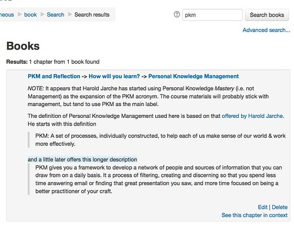

What follows is some explorations of the technology behind Moodle to see how [the mockups of a Book module search function](/blog2/2015/07/19/mocking-up-a-search-facility-for-the-moodle-book-module/) might be implemented. Building my own knowledge of how it works and testing whether it might be possible. It's largely an exploration of how the Search forum block works on the assumption that mirroring that will be a reasonable way to implement a search facility for the Book module.

Two parts to this. First, a look at how the Search forum block is implemented. Second, some rough exploration of how what might need to be done for the Search book block.

**Update:** It does appear that there was [some work done](https://moodle.org/mod/forum/discuss.php?d=130569) on this. [Some working code](https://github.com/stronk7/moodle-block_search_books) as a block, but doesn't appear to have made it into the Moodle plugins database. Will need to chase this up.

## Search forum

### The Search block

~/moodle/blocks/search\_forums implements the search block. The main purpose of this seems to be to generate the HTML necessary to display the block.

All the actual work appears to be passed over to the actual Forum activity module (the file search.php).

### Forum activity module - search

[~/moodle/mod/forum/search.php](https://github.com/djplaner/moodle/blob/master/mod/forum/search.php) is one of those ugly PHP scripts. Apparently hasn't been changed in almost a year (as you'd kind of expect).

1. Handle the parameters.
2. Look at the parameters and attempt to figure out what the search terms will be.
3. Clear the search terms
4. check access.
5. generate an appropriate event
6. Show the form if we're not doing a search.
7. Use forum\_search\_form to populate the form
8. Use forum\_search\_posts to do the search
    - If there aren't any posts, show an empty form and exit
9. Display the results
    - Show the start of the response with all search terms entered appropriately
    - Loop through each post and display it (using a long bit of code)
    - Show the footer

Support functions in search.php

- forum\_print\_big\_search\_form
- forum\_clean\_search\_terms - removes any search strings less than 2 characters long and returns a space-separated search terms
- forum\_menu\_list - what is the list of forums the user can view?

### forum/lib.php

Contains some other functions used.

- forum\_search\_form - generates the much smaller search form.
- forum\_search\_posts - returns the list of posts matching the search terms Involves the following steps
    1. get the readable forums for the user.
    2. for each of the forums
        - generate different SQL statements based on different types of forums.
        - users search\_parser and search\_lexer to do some checks on the search strings.
        - further updates the SQL
        - query the database to get the number of matching records.
        - query the database to get a subset (if large) of the records

## Search book

Given that the Book module doesn't have the same variety and complexity in terms of different types of forums etc, implementing the search would seem to be quite easy. Hidden chapters perhaps the main added "complexity".

### Block

Would seem to be fairly straight forward and easy to implement.

### Advanced search form

The main additional complexity here would be to generate the list of course topics and the books that belong to each topic.

What I'm calling "topics" are stored in the table **course\_sections**.

- Can be visible or not.
- Can be available or not. **Important:** Only search sections the user can see.
- Name is included.

The modules (activities) that are included in each course section is stored in **course\_modules**

- module = 3 suggests a book
- course is the moodle id for the course.
- section is the section id
- will be a question of whether or not the user can see the book **Important:** ensuring that only the books the user is able to see are searched will be important.

### Searching and displaying the book and its chapters

**book** table includes the name and introduction to the book. No indication of who created it.

**Important:** Is it possible (somewhat easily) to identify someone as the author of a book?

**book\_chapters** table contains information about each of the chapters, including

- Is it hidden or not
- Where the chapter was imported from. **Important:** This would be a way of identifying people who have used the import facility
- The actual content, chapter title, whether it's a sub chapter or not.
- pagenum - indicates the order of the chapters/pages **Important:** Use this to order the search results within a book in order of appearance in the book.