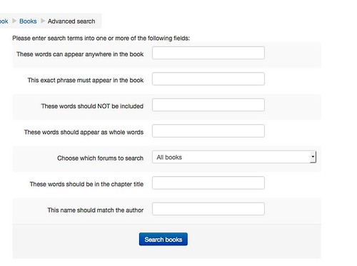
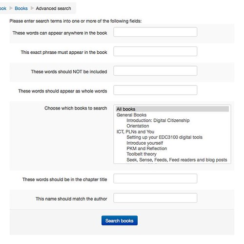
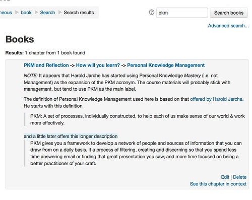

See also: [[blog-home | Home]]

Time to start generating a mock up of one of the itches identified in [this presentation](http://www.slideshare.net/davidj/can-the-book-module-be-open-and-other-enhancements-what-would-you-like-to-see) and from the [Moodle "open" book project](/blog2/the-moodle-open-book-module-project/). Perhaps best summed up from this comment from a past EDC3100 student

> It is impossible to go back and remember where to find information…At least on a PDF I can use the Find function

There is no search facility for the Moodle book module.

**Update:** It does appear that there was [some work done](https://moodle.org/mod/forum/discuss.php?d=130569) on this. [Some working code](https://github.com/stronk7/moodle-block_search_books) as a block, but doesn't appear to have made it into the Moodle plugins database. Will need to chase this up.

The question here is whether one can one be added using the existing [search forums block](https://docs.moodle.org/29/en/Search_forums_block) as the model?

This post is an attempt to mock up and explore how this might work. The following is intended to provide sufficient ideas to generate feedback and suggestions.

## Search book block

The start would be the option to include a "Search Book Block" on a Moodle course page. Current plan would that it would function exactly like the Search Forum block.

Just type in the words you wanted to search for and by default it would search all books in the current course site (results of the search shown below). If you wanted to be more advanced, use the Advanced Search link.

## Advanced Search

The advanced search functionality would also mirror the Search forum block. Click on the "Advanced Search" link and you get a page like the following.

The extra options being

1. Search for an exact phrase.
2. Search for books that don't include a specific search phrase.
3. Search for whole words.
4. Refine the search to only specific books (more on this below).
5. Search for words within the titles of chapters. **Addition:** should also perhaps have the option to only search for words in the title and the description of the whole book, rather than within chapters.
6. Search for books written by an author. This is a little strange and somewhat borrowed from the Search forum block. Originally the intent was that the Book module might be used by students to create content on a Moodle site. I'm not sure many people use this, but the ability to search only in books written by a particular author might be useful.

Given that a course may have quite a few books (e.g. one of mine has 70+) the ability to select which books to search might be useful. You might wish to search all the books, a few books, or all books within a given topic/module. Hence the change in how to select which books to search in the following.

The idea is that you would be able to select multiple books. All the books in the course would be displayed and would be grouped based on the topics/modules that they belong to.

### The search results

The search forum block returns a list of matching forum posts grouped on separate pages (if needed). For each post it displays both the "header" - the author details, the forum, date posted, and the subject line - and the content. The search Book block could mirror that, but instead showing each chapter that matched the search and the book from which those chapters belonged. Something like the following.

Some of the minor suggested changes are

- Have the results summary count the number of chapters and books that were found in the search.
- The header of each search result will provide the full path to the specific chapter. i.e. Topic/module -> Book -> chapter. This might be better displayed using the standard display approach used within the Book module, but with the addition of links so that the searcher can go directly to the topic, book, or chapter.

That will do for now. Time to explore the technical feasibility of it all.

### Ad hoc notes

- Probably want to treat titles of books as a special search and result. e.g. be clear is a search string appears in the book title and allow to only search (or not include) book titles.
- Should the results show the entire contents of a chapter, or just a subset?