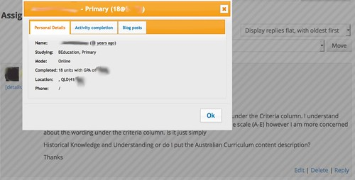

See also: [[blog-home | Home]]

["More student details"](/blog2/2014/11/13/adding-more-student-information-to-a-moodle-course/) (see image below) is the most visible part of the additional systems I've put in place to make teaching bearable ([this presentation](http://www.usq.edu.au/learning-teaching/USQSalon/JonesAlbion) talks more about it). The problem I'm dealing with here is that a new semester has started, which means I need to re-configure these feral systems to work with the new semester.

And while I'm at it, I'm hoping I might be able to add [a bit of sentiment analysis](/blog2/2015/06/16/exploring-bim-sentiment-analysis-what-might-it-say-about-student-blog-posts/) to it.

## What needs to be done

Tentative process appears to be

1. Create new course ID (5), group id (53), contextid (575) and course label (EDC3100\_2015\_S2) for new offering - creating the course in local Moodle.
2. Create a BIM activity in the new course. - 3 - DONE
3. run participants/parse.pl - DONE
4. run the user extras. - DONE
5. Load the initial activity information.- DONE
6. Load the current activity completion data. - DONE
7. Load the BIM data. - DONE
8. Update the greasemonkey script

The basic aim is to populate a database running on my laptop with the following data

- Student enrolment data.
    - Source - spreadsheet provided by manual dump from student records
    - Destination - Local moodle tables: mdl\_user\_extras and mdl\_user
    - Method
        - Initialisation - set up the Moodle users data
            - update the course label in extras.pl
            - Play around with the columns in the spreadsheet.
        - Maintenance - participants/extras/extra.pl - DONE
            - Can the CSV file be read appropriately - DONE - but missing some of the data I would have liked to have had.  
                Keep on eye out for strange data - e.g. UK post codes.
            - Get the users data for this course.
            - See if a match can be made with local Moodle and Peoplesoft data
            - Any missing students (can't match)
            - insert into mdl\_user\_extras table
            - update mdl\_user table - to update the phone1 and phone2 values
    - Status
- Student Moodle user data.
    - Source - CSV file produced
    - Destination - Local moodle tables: mdl\_user, mdl\_groups\_members, mdl\_role\_assignments
    - Method BAM/3100/3100\_support/participants/parse.pl
        - Initialisation
            1. Update the library files
            2. Create a new local Moodle course - get id.
            3. ??? do I need to create a group ID???? What else is needed
        - Maintenance - script will do most of this -- students aren't enrolled in the course, but are appearing in BIM.
            1. Parse the HTML file. - DONE
            2. Find any existing users - DONE
            3. Add the new students - DONE
            4. Populate the group data - DONE
            5. Populate role assignments - DONE
    - Status
- Activity completion data - DONE
    - Source
        - HTML file saved of main Moodle site - DONE
        - CSV file from activity completion
    - Destination - local Moodle tables
    - Method
        - Initialisation - activities/parseActivity.pl - DONE
            1. Have the local Moodle course set up.
            2. Ensure that the script has the configuration for the new course.
            3. Dump the main remote Moodle page to HTML.
            4. Run the parseActivity.pl script
                - Parse the html page - DONE
                - update the activity mapping table - DONE
            5. perhaps have to play with the activity translation stuff **especially since Moodle 2.8 seems to have changed their method**
        - Maintenance
            - List of activities - Whenever a the activity list to be completed changes on the remote site, save a new HTML file and re-run the script.
            - Activity completion - run the parse completion script
                - get progress data - DONE And Moodle has changed the format of their spreadsheet. It appears that the ... has been removed. Let's try that.
                - update the local/remote mapping - DONE
                - check the students - DONE
                - update the database - DONE
    - Status
- Student blog data.
    - Source - HTML file from BIM on remote site
    - Destination - local Moodle BIM tables
    - Method
        - Initialisation - DONE
            1. Create the course
            2. Create the BIM activity
            3. Run the user scripts
            4. Modify the bim/parseBIM.pl script
        - Maintenance
            1. parse the file
            2. Get the users and check data
            3. insert the data - DONE
    - Status - simply save the updated HTML page and re-run the script when updates required

### Greasemonkey script

Well the data is in and the update process should be fairly straight forward - though still somewhat manual. Time to move onto the Greasemonkey script. This is what recognises and updates the Moodle page, communicates with the details server and displays a pop up. Changes will likely need to be made to both the client and server to serve the new course.

Greasemonkey first

- Recognise the course - 7023 Add that Moodle course id to an if statement and it should start working? As long as I remember to reload the modified script. Yes. It is recognising it.

Server

- Map course id to BIM
- Map remote course id to local id
- need to abstract out the WEEKS data - at the moment this is hard coded to the weeks, but it will do
- And the module mapping - DONE
- Fix up the dates

Still some minor bugs, to do list includes

- Get the accordion working.
- Timeago isn't calculating the time since/till end of weeks.
- Missing data- GPA, # courses complete
- Add in the sentiment analysis work.