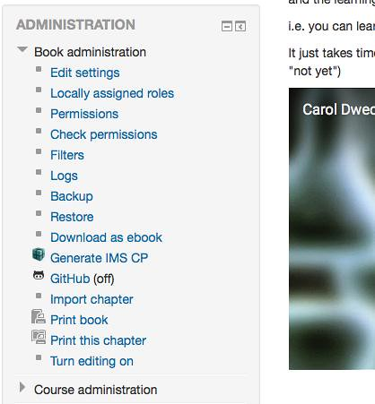
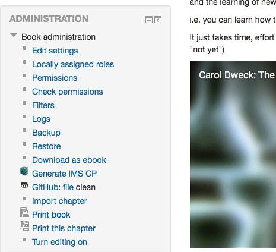
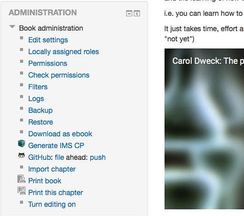
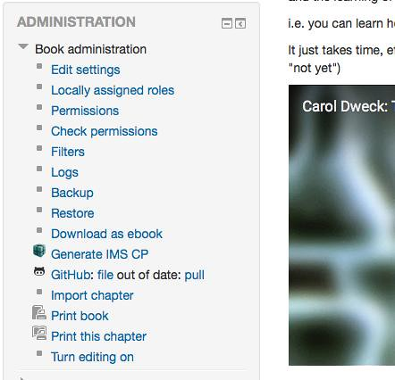
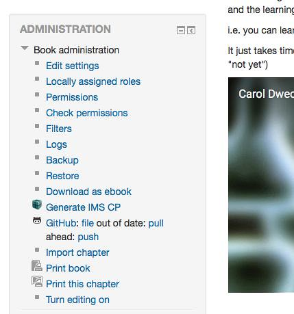

The [Moodle open book project](/blog2/the-moodle-open-book-module-project/) is attempting (not surprisingly) to modify the [Moodle book module](https://docs.moodle.org/29/en/Book_module) to enable it to produce open resources (educational or otherwise). The main focus is on making the content of the books open in a way that enables modification and reuse. The plan is to do this by enabling a Moodle book resource to be linked to github.

The following is an exploration of and an attempt to describe how this might work at a fairly high level.

What do you think? Might this work? Are there better options?

The next step will be to try some realistic technical explorations to see if this can be implemented.

### Why?

The idea is that once in github different people (or courses) can use github to modify and collaborate around the same document. e.g. a book I created for my course, might be useful for another course looking at ICT and Pedagogy. Rather than play around with Moodle backups, I could create a github repository and the content of the book to that repository. The author of the other course can then fork that repo and import the content of the book from their repo into Moodle.

Any changes that either of us make to the book are stored in github. We can then use github's features to share and manage changes.

Beyond this, I could make all of the books in my course available via github. Who knows, some of my students might find them useful or may wish to make changes that might enhance the work.

### Implementation

At this stage, the idea is to implement the github 'connection' as a [book tool](https://moodle.org/plugins/browse.php?list=category&id=56). This means it can be installed by each Moodle site that wants it. When installed there will be a new link in the Book administration block through which you access the github functionality.

The intent is that an individual Book resource will be linked to a single file hosted in a github repository. The file would be a single HTML file (at least initially) with the different chapters and sub-chapters indicated in some yet to be defined way. The final format will aim to allow the HTML file to be edited by as many different editors as possible, but still allow simple importation into the Book module.

As a future feature, it might be possible and useful to all the import/export of that single file from github into the Book to be done using the user's choice of other import/export tool. i.e. if I might want the file in github to be an epub file, I would configure the github tool to use the [Lucimoo EPUB export/import tools](https://moodle.org/plugins/view/booktool_exportepub) to produce the file that is sent to/from github.

### What it might look like

Initially, it might look like the following. The _(off)_ is meant to be an indication that the connection to github is currently off. i.e. not being used.

Clicking on the GitHub link would open up a form that would be used to configure the necessary information including:

1. github repository - that contains the file.
2. file - the actual file being linked to.
3. github credentials - of the author (with the option that this might be left empty for repositories configured to allow that).
4. behaviour spec - i.e. how to import the file (replace existing content, append?), how to handle changes made in the book
    
    Initially, this would probably be left to some default combination. It would also be dependent on the settings of the repository and the permissions of the github credentials.
    
    More work required here.
    

Once this is configured, the administration link would change to indicate that a connection had been made. It would now have a link to the file on github and also some indication of the relationship between the book and the github file. In the following image "clean" implies the book and github file are a match.

If changes are made in the Moodle book this would mean that the book is "ahead" of the github file. The github link would change appropriately. It would also add an additional link "push". Clicking on that link should probably display a page that provides some details of the changes to be pushed and allows the author to make the choice whether to push or not.

If the version of the file on the repository had been changed, then changes are also made.

Leaving the question of what happens when both local and remote changes have been made? Both? Some thought to be given here.

### Assumptions

This is all based on

1. The Book author has the details and credentials to a GitHub respository that contains a file of the correct format; This might be a challenge for some authors.
2. There is no local git repository. Asking folk supporting a Moodle instance to install git on the server is a bit much. Instead, the content for the book will be stored in the Moodle database. No problems for Moodle, but raises questions about how to determine whether there have been changes. At least two current possibilities
    1. Store the date of last change on the repo in the Moodle database and compare dates for changes to the book.
    2. Generate/store a version of the HTML file locally and do a compare (sounding very heavyweight).

4. That different books in a single course could be linked to entirely different github repositories.
5. That the idea of adding additional links and status information about github into the administration block doesn't break some Moodle style guide.

### Outstanding questions

Lots.

More specifically

- How to handle links between chapters? A book is made up of chapters (a single HTML page). When displayed in Moodle the Book module provides simple next/previous page navigation. It's also fairly common for authors to hard-code links between chapters (and even into chapters in other books). If the github version of a book stores all the chapters in a single file, what about these links?
    
    How do the existing export/import plugins handle this?
- How to handle embedded resources (images, movies etc)? Books also contain embedded images, movies etc. The issue of how these are provided is a common one. I tend to use external services, but others place them into Moodle, how to handle these? How do the existing export/import plugins handle them?
- Is all of the above technically possible with github, the github API, PHP, Moodle etc.
- Does all this need to be github specific? Is there a way (and a need) for this to git specific, but not github specific?
- What might be the process for create a new file in a repository based on an existing Moodle book?