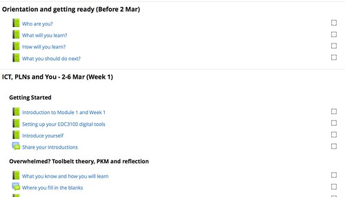
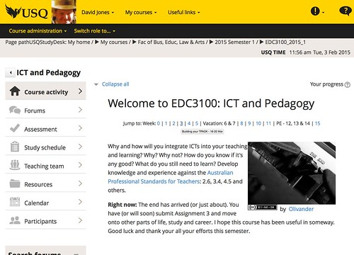

My current institution has a content problem when it comes to e-learning (insert digital learning, online learning, technology enhanced learning, or just learning if you prefer). The following is an attempt to use my experience teaching at the institution to understand what are some of the factors contributing to the problem.

In order to appear solutions-focused, I'll start by re-framing the contributing factors I've identified below as suggested partial solutions to the content problem, including:

1. Implement a search engine.
2. Implement content authoring tools that fulfill authoring and learning requirements.
3. Focus on authoring tools that help produce content that is "of" the web, not just "on" the web.
4. Focus on authoring tools that support both design and bricolage.
5. Identify, query, and replace conceptions and metaphors from prior modes (e.g. print-based and perhaps face-to-face) of learning.
6. Develop and provide support for a number of higher-level models of "Course Activity".
7. Move away from an information transmission focus toward one based on learner activity.
8. Develop a range of contextual services that can enhance content and student learning.

Disclaimer: I think improving any aspect of learning and teaching within a university is [a wicked problem](https://en.wikipedia.org/wiki/Wicked_problem). i.e. there is no one silver bullet solution. Just better and worse solutions. From my perspective, the solutions that the institution appears to be exploring are not necessarily leaning towards the "better" end of the spectrum. The above may be a little better.

In addition, I don't think this is a problem restricted to my current institution. I also don't think that the solutions attempted so far are all that much different from what's been attempted at other institutions. I've observed both the problems and the solutions elsewhere.

Does your institution have a "content problem"? Has it any solutions? Any of them worked?

PS. if we're having problems with "content", imagine the problems there must be with creating effective learning activities (IMHO, a much harder and more important problem).

## Evidence of the problem

Evidence of the problems comes from two different sources.

### Institutional

First, is at the institutional level. For some time there has been concern expressed at senior levels within the institution that students can't find information on the course sites. This has led to a number of institutional projects and strategies.

The first was the development of a standard look and feel for course sites. Publicised as [a makeover](http://www.usq.edu.au/studydesk/) of the StudyDesk (the institutional brand for Moodle, which potentially [causes its own problems](/blog2/2015/07/07/does-branding-the-lms-hurt-learning/)) that promises the ability to find "all course information" and "assessment submission in one location". There is apparently on-going work around this

https://twitter.com/usqedu/status/630513932176756736

### Personal observation

From the evidence I see (personally and via my better half who is currently a student at the institution) there remains some distance until this promise is fulfilled. The Moodle sites at the institution that I see are still largely problematic and still mirror what I found when I took over the course I currently teach. i.e. a hodge podge of Powerpoint and other files interspersed with various bits of HTML (Moodle labels) with headings or explanatory text. The HTML often illustrates complete ignorance of simple design (e.g. of [the CRAP design principles](http://blog.teamtreehouse.com/how-crap-is-your-site-design)) and is often an attempt to explain how everything fits together. This is required because due to a couple of institutional specific approaches, not all the content is able to be effectively integrated into appropriate places within the Moodle site.

The ad hoc intermingling of all this content ends up in ["the inevitable scroll of death"](http://elearningstuff.net/2013/05/01/is-the-scroll-of-death-inevitable/) and the problem that students (and staff) can't find information.

Even when Moodle courses are well designed, there are times when you can't find information. I'll claim that the course site for EDC3100, ICT and Pedagogy (one of the courses I teach) is amongst the most structured of course sites. As far away from the ad hoc upload approach to site design as you can get. In addition, largely I have been the sole designer and maintainer of the course site. A task that I've been doing over the last 3+ years and 6+ offerings of the course. I'm also very technically proficient.

And there are times when I still can't find information quickly on the EDC3100 site!!!

## Contributing factors

What is contributing to this problem? What follows are some of the factors arise from my perspective.

### No search engine

The number one way you find information on the web is via search and yet there is no search engine that works within Moodle at this institution.

### Content tools solving institutional requirements, not authoring/learning requirements

The most recent major investment in content tools at the institution has been the implementation and mandated use of an institutional repository. This quite significant investment of funds was not driven by a desire to help improve the authoring or learning processes. It was driven by two separate institutional requirements, which were:

1. being able to manage and report use of copyrighted materials; and,
2. address the disk storage problems created by Moodle course sites containing duplicate copies of large content files.

From what I've observed, it would be very hard to claim that the implementation of the learning repository has helped address the ability of people to create and find information for Moodle.

### "on" the web, not "of" the web

Alan Levine [writes](https://wcetblog.wordpress.com/2013/02/13/ds106/) (about the open course [ds106](http://ds106.us/))

> You will hear people talk about their organizations or projects being on the web. but there is more than a shade of difference of ds106 being of the web.

Much of the thinking behind the tools and approaches of the institution are focused on producing content that is placed "on" the web, but is not "of" the web. In fact, some of the tools provided previously had enough trouble being "of" Moodle, let alone "of" the web.

The prime example here is the [ICE environment](http://eprints.usq.edu.au/697/). An environment developed within the institution to enable it to leverage quite significant print-based distance education material (such as Study Guides) by converting them into a Web format. The existing material (typically created using Word) would be run through ICE to produce a collection of HTML files. That collection of HTML files could then be linked to from the course site - via a link labelled "Course Content".

The very first web browser was also an editor. If you wanted to edit a page, you could do so within the same tool you were using to view it. The ICE approach doesn't (I believe) work that way, to make a change you have to go back to the Word version, make the change, and then run it through ICE again. Not "of" the web.

A common way to organise a Moodle course site is by topic or week. Each section of the course site is meant to include everything you should do as part of that topic or week. But the ICE "Course Content" link contains all of the content in one place. It's more difficult to distribute the content into the appropriate weeks or topics. Meaning that you can't look in the one place for all the relevant information.

There's some value in enabling the reuse of existing materials, but they have to be leveraged in a way that encourages them to become part of the new medium. Not always held back to the ways of the old.

### A focus on design, rather than bricolage

The ICE model and the model used by print-based distance education was based on design. i.e. the process was to spend a lot of time on design and production of a perfect, final artefact (print-based materials) that was distributed to students. This is because once the materials were sent out, they couldn't be changed. This created problems, e.g. this from [Jones (1996)](/blog2/publications/solving-some-problems-of-university-education-a-case-study/)

> inability to respond to errors in study material or the requirements of individual students

Yesterday, one of my students reported some difficulties understanding the requirements for submitting the first assignment. I decided that an example was the best explanation and that I should incorporate that example into the Assignment 1 specification so that other students wouldn't have the same problem. I can do this because the Assignment 1 specification is a web page on the Study Desk that I can edit.

So I found an example and went to the Assignment 1 page to make the change. Only to discover that I'd already previously modified the page to include (the same) examples. Hence the quick reply back to the student pointing out the examples.

An experience that suggests you can put in all the effort you want around making content findable and understandable, but it may not be enough.

### Old metaphors lingering around

It's not only materials that need to be brought into the new medium. There are other conceptions or metaphors that need to be updated. For example, [the makeover](http://www.usq.edu.au/studydesk/) of the StudyDesk just undertaken includes a specific page for "Study Schedule". This was a standard component of print-based distance education packages. But it's not clear that it belongs in the new Moodle age within which we live.

As mentioned above, a common method for organising Moodle course sites is by week or by topic. The image below is part of the course site for EDC3100. The site is organised by week. The top of the site has skip navigation links (see the next image below) that you can use to take you directly to the week you need to work on. All the activities and resources you need for that week are in that section. As you complete each activity you will get a nice behaviouralist tick indicating that you have completed the activity.

With this structure in place, I question the value of a Study Schedule. Especially when I see the type of information that is contained in many of the Study Schedules on other courses.

My course does include a Study Schedule. It would be interesting to see how often it is used by students.

### No higher-level models of "Course Activity"

[The makeover](http://www.usq.edu.au/studydesk/) of the Study Desk was "sold" to academics (in part) using a line like "we won't touch 'Course Activity'". i.e. the normal Moodle list of activities and resources would remain the sole purview of the academic. The new look and feel was just adding some additional structure (see the left hand menu in the image below) to help students find information.

It was left to academics to organise the "scroll of death" that is a Moodle site. A task that is not straight forward. There have been (yet) no attempts to develop and share higher-level models of how the "course activity" section could be structured. I'm assuming that at some stage soon there will be a project at the institution to develop the "one higher level model" for all courses at the institution, because consistency is good.

I'd argue that there's value in developing multiple contextually appropriate "higher level" models. The approach I use is one "higher level" model. [UNE uses a different model](http://moodle.une.edu.au/course/view.php?id=2) that provides enough eye candy to excite some, and there would be other possibilities.

### Resource centric understanding of learning

Lastly, and perhaps most scarily, is the apparent on-going resource centric understanding of learning suggested by the on-going interest in the "Resources" tab in the standard look and feel captured by the tweet from above. It is even more troubling when you combine this significant investment of resources in the "Resources" tab with the apparent lack of focus on "Course Activity".

At least for me (and a few others I know) this combination speaks of a conception of learning that is focused on the transmission of information, rather than learner activity.

### No value added, contextual services

When the screenshot above was taken my mouse was hovering over the _3_ in the "Jump to: Week" skip navigation. As a result a tool tip was being shown by the browser with the words _Building your TPACK - 16-20 Mar_. This is the title I've given to the week's activities and also the dates of the semester that was week 3.

If you look at the earlier screen shot you will see the titles and dates for two more weekly sets of activities: _Orientation and getting ready (Before 2 Mar)_ and _ICT, PLNs and You - 2-6 Mar (Week 1)_. If you were able to mouse over the _0_ and _1_ in the skip navigation at the top of the page, the tooltip would display the same title and date information. If you were able to look at the provided Study Schedule, you would see the same title and date information in the Study Schedule.

The same course is being offered this semester. The dates listed above no longer apply in the new semester. Under the current institutional model I would be expected to manually search and replace all of the date information every time the course site is rolled over to a new semester. The same applies to assignment due dates and other contextual information. For example, if I decide that the title for week 3 should change, I'll need to manually search and replace all occurrences of the old title.

Since doing this manually would be silly, most people don't do it. Instead of providing context specific information (e.g. dates), generic information is given. It's just week 1 or theme 1. The problem with this is that it makes it more difficult for the teacher and student. Rather than information (like due dates) being available in the space needed, they have to expend energy and time looking elsewhere for that information.

I've implemented [a kludge macro system](/blog2/2015/06/26/and-the-little-one-said-roll-over-roll-over/), but Moodle has a functionality called [filters](https://docs.moodle.org/dev/Filters) that could be used to achieve the same end with some advantages.

However, this particular problem doesn't appear to be on the radar. Arguably because all of the other "content" problems means that few people are producing content that could work with filters or require this approach.