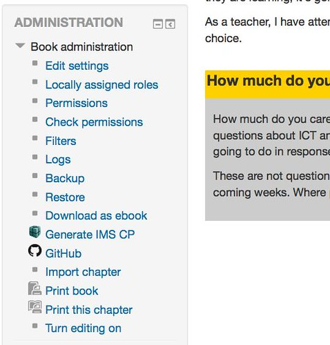

See also: [[blog-home | Home]]

The following is the first step in actually implementing some of the ideas outlined in [an earlier post](/blog2/2015/08/13/how-might-github-and-the-moodle-book-module-work-together/) about bringing [and the](http://github.com/) [Moodle Book module](https://docs.moodle.org/29/en/Book_module) together. The major steps covered here are

1. Explore the requirements of a book tool.
2. Name and set up an initial book tool.
3. Figure out how to integrate github.

## A book tool

The Moodle book module is part of core Moodle. Changing core Moodle is (understandably) hard. Recently, I discovered that there is a notion of a [Book tool](https://moodle.org/plugins/browse.php?list=category&id=56). This appears to be a simple "plugin" architecture for the Book module. People can add functionality to the Book module without it being part of core. The current plan is that the github work here will be implemented as a Book tool.

What does that mean? My very quick search doesn't reveal any specific information. The [book tool page](https://docs.moodle.org/dev/Book_tool) within the list of plugin types in the Developer documentation is missing. Suggesting that perhaps what follows should be added to that page.

The [plugin types page](https://docs.moodle.org/dev/Plugin_types) describes book tools as

> Small information-displays or tools that can be moved around pages

Which is perhaps not the best description given the nature of the [available Book tools](https://moodle.org/plugins/browse.php?list=category&id=56).

### The tool directory

The book tools appear to reside in ~/mod/book/tool. Each tool has it's own directory. Apparently, with all the fairly common basic requirements in terms of files

- [version.php](https://docs.moodle.org/dev/Plugin_files#version.php) \[code lang="php"\]$plugin->component = 'booktool\_pluginname';\[/code\]
- [lang/en/booktool\_pluginname.php](https://docs.moodle.org/dev/Plugin_files#lang.2Fen.2Fplugintype_pluginname.php)

etc.

The Book module's lib.php has various calls to _get\_plugin\_list('booktool')_ in various places

- book\_get\_view\_actions
- book\_get\_post\_actions
- book\_extend\_settings\_navigation

The first two look for matching functions (e.g. book\__plugin_\_get\_post\_actions) in the book tool's lib.php which get called and then used to modify operations.

The settings navigation is where the changes to the settings/administration block get made and from there that's how the author gets access to the booktool's functionality.

## Naming and getting it started

The plan seems to be to

1. Create a new github repository for the new book tool
2. Copy and edit an existing book tool to get started.
3. Figure out how to slowly add github functionality.

### Creating the booktool github repository

The repository will need to be called moodle-booktool\__pluginname_. What should the plugin name be?

I'll start with github. Existing tools tend to include a verb e.g. print, exportepub, importepub, exportimscp. So this may be breaking a trend, but that can always be fixed later.

And then there was [a repository](https://github.com/djplaner/moodle-booktool_github).

Clone a local copy.

Copy the contents from another book tool and start editing

And take a note of work to do on [the issues section](https://github.com/djplaner/moodle-booktool_github/issues) of the github repository.

Updated the icon. Wonder if that will work as is?

Login to local moodle. It has picked up the new module and asking to install. That appeared to work. Now what happens when I view a book resource? Woohoo that works.

Doesn't do anything useful beyond display the availability of GitHub (with the nice icon).

Push that code back to the repository.

## How to integrate github

Time to actually see if it can start talking to GitHub and how that might be achieved.

Initial plan for this is

1. Hard code details of github repository and credentials for a single Book module.
2. Implement the code necessary to update the link in the settings block based on whether the book is up-to-date with the repository.
3. Implement index.php function to display various status information about current repository and book.
4. Implement the fetch and push functions.
    
    From here on a lot more thought will need to be given to the workflow.
    
5. Implement the interface to configure the repository/credentials

Which all beg the question.

### How to talk to the GitHub API

The assumption underpinning all of this is that the tool will use [GitHub API](https://developer.github.com/v3/) to access it's services. Moodle is written in PHP, so I'm looking for a PHP-based method for talking to the GitHub API.

There's no clear winner, so time to do a comparison

- [Scion: Wrapper](https://github.com/Scion-Framework/GitHubAPI) - initial impressions good. Does use cURL. But requires other "scion" based code
- [KnpLabs API](https://github.com/KnpLabs/php-github-api) - requires another library for the HTTP requests. Not a plus.
- [tan-tan-kanarek version](https://github.com/tan-tan-kanarek/github-php-client) - looks ok. No mention of other requirements.

Let's try the latter. Installation and it's all working. Now only need to grok the API and how to use it from PHP.

The focus here is on an individual file. The book will be connected to an individual file.

Most of these request seem linked to the [Contents part of the API](https://developer.github.com/v3/repos/contents/) - part of Repositories.

Actions required

1. Does the file exist in the repo? Getting the content should return a 200 status code and "type: file" if it is a file, but it will also return the content of the file.
2. Create a new file [API](https://developer.github.com/v3/repos/contents/#create-a-file): PUT /repos/:owner/:repo/contents/:path
3. (fetch) Get the content for the file. [API](https://developer.github.com/v3/repos/contents/#get-contents) - GET /repos/:owner/:repo/contents/:path
4. (push) Update the file with new content. [API:](https://developer.github.com/v3/repos/contents/#update-a-file) PUT /repos/:owner/:repo/contents/:path
5. What is the status of the file in the repo?
6. What is the relationship between the content/status of the file in the repo and the content in the book.

Running out of time. Will have to come back to this another day for Step 2.