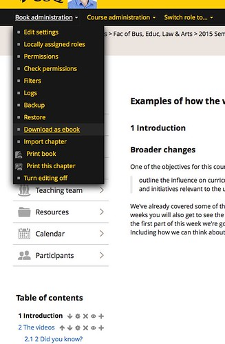

---
categories:
- moodle
- moodleopenbook
date: 2015-08-18 10:22:30+10:00
next:
  text: Understanding learning as network formation
  url: /blog/2015/08/18/understanding-learning-as-network-formation/
previous:
  text: There&#039;s more to it than the Internet and social software
  url: /blog/2015/08/17/theres-more-to-it-than-the-internet-and-social-software/
title: Testing the Lucimoo epub export book tool
type: post
template: blog-post.html
comments:
    []
    
pingbacks:
    - approved: '1'
      author: 'Can video be emedded in ePub exported from #moodle book? &#8211; The Weblog
        of (a) David Jones'
      author_email: null
      author_ip: 192.0.113.167
      author_url: https://davidtjones.wordpress.com/2016/02/17/can-video-be-emedded-in-epub-exported-from-moodle-book/
      content: '[&#8230;] my institution installed the Lucimoo epub export tool for the
        Moodle Book module. I did some of the testing of it. I&#8217;m particularly interested
        (but not overly) in its ability to export a book resource as an [&#8230;]'
      date: '2016-02-17 10:57:06'
      date_gmt: '2016-02-17 00:57:06'
      id: '1383'
      parent: '0'
      type: pingback
      user_id: '0'
    
---
There's movement afoot. The [Lucimoo epub export tool](https://moodle.org/plugins/view/booktool_exportepub) for the [Moodle book module](https://docs.moodle.org/28/en/Book_module) is going through the process of being tested (and perhaps installed) on my institution's main Moodle instance. What follows is a bit of testing of that tool in the institution's test environment.

Verdict: all works, a few changes to practice to leverage it properly.

### Import a few books

First step is to import a few books into the bare course site within the test environment. Just a few random books from my main course. Something that's much easier now that @jonof helped identify [some lost knowledge](/blog/2015/07/18/import-and-the-book-module-a-case-of-knowledge-loss/) (and my oversight/mistake).

Of course it is never perfect. The default setting on the test environment is to use the gui editor. Which removes links to CSS files. **Which is a real pain**.

### Doing an export

Once in the book select the administration/settings block and hey presto, there's the option to "Download as ebook"

Select that option and I get the option to download the ePub file or view it in iBooks.

As [reported earlier](/blog/2015/06/15/importexport-epubs-into-the-moodle-book-module/) the ePub contains a few errors because apparently the original HTML content in my Book resource doesn't always meet ePub's stricter requirements. The bugs I had to fix included

- Missing ending tag for an image (produced by ImageCodr) Of course it appears that the over-reaching default HTML editor in Moodle is automatically removing the /> I'm putting at the end of the < with  
    
    And all this so far is largely in code auto-generated by ImageCodr
    
- "Opening and ending tag mismatch" An issue with the relationship between P and BLOCKQUOTE tags that I am somewhat lazy. Yay, that's the first page.
- The spacing around the image isn't great.
- "Specification mandate value for attribute allowfullscreen" A YouTube embed that doesn't meet expectations.
- The videos don't show. There is a space for the embedded YouTube video, but it is empty. Will need to figure out a way to fix this. Especially in this test book, which has a lot of videos in it
- Missing styling. In this books I use a bit of CSS to style elements such as activities. The ePub version is currently not showing that styling, though the "Print this book" version does. Ahh, that's caused by the magical CSS chomping GUI editor. Fixed.

You can view the [final ePub file](https://dl.dropboxusercontent.com/u/14025788/MoodleOpenBook/Examples_of_how_the_world_is_changing.epub) and also [a PDF](https://dl.dropboxusercontent.com/u/14025788/MoodleOpenBook/Examples%20of%20how%20the%20world%20is%20changing.pdf) produced by "printing the book".

The layout of the PDF isn't great. It does at least show some visual evidence of the videos. Though it's not very useful.

### Test the Assessment book

Assessment is of course what is uppermost in the minds of students, so I should test that book. I don't have that in my nice offline format, so will have to explore the how Moodle backup and restore process.

Again, a slightly different collection of HTML "strictness" problems. Given the size of the assessment book, there are surprisingly few of them.

The major problem here is that my "macro" approach that relies on jQuery to update due dates and related information obviously won't work with ePub. Wonder if the filter approach will work with the ePub export tool?

### View the results on a mobile device

One of the main benefits of the ePub format is that it is supposed to play nicely with mobile devices. Hence testing the files on a mobile device (my phone) would be sensible. Observation and problems include

- The Flickr image on the front page isn't showing up. There is a link I can click on, but not embedded in the book. Wonder if that's a config option in ibooks?
- The CSS styling on tables for Assessment doesn't appear to work. It does in iBooks on the laptop, but not on the phone. In much the same way that the images work on laptop, but not phone.
- Neither does the table of contents, actually that appears to be an issue with internal links being added into the ToC and some of these being incorrectly.

Problems to be explored at a later date, not show stoppers, just part of learning the details of a new ecosystem.