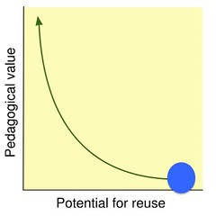

The idea that everyone should know how to code is increasingly dominant and increasingly questioned. In terms of a required skill that everyone should know, I remain sitting on the fence. But if you are currently teaching in a contemporary university where e-learning (technology enhanced learning, digital learning, online learning, choose your phrase) forms a significant part of what you do, then I think you should seriously consider developing the skill.

If you don't have the skill, then I don't know how you are surviving the supreme silliness that is the institutionally selected and mandated e-learning environment. And, at the very least, I've been able to convince [Kate](https://www.linkedin.com/pub/kate-ames/16/aa2/3b4)

https://twitter.com/Kate\_Ames/status/601200435957923841

Which means I think it's a good step when [Alex](http://alexgilbey.weebly.com/home/decoded-learning) and [Lisa](https://lisaaurisch.wordpress.com/2015/08/09/beginning-my-learning-journey/) have decided to learn a bit of "coding" as the "as learner" task for netgl. I might disagree a little about whether "HTML" counts as coding (you have to at least bring in Javascript to get there I think), but as a first step it's okay.

### Why should a (e-)teacher know how to code

(Sorry for using "e-teacher", but I needed a short way to make clear that I don't think all teachers should learn to code. Just someone who's having to deal with an "institutionally selected and mandated e-learning environment" and perhaps those using broader tools. I won't use it again)

What reasons can I give for this? I'll start with these

1. Avoid the starvation problem.
2. Avoid the reusability paradox.
3. Actually understand that digital technologies were meant to be protean.
4. Develop what Schulman (1987) saw as the distinguishing knowledge of a teacher,

### The starvation problem

Alex's reasons for learning how to code touch on what I've called [the starvation problem](/blog2/2015/06/16/types-of-e-learning-projects-and-the-problem-of-starvation/) with e-learning projects. Alex's description was

> our developers work with the code. This is fine, but sometime…..no…often, when clients request changes to modules they have paid tens-of-thousands of dollars for, I feel the developers’ time is wasted fixing simple things when they could be figuring out how to program one of the cool new interactions I’ve suggested. So, if I could learn some basic coding their time could be saved and our processes more efficient.

  
   by  [Photographing Travis](https://www.flickr.com/people/photographingtravis/) 

The developers - the folk who can actually change the technology - are the bottleneck. If anything needs to change you have to involve the developers and typically most institutions have too few developers for the amount of reliance they now place on digital technologies.

In the original [starvation problem post](/blog2/2015/06/16/types-of-e-learning-projects-and-the-problem-of-starvation/) I identified five types of e-learning projects and suggested that the reliance on limited developer resources meant that institutions were flat out completing all of the necessary projects of the first two types. Projects of types 3, 4, and 5 are destined to be (almost) always starved of developer resources. i.e. the changes to technology will never happen.

| # | Description |
| --- | --- |
| 1. | Externally mandated changes. |
| 2. | Changes arising from institutional strategic projects. |
| 3. | Likely (strategic) projects that haven't registered on some senior managers radar |
| 4. | Projects that only a sub-set of institutional courses (e.g. all of the Bachelor of Education courses) will require.  How can we be one university if you have different requirements?   |
| 5. | Changes specific to a course of pedagogical design. |

For a teacher, it's type 4 and 5 projects that are going to be of the immediate interest. But these are also the projects least likely to be resourced. Especially if the institution is on a consistency/"One University" kick where the inherent diversity of learning and teaching is seen as a cost to be minimised, rather than an inherent characteristic.

### Avoid the reusability paradox

The question of diversity and its importance to effective learning (and teaching) brings in the notion of [the reusability paradox](/blog2/2015/04/21/where-does-the-lms-sit-in-the-reusability-paradox/). The [Reusability Paradox](http://cnx.org/contents/dad41956-c2b2-4e01-94b4-4a871783b021@19/The_Reusability_Paradox) arises from the idea that the pedagogical value of a learning object (something to learn with/from) arises from how well it has been contextualised. i.e. how well it has been customised for the unique requirements of the individual learner. The problem is that there is an inverse relationship between the pedagogical value of a learning object and the potential for it to be reused in other contexts.

The further problem is that most of the e-learning tools (e.g. an LMS) are designed to maximise reuse. They are designed to be used in many different contexts (the image to the right).

The problem is that in order to be able to maximise the pedagogical value of this learning object I need to be able to change it. I need to be able to modify it so that it suits the specifics of my learner(s). But as we've established above, the only way most existing tools can be changed is by involving the developers. i.e. the scarce resource.

Unless of course you can code. If you can code, then you can write: a [module for Moodle](https://moodle.org/plugins/view/mod_bim) that will allow students to use blogs outside of Moodle for learning; a script that will allow you to [contact students who haven't submitted an assignment](/blog2/2015/06/16/types-of-e-learning-projects-and-the-problem-of-starvation/); [develop a collection of tools](http://damos.world/2013/08/30/the-moodle-activity-viewer-mav-heatmaps-of-student-activity/) to better understand who and how learners are using your course site; or, [mutate that collection of tools](/blog2/2015/07/23/updating-more-student-details/) into something that will allow you to have some idea what each of the 300+ students in your course are doing.

### Understand the protean nature of digital technologies

  
   by  [jeanbaptisteparis](https://www.flickr.com/people/jeanbaptisteparis/) 

And once you can code, you can start to understand that digital technologies aren't meant to be Procrustean tool that is ["designed to produce conformity by violent or ruthless methods"](http://www.thefreedictionary.com/Procrustean). But instead to understand the important points made by people such as the gentlemen to the left - Doug Englebart and Alan Kay. For example, Kay (1984) described software as the "most protean of media" and suggested that it was obvious that

> Users must be able to tailor a system to their wants (p. 57)

### The knowledge base for teaching

Shulman (1987) suggested that

> the key to distinguishing the knowledge base of teaching lies at the intersection of content and pedagogy, in the capacity of a teacher to transform the content knowledge he or she possesses into forms that are pedagogically powerful and yet adaptive to the variations in ability and background presented by the students (p. 15)

If the majority of the teaching you do is mediated by digital technologies, then doesn't the ability to transform the digitial technologies count as part of the "knowledge base of teaching"? Isn't coding an important part of the ability to perform those transformations? Shouldn't every teacher have some ability to code?

I'm not ready to answer those questions yet, still some more work to do. But I have to admit that it's easier (and I believe effective) for me to teach with the ability to code, then it would be without that ability.

### References

Kay, A. (1984). Computer Software. Scientific American, 251(3), 53–59.

Shulman, L. (1987). Knowledge and teaching: Foundations of the new reform. Harvard Educational Review, 57(1), 1–21. Retrieved from http://her.hepg.org/index/J463W79R56455411.pdf