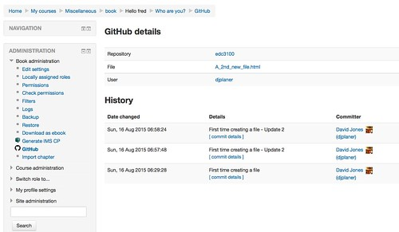

---
categories:
- moodleopenbook
date: 2015-08-20 11:15:08+10:00
next:
  text: Refining a visualisation
  url: /blog/2015/08/21/refining-a-visualisation/
previous:
  text: Visualising locations of students etc
  url: /blog/2015/08/18/visualising-locations-of-students-etc/
title: github and the Moodle - Step 3
type: post
template: blog-post.html
---
Time to follow up [step 2](/blog/2015/08/16/github-and-the-moodle-book-step-2/) in connecting github and the Moodle book module.

## Current status

1. Initial Book tool set up and a [github repo](https://github.com/djplaner/moodle-booktool_github) created.
2. Identified a PHP client for the github api that looks useful.
3. [Explored](/blog/2015/08/14/bringing-github-and-the-moodle-book-module-together-step-1/) how to complete various required tasks with that API from command line php.

## To do here

1. Consider how the status or relationship between github and book are displayed/tracked.
2. Refine the design of how the book tool will work with the github api.
3. Some initial implementation.

## How might the status be tracked

I haven't explored the github API enough. What are the ways you might keep a track of the relationship between github and book versions of the file

- Create a github repo on the Moodle server and use git. **No** This isn't a good idea for a few reasons. Can't see too many Moodle instances wanting random local repos set up for each book. Plus the current model here is that the book is linked to one file in a repo. Meaning you might create locally the whole repo to get one file.
- Compare sha. Git creates a checksum. I guess in theory a checksum of the local book could be produced and compared. However, it appears you can't a file's sha from github without also getting the content. Also calculating the local sha might also be heavyweight (if possible to do in an equivalent way). Don't want to be doing this each time a author views a book chapter.
- Commits? Keep a track locally of the version/commit that was last imported into the book. Then do a test for later commits. Again this would have to be done each time someone viewed a book chapter.

### Testing commits

This code \[code lang="php"\] $commits = $client->repos->commits->listCommitsOnRepository( $owner, $repo ); \[/code\]

Returns an object of about 50Kb on a fairly small and inactive [repository](https://github.com/djplaner/edc3100). But it is returning commits on the whole repository. You can refine the path.

Specify the file's path (information the book tool would have) and it's down to 16.47

That information includes the sha(s) for all the commits and also the dates when the commit was done (and by whom). The Book module maintains a

**Point:** This information would be useful to display on the status page.

## Clarifying the design

Assume that the author has just created a book resource on a Moodle install that has the github book tool installed.

1. Empty book - no github connection. Beyond the normal empty book interface, the author also sees something like the "GitHub (off)" link in the Administration block as shown [in this image](https://www.flickr.com/photos/david_jones/19910790803/in/dateposted-public/).
2. Turn the github link on Clicking on the GitHub link opens a new page that will show
    - Basic information about the tool and how it works (and pointers to more detailed information).
    - Space to enter the required details, including
        - the author's github username
            
            Will need to explore oAuth
            
        - name of the repo
        - name of the file to link **Note:** this will need to be able to handle specifying an existing file in the repo (which in a perfect world would have a a nice gui interface to do - but time won't allow that - even the OERPub editor didn't do that) or choose to create a new file based on the book.
            
            There'll be a different workflow from here depending on which of these. I'll focus here on connecting to an existing file.
            
3. Github link configured and turned on Details about the link have been entered correctly, checked and now the tool displays details about the status of the file. The details will need to be entered into a book tool database. At this stage I don't think it will have imported anything. Just display a list of details about the file. At this stage the author has the option to import the file after checking. The author should have the following choices
    1. Which file to import In most cases there will be multiple versions of files in the repo. The display should show details of all of them and allow the author to choose which to import.
    2. How to import There's the question of how to import. i.e. add the contents of the file to the end of the book, to the start of the book, or to overwrite. Of course, this complicates coding. Especially in terms of committing changes back to the repo. Does the whole book (including the stuff that used to be there) get committed, or just the most recent? Initially, there may not be any choice how to import. All or nothing. What about merging/updating? Purely updating could be done by overwrite, but merging is different. i.e. I've made changes in the book and someone else has made changes in github and I'd like to merge those changes into the one file. At this stage, I'm leaning towards putting the onus back on github and keeping the book tool dumb. Makes it easier to implement and maintain at the cost of making it harder for the author - they need to know github to handle this case.
4. File being imported. Clicking the "import" button starts the overwriting process (or a choice of import strategy if provided). The following screen will show the outcome of that process. What it shows might include
    - Whether or not the file was in a format that could be imported.
    - If there were any errors in the format. (these first two are related)
    - The number of chapters/sub-chapters etc that were found.The book tool table should be updated to store the date associated with the commit that was imported. Perhaps the SHA should also be stored to allow working on old versions of the file.
5. Return to the normal book view Time to check out the imported book. The Book administration block should now display a link to the file on github that was imported and some indication of the relationship of the contents of the book. Options are
    
    - [clean](https://www.flickr.com/photos/david_jones/19909046764/in/dateposted-public/) - i.e. the book and github version are the same.
    - [ahead](https://www.flickr.com/photos/david_jones/20344990589/in/dateposted-public/) - i.e. the book version has been modified.
        
        This would include a link to push the changes back to the repo
        
        If the author has chosen to use an old version of the file for the book and has then changed the book, this is going to create issues for github (I believe). The tool may have to detect this and suggest that the author handle this via github. Will need to explore more.
        
    - [out of date](https://www.flickr.com/photos/david_jones/20344990349/in/dateposted-public/) - i.e. the github version has been modified.
        
        This would include a link to pull the changes from the repo and update the book.
        
    - [both ahead and out of date](https://www.flickr.com/photos/david_jones/20531711885/in/dateposted-public/)
        
        The [initial design image](https://www.flickr.com/photos/david_jones/20531711885/in/dateposted-public/) had this situation having links to both pull and push. Instead, this might need to be a link to "merge". Where that would be some advice on how to use github to do the merge.
        
    
    This would be calculated by using
    
    - the commit dates for the file from github Would need to include the sha of the file to work with a particular version. This will need to be retrieved everytime the book is viewed, just in case it's been changed.
    - The "timemodified" field in mdl\_book Which I assume is kept up to date.

## Initial implementation

The main aim here is to test some of my assumptions around how the github communication will work. For now, I'm going to ignore broader questions such as the github tools database requirements (I'll hard code specific information for now) and the actual import/export process.

The focus will be on

1. Implementing an initial status page.
2. Getting the link in the Book administration to change

### Initial status page

Aim here is that a click on "GitHub" in the Book administration block will take the author to a page that shows the status and details of the file that's currently linked to the book. Test out the use of the github api and performance etc.

And with a bit of kludging a connection is made and the content is displayed.

Time now to look at the commits, start thinking about the structure of the code, and the HTML.

Starting to put the github API calls into the lib.php file. Abstract that away hopefully.

A lot of the data via the API is returned via JSON that is converted into hash arrays in PHP. Wondering if there's some neat way of transforming those arrays into tables in Moodle? In PHP? [Mustache templates](https://docs.moodle.org/dev/Templates) are coming, but perhaps a bit too new to use?

Let's checkout the [Output API](https://docs.moodle.org/dev/Output_API) and renderers - but I can't figure out how to get the render call to work. And it may not be able to as the Book module itself doesn't use a renderer.

Back to more primitive approaches and have a bit of tinkering and exploring with both Moodle development and the github client we have a version of the github book tool that is talking to github. But only getting some initial information from github, not yet importing anything useful into the book. It looks like this

The "History" section is all information retrieved from github for a specific file in a specific repository. It shows a list of all the commits on that file. When the commit was made, what the commit message was, a link to the HTML page on GitHub that shows more information on the commit, and the details of the person who made the commit.

The idea is that the github book tool will eventually

- If the book resource is linked to one of these commits
    - Highlight which of the commits (if any) is the current link to the book resource.
    - Indicate whether the book is up to date, ahead, or behind the version in github.
    - Provide links to the github book tool to take appropriate action (push, pull etc). based on the status
- If the book resource is not yet officially linked to one of these commits
    - Provide a link to the github book tool to make the connection.
- If the github book tool couldn't access information from github
    - Attempt to diagnose the problem and display information about why
    - Ask for github credentials if required
        
        Raising a whole range of issues to consider (how to store passwords, oAuth?).
        

Current focus is to have a largely working prototype to show people, get feedback, and test out major sticking points. Thus, next steps to do include

- oAuth. Will be required if we want people to be able to use private repositories and should probably be required for commits back to github
- Working with any commit. Should (yes I think) and can the github book tool allow the user to work with any commit.
- Status. Have the github book tool be able to discover whether the current book is up to date, ahead, or behind the repo.
- Responsive administration link Have the github book tool link in the Book adminstration block show the status.
- Commit. Github book tool can commit to the repo. (Initially working with a simple import/export from the Moodle tables)
- Pull. Book tool can pull from the repo. (Initially working with a simple import/export from the Moodle tables)

- Identify format. Need to identify a format for the single file that is stored on github. A single HTML file. Will need to identify chapters and sub-chapters.
- Implement import/export. Allow data to actually flow from github and Moodle.
- Consider additional modifications. A straight dump from Moodle isn't going to produce a file useful outside of Moodle. e.g. a link from one chapter to another chapter in Moodle, isn't going to work as expected in the single file. Import/export will need to do some form of translation.
    
    There are other translations that may also be useful. e.g. the single HTML file might use a standard CSS link to allow display out of Moodle. Going into Moodle remove this, going out of Moodle include it. Identifying other Moodle specific links, perhaps identifying them with a specific CSS class that will make them obvious out of Moodle.