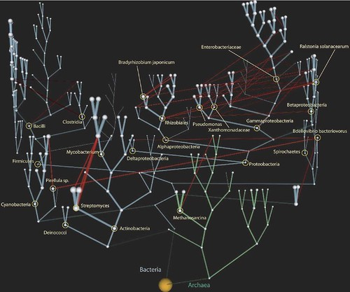

---
categories:
- bad
- dejavu
- e-learning
date: 2015-09-05 16:30:42+10:00
next:
  text: How NGL can inform my role as teacher
  url: /blog/2015/09/07/how-ngl-can-inform-my-role-as-teacher/
previous:
  text: 'Educational technology: deja vu all over again'
  url: /blog/2015/09/03/educational-technology-deja-vu-all-over-again/
tags:
- netgl
title: Design of a BAD approach to developing TPACK
type: post
template: blog-post.html
comments:
    - approved: '1'
      author: damoclarky
      author_email: d.clark@cqu.edu.au
      author_ip: 118.211.203.11
      author_url: null
      content: "Hi David,\n\nQuite an ambitious project.\n\nAs I was approaching the section\
        \ on 'forking', I too was thinking about the distributed nature of modern version\
        \ controls systems such as git, which I assume is the origin of the term 'fork'\
        \ in this context.\n\nA few random thoughts, particularly relating to some of\
        \ your questions and unexplored challenges.\n\nNaturally (and unsurprisingly I'm\
        \ sure), I'm immediately drawn to the issue of security.  This type of arrangement\
        \ of shared and distributed model is ripe for exploitation by all sorts of nefarious\
        \ characters.\n\nI am reminded of a distributed model as an alternative to the\
        \ central authority model, such as is used with digital signing authorities and\
        \ so on.  There is the 'web of trust' model that is used where trust relationships\
        \ between individuals/peers are made by digitally signing each other's public\
        \ keys.  By degrees of separation, levels of trust can be calculated.  This type\
        \ of model might be a reasonable fit for ensuring that vines you are engaging\
        \ with and 'forking' from are trustworthy.\n\nI still see some limitations and\
        \ examples of the design being shackled to hierarchy.  For instance, the approach\
        \ of forking while allows distribution, ultimately results in tree-like structures.\
        \  It is github - a centralised/commercialised implementation of a distributed\
        \ VCS - git.\n\nThe following passage also doesn't really diverge from the hierarchical\
        \ tree type model that you are attempting to avoid:\n\n\"If the \u201Cscript\u201D\
        \ supported multiple \u201Cdatabase\u201D pages that would offer support for an\
        \ individual to support the multiple identifies. e.g. as a member of my institution\
        \ I might want to use the institutional \u201Cdatabase\u201D. But as some teaching\
        \ Education students, I would also like to have an Education \u201Cdatabase\u201D\
        . As someone teaching the course EDC3100, I might also like to have an EDC3100\
        \ \u201Cdatabase\u201D.\"\n\nI am thinking that I would want to know what my peers\
        \ are using, and fork from their scripts, rather than traverse a hierarchy starting\
        \ with the institution down to the individual.  This point links back to my mention\
        \ of the web of trust.  For example, I often talk to peers about what addons they\
        \ use in their browser, and discover some gems that I would probably not otherwise\
        \ know about.  Of course this is not done via technology but by hallway conversation.\
        \  The point is the source or inspiration of new scripts would come from trusted\
        \ individuals from potentially disparate vines (such as other lesser institutions\
        \ like USQ :) ).  Not the root of the tree (especially with what institutions\
        \ would typically offer).\n\nIn terms of sharing 'scripts', my first thought was\
        \ re-invigorating the dying RSS feeds approach and use syndication.  So here is\
        \ a feed of what scripts my friends are using.  In this way, it doesn't really\
        \ matter what underlying technology is used as the source of the scripts, provided\
        \ they conform to the agreed RSS feed format.  Of course, this could be taken\
        \ a step further in creating an API that is a subset of RSS. Another approach\
        \ is simply an API outright, which is the modern approach to sharing.\n\nOf course\
        \ this is on the basis of having not read anything about SFWs.  I'm afraid the\
        \ term 'wiki' doesn't fill me with excitement these days.\n\nDamo."
      date: '2015-10-30 14:29:22'
      date_gmt: '2015-10-30 04:29:22'
      id: '1420'
      parent: '0'
      type: comment
      user_id: '0'
    
pingbacks:
    - approved: '1'
      author: How NGL can inform my role as teacher | The Weblog of (a) David Jones
      author_email: null
      author_ip: 192.0.86.78
      author_url: https://davidtjones.wordpress.com/2015/09/07/how-ngl-can-inform-my-role-as-teacher/
      content: '[&#8230;] last post before this one outlines a &#8220;system&#8221; that
        I&#8217;d like to implement that I think is [&#8230;]'
      date: '2015-09-07 12:04:13'
      date_gmt: '2015-09-07 02:04:13'
      id: '1416'
      parent: '0'
      type: pingback
      user_id: '0'
    - approved: '1'
      author: Requirements, solutions, design, and who should decide | The Weblog of (a)
        David Jones
      author_email: null
      author_ip: 192.0.86.68
      author_url: https://davidtjones.wordpress.com/2015/09/09/requirements-solutions-design-and-who-should-decide/
      content: '[&#8230;] Second, recognise that increasingly people are often using the
        same digital space. Design the digital space so that &#8220;serendipitous exchanges&#8221;
        can take place in the digital space. That&#8217;s one of the aims of this project.
        [&#8230;]'
      date: '2015-09-09 18:06:55'
      date_gmt: '2015-09-09 08:06:55'
      id: '1417'
      parent: '0'
      type: pingback
      user_id: '0'
    - approved: '1'
      author: 'University e-learning: Removing the context and adding the sediment | The
        Weblog of (a) David Jones'
      author_email: null
      author_ip: 192.0.81.171
      author_url: https://davidtjones.wordpress.com/2015/10/01/university-e-learning-removing-the-context-and-adding-the-sediment/
      content: '[&#8230;] The talk also briefly touched on the idea of a CASA for CASA.
        This idea was previously described in a post looking at a BAD approach to developing
        distributed TPACK. [&#8230;]'
      date: '2015-10-01 12:50:42'
      date_gmt: '2015-10-01 02:50:42'
      id: '1418'
      parent: '0'
      type: pingback
      user_id: '0'
    - approved: '1'
      author: What is &#8220;netgl&#8221; and how might it apply to my problem | The Weblog
        of (a) David Jones
      author_email: null
      author_ip: 192.0.100.240
      author_url: https://davidtjones.wordpress.com/2015/10/08/what-is-netgl-and-how-might-it-apply-to-my-problem/
      content: '[&#8230;] This recent post is my attempt to answer at least this question
        from above How can institutional learning and teaching support engage with the
        situated nature of TPACK and its development? [&#8230;]'
      date: '2015-10-08 14:21:41'
      date_gmt: '2015-10-08 04:21:41'
      id: '1419'
      parent: '0'
      type: pingback
      user_id: '0'
    - approved: '1'
      author: The CSCW view of Knowledge Management | The Weblog of (a) David Jones
      author_email: null
      author_ip: 192.0.83.104
      author_url: https://davidtjones.wordpress.com/2015/10/30/the-cscw-view-of-knowledge-management/
      content: '[&#8230;] All this is especially interesting to me due to my interest
        in exploring the design and impact of distributed means of sharing knowledge about
        digital learning [&#8230;]'
      date: '2015-10-30 16:19:47'
      date_gmt: '2015-10-30 06:19:47'
      id: '1421'
      parent: '0'
      type: pingback
      user_id: '0'
    
---
Two of my recent publications ([Jones & Clark, 2015](/blog/2014/09/21/breaking-bad-to-bridge-the-realityrhetoric-chasm/); [Jones, Heffernan & Albion, 2016](/blog/publications/)) seek to explore and identify the problems faced by teachers in developing the knowledge necessary to teach in e-learning/digital learning environments. Both suggest that there are significant problems with how this is currently done and offer some theoretical suggestions about how it might be improved. Jones & Clark (2015) suggest that [the BAD/SET mindsets](/blog/2014/09/21/breaking-bad-to-bridge-the-realityrhetoric-chasm/#badset) offer one way to understand the problems of the current approaches, and outline some fruitful ways forward.

This post is an attempt to describe in broad details of a system that could potentially enable a much greater use of the BAD mindset within what passes for institutional e-learning environments (and perhaps beyond). The system, is really a collection of different current technologies, including:

- Greasemonkey or other approaches to client-side scripting;
- Smallest Federated Wiki; and,
- APIs and API-centric architectures.

Some form of screen-scraping web-automation might also be added to this list, as might other technologies. But the three above is a start.

See the abstract of [this presentation](/blog/2013/05/12/moodle-bim-reflective-journals-and-tpack-suggestions-for-moving-beyond/) for an explanation of TPACK and Jones et al (2016) for an argument for ["distributed TPACK"](/blog/publications/)

## Basic Aim

The division of responsibility for all elements of e-learning and learning about e-learning are currently organised and operate as a tree. Each of software development, instructional design, graphic design, copyright, staff development, teaching, and other related tasks are located in different parts of the organisational hierarchy. Learning itself is organised as a tree. Students enrol in programs (e.g. Bachelor of Education) which is divided up into years (e.g. first year, second year etc) and then into courses and then into semesters and weeks. The end result is a series of separate black boxes that rarely or easily share the knowledge they produce. The hierarchy is extends beyond institutions. Many institutions might be using the [Moodle LMS](http://moodle.org), but they will typically be black boxes that rarely or easily share their knowledge with other institutions.

The aim of this "system" is to:

1. enable the creation and sharing (or not) of new connections within the hierarchy of systems, people, and responsibilities that make up organisational e-learning and beyond;
2. make it easier to combine disparate nodes and connections into single "black boxed sub-networks" that can be shared, viewed, modified, and re-shared by anyone;
3. by anyone;
4. in order to improve the quality of the knowledge about how best to undertake e-learning.

### A metaphor

Most people are familiar with the organisation of species of organisms into evolutionary trees (aka [Phylogenetic trees](https://en.wikipedia.org/wiki/Phylogenetic_tree)), suggested very early on by Darwin.

    by  [jcraveiro](https://www.flickr.com/people/jcraveiro/) 

 

However, more recent work has suggested that trees aren't all that effective in capturing the full complexity of what is going on. Biologists have started talking about the "net of life". Or as described [here](http://www.talkorigins.org/faqs/macroevolution.html), the tree is still the main way to describe the evolution of species

> but the "tree" now has "vines" that hang across the branches

As shown in the following from [Kunin et al (2005)](http://www.ncbi.nlm.nih.gov/pmc/articles/PMC1172039/)

    by  [David T Jones](https://www.flickr.com/people/david_jones/) 

## How it might work

The following outlines how this system might work, the technology that might be used to implement it, and the benefits it might bring.

### 1\. Install the "script"

The first step is to install some form of client (browser) side script (e.g. [Greasemonkey](https://en.wikipedia.org/wiki/Greasemonkey)) . The idea is that the "vines that hang across the branches" will be revealed by this script (aka [augmented browsing](https://en.wikipedia.org/wiki/Augmented_browsing)). Hence the assumption is that participation in this "net of e-learning" is dependent upon using a web browser and this script.

You might also need to configure the script to point to a particular "database" or three.

### 2\. Use the script

Normally the script doesn't make any difference to what you see when browsing the web. You just continue using the web browser as you normally do. However, the script has been configured to look out for specific types of URLs. When it sees these URLs it will allow you to see the vines, it will augment your browsing.

The types of URLs/web pages it would be on the look out for is any page for which you and the other members of your network (perhaps within an organisation, but also across different organisations) use for learning and teaching. Some possible examples might be:

- A discussion forum (or any other component) in Moodle (or some other LMS).
- The object repository used by your organisation.
- The dashboard for a Wordpress blog (or any other web page).

### 3\. View the vines/scaffolds

When such a page is detected, the script will add a user interface element to the page. Perhaps in the form of a pop-up window or something embedded in the page. The form itself should eventually be configurable, but the basic aim is to be easily visible, but without cluttering up the interface of the page.

The interface element should give you a visual overview of all of the "vines" (scaffolds) that have been hung across the tree. These vines might include (examples of some given below):

1. Collections of helper applications, [skins](https://en.wikipedia.org/wiki/Skin_%28computing%29), recipes, and other "code" that can be used to automate, extend, and customise the page being viewed and its related functionality.
2. Pointers/details of people who have recently or heavily used this particular page (as a potential source of help).
3. Relevant support resources. At some level this mirrors (but extends) the context sensitive help available in Moodle (and I assume other LMS). e.g. rather than sending an email containing a 9 page Word document with instructions on how to create a supplementary assessment and expecting people to store it ready for use when they have to do this task. Embed a link to the information on the assessment activity in Moodle.
4. A method for asking and answering questions about the specific page.
5. A method for recording [critical incidents](https://en.wikipedia.org/wiki/Critical_Incident_Technique).

No need that all these vines be visible, or that these are the only possible vines.

The script would probably tend to

1. Provide a brief summary of the status of each vine that you can view at a glance.
2. Provide access to a different, expanded interface to perform specific tasks.

### 4\. Select, and use helper applications

A key vine that I'm interested in is the idea of "helper applications". i.e. small scripts/applications that add value to the functionality of the current page/service. This idea is linked to the idea of the [Reusability Paradox](/blog/2015/04/21/where-does-the-lms-sit-in-the-reusability-paradox/) and [the Starvation Problem of e-learning](/blog/2015/06/16/types-of-e-learning-projects-and-the-problem-of-starvation/).

These helper applications would potentially cover a wide array of functionality and complexity. The following examples illustrate some initial categories

- customise; e.g. a couple of lines of jQuery that allow you to change the menu in the institutionally provided course template to something that's useful.
- extend; and e.g. [a Greasemonkey script](http://dralb.albion.id.au/?p=4429) that adds a table of statistics about marker progress to the Moodle assignment activity.
- automate. e.g. rather than provide a 9 page Word document containing instructions on how to perform some task with an LMS. Add a [Wizard](https://en.wikipedia.org/wiki/Wizard_%28software%29) that steps the user through the process.

The details of the technical implementation of these helper applications would tend to be less important than the intent being that any individual end user can decide whether or not to install/user a particular helper application. It's not a question for the institutional committee to meet and decide what's best for everyone.

Greasemonkey like scripts would be one technical approach, as used by the markers progress example above. Automation might be implemented by some form of web scraping.

Implementation would be significantly aided by the increasing prevelance of [API-centric architecture](http://apigee.com/about/blog/technology/api-centric-architecture-all-development-api-development).

**Pedagogical skins**

From a purely selfish perspective, I am personally interested "helper applications" that act as pedagogical skins. i.e. applications that customise, add, and combine the basic functionality of most basic online tools into something that is more specifically designed to support the particular learning activities. e.g. a pedagogical skin that leverages the Moodle discussion forum into a debate forum. Or another skin that adds various types of notification and awareness (Carroll et al, 2003) or learning analytics interventions (Wise, 2014).

### 5\. Contribute a helper application

The intent is that not only is the adoption decision up to the individual, but the development decision is also. The point here is that - to paraphrase the words of Anton Egon - not everyone is going to be able to code, but the great ideas about what to code can come from anywhere.

The idea is that this system is helping anyone to make changes to it, not just the people within the IT governance structure. The aim is to move the ability to customise and code from a tree to a network. Or, as more correctly pointed out by @s\_palm, to move from a hierarchical network to an open network.

https://twitter.com/s\_palm/status/640070756873834496

### 6\. Configure/reconfigure the "script"

This approach of providing the individual with control over this system extends to the ability to re-configure the "script" that drives all this. i.e. you can control which URLs are of interest to you. You're not limited to whatever your organisation has decided.

This is where I think the [Smallest Federated Wiki](http://fed.wiki.org/view/welcome-visitors) can play a role.

The core "script" for this conception would probably be limited to the following task:

> When a URL "of interest" is visited, display something

Meaning that the two key bits of data are

1. Which URLs are of interest
2. What is the something to display for this URL.

Traditionally, this type of information would have been stored in a database of some description. A database that is under the control of some person or organisation. Once again bringing us back to a tree structure. How do you remove this barrier?

This is where Smallest Federated Wiki (SFW) enters the picture. It's a Wiki, but not as you know it. It has a number of features that offer great potential for this "system". @hapgood's [Smallest Federated Wiki as an Alternate Vision of the Web](http://hapgood.us/2014/06/04/smallest-federated-wiki-as-an-alternate-vision-of-the-web/) gives much more detail. I'm going to focus on two features particular relevant to this idea.

**Everything on a SFW page is data**

Rather than just store text. Each paragraph on a SFW page is a little bit of [JSON data](https://en.wikipedia.org/wiki/JSON) plus a link to instructions how to display that data. This feature of SWF is designed to make it easier to bring data into SFW. I assume that this meant there would be options for taking data out of SFW?

Only after starting on this post did I stumble across [this post from @hapgood](http://hapgood.us/2015/04/24/the-simplest-federated-database-that-could-work/) that explains and has a video demonstrating how to use SFW as a "database". The video pointed me to something I'd missed before, at the bottom of each SFW page you will find a link to the JSON data for that page. i.e. where an external application could extract the data.

This means that pages in a SFW could be used to store the data about which URLs are of interest and what to display, rather than a database. To add a new URL of interest or change what to show, you would edit the page on SFW.

Now this could get quite large and cumbersome. There is a reason why people use databases to store data. This is one of the problems with this approach that will have to be considered.

However, SFW data is managed/displayed via plugins (e.g. [this video](https://vimeo.com/33131381) that illustrates a SFW plugin that is an expenses calculator and [this from @hapgood](http://hapgood.us/2014/06/20/smallest-federated-wiki-as-a-universal-json-canvas/) on SFW as a universal canvas. This offers some potential for writing plugins to help keep a handle on this problem. e.g. one of the plugins might allow a list of URLs to be specified in a another data source so that not every URL has to be shown on one page. That other data source might be another SFW page, or it might be a database or any other data store.

But doesn't that get back to the tree problem? That's where the next feature of SFW enters the picture.

**Every page on SFW has a "fork" button**

When you edit a SFW page (whether it's yours or from someone else) the original SFW page is forked. Your SFW takes a copy of the data and stores it on your server. There are links back to the original page and the original author is able to see if someone has forked their wiki page and make decisions about incorporating those changes back into the original.

The video [in this post](http://hapgood.us/2014/06/18/one-minute-federated-wiki-pulling-something-from-twitter/) from @hapgood shows this in action.

Assuming that the "script" for this system allows the configuration of the URL for the SFW page "database", then anyone with a SFW could fork a "database" page and customise it to their needs. Inheriting all the data from the original page and adding their own. They could then configure the script to use this new "database", either instead of, or as well as the original. If appropriate, the author of the original "database" might accept the customisations back into the original.

Each person/group involved can make their own decisions about what "vines" they want to see.

If the "script" supported multiple "database" pages that would offer support for an individual to support the multiple identifies. e.g. as a member of my institution I might want to use the institutional "database". But as some teaching Education students, I would also like to have an Education "database". As someone teaching the course EDC3100, I might also like to have an EDC3100 "database".

By forking the SFW database anyone can re-configure how this "script" would work.

Of course, raising questions about spam, and duplication and coordination between separate "databases" etc. But questions that can be explored.

## An institutional use case

Let's assume that my institution has built this system and is encouraging it's use. The process might go something like this:

1. Pre-population by the institution.
    
    Some appropriate central group might start by pre-populating the institution's SFW "database" page. It would probably focuses on URLs within the institutional LMS and other systems. The institution would probably go through various committees, working groups, and related palaver before coming up with the institution's quality assured and controled "database" page.
2. Dissemination to staff.
    
    (I'll focus on teaching staff, but the same could apply to students). Staff get an email with a pointer to the script. The script might be pre-configured to use the URL for the institutional SFW "database".
3. Installation and use by my colleagues and I.
    
    I decide to go with this and install it on my browser. I start using it. A couple of my colleagues in education start using it. Many of us in education make use of [the Australian Curriculum website](http://www.australiancurriculum.edu.au/). We want to start sharing stories, advice, and helper applications for using that site. How do we do this?
4. We fork the SFW page or create our own.
    
    Using my [SFW](http://fedwiki.djon.es/view/welcome-visitors) I might create a new Education database or fork the institutions. Either way my education colleagues and I re-configure the script so that it is pointing to the education database. This might be instead of, or as well as the original institutional SFW database page.
5. Education academics at other institutions see the value.
    
    Education academics at all Australian Universities would use the Australian Curriculum website. Perhaps some academics at other institutions here about what we're doing and are interested in participating. So they grab the script, configure it just to point to our education database page and start participating.
6. Participation continues.
    
    As outlined above participation potentially includes a range of activities, such as
    - Reading some advice on how to use a particular page.
    - Adding some advice on how to use a particular page.In some instances it might make sense to store this advice in SFW pages. But in others the advice may be URLs to existing online resources.
    - Participating in a forum talking about a particular page.The implementation of the forum is beyond this particular system. The SFW database page would just contain a URL to the forum and perhaps the script might know enough how to generate summary data from the forum to display.
        
        In an institution, the forum might be the formal IT helpdesk system.
    - Installing or contributing helper applications.Again, typically this script would only provide pointers to where these operations are performed (e.g. github)

And so on.

The aim of the system is to help create, manage, and traverse vines that hang across the tree the underpins e-learning. The intent is that this should be generative and highly contextually sensitive.

Would this work? Would people use it? Would you use it?

Lots of questions.

## References

Carroll, J. M., Neale, D. C., Isenhour, P. L., Beth Rosson, M., & Scott McCrickard, D. (2003). Notification and awareness: Synchronizing task-oriented collaborative activity. International Journal of Human Computer Studies, 58(5), 605–632. doi:10.1016/S1071-5819(03)00024-7

Jones, D., & Clark, D. (2014). Breaking BAD to bridge the reality/rhetoric chasm. In B. Hegarty, J. McDonald, & S. Loke (Eds.), Rhetoric and Reality: Critical perspectives on educational technology. Proceedings ascilite Dunedin 2014 (pp. 262–272). Dunedin. Retrieved from http://ascilite2014.otago.ac.nz/files/fullpapers/221-Jones.pdf

Jones, D., Heffernan, A., & Albion, P. R. (2015). TPACK as shared practice: Toward a research agenda. In D. Slykhuis & G. Marks (Eds.), Proceedings of Society for Information Technology & Teacher Education International Conference 2015 (pp. 3287–3294). Las Vegas, NV: AACE. Retrieved from http://www.editlib.org/p/150454/

Wise, A. F. (2014). Designing pedagogical interventions to support student use of learning analytics. In Proceedins of the Fourth International Conference on Learning Analytics And Knowledge - LAK ’14 (pp. 203–211). doi:10.1145/2567574.2567588