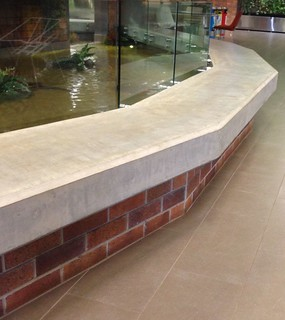
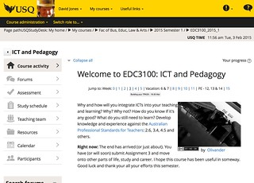

---
categories:
- computationalthinking
- elearning
- literacies
- tpack
date: 2015-09-10 13:25:47+10:00
next:
  text: Exploring Moodle's API
  url: /blog2/2015/09/13/exploring-moodles-api/
previous:
  text: Requirements, solutions, design, and who should decide
  url: /blog2/2015/09/09/requirements-solutions-design-and-who-should-decide/
title: What type of "digital knowledge" does a teacher need?
type: post
template: blog-post.html
comments:
    []
    
pingbacks:
    - approved: '1'
      author: Teachers as digital renovators? | The Weblog of (a) David Jones
      author_email: null
      author_ip: 192.0.81.49
      author_url: https://davidtjones.wordpress.com/2015/10/06/teachers-as-digital-renovators/
      content: '[&#8230;] colleagues and I are starting to wonder about what type of &#8220;digital
        knowledge&#8221; teachers might need. This is occurring in the context of a re-design
        of a Bachelor of Education. This [&#8230;]'
      date: '2015-10-06 18:27:27'
      date_gmt: '2015-10-06 08:27:27'
      id: '1424'
      parent: '0'
      type: pingback
      user_id: '0'
    
---
Apparently teacher education has a technology knowledge problem.

The [2015 Horizon Report for K-12](http://www.nmc.org/publication/nmc-horizon-report-2015-k-12-edition/) lists as it's second "Solvable Challenge" (defined as "Those that we understand and know how to solve") the problem of "**Integrating Technology in Teacher Education**".

It includes statements such as

> Teacher training still does not acknowledge the fact that digital media literacy continues its rise in importance as a key skill in every discipline and profession....training in the digital-supported teaching methods is still too uncommon in teacher education and in the preparation of teachers....the most important finding is that the level of a teacher’s digital competence directly correlates with students’ learning outcomes when technology is used

Given that teacher education typically happens within higher education a mention should also be given to the 2014 Horizon Report for Higher Education that identified as its number 1 "Solvable Challenge" that "**Low digital fluency of faculty**" and has some obvious connections

> Faculty training still does not acknowledge the fact that digital media literacy continues its rise in importance as a key skill in every discipline and profession...training in the supporting skills and techniques is rare in teacher education and non-existent in the preparation of faculty

The 2015 Horizon Report for Higher Education picks up this theme with "**Improving Digital Literacy**" as its number 2 "Solvable Challenge" and amongst other statements includes the following

> Lack of consensus on what comprises digital literacy is impeding many colleges and universities from formulating adequate policies and programs that address this challenge.

This is the problem the following tries to engage with.

_Aside:_ The Horizon Reports organise problems into three categories: solvable, difficult ("those we understand but for which solutions are elusive"), and wicked ("those that are complex to even define, much less address"). I have some significant reservations about the categorisation of these types of problems as solvable. If these problems are solvable, why is it that there is still a "lack of consensus on what comprises digital literacy"? Let alone examples of institutions that have successfully solved this problem?

## Our problem

I work in teacher education. I teach pre-service teachers a course titled ["ICT and Pedagogy"](http://www.usq.edu.au/course/specification/2015/EDC3100-S2-2015-WEB-TWMBA.html). At the moment, my colleagues and I are engaged in the process of re-designing our 4-year Bachelor's program in Education. It would seem an appropriate time to address the above "significant challenges".

### Different types of "digital knowledge" and "digital knower"

The literature is overflowing with labels and ideas about how to identify the type of "digital knowledge" and "digital knowers" that we're trying to develop. It involves labels such as: digital native/digital immigrant; digital resident/digital visitor/digital tourist; digital literacy; digital fluency; [multiliteracies](http://newlearningonline.com/multiliteracies); and, computational thinking.

  
   by  [bb\_matt](https://www.flickr.com/people/bb_matt/) 

As the 2015 Horizon Report suggests, there is an apparent "lack of consensus on what comprises digital literacy". It goes on further to suggest (emphasis added)

> definitions are broad and ambiguous. Compounding this issue is the notion that digital literacy encompasses skills that differ for educators and learners, as **teaching with technology is inherently different from learning with it**.

Personally, I tend to see the influence of [Maslow's Hammer](https://en.wikipedia.org/wiki/Law_of_the_instrument). People from a literacy background approach the question of the type of knowledge required in terms of communication and representation. Limiting what you can do with digital technologies to multimodal presentations. People from a coding background see computational thinking as the core. [Librarians see digital literacies](http://connect.ala.org/node/181197) as involving the ability to "find, evaluate, create, and communicate information".

Beyond that you have people who may not exactly live and breath in the new digital world making pronouncements on the importance or otherwise of various aspects of digital knowledge. For example, a recent review of the Australian Curriculum contained some reservations about the proposed "digital technologies" learning area that generated [this response](https://www.linkedin.com/grp/post/3889421-5927920750416646144) from one professional association. Not to mention some [recent comments](http://www.lifehacker.com.au/2015/05/tony-abbott-thinks-teaching-coding-to-kids-means-sending-them-to-work-at-age-11/) from the Australian Prime Minister.

Of course, there are also people who are engaged with the digital world who are questioning the value of coding to school children. For example, [Bron Stuckey](http://www.aare.edu.au/blog/?p=1076) is left with two big questions around teaching coding in schools

> Where should coding be positioned in the already overcrowded curriculum? And bottom line, where do we get the teachers with the knowledge and passion to teach it?

Rather than get drawn into the debate about whether students should be taught coding in school, the focus here is on what type of digital knowledge should teachers have in order to effectively teach?

## A metaphoric typology of place and tool

Back in 2011 I asked ["Residents and visitors, are builders the forgotten category?"](/blog2/2011/07/31/residents-and-visitors-are-builders-the-forgotten-category/). A question sparked by thinking about the Visitors and Residents typology proposed by [White & Cornu (2011)](http://firstmonday.org/article/view/3171/3049) (I paper I need to read again) for "individuals' engagement with the web". As a teacher who regularly used coding to enable the design of learning experiences, I wondered whether "builders" should be added. In [a comment](/blog2/2011/07/31/residents-and-visitors-are-builders-the-forgotten-category/#comment-100) @palbion wondered whether there was a place for "renovator/handyman/DIY enthusiast".

The aim here is to see if expanding the visitor/resident typology offers any value in understanding the breadth of "digital knowledge" and in turn identifying whether or not that offers any assistance in thinking about the type of "digital knowledge" that would be required and useful for a teacher. Especially if that teacher engages primarily in a digital learning space.

What follows is an initial attempt at expanding the White & Cornu (2011) visitor/resident typology. It has flaws, not the least of which is whether the "roles" added to this typology are defined in ways that fit with White & Cornu's original thinking. In particular, their comments on "technical aptitude"

> we do not consider the Visitor to be necessarily any less technically adept than the Resident. The concept of ‘technical’ aptitude should be viewed as more than simply an ability to manipulate hardware and software.

There are also questions to ask about whether these roles are distinct. Can you be a resident and not a decorator? Can you be a decorator and either a visitor or resident? And many more.

And importantly I'll echo White and Cornu's (2011) sentiment that this "typology should be understood as a continuum".

### Excluded visitor

There remain people who [are disconnected](http://www.usq.edu.au/learning-teaching/USQSalon/Farley) or excluded from participation in digital spaces, especially online digital spaces. While the proportion is reducing there will remain people who are excluded visitors.

  
   by  [Dallas1200am](https://www.flickr.com/people/blile59/) 

A potentially troubling factor in this is the balakanisation of the Internet, which apparently also goes under the name of [the splinternet](https://en.wikipedia.org/wiki/Splinternet). Increasingly "online spaces" are not freely open spaces where anyone can wander through. The online spaces used by many formal educational institutions have boundaries which exclude people. Some times the people that are excluded were once residents.

We already have this at Universities with the LMS. @timklapdor inspired the following from @s\_palm

https://twitter.com/s\_palm/status/631980504888115200

And it's not just the LMS. There's [Elke's comment](/blog2/2015/08/18/the-role-of-coding-in-learning-and-teaching/#comment-7398) about what she misses most about studying at University "Access to all of those journal articles!".

### Visitor

White & Cornu (2011) define visitors as being those that

> understand the Web as akin to an untidy garden tool shed. They have defined a goal or task and go into the shed to select an appropriate tool which they use to attain their goal. Task over, the tool is returned to the shed. It may not have been perfect for the task, but they are happy to make do so long as some progress is made. This is important, since Visitors need to see some concrete benefit resulting from their use of the platform. Significantly, Visitors are unlikely to have any form of persistent profile online which projects their identity into the digital space.

When it comes to institutional learning and teaching tools such as the LMS, can anyone ever be more than a visitor? Is it simply a place to visit, complete a task, and then exit? Is this part of the problem facing digital learning?

### Resident

White & Cornu (2011) describe residents as those that

> see the Web as a place, perhaps like a park or a building in which there are clusters of friends and colleagues whom they can approach and with whom they can share information about their life and work. A proportion of their lives is actually lived out online where the distinction between online and off–line is increasingly blurred. Residents are happy to go online simply to spend time with others and they are likely to consider that they ‘belong’ to a community which is located in the virtual. They have a profile in social networking platforms such as Facebook or Twitter and are comfortable expressing their persona in these online spaces. To Residents, the Web is a place to express opinions, a place in which relationships can be formed and extended.

Can you be a resident in a LMS? How does owning the space impact your sense of residency and ownership of that space? Should everyone own their own space, their own [personal cyberinfrastructure](http://er.educause.edu/articles/2009/9/a-personal-cyberinfrastructure) (and [this](http://www.educause.edu/eli/events/eli-annual-meeting/2015/adventures-personal-cyberinfrastructure-lessons-learned-piloting-domain-ones-own-four-camp))?

### Decorator

Decorators might be seen as residents that wish to extend their sense of belonging to/project more of their identity into a digital space by decorating that space. You can change the colour scheme, re-arrange the furniture, hang art on the wall, and put up new curtains.

The ability to decorate a space is more than simply having the knowledge to do so.

First, you need to have the permission and right to do this. You probably can't decorate a public space. If you're renting a space, the rental agreement probably limits what decoration you can undertake (no nails in the wall).

Second, the space needs to offer the affordances necessary for decoration. For example, you're probably not going to be able to re-located the concrete seating in the image to the right.

Does the amount of decoration (e.g. customising their profile) someone performs in an LMS give an indication of their sense of belonging to the space? Does it say anything about the perceived affordances of that space?

An example of decoration as a teacher might include what I've done with my digital course learning space. Thanks to the institution's standard look and feel it looks like the following. Including, pre-defined locations for all the furniture. e.g. the "Assessment" furniture is all located in a specific location (URL) and the "Assessment" item in the left-hand menu is the hall way to that institutionally defined location.

And that location sucks. As a space it provides far less than what I'd like to provide. So I redecorated.

I used jQuery to change where the "Assessment" item in the left-hand menu pointed to. It now points to a much more useful space for Assessment.

### Renovator

In the words of @hapgood, the concept of a [digital renovator](http://fedwiki.djon.es/view/welcome-visitors/view/digital-renovator)

> captures that idea - no one is just a resident of the digital world. We co-create the digital environment with others. We evolve with the environment in a never-ending cycle

And perhaps extends this co-creation beyond just using Facebook to share content or customising our Twitter home page to actually making changes to the environment. White & Cornu (2011) talk about both digital visitors and residents as using "'tools' such as online banking and shopping systems", but the distinction they make is that residents "also use the Web to maintain and develop a digital identity". A digital renovator may well be a tool user and maintain a digital identity, but they also use tools to significantly change the digital space.

An example of this would be @palbion's [creation of a Greasemonkey script](http://dralb.albion.id.au/?p=4429) to add functionality to the Moodle assignment submission activity. In particular, to enable the comparison of results from different markers. A script

> that runs over Firefox works on the Moodle assignment system page that lists submissions. It extracts names of markers and marks awarded and calculates means and standard deviations of marks overall and for each marker. It then formats those statistics in a table and injects that into the page.

A digital renovator is quite happy to put up a new set of shelves, knock down a wall, revamp the kitchen, and generally make changes to the digital space so that it better suits their purpose.

### (Owner) Builder

The distinction between digital renovator and digital builder may become increasingly blurred. It's a distinction that might be made based on at least two different criteria:

1. the complexity or novelty of what's being built; or, Tweaking an existing space (e.g. @palbion's Greasemonkey script above) is renovation, where as building is constructing a new space. This is perhaps a more meaningless distinction in the digital world where everything is linked.
2. who they are building for. This is where the idea of "owner builder" might be a better metaphor for teachers and learners in a digital space. They "own" the space but are adding something significant to it for their own purposes. Where as a builder is arguably a professional employed to construct spaces that will be utilised by others.

[The type of work](http://cogdogblog.com/2015/09/08/sort/) that @cogdog does with [ds106](http://ds106.us/) and elsewhere is probably the best example of a "teacher" builder. Though a builder who largely works outside the staid digital spaces of formal education.

Which is the space my "builder" work tends to occur. The main example is perhaps building the [BIM module](https://moodle.org/plugins/view.php?plugin=mod_bim) for Moodle that I use in my own teaching.

## Considerations and limitations

What follows are a few extra considerations/limtations around this typology.

### The problem with typologies

White and Cornu (2011) mention a number of disadvantages with typologies

> disadvantages focus principally on the inflexibility of types, as well as the tendency to box individuals into one type or another, overlooking contradictory evidence. Theories of learning styles favour typologies of this sort, as do certain theories of human development, and many struggle to allow individuals the space simultaneously to exhibit traits characteristic of different types.

But they also point out that there are also advantages

> benefits are that these categories allow others to use this new knowledge to augment the learning experience

### Avoid the teacher deficit model

Another problems with the above typology and the question that framed this whole post - What "digital knowledge" does a teacher need? - is that it appears to suggest that the whatever deficit of knowledge exists, it is a deficit on the part of the teacher. It's the teacher that is lacking the necessary knowledge. That this is the problem to fix, and that this is obviously done by training them more and better.

This is a very limited view of knowledge. As suggested by various types of distributive views of knowledge (e.g. [Jones, Heffernan and Albion (2015)](/blog2/2015/01/06/tpack-as-shared-practice-toward-a-research-agenda/)), knowledge isn't just within the head. It arises from the networks of people, tools, processes, policies etc. surrounding the teachers. The lack of knowledge or inability to "move up" the typology isn't just about the teacher's lack of knowledge and it won't be solved simply by more and better training.

## Questions

All this is still a work in progress and has generated additional questions for me. These are listed below.

What questions or problems has it generated for you?

My current questions

- Is there really a single type suitable for all teachers? (Of course, no).
- How and what can pre-service teacher education do to help build this knowledge? Is training enough? Walk the walk?
- Is it all about the formal teaching, what about the environment?
    
    e.g the idea that ["branding the LMS"](/blog2/2015/07/07/does-branding-the-lms-hurt-learning/) hurts learning/digital literacy.
    
- Beyond training, is there benefit in creating institutional, digital learning spaces that feel more like places you want to live, than hovels you wish to escape as quickly as possible?
- How do teachers and students perceive current digital spaces? What impact does this have on their self-perceived place in the typology?
- What would be the characteristics of a digital learning space where people wish to reside, rather than leave?
- Is there literature and research about teachers, teaching, and physical spaces that can help inform the space/tool metaphor that underpins this typology?
- Is it possible to map existing forms of "digital knowledge" (e.g. digital literacy, digital fluency, computational thinking) onto the above typology? Is that helpful?
- What are the distinguishing types of digital knowledge for each role in the typology?

## References

White, D., & Le Cornu, A. (2011). Visitors and Residents : A new typology for online engagement. First Monday, 16(9). [http://firstmonday.org/article/view/3171/3049](http://firstmonday.org/article/view/3171/3049)