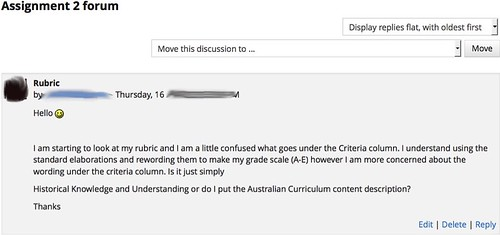
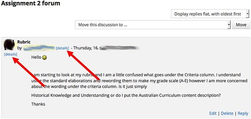
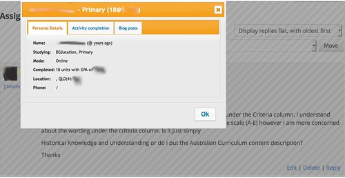
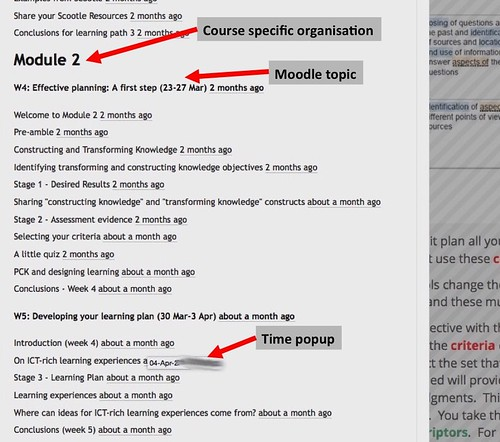
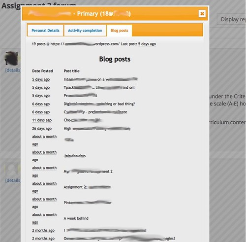

See also: [[blog-home | Home]]

The first key takeaway from [Motz, Teague and Shepard (2015)](http://er.educause.edu/articles/2015/3/know-thy-students-providing-aggregate-student-data-to-instructors) is

> Learner-centered approaches to higher education require that instructors have insight into their students' characteristics, but instructors often prepare their courses long before they have an opportunity to meet the students.

The following illustrates one of the problems teaching staff (at least in my institution) face when trying to "know thy student". It ponders if learner experience design (LX design) plus learning analytics (LA) might help. Shows off one example of what I'm currently doing to fix this problem and ponders some future directions for development.

## The problem

One of the problems I identified in [this talk](https://web.archive.org/web/20160403203459/http://usq.edu.au/learning-teaching/USQSalon/previous/JonesAlbion) was what it took for me to "know thy student" during semester. For example, the following is a question asked by a student on my course website earlier this year (in an offering that included 300+ students).

To answer this question, it would be useful "know thy student" in the following terms

1. Where is the student located? My students are distributed throughout Australian and the world. For this assignment they should be using curriculum documents specific to their location. It's useful to know if the student is using the correct curriculum documents.
2. What specialisation is the student working on? As a core course the Bachelor of Education degree, my course includes all types of pre-service teachers. Ranging from students studying to be Early Childhood teachers, Primary school teachers, Secondary teachers, and even some looking to be VET teachers/trainers.
3. What activities and resources has the student engaged with on the course site? The activities and resources on the site are designed to help students learn. There is an activity focused on this question, has this student completed it? When did they complete it?
4. What else has the student written and asked about? In this course, students are asked to maintain their own blog for reflection. What the student has written on that blog might help provide more insight. Ditto for other forum posts.

To "know thy student" in the terms outlined above and limited to the tools provided by my institution requires:

- the use three different systems;
- use of a number of different reports/services within those two systems; and,
- at least 10 minutes to click through each of these.

Given Norman's (1993) observations is it any wonder that perhaps I might not spend 10 minutes on that task every time I respond to a question from the 300+ students?

## Can learner experience (LX) design help?

Yesterday, Joyce (@catspyjamasnz) and I spent some time exploring if and how learner experience design (Joyce's expertise) and learning analytics (my interest) might be combined.

As I'm currently working on a proposal to help make it easier for teachers "know thy students" this was uppermost in my mind. And, as Joyce pointed out, "know the students" is a key step in LX design. And, as [Motz et al (2015)](http://er.educause.edu/articles/2015/3/know-thy-students-providing-aggregate-student-data-to-instructors) illustrate there appears to be some value in using learning analytics to help teachers "know thy students". And, beyond Motz's et al (2015) focus on planning, learning analytics has been suggested to help with the orchestration of learning in the form of process analytics (Lockyer et al, 2013). A link [I was thinking](/blog2/2015/09/14/what-might-a-project-combining-lx-design-and-analaytics-look-like/#process) about before our talk.

Out of all this a few questions

1. Can LX design practices be married with learning analytics in ways that enhance and transform the approach used by Motz et al (2015)?
2. Learning analytics can be critiqued as being driven more by the available data and the algorithms available to analyse it (the expertise of the "data scientists") driving it. Some LA work is driven by educational theories/ideas. Does LX design offer a different set of "purposes" to inform the development of LA applications?
3. Can LX design practices + learning analytics be used to translate what Motz et al (2015) see as "relatively rare and special" into more common practice
    
    > Exceptionally thoughtful, reflective instructors do exist, who customize and adapt their course after the start of the semester, but it's our experience that these instructors are relatively rare and special, and these efforts at learning about students requires substantial time investment.
    
4. Can this type of practice be done in a way that doesn't require "data analysts responsible for developing and distributing" (Motz et al, 2015) the information?
5. What type of affordances can and should such an approach provide?
6. What ethical/privacy issues would need to be addressed?
7. What additional data should be gathered and how?
    
    e.g. in the past I've used the [course barometer idea](/blog2/student-feedback-anonymity-observable-change-and-course-barometers/) to gather student experience during a course. Might something like this be added usefully?
    

## More student details

"More student details" is the kludge that I've put in place to solve the problem at the top of this post. I couldn't live with the current systems and had to scratch that itch.

The technical implementation of this scratch involves

1. Extracting data from various institutional systems via manually produced reports and [screen scraping](https://en.wikipedia.org/wiki/Data_scraping#Screen_scraping) and placing that data into a database on my laptop.
2. Adapting the [MAV architecture](https://github.com/damoclark/mav) to create a Greasemonkey script that talks to a server on my laptop that in turn extracts data from the database.
3. Install the Greasemonkey script on the browser I use on my laptop.

As a result, when I use that browser to view the forum post at the top of this post, I actually see the following (click on the image to see a larger version). The red arrows have been added to the image to highlight what's changed. The addition of \[details\] links.

Whenever the Greasemonkey script sees a Moodle user profile link, it adds a \[details\] link. Regardless of which page on my Moodle course sites I'm on. The following image shows an excerpt from the results page for a Quiz. It has the \[details\] links as well.

It's not beautiful, but it's only something I currently use and I was after utility.

Clicking on the \[details\] links results in a popup window appearing. A window that helps me "know they student". The window has three tabs. The first is labelled "Personal Details" and is visible below. It provides information from the institutional student records system, including name, email address, age, specialisation, which campus or mode the student is enrolled in, the number of prior units they've completed, their GPA, and their location and phone numbers.

The second tab on "more student details" shows details of the student's activity completion. This is a Moodle idea where it tracks if and when a student has completed an activity or resource. My course site is designed as a collection of weekly "learning paths". Each path is a series of activities and resources design to help the student learn. Each week belongs to one of three modules.

The following image shows part of the "Activity Completion" tab for "more student details". It shows that Module 2 starts with week 4 (Effective planning: a first step) and week 5 (Developing your learning plan). Each week has a series of activities and resources.

For each activity the student has completed, it shows when they completed that activity. This student completed the "Welcome to Module 2" - 2 months ago. If I hold the mouse over "2 months ago" it will display the exact time and date it was completed.

I did mention above that it's useful, rather the beautiful.

The "blog posts tab shows details about all the posts the student has written on their blog for this course. Each of the blog posts include a link to that blog post and shows how long ago the post was made.

With this tool available, when I answer a question on a discussion forum I can quickly refresh what I know about the student and their progress before answering. When I consider a request for an assignment extension, I can check on the student's progress so far. Without spending 10+ minutes doing so.

## API implementation and flexibility

As currently implemented, this tool relies on a number of manual steps and my personal technology infrastructure. To scale this approach will require addressing these problems.

The traditional approach to doing this might involve making modifications to Moodle to add this functionality into Moodle. I think this is the wrong way to do it. It's too heavyweight, largely because Moodle is a complex bit of software used by huge numbers of people across the world, and because most of the really useful information here is going to be unique to different courses. For example, not many courses at my institution currently use activity completion in the way my course does. Almost none of the courses at my institution use [BIM](https://moodle.org/plugins/view.php?plugin=mod_bim) and student blogs the way my course does. Beyond this, the type of information required to "know thy student" extends beyond what is available in Moodle.

To "know thy student", especially when thinking of process analytics that are unique to the specific learning design used, it will be important that any solution be flexible. It should allow individual courses to adapt and modify the data required to fit the specifics of the course and its learning design.

Which is why I plan to continue the use of [augmented browsing](https://en.wikipedia.org/wiki/Augmented_browsing) as the primary mechanism, and why I've started [exploring Moodle's API](/blog2/2015/09/13/exploring-moodles-api/). It appears to provide a way to allow the development of a flexible and customisable approach to allowing "know thy student" respond to the full diversity of learning and teaching.

Now, I wonder how LX design might help?