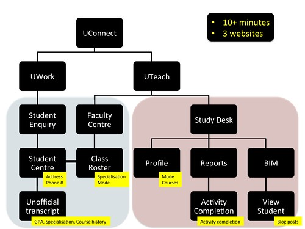
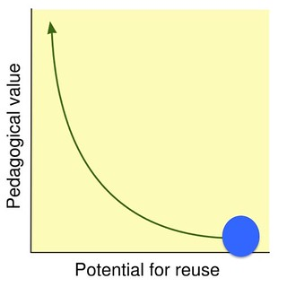
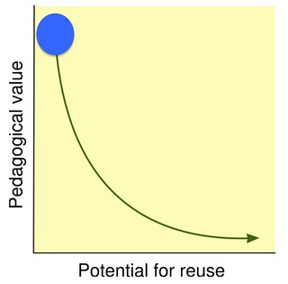
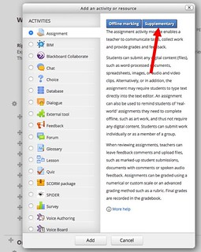
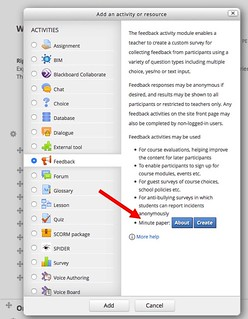
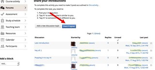
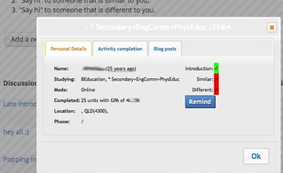

---
categories:
- bad
- elearning
date: 2015-10-01 12:50:10+10:00
next:
  text: Teachers as designers of technology enhance learning?
  url: /blog2/2015/10/06/teachers-as-digital-renovators/
previous:
  text: Self-assertive and integrative tendencies and the connection to the BAD/SET
    mindsets
  url: /blog2/2015/09/17/self-assertive-and-integrative-tendencies-and-the-connection-to-the-badset-mindsets/
title: '"University e-learning: Removing context and adding sediment"'
type: post
template: blog-post.html
comments:
    []
    
pingbacks:
    - approved: '1'
      author: The perceived uselessness of the Technology Acceptance Model (TAM) for e-learning
        | The Weblog of (a) David Jones
      author_email: null
      author_ip: 192.0.100.177
      author_url: https://davidtjones.wordpress.com/2015/09/03/the-perceived-uselessness-of-the-technology-acceptance-model-tam-for-e-learning/
      content: '[&#8230;] Below you will find the slides, abstract, and references for
        a talk given to folk from the University of South Australia on 1 October, 2015.
        A later blog post outlines core parts of the argument. [&#8230;]'
      date: '2015-10-01 13:02:48'
      date_gmt: '2015-10-01 03:02:48'
      id: '1434'
      parent: '0'
      type: pingback
      user_id: '0'
    - approved: '1'
      author: Technology required by teachers to customise technology-enhanced units |
        The Weblog of (a) David Jones
      author_email: null
      author_ip: 192.0.86.61
      author_url: https://davidtjones.wordpress.com/2015/10/07/technology-required-by-teachers-to-customise-technology-enhanced-units/
      content: '[&#8230;] and seeking new approaches to solving problems&#8221; (p. 233)
        &#8211; resonates with the idea of Context Appropriate Scaffolding Assemblages
        (CASA) including the idea of a CASA that allows course designers (teacher educators)
        to annotate their [&#8230;]'
      date: '2015-10-07 13:11:51'
      date_gmt: '2015-10-07 03:11:51'
      id: '1435'
      parent: '0'
      type: pingback
      user_id: '0'
    - approved: '1'
      author: Building a CASA for student evaluation of teaching results &#8211; The Weblog
        of (a) David Jones
      author_email: null
      author_ip: 192.0.100.73
      author_url: https://davidtjones.wordpress.com/2016/05/18/building-a-casa-for-student-evaluation-of-teaching-results/
      content: '[&#8230;] The following documents the development of what might be called
        a kludge or a work around to this problem. Though being an academic I prefer to
        define and use my own term of Context Appropriate Scaffolding Assemblage (CASA).
        [&#8230;]'
      date: '2016-05-18 09:10:03'
      date_gmt: '2016-05-17 23:10:03'
      id: '1436'
      parent: '0'
      type: pingback
      user_id: '0'
    
---
The following is the outlines the core of the argument used in a talk to folk at UniSA today titled ["The perceived uselessness of the Technology Acceptance Model (TAM) for e-learning"](/blog2/2015/09/03/the-perceived-uselessness-of-the-technology-acceptance-model-tam-for-e-learning/). The argument is that the mindset underpinning the implementation of institutional e-learning within Universities focuses on widespread reuse across an institution (and sometimes beyond). As a result institutional e-learning has a tendency to remove considerations of context, which in turn reduces/removes any chance of learners and teachers perceiving any usefulness or ease-of-use from the provided systems and processes.

The end result is that rather than enabling high quality learning experiences, institutional e-learning practices are [creating sediment](http://blog.edtechie.net/vle/the-vle-isnt-the-problem-the-sediment-is/) that clogs up any attempt to create high quality learning experiences. The following offers on possible explanation for why this is the case and offers a possible solution.

## Example - "Know thy student"

The ability to know thy student is of central importance to learning and teaching. However, research around learning analytics has identified that institutional e-learning systems do a particularly poor job at supporting this fairly central task.

Seven years ago Dawson and McWilliam (2008, p. 3) found that

> current LMS present poor data aggregation and similarly poor visualisation tools in terms of assisting staff in understanding..student learning behaviour

Two years ago Corrin et. al. (2013, p. 204) found that

> A common request that emerged across the focus groups was the ability to correlate data across systems

If I want to know who one of my students is, where they are located, what type of teacher they are studying to become (e.g. Early Childhood, Primary, Secondary, Special Education etc), what activities they've completed on the course site, and what course related posts they've written on their blog I have to (as summarised by the following image) spend 10+ minutes wandering around 3 different websites.

And while the above diagram uses simple and consistent black boxes to represent each of the web pages I use to get the information. The reality is actually much more complex. As is shown by the following image. It's a full screen dump of the Activity Completion report in Moodle. Each of the rows in the massive table represent a student in my course. Each of the columns represents an activity they are asked to complete on the course site. A tick in a particular box indicates that they have completed that activity. Given the size and complexity of this representation it's actually quite hard to identify whether or not a student has completed an activity.

### Lesson from TAM - people won't use this

The Technology Acceptance Model (TAM) proposes that people are much more likely to use a system if they perceive the system to be

1. easy to use; and,
    
2. useful.
    

Do you perceive the above system to be useful and easy to use?

I don't. Which is why I (and assume most other teaching staff) don't use it.

Given that this is blindingly obvious, and that both Dawson et al (2008) and Corrin et al (2013) have already identified this problem, why hasn't the problem been fixed?

## SET mindset - removing context, usefulness, and ease of use

Institutional e-learning - like much in contemporary corporate Universities - is driven by [a SET mindset](/blog2/2014/09/21/breaking-bad-to-bridge-the-realityrhetoric-chasm/#badset).

Amongst the many problems with the SET mindset is that it must focus on reuse. The learning objects/systems that the SET mindset creates must be usable (at least) across an entire institution. This is contributed to by each of the components of the SET mindset.

1. **S**trategic - the emphasis of the SET mindset is on strategic planning. Strategies that are important for the organisation. Strategic planning separates the planning from the doing. It separates the planning from the context.
2. **E**stablished - the SET framework has an established view of digital technologies. i.e. it's hard, expensive and subsequently wrong to modify or customise technology. Thus the organisation must use the same technology. It can't be modified to respond to contextual needs.
3. **T**ree-like - the SET framework breaks big, difficult problems down into lots of little parts that are solved separately. Each of the parts of the organisation is focused on their little part of the problem and doing it well. There can't be sufficient focus on the useful whole (e.g. a learning experience). A learning experience is actually a combination of different parts (e.g. branded look and feel, maintaining uptime on Moodle, university policy on extensions etc.) the people with the greatest focus on the whole/the learning experience (i.e. the learners and teachers) have the least capability to modify or control the parts and how they are put together.

In terms of [the reusability paradox](http://cnx.org/contents/dad41956-c2b2-4e01-94b4-4a871783b021@19/The-Reusability-Paradox) the SET mindset tends to focus on reuse at the expense of pedagogical value. It removes context (and thus usefulness and ease of use) from the learning objects/systems in order to be able to reuse them in different contexts.

## BAD mindset - adding context, usefulness, and ease of use

On the other hand, [the BAD mindset](/blog2/2014/09/21/breaking-bad-to-bridge-the-realityrhetoric-chasm/#badset) tends to put context back into the learning objects/systems. It responds to the needs of a specific context and focuses on maximising usefulness and ease of use within the confines of that context. As a result, the BAD mindset tends to reduce the capability to reuse the learning object/system.

This tendency is contributed to by each of the parts of the BAD mindset

1. **B**ricolage - combines doing and planning/design within the specifics of the context. Takes what is available within the context and uses that creatively to scratch and itch. The nature of the solution is dependent on the context, the available resources, and the connections that can be made.
2. **A**ffordances - the BAD mindset sees digital technology as inherently "protean...to be shaped and exploited...the first metamedium, and as such it has degrees of freedom for representation and expression" (Kay, 1984, p. 59). i.e. digital technology is this hugely flexible resources that can and should e "shaped and exploited" to fit the requirements specific to a context.
3. **D**istributed - rather than see the world as a collection of separate boxes never to be questioned, the BAD mindset sees the world as a distributed collection of connections and relationships that exist to be connected and re-connected in new and useful ways.

## The BAD solution to "know thy student"

Using the BAD mindset, I've implemented a solution to the "know thy student" problem that I've used this year. Another post offers a [more detailed description of that solution](/blog2/2015/09/15/helping-teachers-know-thy-students/#more). The above argument suggests that the BAD solution should be hugely more contextually appropriate and thus useful and easy to use than the SET solution. The following table provides a simple comparison between the SET and BAD solutions.

| Mindset | Where | How long |
| --- | --- | --- |
| SET | 3 separate websites, 9 + web pages | 10+ minutes |
| BAD | Where-ever I interact with students on the course web site | 3 mouse clicks |

I certainly know which solution I use more.

## Can this scale?

Yes.

The "know thy student" solution I've been using can't be used by anyone else as it depends on a mix of technologies and learning designs specific to my context. For example, I don't think any other course (not taught by me) at USQ uses a combination of activity completion and the BIM module that I use in my course. But the whole point of the BAD mindset is that the specifics of the "know thy student" solution can and should be modified to suit the specifics of the design of your course and your context.

Some of the technologies I use won't scale to other people. However, the general trend with digital technologies (e.g. the rise of API-centric architectures) is such that it can be easily re-created and scaled. The challenge at the moment is that the SET mindset is holding back the adoption and innovative use of these technological trends.

For example, Peter Albion has customised [the Moodle Assignment activity](http://dralb.albion.id.au/?p=4429) to better suit his needs. Peter's customisation should (with little or no modification) be able to be used by any teacher who is using the Moodle assignment activity. (It should be especially easy if you are using the Firefox browser, but not all that difficult if you are [using another browser](http://www.mturkgrind.com/threads/which-browsers-can-you-run-userscripts-in-and-how.27432/))

But not everyone can code. University e-learning systems currently have [a starvation problem](/blog2/2015/06/16/types-of-e-learning-projects-and-the-problem-of-starvation/). That is, a range of projects that should get implemented can't because there aren't enough development resources. Customising everything to each specific context/learning design is never going to happen, unless perhaps everyone can do their own coding.

But that's the point of a **D**istributed perspective. Not everyone needs to be able to code, though it might be a huge benefit. All you need to do is be connected through your various links and connections to someone who can code. You also need to be within an environment that actively enables people who can code to share what they do in a way that can be re-used, customised, and re-shared.

You need to be in an environment that recognises and responds to Anton Ego's sentiment in the following image. Rather than a SET-based environment that believes a great artist (programmer) can only come from the IT division (if you're lucky) and an external consultant (if you're unlucky). E-learning's starvation problem is coming from too few people and too few perspectives being allowed and encouraged to engage in modification.

## CASA - Context-Appropriate Scaffolding Assemblages

While @beerc and I were enjoying the following view of Queenstown post the 2015 ASCILITE conference we started talking about a range of ideas.

One of those was the idea of CASA - Context-Appropriate Scaffolding Assemblages - as a representation of the type of "systems" that a BAD mindset would produce. Not as a replacement for the types of systems that the SET mindset generates. CASA are meant to be the recombination, reconnection, and mashup of a range of different parts of SET systems in ways that respond to contextual requirements.

Today's talk at UniSA included an attempt to move the CASA concept forward a bit and give a few more examples of what CASA might look like.

The BAD and CASA acronyms overlap (but not as neatly as the following suggests)

- **C**ontext-**A**ppropriate and **B**ricolage.
    
    The focus is to increase pedagogical value (e.g. ease of use and usefulness) but putting more and more context into the e-learning systems. To enable individual teachers (and learners) to scratch the itches they have, rather than have to wait on the organisation or beyond.
    
- **S**caffolding and **A**ffordances
    
    The aim is to modify digital technologies and generally make connections that help learners and teachers accomplish tasks that are specific to the context. Echoing the idea of Electronic Performance Support Systems (Hannafin et. al., 2001)
    
- **A**ssemblages and **D**istrubtion
    
    The focus is the on-going production, destruction, and re-construction of heterogeneous, productive, and desired socio-material connections/relationships. A naive and nascent channeling of Muller (2015) and Introna (2013).
    

### Supplementary Assessment CASA

My faculty has a formal process for how supplementary assessments are meant to be managed using Moodle. To help academics implement this policy the faculty distributed version 2.7 of an 11 page PDF outlining the steps required.

This is an example of how the SET mindset is unable to insert additional context into its systems. Instead of modifying the tool to fit the task, the user has to modify their actions.

Rather than do this, why not implement a CASA that offers support to teaching staff to implement this policy. Support that is located exactly where they need it. i.e. the Moodle assignment activity module as shown in the following image.

The idea is that I know I need to set a supplementary assessment. I go to Moodle and add an assessment activity. But since I've installed this CASA on my browser, it modifies the traditional Moodle interface and adds a button for "Supplementary". If I click on that button it scaffolds me through the process for creating a supplementary assessment as per university policy.

The CASA is implemented in via augmented browsing. It's not a modification of Moodle. Moodle has an inherently tree-like structure and modifying it can be seen as problematic. Though modifying Moodle to implement this (or any) CASA is possible, it's probably unlikely.

### Minute paper CASA

A [minute paper](http://www.flaguide.org/cat/minutepapers/minutepapers1.php) is a fairly well-known, simple, and effective strategy for getting feedback from students. However, Stead (2005) found that

> the one-minute paper is perhaps not used especially extensively...largely due to lack of knowledge of its existence and the perception that it would be too time-consuming to analyse the responses (p. 118)

If only we had access to a technology that allowed for the simple capture, analysis, visualisation, and querying of data. That might help solve this problem.

Well, what about a minute paper CASA connected with the Moodle Feedback activity. A system that is directly designed to serve this purpose. However, because it's designed for reuse across a range of feedback contexts configuring the Feedback activity to implement a minute paper takes a bit of work. It is also unlikely that the Feedback activity provides the type of analysis functionality that would be directly specific to the minute paper.

A minute paper CASA could add information about the minute paper to the Moodle interface, thereby increasing awareness (a little). But it could also provide a scaffolded (and perhaps almost entirely automated process) for creating a minute paper. The minute paper CASA could also usefully provide specific learning analytics for the minute paper.

### Ice-breaker process analytics CASA

Lockyer et al (2013) define learning process analytics as

> data and analysis (that) provide direct insight into learner information processing and knowledge application...within the tasks that the student completes as part of the learning design (p. 1448)

One of the learning designs I use early in my course is an [ice breaker activity](/blog2/2014/02/18/looking-for-a-new-icebreaker-for-edc3100/) using a discussion forum. Students are asked to post an introduction to themselves and then read through the introductions provided by other students. Their aim is to located someone they think is the "same" as them and someone who is "different". Once identified they are asked to say "Hi" to those individuals.

It's not a bad activity. However, because the Moodle discussion forum is designed to be re-used in the broadest possible collection of contexts, it provides no scaffolding specific to this particular learning design. This is where a CASA specific to this learning design could help. Either when I create the discussion forum, or perhaps later when I configure it, I would specify that this discussion forum is being used for this specific learning design.

From then on when I view this specific discussion forum the inteface is modified to provide context-appropriate scaffolding. For example, a "check progress" button might be added to allow me to see where in the process students are up to. It might also provide some scaffolding around how I might encourage some of the laggards.

The CASA might also modify my "know thy students" CASA so that while I'm within this specific discussion forum the display is modified to include information specific to the learning design. In this case, a simple legend showing whether or not the student has completed the three required posts.

### A CASA for CASA?

The talk also briefly touched on the idea of a CASA for CASA. This idea was previously described in a post [looking at a BAD approach to developing distributed TPACK](/blog2/2015/09/05/design-of-a-bad-approach-to-developing-tpack/).

## What's next?

The immediate focus (I hope) is on exploring how the "know thy student" "CASA" can be scaled, customised, and tested with other colleagues here at USQ. What challenges are likely to exist in trying to convince the SET-mindset parts of the institution that they need to break BAD? Which of the fears that they have about breaking BAD will be proven? What haven't we predicted? Will it make any difference?

## References

Introna, L. (2013). Epilogue: Performativity and the Becoming of Sociomaterial Assemblages. In F.-X. de Vaujany & N. Mitev (Eds.), Materiality and Space: Organizations, Artefacts and Practices (pp. 330–342). Palgrave Macmillan.

Müller, M. (2015). Assemblages and Actor-networks: Rethinking Socio-material Power, Politics and Space. Geography Compass, 9(1), 27–41. doi:10.1111/gec3.12192

Stead, D. R. (2005). A review of the one-minute paper. Active Learning in Higher Education, 6(2), 118–131. doi:10.1177/1469787405054237