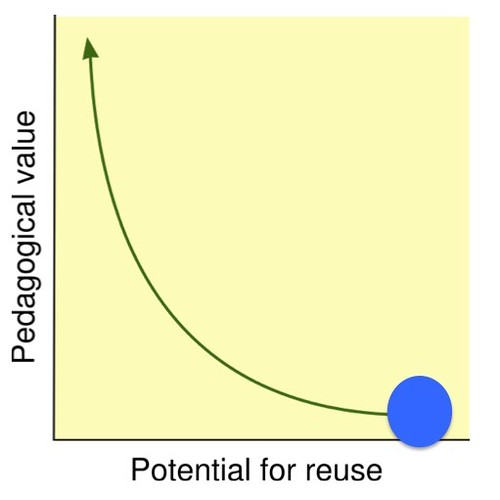
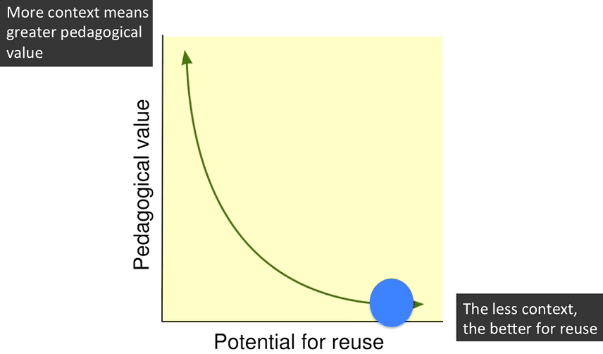

This is the 2nd post ([first here](/blog2/2015/10/06/teachers-as-digital-renovators/)) looking at [Instructional Science 43(2)](http://link.springer.com/journal/11251/43/2/page/1) on the topic of "Teachers as designers of technology enhanced learning". This post looks at [Matuk et al (2015)](http://link.springer.com/article/10.1007/s11251-014-9338-1)

## In summary

1. The claim is that the ability for teachers to customise is positive for learning.
    
    > Teachers’ involvement in curriculum design is essential for sustaining the relevance of technology-enhanced learning materials. Customizing - making small adjustments to tailor given materials to particular situations and settings - is one design activity in which busy teachers can feasibly engage. Research indicates that customizations based in evidence from student work lead to improved learning outcomes (p. 229)
    
2. Customisations by a four middle/high school teachers are examined to see how these customisations were afforded
3. Identified 3 4 types of customisations (the abstract says 3 and then proceeds to list these 4)
    - "devising timely instructional interventions to provide individualised guidance"
    - "planning activities and adjusting milestones to align with students' progress"
    - "modifying existing materials to better integrate content into overall curriculum plans"
    - incorporating scaffolds to better address students' needs
4. Identified 3 technology features that support customisations
    - A system that logs student work for teachers' inspection;
    - tools for conducting dynamic, formative assessment; and,
    - an authoring environment that supports re-design of units at multiple levels of granularity

> In this paper, we argue that teachers’ effectiveness in customizing TEL materials also relies on the affordances of the tools available to them, particularly in their ability to make students’ ideas visible (p. 232)

Preliminary design principles "for flexibly adaptive curriculum materials based on the premise of making student work visible as evidence to inform teachers’ customizations" (p. 250)

1. Provide an interface for browsing logged responses; i.e. display responses and revisions "and give teachers a persistent record of their students' thinking".
2. Integrate scaffolds that make student thinking explicit; i.e. make students' thinking processes visible to teachers to enable formative advice. Strong link here with learning process analytics (Lockyer et al, 2013)
3. Provide technologies to monitor real-time progress;
4. Offer flexible, accessible authoring tools that support testing and refinement.

Challenges for future technologies: a research and design agenda

1. How do we design interfaces and real-time displays that make students’ logged data both accessible to, and usable by teachers?
2. How can we make the underlying instructional framework transparent such that the curriculum materials themselves guide teachers’ customizations?
3. How can authoring tools be designed that both take advantage of teachers’ expertise and respect their time?

Some of the findings echo some of the ideas from learning analytics, but more directly from a teacher perspective.

## Questions

1. The participants and context for this study was fairly limited. What types of customisations and features to support customisations might be identified by examining the work of other teachers in other contexts. Especially contexts that make significantly greater use of digital technologies (e.g. largely online university courses)?
2. This paper appears to focus on teacher's redesigning technology-enhanced "curriculum materials", almost a content focus. What differences do you have to consider if you see digital technology as part of the learning space? As the environment in which learning occurs, not just the curriculum?
3. The idea of _educative curriculum materials_ - "curriculum materials with an additional tools and resources to aid teachers in attending to changing classroom dynamics, reflecting on their practices, and seeking new approaches to solving problems" (p. 233) - resonates with the idea of [Context Appropriate Scaffolding Assemblages (CASA)](/blog2/2015/10/01/university-e-learning-removing-the-context-and-adding-the-sediment/#casa) including the idea of a CASA that allows course designers (teacher educators) to annotate their digital learning spaces (course sites) with explanations and rationalisations behind the designs. Perhaps something useful for other teacher educators, but also for pre-service teachers (links to an idea that @palbion has previously mentioned).
4. How does this papers purpose/context
    
    > existing research establishes that technology can support teachers’ customizations. It also characterizes broad categories of the kinds of customizations teachers make. Still, little is known about the specific ways by which technology enables customizations, especially those based in students’ ideas.
    
    link and inform the purpose/context of the paper(s) we're thinking of? Links somewhat back to questions #1 and #2. A different context and a broader notion of digital technologies. Also perhaps a focus more on the type of digital knowledge required of teachers. "Affordance" as in "affordance of a technology for customisation" is a relational term. It's dependent on the functionality of the technology and the teachers capability to perceive and perform tasks with that functionality.
5. The technology-enhance units being customised here can be customised "without the need for programming skills" (p. 234). Might not this limit the type of customisations that teachers can undertake? Might not teachers with programming skills want to make different customisations and thus require different affordances from the systems? The customisations identified in this paper are very dependent on the nature of the system and the affordances it offered. Would a more open system combined with a teacher with programming skills identified more and different customisations/technology features? Something that the authors identify later
    
    > Our findings raise questions for future research about how teachers’ different prior knowledge of their students and of the subject matter, their individual skills with tech- nology, and their personal orientations toward their roles as teachers and designers, influence their interpretations and responses to their students’ work. They also raise questions about how these interactions are manifested in teachers’ customizations. (p. 250)
    
6. Is this observation
    
    > A recent review of 30 technology-based inquiry-learning environments identified only eight, including WISE, that support teachers’ customizations (Donnelly et al. 2014) (pp. 234-235)
    
    indicative of a broader problem around digital technologies? i.e. they are generally not designed to be modified by teachers. There's an aspect of that around the LMS, what about more broadly? How does this fit in with various perspectives about the (de-)professionalisation of teachers?

## It's all about putting the context back in

Reading the 4 types of customisation that were identified puts me in mind of the [reusability paradox](http://cnx.org/contents/dad41956-c2b2-4e01-94b4-4a871783b021@19/The-Reusability-Paradox) described as the tension between these two observations

- "The more context a learning object has, the more (and the more easily) a learner can learn from it."
- "To make learning objects maximally reusable, learning objects should contain as little context as possible."

And my [current pet argument](http://bit.ly/uselessTAM) that the mindset underpinning the design and implementation of digital technologies for learning and teaching has a (strong) tendency to remove context and hence reduce pedagogical value.

What strikes me about the four customisations is that they are all about modifying the "technology-enhanced units" to insert more context. e.g. providing individual guidance, align with students' progress, better integrate content into overall curriculum plans, and better address needs. All these talk about teachers modifying the "technology" to better respond to context.

Which resonates strongly with Shulman's (1987) suggestion that

> the key to distinguishing the knowledge base of teaching lies at the intersection of content and pedagogy, in the capacity of a teacher to transform the content knowledge he or she possesses into forms that are pedagogically powerful and yet adaptive to the variations in ability and background presented by the students (p. 15)

And also picks up a quote from this paper

> The relationship between teachers and curriculum has been characterized as one between designers and their tools (Brown 2009). In designing curriculum, teachers combine available materials with their own knowledge and expertise to craft instructional experi- ences (Brown and Edelson 2003). (p. 232)

## Summary

### Introduction

The authors argue that

> materials that yield to teachers’ modifications better respond to the classroom’s changing needs, constraints, and resources...research finds that teachers who attend to students’ ideas design more effective instruction and formative feedback (Black and Wiliam 2010) (p. 230)

But the various constraints of the classroom setting mean that

> their customization decisions tend to be driven by issues of practicality and feasibility (Boschman et al. 2014) rather than by evidence from students’ ideas

Reasons why materials are changed and how are outlined with some supporting references. Labelled as _curriculum customizations_ (Brown and Edelson, 2003). Largely guided by experience, practicalities etc.

Customisation may be a process of differentiation leading to learning gains. "This process demands a degree of expertise" (p. 231). "Customisations based in students ideas have been shown to lead to improved learning outcomes (Ruiz-Primo and Furtak, 2007)...,em>how teachers understand their students' thinking also influences the kinds of customizations they make" (p. 232)

### The role of technology in supporting customisation

> The relationship between teachers and curriculum has been characterized as one between designers and their tools (Brown 2009)...Thus, by understanding how teachers use tools to aid their practice, we can further define their facilitating roles. (p. 232)

Apparently Schwartz et al (1999) make a point related to the need to provide flexibly adaptive materials that can support teacher customisation without losing integrity. Which brings up the interesting point

> because whereas teachers’ adaptations of materials to local conditions can sometimes lead to improved student learning, it is also possible that they deviate from the intended value of the innovation (p. 232)

TEL materials and afford/guide customisations. Many examples of TEL curriculum material that have done this. Also mentions _educative curriculum materials_ as materials with additional tools and resources - e.g. annotations on documents viewable by a teacher that offers suggestions for implementation and described the rationale behind these designs.

### The context

Case studies arise from use of the [Web-based Inquiry Science Environment](http://wise.berkeley.edu/) a system used by 9900+ teachers, 80,000+ students, and with 8,000 different customised WISE units (at the time of writing). Up to date statistics are [available from the web site](http://wise.berkeley.edu/webapp/pages/statistics.html)

Essentially appears to be a collection of established units in the form of web pages, animations etc supported by various functions (e.g. concept maps). It does have an authoring environment that "allows users to copy and modify existing units without the need for programming skills" (p. 234).

This is interesting

> A recent review of 30 technology-based inquiry-learning environments identified only eight, including WISE, that support teachers’ customizations (Donnelly et al. 2014) (pp. 234-235)

### Cases of customisation and the role of technology

Much detailed description. Explaining how and why the four teachers customised the WISE units in response to their students. Shows the origins of the four types of customisation.

### Discussion

Teachers used different tools based on a range of factors:

> students’ differing needs; the conceptual and linguistic challenges most prominent in teachers’ regard; teachers’ own instructional goals; and teachers’ orientations toward technology, pedagogy and their roles as designers with respect to the curriculum materials (p. 248)

There was variability in modes of customisation - variability in level of digital changes

> These differences in customization mode might be explained by teachers’ familiarity with, and orientations toward technology; as well as to the support available for using that technology (Inan and Lowther 2009; Koehler and Mishra 2008; Zhao et al. 2002)....If teachers did indeed vary in their facilities and familiarities with technology, then with consistent amounts of training, their customization strategies would come to more closely resemble one another. But another explanation for teachers’ differences is their perceptions of themselves as designers (Cviko et al. 2013) and as research participants in curriculum development projects such as WISE. (p. 249)

The last point is perhaps interesting.

### How can technologies offload the effort involved in giving individualised guidance?

"logistic constraints of the classroom can limit what teachers can do" (p. 253) Mainly talks about automation as the tactic. Fairly limited discussion and something a lot of machine intelligence guys are working on.

## References

Lockyer, L., Heathcote, E., & Dawson, S. (2013). Informing Pedagogical Action: Aligning Learning Analytics With Learning Design. American Behavioral Scientist, 57(10), 1439–1459. doi:10.1177/0002764213479367

Matuk, C. F., Linn, M. C., & Eylon, B.-S. (2015). Technology to support teachers using evidence from student work to customize technology-enhanced inquiry units. Instructional Science, 43, 229–257. doi:10.1007/s11251-014-9338-1

Shulman, L. (1987). Knowledge and teaching: Foundations of the new reform. Harvard Educational Review, 57(1), 1–21. Retrieved from http://her.hepg.org/index/J463W79R56455411.pdf