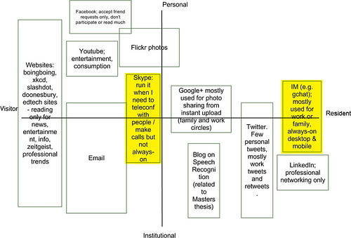
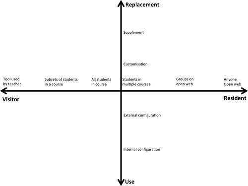
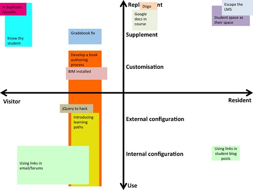

See also: [[blog-home | Home]]

### Why?

Apparently there is a digital literacy/fluency problem with teachers. The [2014 Horizon Report for Higher Education](http://www.nmc.org/publications/2014-horizon-report-higher-ed) identified the “Low Digital Fluency of Faculty” as the number 1 “significant challenge impeding higher education technology adoption”. In the [2015 Horizon Report for Higher Education](http://www.nmc.org/publication/nmc-horizon-report-2015-higher-education-edition/) this morphs into "Improving Digital Literacy" being the #2 significant challenge. While the [2015 K-12 Horizon Report](http://www.nmc.org/publication/nmc-horizon-report-2015-k-12-edition/) has "Integrating Technology in Teacher Education" as the #2 significant challenge.

But focusing solely on the literacy of the teaching staff seems a bit short sighted. @palbion, @chalkhands and I are teacher educators working in a digitally rich learning environment (i.e. a large percentage of our students are online only students). We are also fairly digitally fluent/literate. In [a paper last year](/blog2/2015/01/06/tpack-as-shared-practice-toward-a-research-agenda/) we explored how a distributive view of knowledge sharing helped us "overcome the limitations of organisational practices and technologies that were not always well suited to our context and aims".

Our digital literacy isn't a problem, we're able and believe we have to overcome the limitations of the environment in which we teach. Increasingly the digital tools we are provided by the institution do not match the needs we have for our learning designs and consequently we make various types of changes.

Often these changes are seen as bad. At best these changes are invisible to other people within our institution. At worst they are labelled as duplication, inefficient, unsafe, and feral. They are seen as [shadow systems](/blog2/publications/the-rise-and-fall-of-a-shadow-system-lessons-for-enterprise-system-implementation/#shadow). Systems and changes that are undesirable and should be rooted out.

### What?

Rather than continue this negative perspective, @palbion, @chalkhands and I have just finished a rough paper that set out to explore if there was anything valuable or interesting to learn from the changes we made to our digital learning spaces. Our process for this paper was

1. Generate a list of stories of the changes we made to our digital learning/teaching spaces. Using a Google doc and a simple story format (descriptive title; what change was made; why; and, outcomes) each of us generated a list of stories of where we'd changed the digital tools/spaces we use for our teaching.
2. Map those stories using a modified [Visitor and Resident mapping](http://daveowhite.com/vandr/vr-mapping/) approach. The stories needed to be analysed in someway. The [Visitors & Residents](http://daveowhite.com/vandr/) approach offered a number of advantages - more detail below.
3. Reflect upon what that analysis showed and about potential future applications of this approach.

What follows is some reflection on the approach, a description of the original V&R map, and a description and example of our modified V&R map.

### Reflection on the approach

In short, we (I think I can say we) found the whole approach interesting and could see some potential for broader use. In particular, the potential benefits of the approach include:

1. Great way to start discussions and share knowledge. Gathering stories and analysing them using the V&R process appear to be very useful ways for starting discussions and sharing knowledge. Not the least because it starts with people sharing what they are doing (trying to do) now, rather than some mythical ideal future state. [Reports from others](https://catherinecronin.wordpress.com/2015/03/19/marvellous-mapping/) using the original V&R mapping process suggest this is a strength of the V&R mapping approach. Our experience seems to suggest this might continue with the modified map we used.
2. Doesn't start by assuming that people are illiterate. Neither @palbion or I think we're digitally illiterate. We have formal qualifications in Information Technology (IT). @chalkhands doesn't have formal qualifications in IT. Early on in this process she was questioning whether or not she had anything to add. She wasn't as "literate" as @palbion and I. However, as we started sharing stories and mapping them that questioning went away. The V&R approach is very much based on the idea of focusing on what people do, rather than who they are or what they know (or don't). It doesn't assume teaching staff are digitally illiterate and is just interested in what people do. I think this is a much more valuable starting point for engaging in this space. It appears likely to provide a method for helping universities follow observations from the 2015 Horizon Report that solving the "digital literacy problem" requires "individual scaffolding and support along with helping learners as they manage conflict between practice and different contexts" and "Understanding how to use technologies is a key first step, but being able to leverage them for innovation is vital to fostering real transformation in higher education" and "that programs with one-size-fits-all training approaches that assume all faculty are at the same level of digital literacy pose a higher risk of failure."
3. It accepts that the ability for people to change digital technologies is not only ok, it is necessary and unavoidable. [Worthen (2007)](http://www.cio.com/article/2442600/consumer-technology/user-management---users-who-know-too-much-and-the-cios-who-fear-them.html) makes the point that those in charge of institutional IT (including digital learning spaces) want to prevent change while the people using digital systems want the technology to change
    
    > Users want IT to be responsive to their individual needs and to make them more productive. CIOs want IT to be reliable, secure, scalable, and compliant with an ever increasing number of government regulations
    
    Since the CIOs are in charge of the technology (they have the power) the practice of changing digital systems (without having gone through the approved governance processes) is deemed as bad and something to be avoided. This is due to change, especially in learning and teaching if you accept Shulman's (1987) identification of the "knowledge based of teaching" laying (emphasis added)
    
    > at the intersection of content and pedagogy, in the _capacity of a teacher to transform_ the content knowledge he or she possesses into forms that are pedagogically powerful and yet _adaptive to the variations in ability and background presented by the students_ (p. 15)
    

### The original V&R map

The original V&R map is (example in the image below) a cartesian graph with two axes. The X-axis ranges from visitor to resident and describes how you perceive and use digital technologies. A visitor sees a collection of disparate tools that are fit for specific purposes. When something has to be done the visitor selects the tool, gets the job done, and leaves the digital space leaving no social trace. A resident on the other hand sees a digital space where they can connect and socialise with others. The Y-axis ranges from Institutional to Personal and describes where use of digital technologies fits on a professional or personal scale.

The following map shows someone for whom LinkedIn is only used for professional purposes. So it's located toward the "Institutional" end of the Y-axis. Since LinkedIn is about leaving a public social trace for others to link to, it's located toward the "Resident" end of the X-axis.

    by  [jisc\_infonet](https://www.flickr.com/people/jiscinfonet/) 

### Our modified V&R map

Our purpose was to map stories about how we had change digital technologies within our role as teacher educators. Thus the normal Institutional/Personal scale for the Y-axis doesn't work. We're only considering activities that are institutional in purpose. In addition, we're focusing on activities that changed digital technologies. We're interested in understanding the types of changes that were made. As a result we adopted a "change scale" as the Y-axis. The scale was adapted from software engineering/information systems research and is summarised in the following table.

| Item | Description | Example |
| --- | --- | --- |
| Use | Tool used with no change | Add an element to a Moodle site |
| Internal configuration | Change operation of a tool using the configuration options of the tool | Change the appearance of the Moodle site with course settings |
| External configuration | Change operation of a tool using means external to the tool | Inject CSS of Javascript into a Moodle site to change its operation |
| Customization | Change the tool by modifying its code | Modify the Moodle source code, or install a new plugin |
| Supplement | Use another tool(s) to offer functionality not provided by existing tools | Implement course level social bookmarking by requiring use of Diigo |
| Replacement | Use another tool to replace/enhance functionality provided by existing tools | Require students to use external blog engines, rather than the Moodle blog engine. |

Since we were new to the V&R mapping process and were trying to quickly do this work without being able to meet, some additional scaffolding was placed on the X-axis (visitor-resident). This provide some common level of understanding of the scale and was based on a specific (and fairly limited) definition of "social trace". The lowest level of the scale was "tools used by teachers" which meant no social trace. The scale gradually increased the number of people involved in the activities mediated by the digital technology. "Subsets of students in a course" to "All students in a course" and right on up to "Anyone on the open web".

The following image is the "template" map that each of used to map out our stories of changing digital technologies.

### An example map and stories

The following image is the outcome of mapping my stories of change. A couple of example stories are included after the image.

**Know thy student**

This story involves replacing/supplementing existing digital tools, but is something that only I use. Hence Visitor/Replacement.

_What?_ A collection of Greasemonkey scripts, web scrapping, local database/server designed to help me know my students and what they were doing in the Study Desk. Wherever there is a Moodle user profile link in Moodle, the script will add a link \[ details \] that is specific for each user. If I click on that link I see a popup window with a range of information about the student

_Why?_ Because finding out this information about a student would normally take 10+ minutes and require the use of multiple different web pages in two different system. Many of these pages don’t exactly make it easy to see the information. Knowing the students better is a core part of improving my teaching.

_Outcomes?_ It’s been a god send. Saving time and enabling me to be more aware of student progess.

**Using links in student blog posts**

A fairly minor example of change. There's a question of whether it's just "use" or "internal configuration"? After all, it's just using an editor on a web page to create some HTML. It was bumped up to "internal configuration" because of an observation that hyperlinks were not often used by many teachers. Something I'm hoping that @beerc will test empirically.

_What?_ Some comments I write on student blog posts will make use of links to offer pointers to relevant resources.

_Why?_ It's more useful/easy to the students to have the direct link. Hence more likely to make use of the suggestion.

_Outcomes?_ Minor anecdotal positive comments. Not really known

### Early indications and reflection

The change scale worked okay but could use some additional reflection. In particular we raised some questions about whether many of the "replacement" examples of change (including those in my map above) are actually examples of supplement.

On reflecting on all this we made some initial observations, including

1. Regardless of perceived levels of digital literacy we all engaged in a range of changes to digital technologies.
2. Not surpisingly, the breadth/complexity of those changes increased with greater digital literacy.
3. In the end very few of our changes were "replacement". Almost all were focused more on overcoming perceived shortcomings with the provided tools, rather than duplicating their functionality.
4. Most of changes tended to congregate towards the "visitor" end of the X-axis. Not surprising given that all of the digital technologies provided by the institution are not on the open web.
5. Almost all of the stories that involved "replacement" were based on moving out onto the "open web". i.e. they were all located toward the "resident" end of the X-axis.
6. Changes were being made due to two main reasons: improving the efficiency of institutional systems or practices; or, customising digital technologies to fit the specific learning activities we wanted to implement.